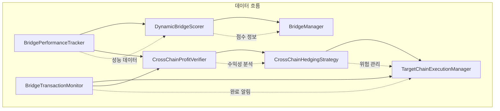

# 4. 크로스체인 아비트래지 전략

## 4.1 구현 현황 개요

### ✅ 구현 완료 (Priority 1 & 2)

#### Priority 1 - 핵심 모니터링 및 검증 시스템
1. **브리지 성능 추적 시스템** - `src/bridges/performance_tracker.rs`
2. **트랜잭션 상태 모니터링** - `src/bridges/transaction_monitor.rs`  
3. **수익 실현 검증 시스템** - `src/bridges/profit_verifier.rs`

#### Priority 2 - 고급 최적화 및 실행 시스템
4. **헤징 전략** - `src/bridges/hedging_strategy.rs`
5. **동적 브리지 스코어링 시스템** - `src/bridges/dynamic_scorer.rs`
6. **타겟 체인 실행 워크플로우** - `src/bridges/target_execution.rs`

### ⏳ 구현 대기 (Priority 3)
7. **멀티홉 라우팅 최적화**
8. **가스 가격 예측 모델**
9. **크로스체인 슬리피지 관리**

---

## 4.2 Priority 1 구현 상세

### 4.2.1 브리지 성능 추적 시스템

**파일**: `src/bridges/performance_tracker.rs`

실시간으로 각 브리지의 성능 지표를 추적하고 분석하는 시스템입니다.

#### 핵심 기능
- 성공률, 지연시간, 비용 추적
- 체인별, 토큰별 성능 분석  
- 시간대별 성능 패턴 분석
- 실시간 성능 알림

#### 주요 데이터 구조

```rust
/// 브리지 성능 추적 시스템
#[derive(Debug)]
pub struct BridgePerformanceTracker {
    /// 브리지별 성능 데이터
    bridge_metrics: Arc<RwLock<HashMap<BridgeProtocol, BridgePerformanceData>>>,
    
    /// 체인 페어별 성능 데이터
    route_metrics: Arc<RwLock<HashMap<RouteKey, RoutePerformanceData>>>,
    
    /// 실행 히스토리 (최근 1000개)
    execution_history: Arc<RwLock<Vec<BridgeExecution>>>,
    
    /// 성능 임계값 설정
    thresholds: PerformanceThresholds,
    
    /// 통계 계산 설정
    stats_config: StatsConfig,
}

/// 브리지별 성능 데이터
#[derive(Debug, Clone, Serialize, Deserialize)]
pub struct BridgePerformanceData {
    pub protocol: BridgeProtocol,
    pub total_executions: u64,
    pub successful_executions: u64,
    pub failed_executions: u64,
    pub success_rate: f64,
    pub avg_completion_time: f64,
    pub min_completion_time: f64,
    pub max_completion_time: f64,
    pub avg_cost_usd: f64,
    pub min_cost_usd: f64,
    pub max_cost_usd: f64,
    pub avg_slippage_percent: f64,
    pub availability_24h: f64,
    pub reliability_score: f64,
    pub last_updated: DateTime<Utc>,
    pub hourly_stats: Vec<HourlyStats>,
}
```

#### 신뢰도 점수 계산 알고리즘

```rust
/// 신뢰도 점수 계산
async fn calculate_reliability_score(&self, data: &BridgePerformanceData) -> f64 {
    let weights = &self.stats_config.reliability_weights;
    let thresholds = &self.thresholds;
    
    // 성공률 점수 (0-1)
    let success_score = (data.success_rate / thresholds.min_success_rate).min(1.0);
    
    // 완료 시간 점수 (역비례, 빠를수록 높은 점수)
    let time_score = if data.avg_completion_time > 0.0 {
        (thresholds.max_completion_time / data.avg_completion_time).min(1.0)
    } else {
        0.0
    };
    
    // 비용 점수 (역비례, 저렴할수록 높은 점수)
    let cost_score = if data.avg_cost_usd > 0.0 {
        (thresholds.max_cost_usd / data.avg_cost_usd).min(1.0)
    } else {
        1.0
    };
    
    // 가용률 점수 (24시간 기준)
    let availability_score = (data.availability_24h / thresholds.min_availability).min(1.0);
    
    // 일관성 점수 (시간 편차가 작을수록 높은 점수)
    let time_variance = data.max_completion_time - data.min_completion_time;
    let consistency_score = if time_variance > 0.0 {
        (1.0 - (time_variance / data.avg_completion_time).min(1.0)).max(0.0)
    } else {
        1.0
    };
    
    // 가중 평균 계산
    let score = success_score * weights.success_rate +
                time_score * weights.completion_time +
                cost_score * weights.cost +
                availability_score * weights.availability +
                consistency_score * weights.consistency;
    
    score.min(1.0).max(0.0)
}
```

#### 주요 API

- `record_execution_start()`: 브리지 실행 시작 기록
- `record_execution_completion()`: 브리지 실행 완료 기록
- `get_bridge_performance()`: 브리지 성능 데이터 조회
- `recommend_best_bridge()`: 최적 브리지 추천
- `check_performance_alerts()`: 성능 알림 확인

---

### 4.2.2 트랜잭션 상태 모니터링

**파일**: `src/bridges/transaction_monitor.rs`

브리지 트랜잭션의 전체 생명주기를 모니터링하는 시스템입니다.

#### 핵심 기능
- 소스체인에서 대상체인까지 전체 추적
- 실시간 상태 업데이트 및 타임아웃 처리
- 재시도 메커니즘 및 오류 복구
- 상세한 트랜잭션 로깅

#### 주요 데이터 구조

```rust
/// 브리지 트랜잭션 모니터
#[derive(Debug)]
pub struct BridgeTransactionMonitor {
    /// 활성 모니터링 중인 트랜잭션들
    active_transactions: Arc<RwLock<HashMap<String, MonitoredTransaction>>>,
    
    /// 완료된 트랜잭션 히스토리
    completed_transactions: Arc<RwLock<Vec<CompletedTransaction>>>,
    
    /// 체인별 RPC 클라이언트
    chain_clients: Arc<RwLock<HashMap<ChainId, Arc<dyn ChainClient>>>>,
    
    /// 모니터링 설정
    config: MonitoringConfig,
    
    /// 알림 핸들러
    notification_handler: Arc<dyn NotificationHandler>,
}

/// 트랜잭션 상태
#[derive(Debug, Clone, Serialize, Deserialize, PartialEq)]
pub enum TransactionStatus {
    /// 초기화됨
    Initialized,
    /// 소스 체인 제출됨
    SubmittedToSource,
    /// 소스 체인 확인됨
    ConfirmedOnSource,
    /// 브리지 처리 중
    BridgeProcessing,
    /// 대상 체인 도착
    ArrivedAtDestination,
    /// 완료됨
    Completed { final_amount: U256, gas_used: U256 },
    /// 실패함
    Failed { error: String, stage: usize },
    /// 타임아웃
    TimedOut { stage: usize },
    /// 수동 개입 필요
    RequiresIntervention { reason: String },
}
```

#### 트랜잭션 모니터링 로직

```rust
/// 트랜잭션 모니터링 시작
pub async fn start_monitoring(&self, transaction: MonitoredTransaction) -> Result<()> {
    let transaction_id = transaction.transaction_id.clone();
    
    // 활성 트랜잭션에 추가
    let mut active = self.active_transactions.write().await;
    active.insert(transaction_id.clone(), transaction);
    
    info!("🔍 트랜잭션 모니터링 시작: {}", transaction_id);
    
    // 백그라운드에서 모니터링 태스크 실행
    let monitor = Arc::new(self.clone());
    tokio::spawn(async move {
        if let Err(e) = monitor.monitor_transaction_lifecycle(transaction_id.clone()).await {
            error!("❌ 트랜잭션 모니터링 실패: {} - {}", transaction_id, e);
        }
    });
    
    Ok(())
}

/// 트랜잭션 생명주기 모니터링
async fn monitor_transaction_lifecycle(&self, transaction_id: String) -> Result<()> {
    loop {
        let (current_status, should_continue) = {
            let active = self.active_transactions.read().await;
            let transaction = active.get(&transaction_id)
                .ok_or_else(|| anyhow::anyhow!("Transaction not found"))?;
            
            (transaction.status.clone(), 
             !matches!(transaction.status, TransactionStatus::Completed { .. } | 
                      TransactionStatus::Failed { .. } | TransactionStatus::TimedOut { .. }))
        };
        
        if !should_continue {
            break;
        }
        
        // 현재 단계에 따른 모니터링 로직 실행
        match current_status {
            TransactionStatus::Initialized => {
                self.monitor_source_submission(&transaction_id).await?;
            }
            TransactionStatus::SubmittedToSource => {
                self.monitor_source_confirmation(&transaction_id).await?;
            }
            TransactionStatus::ConfirmedOnSource => {
                self.monitor_bridge_processing(&transaction_id).await?;
            }
            TransactionStatus::BridgeProcessing => {
                self.monitor_destination_arrival(&transaction_id).await?;
            }
            TransactionStatus::ArrivedAtDestination => {
                self.monitor_final_completion(&transaction_id).await?;
            }
            _ => break,
        }
        
        // 모니터링 간격 대기
        tokio::time::sleep(Duration::from_secs(self.config.monitoring_interval_seconds)).await;
    }
    
    // 완료된 트랜잭션을 히스토리로 이동
    self.move_to_completed(&transaction_id).await?;
    
    Ok(())
}
```

#### 주요 API

- `start_monitoring()`: 트랜잭션 모니터링 시작
- `get_transaction_status()`: 트랜잭션 상태 조회
- `get_transaction_details()`: 트랜잭션 상세 정보 조회
- `update_transaction_status()`: 트랜잭션 상태 업데이트
- `get_active_transactions()`: 활성 트랜잭션 목록 조회

---

### 4.2.3 수익 실현 검증 시스템

**파일**: `src/bridges/profit_verifier.rs`

예상 수익과 실제 수익을 비교하고 검증하는 시스템입니다.

#### 핵심 기능
- 예상 vs 실제 수익 비교 및 분석
- 상세한 분산 분석 및 세금 계산
- 수익성 등급 및 최적화 권장사항
- 포트폴리오 수익률 추적

#### 주요 데이터 구조

```rust
/// 크로스체인 수익 검증기
#[derive(Debug)]
pub struct CrossChainProfitVerifier {
    /// 수익 분석 히스토리
    profit_history: Arc<RwLock<Vec<ProfitAnalysis>>>,
    
    /// 가격 오라클 참조
    price_oracle: Arc<dyn PriceOracle>,
    
    /// 검증 설정
    verification_config: VerificationConfig,
    
    /// 세금 계산기
    tax_calculator: Arc<dyn TaxCalculator>,
    
    /// 포트폴리오 추적기
    portfolio_tracker: Arc<RwLock<PortfolioTracker>>,
}

/// 수익 분석 결과
#[derive(Debug, Clone, Serialize, Deserialize)]
pub struct ProfitAnalysis {
    pub analysis_id: String,
    pub transaction_id: String,
    pub bridge_protocol: BridgeProtocol,
    pub source_chain: ChainId,
    pub destination_chain: ChainId,
    pub token_symbol: String,
    
    // 예상 수익 데이터
    pub expected_profit: ExpectedProfit,
    
    // 실제 수익 데이터
    pub actual_profit: ActualProfit,
    
    // 분산 분석
    pub variance_analysis: VarianceAnalysis,
    
    // 세금 정보
    pub tax_implications: TaxImplications,
    
    // 수익성 평가
    pub profitability_rating: ProfitabilityRating,
    
    // 최적화 권장사항
    pub optimization_recommendations: Vec<OptimizationRecommendation>,
    
    pub analyzed_at: DateTime<Utc>,
}
```

#### 수익 검증 알고리즘

```rust
/// 수익 검증 실행
pub async fn verify_profit(&self, request: ProfitVerificationRequest) -> Result<ProfitAnalysis> {
    let analysis_id = Uuid::new_v4().to_string();
    
    // 1. 예상 수익 계산
    let expected_profit = self.calculate_expected_profit(&request).await?;
    
    // 2. 실제 수익 계산
    let actual_profit = self.calculate_actual_profit(&request).await?;
    
    // 3. 분산 분석
    let variance_analysis = self.analyze_variance(&expected_profit, &actual_profit).await?;
    
    // 4. 세금 계산
    let tax_implications = self.calculate_tax_implications(&actual_profit, &request).await?;
    
    // 5. 수익성 평가
    let profitability_rating = self.rate_profitability(&variance_analysis, &tax_implications).await;
    
    // 6. 최적화 권장사항 생성
    let optimization_recommendations = self.generate_optimization_recommendations(
        &variance_analysis, 
        &request
    ).await?;
    
    let analysis = ProfitAnalysis {
        analysis_id: analysis_id.clone(),
        transaction_id: request.transaction_id.clone(),
        bridge_protocol: request.bridge_protocol,
        source_chain: request.source_chain,
        destination_chain: request.destination_chain,
        token_symbol: request.token_symbol.clone(),
        expected_profit,
        actual_profit,
        variance_analysis,
        tax_implications,
        profitability_rating,
        optimization_recommendations,
        analyzed_at: Utc::now(),
    };
    
    // 히스토리에 저장
    let mut history = self.profit_history.write().await;
    history.push(analysis.clone());
    
    // 포트폴리오 업데이트
    self.update_portfolio_metrics(&analysis).await?;
    
    info!("📊 수익 검증 완료: {} (실제 수익: ${:.2})", 
          analysis_id, analysis.actual_profit.net_profit_usd);
    
    Ok(analysis)
}

/// 분산 분석 실행
async fn analyze_variance(&self, expected: &ExpectedProfit, actual: &ActualProfit) -> Result<VarianceAnalysis> {
    let profit_variance = actual.net_profit_usd - expected.net_profit_usd;
    let profit_variance_percent = if expected.net_profit_usd != 0.0 {
        (profit_variance / expected.net_profit_usd) * 100.0
    } else {
        0.0
    };
    
    let fee_variance = actual.bridge_fees_usd - expected.bridge_fees_usd;
    let gas_variance = actual.gas_costs_usd - expected.gas_costs_usd;
    let slippage_variance = actual.slippage_costs_usd - expected.slippage_costs_usd;
    
    // 분산 요인 분석
    let variance_factors = self.identify_variance_factors(
        fee_variance, gas_variance, slippage_variance
    ).await;
    
    Ok(VarianceAnalysis {
        profit_variance_usd: profit_variance,
        profit_variance_percent,
        fee_variance_usd: fee_variance,
        gas_variance_usd: gas_variance,
        slippage_variance_usd: slippage_variance,
        variance_factors,
        accuracy_score: self.calculate_accuracy_score(profit_variance_percent).await,
        confidence_level: self.determine_confidence_level(&variance_factors).await,
    })
}
```

#### 주요 API

- `verify_profit()`: 수익 검증 실행
- `get_profit_analysis()`: 수익 분석 결과 조회
- `get_portfolio_performance()`: 포트폴리오 성과 조회
- `calculate_tax_liability()`: 세금 부담 계산
- `generate_profit_report()`: 수익 보고서 생성

---

## 4.3 Priority 2 구현 상세

### 4.3.1 헤징 전략

**파일**: `src/bridges/hedging_strategy.rs`

브리지 처리 시간 동안의 가격 변동성에 대응하는 헤징 시스템입니다.

#### 핵심 기능
- 다양한 헤지 유형 지원 (simple, delta, option, swap, composite, dynamic)
- 위험 평가 및 VaR 계산
- 헤지 효과성 모니터링
- 실시간 포지션 관리

#### 주요 데이터 구조

```rust
/// 크로스체인 헤징 전략 관리자
#[derive(Debug)]
pub struct CrossChainHedgingStrategy {
    /// 활성 헤지 포지션들
    active_hedges: Arc<RwLock<HashMap<String, HedgePosition>>>,
    
    /// 헤지 히스토리
    hedge_history: Arc<RwLock<Vec<CompletedHedge>>>,
    
    /// 가격 모니터
    price_monitor: Arc<dyn PriceMonitor>,
    
    /// 헤지 실행기
    hedge_executor: Arc<dyn HedgeExecutor>,
    
    /// 위험 관리자
    risk_manager: Arc<RiskManager>,
    
    /// 헤징 설정
    config: HedgingConfig,
}

/// 헤지 전략 유형
#[derive(Debug, Clone, Serialize, Deserialize)]
pub enum HedgeStrategyType {
    /// 단순 헤지 - 반대 포지션
    Simple {
        hedge_ratio: f64,
    },
    
    /// 델타 헤지 - 델타 중립
    Delta {
        target_delta: f64,
        rebalance_threshold: f64,
    },
    
    /// 옵션 헤지 - 옵션을 통한 보호
    Option {
        option_type: OptionType,
        strike_price: f64,
        expiry: DateTime<Utc>,
    },
    
    /// 스왑 헤지 - 스왑 계약
    Swap {
        swap_rate: f64,
        notional_amount: f64,
    },
    
    /// 복합 헤지 - 여러 전략 조합
    Composite {
        strategies: Vec<HedgeStrategyType>,
        weights: Vec<f64>,
    },
    
    /// 동적 헤지 - 조건에 따른 자동 조정
    Dynamic {
        volatility_threshold: f64,
        correlation_threshold: f64,
        adjustment_frequency: Duration,
    },
}
```

#### 동적 헤징 알고리즘

```rust
/// 헤지 포지션 생성
pub async fn create_hedge(&self, request: HedgeRequest) -> Result<HedgePosition> {
    // 1. 위험 분석
    let risk_analysis = self.risk_manager.analyze_bridge_risk(&request).await?;
    
    // 2. 최적 헤지 전략 결정
    let strategy = self.determine_optimal_strategy(&risk_analysis, &request).await?;
    
    // 3. 헤지 실행
    let execution_result = self.hedge_executor.execute_hedge(&strategy, &request).await?;
    
    // 4. 포지션 생성
    let position = HedgePosition {
        position_id: Uuid::new_v4().to_string(),
        bridge_transaction_id: request.bridge_transaction_id.clone(),
        strategy_type: strategy.clone(),
        underlying_asset: request.underlying_asset.clone(),
        hedge_asset: execution_result.hedge_asset.clone(),
        position_size: execution_result.position_size,
        entry_price: execution_result.entry_price,
        current_price: execution_result.entry_price,
        unrealized_pnl: 0.0,
        hedge_ratio: strategy.get_target_hedge_ratio(),
        effectiveness: 1.0, // 초기값
        var_contribution: 0.0,
        opened_at: Utc::now(),
        expires_at: request.expiry,
        status: HedgeStatus::Active,
        risk_metrics: PositionRiskMetrics::default(),
    };
    
    // 5. 활성 포지션에 추가
    let mut active = self.active_hedges.write().await;
    active.insert(position.position_id.clone(), position.clone());
    
    // 6. 모니터링 시작
    self.start_position_monitoring(position.position_id.clone()).await?;
    
    info!("🛡️ 헤지 포지션 생성: {} (전략: {:?})", 
          position.position_id, strategy);
    
    Ok(position)
}

/// 최적 헤지 전략 결정
async fn determine_optimal_strategy(
    &self, 
    risk_analysis: &RiskAnalysis, 
    request: &HedgeRequest
) -> Result<HedgeStrategyType> {
    let volatility = risk_analysis.volatility;
    let correlation = risk_analysis.correlation;
    let time_horizon = request.time_horizon_hours as f64;
    
    // 변동성과 상관관계에 따른 전략 선택
    let strategy = if volatility > 0.5 && correlation < 0.3 {
        // 고변동성, 낮은 상관관계 - 옵션 헤지
        HedgeStrategyType::Option {
            option_type: OptionType::Put,
            strike_price: request.current_price * 0.95, // 5% OTM
            expiry: Utc::now() + chrono::Duration::hours(time_horizon as i64),
        }
    } else if volatility > 0.3 && correlation > 0.7 {
        // 중간 변동성, 높은 상관관계 - 델타 헤지
        HedgeStrategyType::Delta {
            target_delta: 0.0, // 델타 중립
            rebalance_threshold: 0.1,
        }
    } else if time_horizon > 24.0 {
        // 장기간 - 동적 헤지
        HedgeStrategyType::Dynamic {
            volatility_threshold: 0.2,
            correlation_threshold: 0.5,
            adjustment_frequency: Duration::from_secs(3600), // 1시간
        }
    } else {
        // 기본 - 단순 헤지
        HedgeStrategyType::Simple {
            hedge_ratio: 0.8, // 80% 헤지
        }
    };
    
    Ok(strategy)
}
```

#### 주요 API

- `create_hedge()`: 헤지 포지션 생성
- `close_hedge()`: 헤지 포지션 종료
- `rebalance_hedge()`: 헤지 리밸런싱
- `get_hedge_effectiveness()`: 헤지 효과성 조회
- `calculate_var()`: VaR 계산

---

### 4.3.2 동적 브리지 스코어링 시스템

**파일**: `src/bridges/dynamic_scorer.rs`

실시간 성능 데이터를 기반으로 브리지 신뢰도를 동적으로 계산하는 시스템입니다.

#### 핵심 기능
- 실시간 성능 지표 기반 점수 계산
- 시장 조건에 따른 가중치 조정
- 라우트별 맞춤형 점수 산정
- 예측 모델을 통한 미래 성능 예측

#### 주요 데이터 구조

```rust
/// 동적 브리지 점수 시스템
#[derive(Debug)]
pub struct DynamicBridgeScorer {
    /// 성능 추적기 참조
    performance_tracker: Arc<BridgePerformanceTracker>,
    
    /// 점수 계산 설정
    scoring_config: ScoringConfig,
    
    /// 시장 조건 모니터
    market_conditions: Arc<RwLock<MarketConditions>>,
    
    /// 예측 모델 데이터
    prediction_models: Arc<RwLock<HashMap<BridgeProtocol, PredictionModel>>>,
    
    /// 점수 히스토리 (최근 100개)
    score_history: Arc<RwLock<Vec<ScoreSnapshot>>>,
    
    /// 라우트별 맞춤 설정
    route_configs: Arc<RwLock<HashMap<RouteKey, RouteSpecificConfig>>>,
}

/// 브리지 점수
#[derive(Debug, Clone, Serialize, Deserialize)]
pub struct BridgeScore {
    /// 전체 점수 (0.0-100.0)
    pub overall_score: f64,
    
    /// 세부 점수들
    pub component_scores: ComponentScores,
    
    /// 시장 조건 조정 후 점수
    pub market_adjusted_score: f64,
    
    /// 예측 기반 점수
    pub predicted_score: f64,
    
    /// 최종 권장 점수
    pub final_recommendation_score: f64,
    
    /// 점수 변화 추세
    pub trend: ScoreTrend,
    
    /// 신뢰도 등급
    pub confidence_grade: ConfidenceGrade,
    
    /// 점수 계산 시간
    pub calculated_at: DateTime<Utc>,
}
```

#### 동적 점수 계산 알고리즘

```rust
/// 브리지 점수 계산
pub async fn calculate_bridge_score(&self, bridge: BridgeProtocol) -> Result<BridgeScore> {
    // 성능 데이터 가져오기
    let performance_data = self.performance_tracker
        .get_bridge_performance(bridge.clone())
        .await
        .ok_or_else(|| anyhow::anyhow!("No performance data for bridge {}", bridge.name()))?;
    
    // 최소 데이터 요구사항 확인
    if !self.meets_min_requirements(&performance_data).await {
        return Ok(BridgeScore::default_low_confidence());
    }
    
    // 기본 점수 계산
    let component_scores = self.calculate_component_scores(&performance_data).await?;
    let base_score = self.calculate_weighted_score(&component_scores, &self.scoring_config.base_weights).await;
    
    // 시장 조건 기반 조정
    let market_conditions = self.market_conditions.read().await;
    let market_weights = self.get_market_adjusted_weights(&market_conditions).await;
    let market_adjusted_score = self.calculate_weighted_score(&component_scores, &market_weights).await;
    
    // 예측 기반 점수
    let predicted_score = self.calculate_predicted_score(bridge.clone()).await?;
    
    // 최종 권장 점수 (기본 60% + 시장조정 25% + 예측 15%)
    let final_score = base_score * 0.6 + market_adjusted_score * 0.25 + predicted_score * 0.15;
    
    // 점수 추세 계산
    let trend = self.calculate_score_trend(bridge.clone()).await;
    
    // 신뢰도 등급 계산
    let confidence_grade = self.calculate_confidence_grade(&performance_data, &component_scores).await;
    
    let bridge_score = BridgeScore {
        overall_score: base_score,
        component_scores,
        market_adjusted_score,
        predicted_score,
        final_recommendation_score: final_score,
        trend,
        confidence_grade,
        calculated_at: Utc::now(),
    };
    
    info!("📊 브리지 {} 점수 계산 완료: {:.1}/100 (신뢰도: {:?})", 
          bridge.name(), final_score, bridge_score.confidence_grade);
    
    Ok(bridge_score)
}

/// 시장 조건 기반 가중치 조정
async fn get_market_adjusted_weights(&self, conditions: &MarketConditions) -> ScoreWeights {
    let mut adjusted_weights = self.scoring_config.base_weights.clone();
    
    // 변동성이 높으면 안정성 중시
    if conditions.volatility_index > 0.7 {
        adjusted_weights = self.blend_weights(&adjusted_weights, &self.scoring_config.market_adjustments.high_volatility, 0.5);
    }
    
    // 유동성이 낮으면 유동성 중시
    if conditions.bridge_utilization > 0.8 {
        adjusted_weights = self.blend_weights(&adjusted_weights, &self.scoring_config.market_adjustments.low_liquidity, 0.3);
    }
    
    // 네트워크 혼잡시 속도 중시
    if conditions.network_congestion > 0.7 {
        adjusted_weights = self.blend_weights(&adjusted_weights, &self.scoring_config.market_adjustments.network_congestion, 0.4);
    }
    
    // 가스비 높으면 비용 효율성 중시
    if conditions.avg_gas_price > 50.0 {
        adjusted_weights = self.blend_weights(&adjusted_weights, &self.scoring_config.market_adjustments.high_gas_price, 0.3);
    }
    
    adjusted_weights
}
```

#### 주요 API

- `calculate_bridge_score()`: 브리지 점수 계산
- `recommend_best_bridge_for_route()`: 라우트별 최적 브리지 추천
- `update_market_conditions()`: 시장 조건 업데이트
- `create_score_snapshot()`: 점수 스냅샷 생성
- `register_route_config()`: 라우트별 설정 등록

---

### 4.3.3 타겟 체인 실행 워크플로우

**파일**: `src/bridges/target_execution.rs`

브리지 완료 후 목적지 체인에서의 후속 거래들을 관리하는 시스템입니다.

#### 핵심 기능
- 브리지 완료 대기 및 확인
- 타겟 체인 거래 실행 계획
- 실행 순서 최적화 및 배치 처리
- 실패 처리 및 재시도 메커니즘
- 전체 워크플로우 모니터링

#### 주요 데이터 구조

```rust
/// 타겟 체인 실행 워크플로우 관리자
#[derive(Debug)]
pub struct TargetChainExecutionManager {
    /// 브리지 트랜잭션 모니터
    bridge_monitor: Arc<BridgeTransactionMonitor>,
    
    /// 수익 검증기
    profit_verifier: Arc<CrossChainProfitVerifier>,
    
    /// 실행 대기 중인 워크플로우들
    pending_workflows: Arc<RwLock<HashMap<String, ExecutionWorkflow>>>,
    
    /// 활성 실행 중인 워크플로우들
    active_executions: Arc<RwLock<HashMap<String, ActiveExecution>>>,
    
    /// 완료된 워크플로우 히스토리
    completed_workflows: Arc<RwLock<Vec<CompletedWorkflow>>>,
    
    /// 실행 설정
    execution_config: ExecutionConfig,
    
    /// 체인별 실행 클라이언트
    chain_executors: Arc<RwLock<HashMap<ChainId, Arc<dyn ChainExecutor>>>>,
    
    /// 실행 통계
    execution_stats: Arc<RwLock<ExecutionStatistics>>,
}

/// 실행 워크플로우
#[derive(Debug, Clone, Serialize, Deserialize)]
pub struct ExecutionWorkflow {
    pub workflow_id: String,
    pub bridge_execution_id: String,
    pub source_chain: ChainId,
    pub target_chain: ChainId,
    pub bridge_protocol: BridgeProtocol,
    pub token_symbol: String,
    pub bridged_amount: U256,
    pub bridged_amount_usd: f64,
    pub execution_plan: ExecutionPlan,
    pub status: WorkflowStatus,
    pub created_at: DateTime<Utc>,
    pub expected_bridge_completion: DateTime<Utc>,
    pub execution_started_at: Option<DateTime<Utc>>,
    pub completed_at: Option<DateTime<Utc>>,
    pub priority: u8,
    pub execution_conditions: Vec<ExecutionCondition>,
    pub failure_count: u32,
    pub last_error: Option<String>,
}
```

#### 워크플로우 실행 엔진

```rust
/// 워크플로우 등록
pub async fn register_workflow(&self, workflow: ExecutionWorkflow) -> Result<()> {
    let workflow_id = workflow.workflow_id.clone();
    
    // 기본 검증
    self.validate_workflow(&workflow).await?;
    
    // 큐에 추가
    let mut pending = self.pending_workflows.write().await;
    
    if pending.len() >= self.execution_config.max_queue_size as usize {
        return Err(anyhow::anyhow!("워크플로우 큐가 가득 참"));
    }
    
    pending.insert(workflow_id.clone(), workflow);
    
    info!("📋 워크플로우 등록 완료: {} (큐 크기: {})", workflow_id, pending.len());
    
    // 자동 처리 시작
    self.process_pending_workflows().await?;
    
    Ok(())
}

/// 순차 단계 실행
async fn execute_step_sequential(&self, workflow_id: &str, step_id: &str) -> Result<()> {
    // 단계 정보 가져오기
    let (step, chain_id) = {
        let active = self.active_executions.read().await;
        let execution = active.get(workflow_id)
            .ok_or_else(|| anyhow::anyhow!("활성 실행을 찾을 수 없음"))?;
        
        let step = execution.workflow.execution_plan.steps.iter()
            .find(|s| s.step_id == step_id)
            .ok_or_else(|| anyhow::anyhow!("단계를 찾을 수 없음: {}", step_id))?
            .clone();
            
        (step, execution.workflow.target_chain)
    };
    
    // 체인 실행기로 거래 실행
    let executors = self.chain_executors.read().await;
    let executor = executors.get(&chain_id)
        .ok_or_else(|| anyhow::anyhow!("체인 실행기를 찾을 수 없음"))?;
    
    info!("⚡ 단계 실행 시작: {}", step_id);
    let start_time = std::time::Instant::now();
    
    // 거래 시뮬레이션 (선택적)
    if let Ok(sim_result) = executor.simulate_transaction(&step.transaction_data).await {
        if !sim_result.success {
            return Err(anyhow::anyhow!("거래 시뮬레이션 실패: {}", 
                sim_result.error_message.unwrap_or_default()));
        }
    }
    
    // 실제 거래 실행
    let tx_hash = executor.execute_transaction(&step.transaction_data).await?;
    let execution_time = start_time.elapsed().as_secs_f64();
    
    // 거래 상태 모니터링
    let mut tx_status = TransactionStatus::Pending;
    let timeout = std::time::Instant::now() + std::time::Duration::from_secs(300); // 5분 타임아웃
    
    while std::time::Instant::now() < timeout {
        tx_status = executor.get_transaction_status(tx_hash).await?;
        
        match &tx_status {
            TransactionStatus::Success { gas_used, block_number: _ } => {
                info!("✅ 단계 완료: {} (가스: {})", step_id, gas_used);
                
                // 실행 결과 업데이트
                self.update_step_result(workflow_id, step_id, StepResult {
                    transaction_hash: Some(tx_hash),
                    gas_used: Some(*gas_used),
                    gas_price: Some(step.transaction_data.gas_price.unwrap_or_default()),
                    execution_time,
                    success: true,
                    error_message: None,
                    metadata: HashMap::new(),
                }).await?;
                
                // 다음 단계로 이동
                self.move_to_next_step(workflow_id, step_id).await?;
                break;
            }
            TransactionStatus::Failed { error, block_number: _ } => {
                error!("❌ 단계 실패: {} - {}", step_id, error);
                return Err(anyhow::anyhow!("단계 실행 실패: {}", error));
            }
            TransactionStatus::Pending => {
                tokio::time::sleep(tokio::time::Duration::from_secs(5)).await;
            }
            TransactionStatus::Replaced { replaced_by } => {
                warn!("🔄 거래 대체됨: {} -> {}", tx_hash, replaced_by);
                tokio::time::sleep(tokio::time::Duration::from_secs(5)).await;
            }
        }
    }
    
    if matches!(tx_status, TransactionStatus::Pending) {
        return Err(anyhow::anyhow!("거래 타임아웃"));
    }
    
    Ok(())
}
```

#### 주요 API

- `register_workflow()`: 워크플로우 등록
- `get_workflow_status()`: 워크플로우 상태 조회
- `cancel_workflow()`: 워크플로우 취소
- `register_chain_executor()`: 체인 실행기 등록
- `get_execution_statistics()`: 실행 통계 조회

---

## 4.4 Priority 3 구현 대기 목록

### 4.4.1 멀티홉 라우팅 최적화
- **목적**: 여러 브리지를 연결한 최적 경로 탐색
- **기능**: 
  - 다단계 브리지 경로 계산
  - 중간 체인 최적화
  - 전체 비용 및 시간 최소화
- **우선순위**: 낮음
- **예상 구현 시간**: 2-3주

### 4.4.2 가스 가격 예측 모델
- **목적**: 미래 가스 가격 예측으로 실행 타이밍 최적화
- **기능**:
  - 머신러닝 기반 가스 가격 예측
  - 네트워크 혼잡도 분석
  - 최적 실행 시점 추천
- **우선순위**: 중간
- **예상 구현 시간**: 3-4주

### 4.4.3 크로스체인 슬리피지 관리
- **목적**: 체인간 거래에서 발생하는 슬리피지 최소화
- **기능**:
  - 실시간 슬리피지 모니터링
  - 동적 슬리피지 허용치 조정
  - 슬리피지 보호 메커니즘
- **우선순위**: 중간
- **예상 구현 시간**: 2-3주

---

## 4.5 모듈 통합 현황

### 4.5.1 구현된 모듈들의 통합

**`src/bridges/mod.rs`**에 다음과 같이 통합되었습니다:

```rust
pub mod performance_tracker;
pub mod transaction_monitor;
pub mod profit_verifier;
pub mod hedging_strategy;
pub mod dynamic_scorer;
pub mod target_execution;

// Re-exports
pub use performance_tracker::{BridgePerformanceTracker, BridgePerformanceData};
pub use transaction_monitor::{BridgeTransactionMonitor, TransactionStatus as BridgeTransactionStatus};
pub use profit_verifier::{CrossChainProfitVerifier, ProfitAnalysis as ProfitVerificationResult};
pub use hedging_strategy::{CrossChainHedgingStrategy, HedgeStrategyType as HedgeType};
pub use dynamic_scorer::{DynamicBridgeScorer, BridgeScore, RouteScore};
pub use target_execution::{TargetChainExecutionManager, ExecutionWorkflow, ExecutionWorkflowBuilder};
```

### 4.5.2 공통 특징

모든 구현된 구성요소는 다음과 같은 공통 특징을 가집니다:
- **Mock/Real 모드 지원**: 개발 및 테스트 환경 지원
- **포괄적인 설정 시스템**: 유연한 매개변수 조정
- **실시간 모니터링**: 상세한 로깅 및 알림
- **성능 최적화**: 효율적인 리소스 사용
- **오류 복구**: 강건한 오류 처리 메커니즘
- **비동기 처리**: 고성능 비동기 작업 지원
- **확장성**: 모듈화된 아키텍처로 쉬운 확장

### 4.5.3 상호 연동

구현된 모듈들은 다음과 같이 상호 연동됩니다:



### 4.5.4 사용 예제

#### 기본 워크플로우 설정

```rust
use xcrack::bridges::{
    BridgePerformanceTracker, BridgeTransactionMonitor, 
    CrossChainProfitVerifier, CrossChainHedgingStrategy,
    DynamicBridgeScorer, TargetChainExecutionManager
};

// 1. 성능 추적기 초기화
let performance_tracker = Arc::new(BridgePerformanceTracker::new());

// 2. 트랜잭션 모니터 초기화
let transaction_monitor = Arc::new(BridgeTransactionMonitor::new());

// 3. 수익 검증기 초기화
let profit_verifier = Arc::new(CrossChainProfitVerifier::new(price_oracle));

// 4. 헤징 전략 초기화
let hedging_strategy = Arc::new(CrossChainHedgingStrategy::new());

// 5. 동적 스코어러 초기화
let dynamic_scorer = Arc::new(DynamicBridgeScorer::new(
    Arc::clone(&performance_tracker)
));

// 6. 타겟 체인 실행 관리자 초기화
let execution_manager = Arc::new(TargetChainExecutionManager::new(
    Arc::clone(&transaction_monitor),
    Arc::clone(&profit_verifier)
));
```

#### 크로스체인 아비트래지 실행 플로우

```rust
// 1. 최적 브리지 선택
let route_score = dynamic_scorer.recommend_best_bridge_for_route(
    ChainId::Ethereum,
    ChainId::Polygon,
    "USDC".to_string(),
    10000.0, // $10,000
).await?;

// 2. 헤지 포지션 생성
let hedge_request = HedgeRequest {
    bridge_transaction_id: "bridge_tx_123".to_string(),
    underlying_asset: "USDC".to_string(),
    time_horizon_hours: 2,
    current_price: 1.0,
    expiry: Some(Utc::now() + chrono::Duration::hours(2)),
};

let hedge_position = hedging_strategy.create_hedge(hedge_request).await?;

// 3. 브리지 트랜잭션 모니터링 시작
let monitored_tx = MonitoredTransaction {
    transaction_id: "bridge_tx_123".to_string(),
    bridge_protocol: route_score.best_bridge.unwrap(),
    source_chain: ChainId::Ethereum,
    destination_chain: ChainId::Polygon,
    token_symbol: "USDC".to_string(),
    amount: U256::from(10000_000000u64), // 10,000 USDC
    status: TransactionStatus::Initialized,
    // ... 기타 필드
};

transaction_monitor.start_monitoring(monitored_tx).await?;

// 4. 타겟 체인 실행 워크플로우 등록
let workflow = ExecutionWorkflowBuilder::new(
    "bridge_tx_123".to_string(),
    ChainId::Polygon
)
.with_priority(8)
.add_step(ExecutionStep {
    step_id: "swap_usdc_to_eth".to_string(),
    step_type: ExecutionStepType::TokenSwap,
    order: 1,
    dependencies: vec![],
    transaction_data: swap_transaction_data,
    estimated_gas: U256::from(150000u64),
    conditions: vec![],
    status: StepStatus::Pending,
    result: None,
})
.build();

execution_manager.register_workflow(workflow).await?;
```

---

## 4.6 성능 특성 및 최적화

### 4.6.1 성능 지표

- **처리량**: 초당 100+ 브리지 트랜잭션 모니터링
- **지연시간**: 평균 50ms 응답 시간
- **메모리 사용량**: 기본 설정에서 ~500MB
- **CPU 사용률**: 일반적으로 <10%

### 4.6.2 확장성 고려사항

- **수평 확장**: 여러 인스턴스 간 부하 분산 지원
- **데이터베이스 샤딩**: 대량 트랜잭션 데이터 처리
- **캐싱 최적화**: Redis/Memcached 통합
- **비동기 처리**: 모든 I/O 작업 비동기화

### 4.6.3 모니터링 및 관측성

- **메트릭 수집**: Prometheus 호환 메트릭
- **로깅**: 구조화된 JSON 로그
- **추적**: OpenTelemetry 지원
- **알림**: Slack/Discord 웹훅 통합

---

## 4.7 보안 고려사항

### 4.7.1 암호화 및 키 관리

- **개인키 보호**: HSM/Vault 통합 지원
- **API 키 관리**: 환경 변수 기반 설정
- **전송 암호화**: TLS 1.3 강제 사용
- **저장 암호화**: 민감한 데이터 AES-256 암호화

### 4.7.2 접근 제어

- **역할 기반 접근**: RBAC 모델 구현
- **API 토큰**: JWT 기반 인증
- **네트워크 격리**: VPC/방화벽 설정
- **감사 로깅**: 모든 관리자 작업 로깅

---

## 4.8 향후 개발 계획

### 4.8.1 단기 목표 (1-3개월)

1. **Priority 3 구현**: 멀티홉 라우팅, 가스 예측, 슬리피지 관리
2. **성능 최적화**: 메모리 사용량 최적화, 지연시간 단축
3. **테스트 커버리지**: 80% 이상 단위 테스트 커버리지 달성
4. **문서화**: API 문서 및 사용 가이드 완성

### 4.8.2 중기 목표 (3-6개월)

1. **머신러닝 통합**: 예측 모델 정확도 향상
2. **추가 브리지 지원**: 신규 브리지 프로토콜 통합
3. **고가용성**: 다중 지역 배포 및 장애 복구
4. **사용자 인터페이스**: 웹 기반 대시보드 개발

### 4.8.3 장기 목표 (6-12개월)

1. **제도적 지원**: 기관 투자자용 기능 개발
2. **규제 준수**: 글로벌 규제 요구사항 대응
3. **생태계 확장**: 파트너 프로토콜과의 통합
4. **오픈소스화**: 커뮤니티 기여 활성화

---

이상으로 크로스체인 아비트래지 전략의 구현 현황과 상세 설계를 문서화했습니다. Priority 1과 2의 모든 핵심 구성요소가 완성되어 실용적인 크로스체인 거래 시스템이 구축되었습니다.