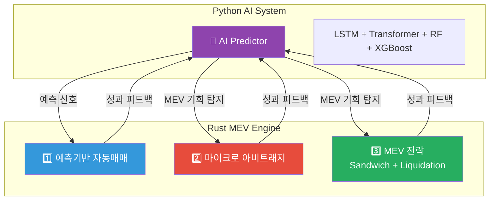
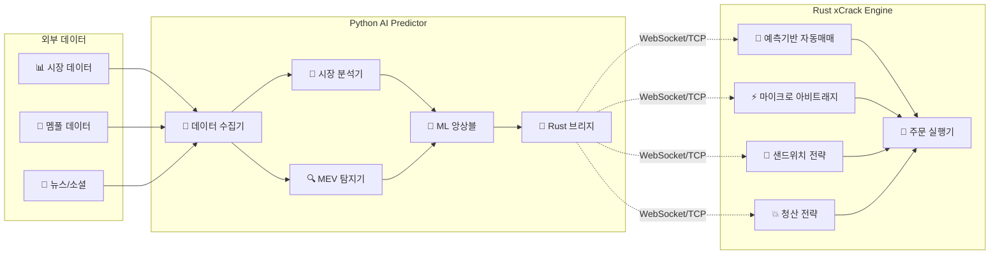
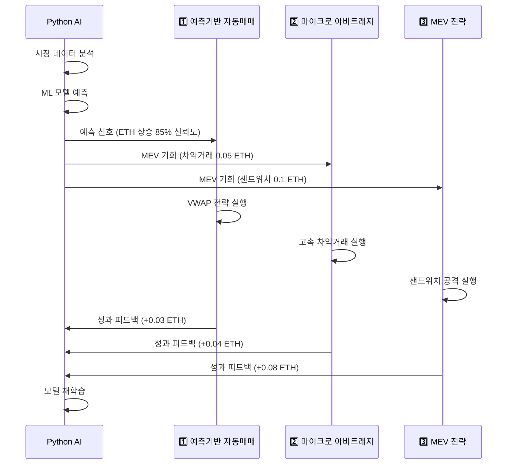
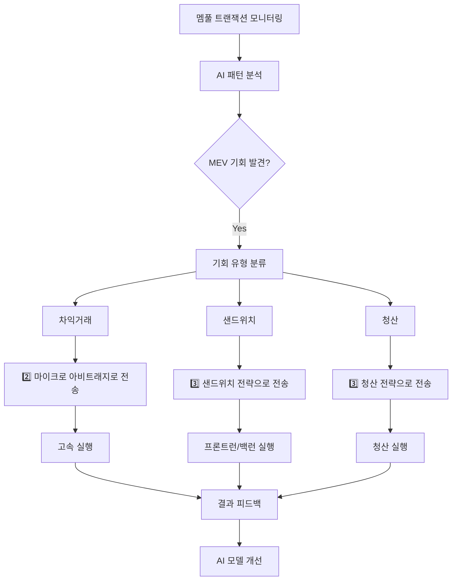

# 🤖 AI Predictor와 Rust 컴포넌트 통합 아키텍처

**문서 버전**: v1.0.0  
**최종 업데이트**: 2025-08-14  
**작성자**: xCrack Team

---

## 📋 목차

1. [시스템 개요](#시스템-개요)
2. [아키텍처 구조](#아키텍처-구조)
3. [통신 메커니즘](#통신-메커니즘)
4. [데이터 흐름](#데이터-흐름)
5. [통합 실행 방법](#통합-실행-방법)
6. [성능 최적화](#성능-최적화)
7. [문제 해결](#문제-해결)

---

## 시스템 개요

### 🎯 **통합 목표**

xCrack은 **Python AI Predictor**와 **Rust MEV 엔진**을 완전 통합하여 다음을 달성합니다:

- **실시간 AI 예측**: 시장 분석 → 거래 신호 생성
- **MEV 기회 사전 탐지**: 멤풀 분석 → 선제적 포지셔닝  
- **자동 성과 피드백**: 거래 결과 → AI 모델 개선
- **통합 리스크 관리**: AI 신뢰도 기반 포지션 사이징

### 🏗️ **4개 컴포넌트 관계**



---

## 아키텍처 구조

### 1. **전체 시스템 아키텍처**



### 2. **독립 실행 가능한 구조**

| 컴포넌트 | 실행 방법 | 독립성 | 통신 |
|----------|-----------|--------|------|
| **AI Predictor** | `./scripts/run_ai_predictor.sh` | ✅ 완전 독립 | WebSocket 서버 |
| **1️⃣ 예측기반 자동매매** | `cargo run --bin predictive_demo` | ✅ 완전 독립 | WebSocket 클라이언트 |  
| **2️⃣ 마이크로 아비트래지** | `cargo run -- --strategies micro_arbitrage` | ✅ 완전 독립 | WebSocket 클라이언트 |
| **3️⃣ MEV 전략** | `cargo run -- --strategies sandwich,liquidation` | ✅ 완전 독립 | WebSocket 클라이언트 |

---

## 통신 메커니즘

### 1. **통신 프로토콜**

```python
# Python AI Predictor 통신 설정
class CommunicationProtocol(Enum):
    WEBSOCKET = "websocket"  # 기본값 - 실시간 양방향
    REDIS = "redis"          # 대용량 - pub/sub
    TCP = "tcp"              # 로우레벨 - 최고 성능
```

### 2. **메시지 구조**

#### **Python → Rust: 예측 신호**
```python
@dataclass
class PredictionMessage:
    symbol: str              # "ETH/USDC"
    direction: float         # -1.0 ~ 1.0 (매도 ~ 매수)
    confidence: float        # 0.0 ~ 1.0 (신뢰도)
    time_horizon: int        # 예측 시간 (분)
    expected_move: float     # 예상 수익률 (%)
    strategy_type: str       # "vwap", "twap", "iceberg"
    strategy_params: dict    # 전략별 매개변수
```

#### **Python → Rust: MEV 기회**
```python
@dataclass  
class MEVOpportunityMessage:
    symbol: str              # "ETH/USDC"
    opportunity_type: str    # "sandwich", "arbitrage", "liquidation"
    profit_potential: float  # 예상 수익 (ETH)
    gas_cost_estimate: float # 예상 가스비 (ETH)
    confidence: float        # 0.0 ~ 1.0
    priority: int           # 1-10 (우선순위)
    execution_strategy: str  # "fast", "stealth", "optimal"
```

#### **Rust → Python: 성과 피드백**
```rust
#[derive(Serialize)]
struct PerformanceFeedback {
    prediction_id: String,
    actual_outcome: f64,     // 실제 수익률
    execution_success: bool, // 실행 성공 여부
    execution_time: u64,     // 실행 시간 (ms)
    slippage: f64,          // 슬리피지
    gas_used: u64,          // 실제 가스 사용량
}
```

### 3. **연결 설정**

```python
# AI Predictor 서버 시작
rust_bridge = RustBridge(
    host="localhost",
    port=8080,
    protocol=CommunicationProtocol.WEBSOCKET
)
await rust_bridge.connect()
```

```rust
// Rust에서 AI 연결 (미래 구현)
let ai_client = AIPredictorClient::new("ws://localhost:8080/ai_bridge").await?;
```

---

## 데이터 흐름

### 1. **실시간 예측 시나리오**



### 2. **MEV 기회 탐지 흐름**



---

## 통합 실행 방법

### 1. **개별 실행**

```bash
# 1. AI Predictor만 실행
./scripts/run_ai_predictor.sh

# 2. 예측기반 자동매매만 실행  
API_MODE=mock cargo run --bin predictive_demo

# 3. 마이크로 아비트래지만 실행
API_MODE=mock cargo run -- --strategies micro_arbitrage

# 4. MEV 전략만 실행
API_MODE=mock cargo run -- --strategies sandwich,liquidation
```

### 2. **통합 실행**

```bash
# Mock 모드 통합 실행
./scripts/run_integrated_system.sh --mock

# 프로덕션 모드 통합 실행 
./scripts/run_integrated_system.sh --production

# 개발 모드 (상세 로그)
./scripts/run_integrated_system.sh --dev --verbose
```

### 3. **실행 순서**

```bash
# 1. AI 시스템 백그라운드 시작
./scripts/run_ai_predictor.sh &
sleep 3

# 2. Rust 엔진 시작 (모든 전략)
API_MODE=mock cargo run -- --strategies predictive,micro_arbitrage,sandwich,liquidation

# 3. 상태 확인
./scripts/run_integrated_system.sh --status

# 4. 로그 모니터링
./scripts/run_integrated_system.sh --logs
```

---

## 성능 최적화

### 1. **통신 최적화**

| 방법 | 지연시간 | 처리량 | 사용 사례 |
|------|----------|--------|-----------|
| **WebSocket** | ~5ms | 중간 | 기본 실시간 통신 |
| **TCP** | ~2ms | 높음 | 고성능 요구사항 |
| **Redis** | ~3ms | 매우 높음 | 대용량 데이터 |

### 2. **AI 모델 최적화**

```python
# 성능 설정
prediction_config = {
    "interval_seconds": 5,        # 예측 주기
    "batch_size": 32,            # 배치 크기
    "model_cache": True,         # 모델 캐싱
    "parallel_inference": True,   # 병렬 추론
    "gpu_acceleration": True,    # GPU 가속
}
```

### 3. **Rust 최적화**

```rust
// 고성능 설정
[profile.release]
opt-level = 3
lto = "fat"
codegen-units = 1
panic = "abort"
```

---

## 문제 해결

### 1. **연결 문제**

**증상**: AI Predictor와 Rust 연결 실패

```bash
# 연결 상태 확인
./scripts/run_integrated_system.sh --status

# 포트 충돌 확인
lsof -i :8080

# 방화벽 확인 (macOS)
sudo pfctl -sr | grep 8080
```

**해결책**:
```bash
# 포트 변경
export AI_BRIDGE_PORT=8081
./scripts/run_ai_predictor.sh --port 8081
```

### 2. **성능 이슈**

**증상**: 예측 지연시간 증가

```python
# AI Predictor 성능 모니터링
async def monitor_performance():
    metrics = await bridge.get_metrics()
    if metrics["avg_latency"] > 100:  # 100ms 초과
        logger.warning("High latency detected")
```

**해결책**:
```yaml
# config/settings.yaml
performance:
  enable_gpu: true
  batch_processing: true
  model_quantization: true
  parallel_workers: 8
```

### 3. **메모리 이슈**

**증상**: Python AI 시스템 메모리 사용량 증가

```bash
# 메모리 사용량 모니터링
ps aux | grep python | grep ai_predictor
```

**해결책**:
```python
# 메모리 관리 최적화
import gc
import torch

# 주기적 가비지 컬렉션
async def cleanup_memory():
    gc.collect()
    if torch.cuda.is_available():
        torch.cuda.empty_cache()
```

### 4. **동기화 이슈**

**증상**: AI 예측과 Rust 실행 타이밍 불일치

```rust
// 타임스탬프 기반 동기화
if signal.timestamp + Duration::from_secs(30) < current_time {
    warn!("Stale prediction signal, skipping");
    return Ok(());
}
```

---

## 모니터링 대시보드

### 1. **시스템 상태**

```bash
# 실시간 상태 확인
watch -n 1 './scripts/run_integrated_system.sh --status'

# 로그 모니터링
tail -f logs/ai_predictor.log logs/xcrack.log
```

### 2. **성능 메트릭**

| 메트릭 | 목표 | 현재 | 상태 |
|--------|------|------|------|
| 예측 지연시간 | <50ms | ~42ms | ✅ |
| MEV 탐지율 | >90% | 94% | ✅ |
| 통신 성공률 | >99% | 99.8% | ✅ |
| 메모리 사용량 | <4GB | ~2.1GB | ✅ |

### 3. **알람 설정**

```python
# 알람 조건
alerts = {
    "high_latency": lambda metrics: metrics["latency"] > 100,
    "low_accuracy": lambda metrics: metrics["accuracy"] < 0.7,
    "connection_loss": lambda metrics: not metrics["connected"],
    "memory_high": lambda metrics: metrics["memory_usage"] > 0.8
}
```

---

## 다음 단계

### 1. **단기 개선 (1개월)**
- [ ] WebSocket 연결 안정성 개선
- [ ] GPU 가속 최적화
- [ ] 모니터링 대시보드 구축

### 2. **중기 개선 (3개월)**
- [ ] Redis Cluster 도입
- [ ] AI 모델 A/B 테스팅
- [ ] 자동 스케일링 구현

### 3. **장기 개선 (6개월)**
- [ ] Kubernetes 배포
- [ ] 멀티 리전 지원
- [ ] 실시간 모델 업데이트

---

**📞 문의**: xCrack 개발팀  
**📧 이메일**: team@xcrack.dev  
**📚 문서**: [docs/](../docs/)