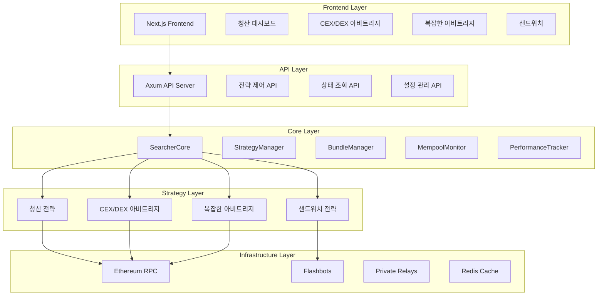
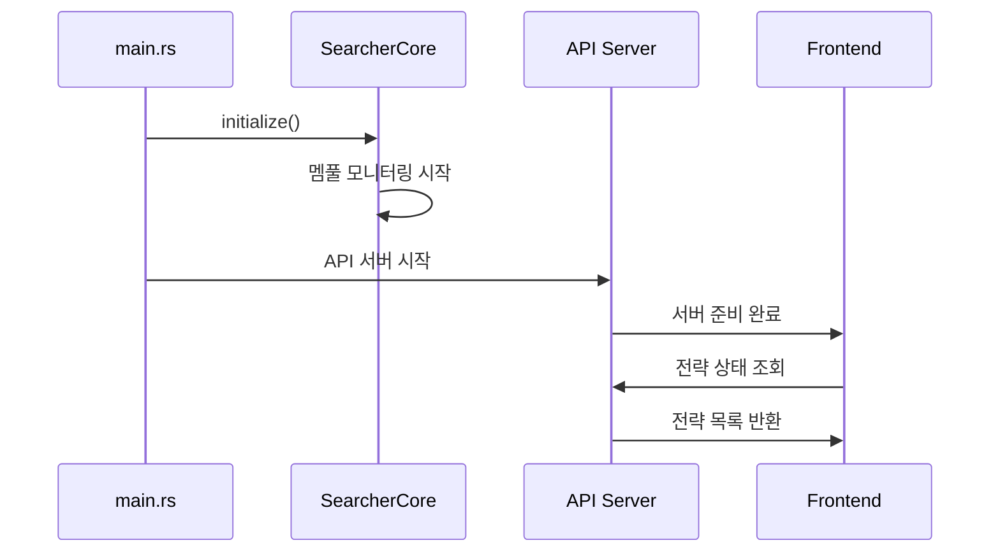
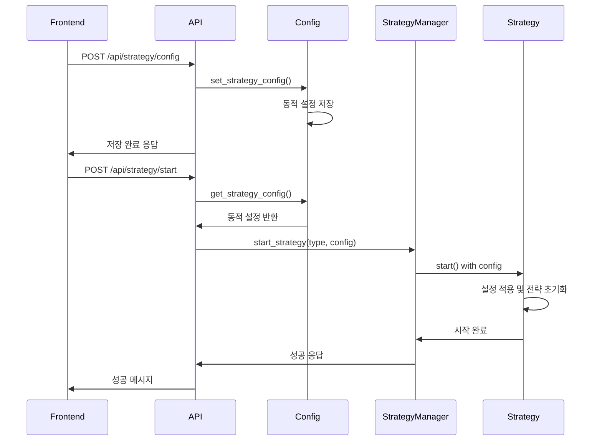
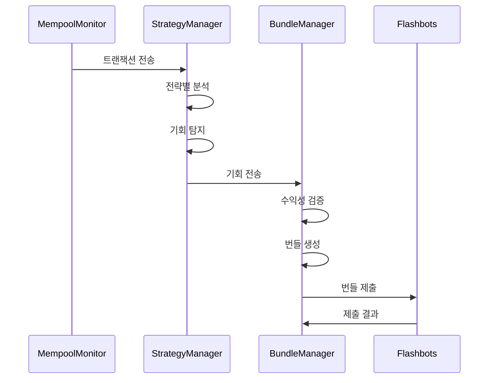
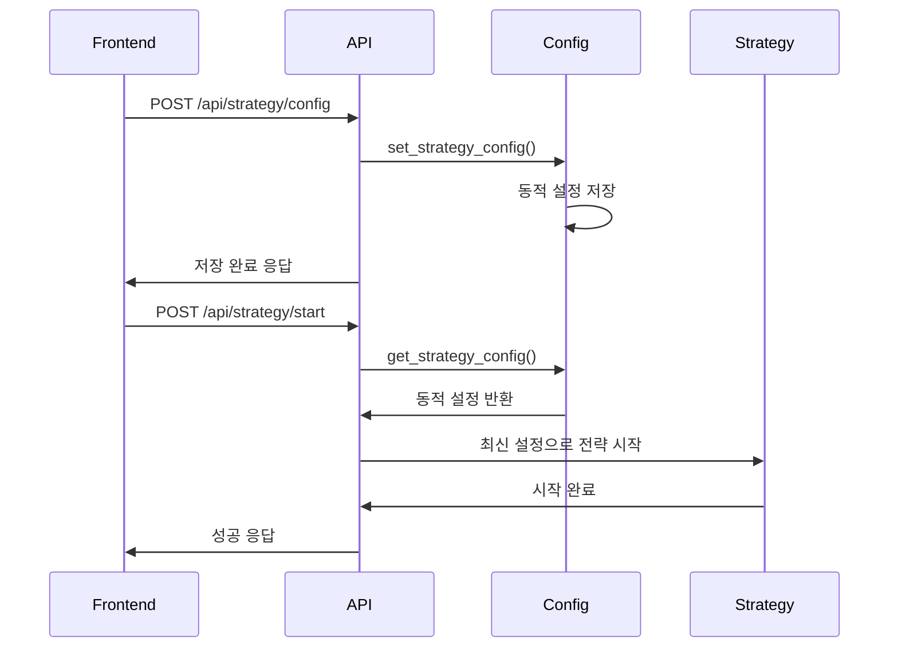

# xCrack MEV 서쳐 아키텍처 문서

## 📋 목차
- [개요](#개요)
- [전체 아키텍처](#전체-아키텍처)
- [핵심 컴포넌트](#핵심-컴포넌트)
- [3가지 전략](#3가지-전략)
- [Frontend 통합](#frontend-통합)
- [API 설계](#api-설계)
- [데이터 플로우](#데이터-플로우)
- [설정 관리](#설정-관리)
- [모니터링](#모니터링)
- [배포 및 실행](#배포-및-실행)

---

## 🎯 개요

xCrack은 Rust로 구축된 고성능 MEV(Maximal Extractable Value) 서쳐 봇으로, 3가지 핵심 전략을 통해 수익 기회를 포착합니다.

### 핵심 특징
- **고성능**: Rust 기반으로 마이크로초 단위의 응답 시간
- **모듈화**: 각 전략이 독립적으로 동작하는 플러그인 아키텍처
- **실시간**: WebSocket 기반 멤풀 모니터링
- **웹 기반**: Next.js Frontend로 완전한 제어 가능
- **확장성**: 새로운 전략을 쉽게 추가할 수 있는 구조

---

## 🏗️ 전체 아키텍처



---

## 🔧 핵심 컴포넌트

### 1. SearcherCore
**역할**: 전체 시스템의 중앙 오케스트레이터

```rust
pub struct SearcherCore {
    config: Arc<Config>,
    provider: Arc<Provider<Ws>>,
    strategy_manager: Arc<StrategyManager>,
    bundle_manager: Arc<BundleManager>,
    mempool_monitor: Arc<CoreMempoolMonitor>,
    performance_tracker: Arc<PerformanceTracker>,
}
```

**주요 기능**:
- 시스템 초기화 및 생명주기 관리
- 멤풀 모니터링 시작/중지
- 전략 간 데이터 플로우 조정
- 성능 메트릭 수집

### 2. StrategyManager
**역할**: 모든 전략의 중앙 관리자

```rust
pub struct StrategyManager {
    strategies: Arc<RwLock<HashMap<StrategyType, Arc<dyn Strategy + Send + Sync>>>>,
    performance_stats: Arc<RwLock<HashMap<StrategyType, StrategyStats>>>,
}
```

**주요 기능**:
- 전략 등록 및 초기화
- 개별 전략 시작/중지
- 전략별 성능 추적
- 트랜잭션 분석 및 기회 탐지

### 3. BundleManager
**역할**: MEV 번들 생성 및 제출

```rust
pub struct BundleManager {
    flashbots_client: Arc<FlashbotsClient>,
    private_relays: Vec<Arc<PrivateRelay>>,
    bundle_queue: Arc<Mutex<VecDeque<Bundle>>>,
}
```

**주요 기능**:
- 수익성 검증
- 가스 최적화
- Flashbots/Private Relay 제출
- 번들 우선순위 관리

### 4. CoreMempoolMonitor
**역할**: 실시간 멤풀 모니터링

```rust
pub struct CoreMempoolMonitor {
    provider: Arc<Provider<Ws>>,
    tx_sender: Option<mpsc::UnboundedSender<Transaction>>,
    filters: Vec<TransactionFilter>,
}
```

**주요 기능**:
- WebSocket 기반 실시간 모니터링
- 트랜잭션 필터링
- 전략별 트랜잭션 라우팅
- 메모리 효율적인 큐 관리

---

## 🎯 3가지 전략

### 1. 💥 청산 전략 (Liquidation Strategy)

**목적**: 대출 프로토콜의 청산 가능한 포지션을 선점

**특징**:
- **실시간 모니터링**: Aave, Compound, MakerDAO 포지션 추적
- **경쟁적 실행**: 다른 청산자보다 빠른 실행
- **수익성 검증**: 가스비 대비 수익 계산
- **리스크 관리**: 최대 청산 금액 제한

**아키텍처**:
```
LiquidationStrategyManager
├── PositionScanner (포지션 스캔)
├── PriceOracle (가격 오라클)
├── LiquidationExecutor (실행 엔진)
├── RiskManager (리스크 관리)
└── PerformanceTracker (성능 추적)
```

**Frontend 기능**:
- 실시간 청산 기회 모니터링
- 프로토콜별 설정 관리
- 수익성 임계값 조정
- 실행 내역 및 통계

### 2. 🔄 CEX/DEX 아비트리지 (CEX/DEX Arbitrage)

**목적**: 중앙화 거래소와 탈중앙화 거래소 간 가격 차이 활용

**특징**:
- **실시간 가격 모니터링**: CEX API + DEX 온체인 데이터
- **고속 실행**: 마이크로초 단위 응답
- **자금 관리**: 지갑 잔고 + 플래시론 활용
- **슬리피지 보호**: 최대 슬리피지 설정

**아키텍처**:
```
MicroArbitrageStrategy
├── PriceMonitor (가격 모니터)
├── OpportunityDetector (기회 탐지)
├── ExecutionEngine (실행 엔진)
├── FundingManager (자금 관리)
└── RiskManager (리스크 관리)
```

**Frontend 기능**:
- CEX/DEX 가격 차이 실시간 표시
- 수익성 임계값 설정
- 자금 관리 및 플래시론 설정
- 거래 내역 및 성과 분석

### 3. 🌐 복잡한 아비트리지 (Complex Arbitrage)

**목적**: 다중자산을 활용한 복잡한 차익거래

**특징**:
- **다중 경로 탐색**: 3단계 이상의 복잡한 경로
- **플래시론 활용**: Aave V3 다중자산 플래시론
- **전략별 분류**: 삼각, 포지션 마이그레이션, 복합 아비트리지
- **고급 리스크 관리**: 복잡한 거래에 맞는 리스크 제어

**아키텍처**:
```
ComplexArbitrageStrategy
├── PathFinder (경로 탐색)
├── FlashloanManager (플래시론 관리)
├── MultiAssetExecutor (다중자산 실행)
├── RiskCalculator (리스크 계산)
└── PerformanceAnalyzer (성능 분석)
```

**Frontend 기능**:
- 복잡한 아비트리지 기회 탐지
- 경로별 수익성 분석
- 플래시론 프로토콜 설정
- 복잡도별 분류 및 관리

### 4. 🥪 샌드위치 전략 (Sandwich Strategy)

**목적**: 대형 DEX 스왑을 앞뒤로 공격하여 수익 창출

**특징**:
- **트랜잭션 파싱**: DEX 스왑 트랜잭션 분석
- **가격 임팩트 계산**: 스왑으로 인한 가격 변동 예측
- **번들 생성**: Front-run + Target + Back-run
- **가스 경쟁**: 높은 가스비로 우선순위 확보

**아키텍처**:
```
SandwichStrategy
├── TransactionParser (트랜잭션 파싱)
├── ImpactCalculator (임팩트 계산)
├── BundleBuilder (번들 생성)
├── GasOptimizer (가스 최적화)
└── ExecutionManager (실행 관리)
```

**Frontend 기능**:
- 샌드위치 기회 실시간 모니터링
- 가스 전략 설정
- 수익성 임계값 조정
- 실행 내역 및 성과 분석

---

## 🎨 Frontend 통합

### 기술 스택
- **Framework**: Next.js 14 (App Router)
- **UI Library**: Shadcn UI + Tailwind CSS
- **State Management**: React Hooks (useState, useEffect)
- **API Client**: Custom fetch wrapper
- **Real-time**: WebSocket hooks

### 페이지 구조
```
crack_front/
├── app/
│   ├── layout.tsx (메인 레이아웃)
│   ├── page.tsx (대시보드)
│   ├── liquidation/ (청산 전략)
│   ├── micro-v2/ (CEX/DEX 아비트리지)
│   ├── complex-arbitrage/ (복잡한 아비트리지)
│   └── sandwich/ (샌드위치)
├── components/ui/ (공통 UI 컴포넌트)
└── lib/
    ├── api.ts (API 클라이언트)
    └── hooks/ (커스텀 훅)
```

### 공통 UI 패턴
각 전략 페이지는 동일한 구조를 가집니다:

1. **헤더**: 전략 제어 버튼 (시작/중지)
2. **탭 네비게이션**: 대시보드, 기회, 내역, 설정
3. **대시보드**: 주요 메트릭 및 성능 지표
4. **기회**: 실시간 기회 목록
5. **내역**: 실행 내역 및 통계
6. **설정**: 전략별 상세 설정

---

## 🔌 API 설계

### RESTful API 구조
```
/api/
├── health (헬스 체크)
├── status (전체 상태)
├── strategies (전략 목록)
├── liquidation/ (청산 전략)
│   ├── dashboard
│   ├── opportunities
│   ├── config (GET/POST)
│   ├── start
│   ├── stop
│   └── status
├── cex-dex-arbitrage/ (CEX/DEX 아비트리지)
├── complex-arbitrage/ (복잡한 아비트리지)
└── sandwich/ (샌드위치)
```

### API 응답 형식
```json
{
  "success": true,
  "message": "작업 성공",
  "data": { ... },
  "timestamp": "2024-01-01T00:00:00Z"
}
```

### 설정 API 응답
```json
{
  "success": true,
  "message": "청산 전략 설정이 저장되었습니다",
  "updated_fields": {
    "min_profit_usd": 50.0,
    "max_position_size_usd": 10000.0,
    "max_gas_price_gwei": 100
  }
}
```

### 에러 처리
```json
{
  "success": false,
  "message": "에러 메시지",
  "error_code": "STRATEGY_NOT_FOUND",
  "timestamp": "2024-01-01T00:00:00Z"
}
```

---

## 📊 데이터 플로우

### 1. 시스템 시작


### 2. 설정 저장 및 전략 시작


### 3. 기회 탐지 및 실행


---

## ⚙️ 설정 관리

### 이중 설정 구조
xCrack은 **정적 설정**과 **동적 설정**을 분리하여 관리합니다:

#### 1. 정적 설정 (Static Config)
- **파일**: `config/default.toml`
- **용도**: 시스템 초기화, 네트워크 설정, 기본값
- **변경**: 서버 재시작 필요

```toml
[network]
chain_id = 1
rpc_url = "wss://mainnet.infura.io/ws/v3/YOUR_KEY"

[strategies.liquidation]
enabled = true
min_profit_usd = 100.0
max_position_size_usd = 10000.0
```

#### 2. 동적 설정 (Dynamic Config)
- **저장소**: 메모리 기반 HashMap
- **용도**: Frontend에서 실시간 변경 가능한 설정
- **변경**: 즉시 적용, 서버 재시작 불필요

```rust
// 동적 설정 저장소
pub struct Config {
    // ... 기존 필드들
    pub dynamic_config: Arc<RwLock<HashMap<String, serde_json::Value>>>,
}
```

### Frontend 설정 관리
각 전략 페이지에서 실시간으로 설정을 변경할 수 있습니다:

- **기본 설정**: 수익 임계값, 포지션 크기, 타임아웃
- **전략별 설정**: 프로토콜 주소, 수수료, 리스크 한도
- **실시간 저장**: 설정 변경 시 즉시 메모리에 저장
- **전략 시작 시 적용**: 저장된 동적 설정으로 전략 시작

### 설정 적용 워크플로우


### 환경 변수 기반 설정
```bash
# 네트워크 설정
ETHEREUM_RPC_URL=wss://mainnet.infura.io/ws/v3/YOUR_KEY
ETHEREUM_HTTP_URL=https://mainnet.infura.io/v3/YOUR_KEY

# 전략 활성화
LIQUIDATION_ENABLED=true
CEX_DEX_ARBITRAGE_ENABLED=true
COMPLEX_ARBITRAGE_ENABLED=true
SANDWICH_ENABLED=true

# API 키
FLASHBOTS_RELAY_URL=https://relay.flashbots.net
PRIVATE_RELAY_URLS=https://api.blocknative.com/v1/auction
```

---

## 📈 모니터링

### 성능 메트릭
- **처리량**: 초당 처리 트랜잭션 수
- **지연시간**: 분석부터 실행까지의 시간
- **성공률**: 성공한 거래 비율
- **수익성**: 총 수익 및 수익률

### 실시간 대시보드
- **전략별 상태**: 실행 중/중지/오류
- **활성 기회**: 현재 탐지된 기회 수
- **실행 내역**: 최근 실행된 거래
- **성능 차트**: 시간별 성능 지표

### 알림 시스템
- **전략 오류**: 전략 실행 실패 시 알림
- **수익 임계값**: 설정한 수익 달성 시 알림
- **리스크 한도**: 손실 한도 도달 시 알림
- **시스템 상태**: 서버 상태 변화 알림

---

## 🚀 배포 및 실행

### 개발 환경 실행
```bash
# Backend 실행
cd /path/to/xCrack
cargo run --release

# Frontend 실행
cd crack_front
npm install
npm run dev
```

### 프로덕션 배포
```bash
# Backend 빌드
cargo build --release

# Frontend 빌드
cd crack_front
npm run build

# Docker 실행
docker-compose up -d
```

### 시스템 요구사항
- **CPU**: 4코어 이상 (고성능 처리)
- **메모리**: 8GB 이상 (멤풀 캐싱)
- **네트워크**: 안정적인 인터넷 연결
- **스토리지**: 50GB 이상 (로그 및 캐시)

---

## 🔒 보안 고려사항

### API 보안
- **인증**: JWT 토큰 기반 인증
- **권한**: 역할 기반 접근 제어
- **암호화**: HTTPS 통신
- **제한**: API 호출 빈도 제한

### 전략 보안
- **검증**: 모든 거래 사전 검증
- **한도**: 일일 거래 한도 설정
- **모니터링**: 비정상 거래 탐지
- **백업**: 설정 및 데이터 백업

---

## 📚 확장성

### 새로운 전략 추가
1. `Strategy` trait 구현
2. `StrategyManager`에 등록
3. API 엔드포인트 추가
4. Frontend 페이지 생성

### 모니터링 확장
- **메트릭 수집**: Prometheus 통합
- **로그 분석**: ELK Stack 연동
- **알림**: Slack/Discord 연동
- **대시보드**: Grafana 연동

---

## 🎯 결론

xCrack은 현대적인 MEV 서쳐 봇으로서 다음과 같은 특징을 가집니다:

- **완전한 모듈화**: 각 전략이 독립적으로 동작
- **실시간 제어**: Frontend를 통한 완전한 제어
- **동적 설정 관리**: 실시간 설정 변경 및 즉시 적용
- **이중 설정 구조**: 정적 설정과 동적 설정의 분리
- **고성능**: Rust 기반의 최적화된 성능
- **확장성**: 새로운 전략과 기능을 쉽게 추가
- **안정성**: 견고한 에러 처리 및 복구 메커니즘

### 핵심 혁신 사항
1. **API 기반 전략 제어**: main.rs에서 자동 시작하지 않고 Frontend에서 완전 제어
2. **동적 설정 시스템**: 메모리 기반 실시간 설정 저장 및 적용
3. **설정-시작 분리**: 설정 저장과 전략 시작을 분리하여 유연성 확보
4. **완전한 Frontend 통합**: 3가지 전략 모두 동일한 수준의 웹 인터페이스

이 아키텍처를 통해 사용자는 3가지 핵심 전략을 효율적으로 관리하고, 실시간으로 설정을 변경하며, 수익 기회를 포착할 수 있습니다.