# 🏦 Liquidation Flow 시퀀스 다이어그램

> **DeFi 청산 전략의 모든 시나리오별 상세 시퀀스 다이어그램**
>
> 각 컴포넌트와 외부 서비스 간의 상호작용을 단계별로 시각화

---

## 📋 목차

1. [전체 청산 프로세스](#-전체-청산-프로세스)
2. [Aave v3 청산 상세 플로우](#-aave-v3-청산-상세-플로우)
3. [Compound v3 청산 상세 플로우](#-compound-v3-청산-상세-플로우)
4. [MakerDAO 청산 상세 플로우](#-makerdao-청산-상세-플로우)
5. [MEV 번들 생성 및 제출 플로우](#-mev-번들-생성-및-제출-플로우)
6. [프라이빗 제출 vs 퍼블릭 폴백 플로우](#-프라이빗-제출-vs-퍼블릭-폴백-플로우)
7. [Flashloan 청산 실행 플로우](#-flashloan-청산-실행-플로우)
8. [DEX Aggregator 스왑 플로우](#-dex-aggregator-스왑-플로우)
9. [경쟁 분석 및 가스 최적화 플로우](#-경쟁-분석-및-가스-최적화-플로우)
10. [에러 처리 및 복구 플로우](#-에러-처리-및-복구-플로우)

---

## 🔄 전체 청산 프로세스

### 1️⃣ 통합 청산 관리자 실행 플로우

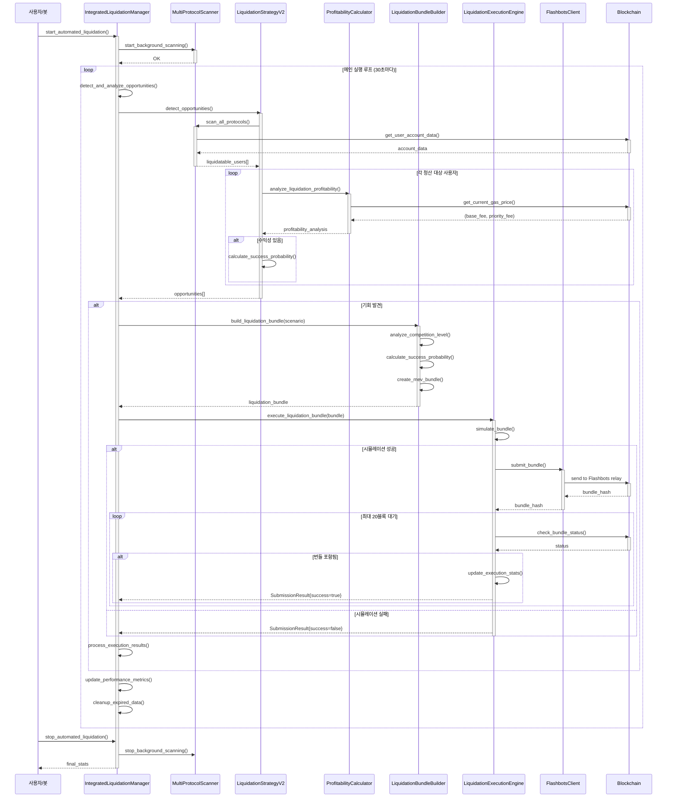
```mermaid
sequenceDiagram
    participant User as 사용자/봇
    participant ILM as IntegratedLiquidationManager
    participant MPS as MultiProtocolScanner
    participant LSV2 as LiquidationStrategyV2
    participant PC as ProfitabilityCalculator
    participant LBB as LiquidationBundleBuilder
    participant LEE as LiquidationExecutionEngine
    participant FB as FlashbotsClient
    participant BC as Blockchain

    User->>ILM: start_automated_liquidation()
    activate ILM

    ILM->>MPS: start_background_scanning()
    activate MPS
    MPS-->>ILM: OK
    deactivate MPS

    loop 메인 실행 루프 (30초마다)
        ILM->>ILM: detect_and_analyze_opportunities()

        ILM->>LSV2: detect_opportunities()
        activate LSV2

        LSV2->>MPS: scan_all_protocols()
        activate MPS
        MPS->>BC: get_user_account_data()
        activate BC
        BC-->>MPS: account_data
        deactivate BC
        MPS-->>LSV2: liquidatable_users[]
        deactivate MPS

        loop 각 청산 대상 사용자
            LSV2->>PC: analyze_liquidation_profitability()
            activate PC
            PC->>BC: get_current_gas_price()
            activate BC
            BC-->>PC: (base_fee, priority_fee)
            deactivate BC
            PC-->>LSV2: profitability_analysis
            deactivate PC

            alt 수익성 있음
                LSV2->>LSV2: calculate_success_probability()
            end
        end

        LSV2-->>ILM: opportunities[]
        deactivate LSV2

        alt 기회 발견
            ILM->>LBB: build_liquidation_bundle(scenario)
            activate LBB
            LBB->>LBB: analyze_competition_level()
            LBB->>LBB: calculate_success_probability()
            LBB->>LBB: create_mev_bundle()
            LBB-->>ILM: liquidation_bundle
            deactivate LBB

            ILM->>LEE: execute_liquidation_bundle(bundle)
            activate LEE
            LEE->>LEE: simulate_bundle()

            alt 시뮬레이션 성공
                LEE->>FB: submit_bundle()
                activate FB
                FB->>BC: send to Flashbots relay
                activate BC
                BC-->>FB: bundle_hash
                deactivate BC
                FB-->>LEE: bundle_hash
                deactivate FB

                loop 최대 20블록 대기
                    LEE->>BC: check_bundle_status()
                    activate BC
                    BC-->>LEE: status
                    deactivate BC

                    alt 번들 포함됨
                        LEE->>LEE: update_execution_stats()
                        LEE-->>ILM: SubmissionResult{success=true}
                    end
                end
            else 시뮬레이션 실패
                LEE-->>ILM: SubmissionResult{success=false}
            end
            deactivate LEE

            ILM->>ILM: process_execution_results()
        end

        ILM->>ILM: update_performance_metrics()
        ILM->>ILM: cleanup_expired_data()
    end

    User->>ILM: stop_automated_liquidation()
    ILM->>MPS: stop_background_scanning()
    ILM-->>User: final_stats
    deactivate ILM
```

---

## 🏦 Aave v3 청산 상세 플로우

### 2️⃣ Aave v3 청산 기회 탐지 및 분석

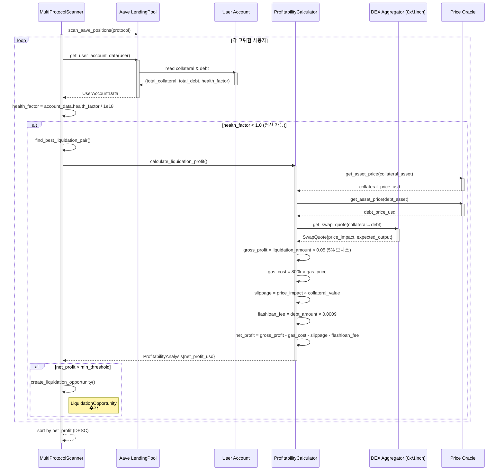
```mermaid
sequenceDiagram
    participant MPS as MultiProtocolScanner
    participant Aave as Aave LendingPool
    participant User as User Account
    participant PC as ProfitabilityCalculator
    participant DEX as DEX Aggregator (0x/1inch)
    participant Oracle as Price Oracle

    MPS->>Aave: scan_aave_positions(protocol)
    activate MPS

    loop 각 고위험 사용자
        MPS->>Aave: get_user_account_data(user)
        activate Aave
        Aave->>User: read collateral & debt
        activate User
        User-->>Aave: (total_collateral, total_debt, health_factor)
        deactivate User
        Aave-->>MPS: UserAccountData
        deactivate Aave

        MPS->>MPS: health_factor = account_data.health_factor / 1e18

        alt health_factor < 1.0 (청산 가능)
            MPS->>MPS: find_best_liquidation_pair()

            MPS->>PC: calculate_liquidation_profit()
            activate PC

            PC->>Oracle: get_asset_price(collateral_asset)
            activate Oracle
            Oracle-->>PC: collateral_price_usd
            deactivate Oracle

            PC->>Oracle: get_asset_price(debt_asset)
            activate Oracle
            Oracle-->>PC: debt_price_usd
            deactivate Oracle

            PC->>DEX: get_swap_quote(collateral→debt)
            activate DEX
            DEX-->>PC: SwapQuote{price_impact, expected_output}
            deactivate DEX

            PC->>PC: gross_profit = liquidation_amount × 0.05 (5% 보너스)
            PC->>PC: gas_cost = 800k × gas_price
            PC->>PC: slippage = price_impact × collateral_value
            PC->>PC: flashloan_fee = debt_amount × 0.0009
            PC->>PC: net_profit = gross_profit - gas_cost - slippage - flashloan_fee

            PC-->>MPS: ProfitabilityAnalysis{net_profit_usd}
            deactivate PC

            alt net_profit > min_threshold
                MPS->>MPS: create_liquidation_opportunity()
                Note right of MPS: LiquidationOpportunity<br/>추가
            end
        end
    end

    MPS-->>MPS: sort by net_profit (DESC)
    deactivate MPS
```

### 3️⃣ Aave v3 청산 실행 (Flashloan 모드)

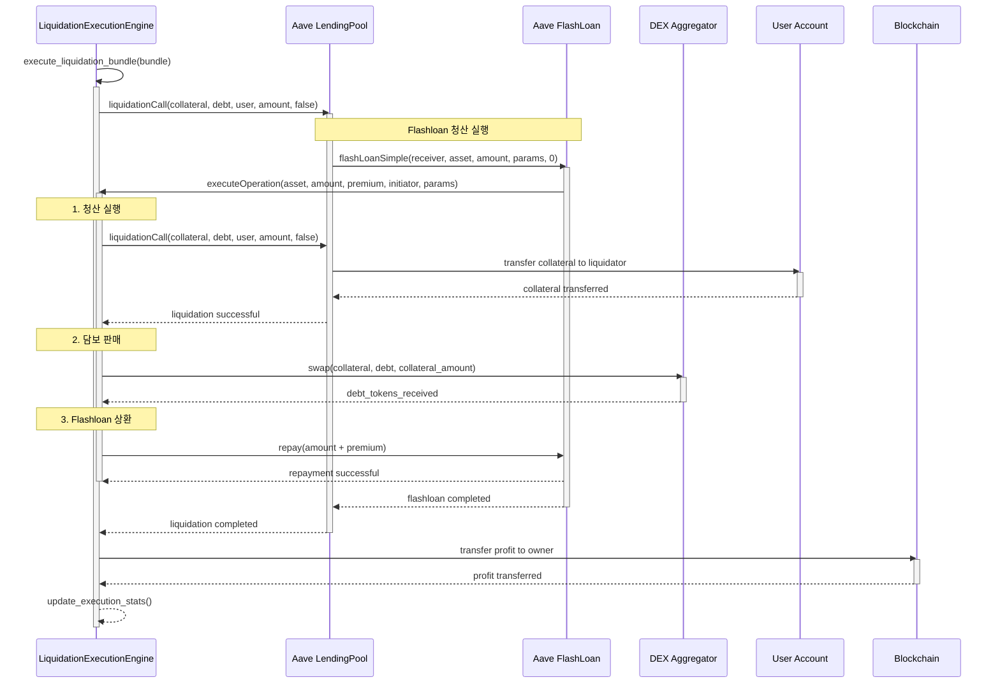
```mermaid
sequenceDiagram
    participant LEE as LiquidationExecutionEngine
    participant Aave as Aave LendingPool
    participant Flashloan as Aave FlashLoan
    participant DEX as DEX Aggregator
    participant User as User Account
    participant BC as Blockchain

    LEE->>LEE: execute_liquidation_bundle(bundle)
    activate LEE

    LEE->>Aave: liquidationCall(collateral, debt, user, amount, false)
    activate Aave

    Note over Aave,Flashloan: Flashloan 청산 실행
    Aave->>Flashloan: flashLoanSimple(receiver, asset, amount, params, 0)
    activate Flashloan

    Flashloan->>LEE: executeOperation(asset, amount, premium, initiator, params)
    activate LEE

    Note over LEE: 1. 청산 실행
    LEE->>Aave: liquidationCall(collateral, debt, user, amount, false)
    Aave->>User: transfer collateral to liquidator
    activate User
    User-->>Aave: collateral transferred
    deactivate User
    Aave-->>LEE: liquidation successful

    Note over LEE: 2. 담보 판매
    LEE->>DEX: swap(collateral, debt, collateral_amount)
    activate DEX
    DEX-->>LEE: debt_tokens_received
    deactivate DEX

    Note over LEE: 3. Flashloan 상환
    LEE->>Flashloan: repay(amount + premium)
    Flashloan-->>LEE: repayment successful
    deactivate LEE

    Flashloan-->>Aave: flashloan completed
    deactivate Flashloan

    Aave-->>LEE: liquidation completed
    deactivate Aave

    LEE->>BC: transfer profit to owner
    activate BC
    BC-->>LEE: profit transferred
    deactivate BC

    LEE-->>LEE: update_execution_stats()
    deactivate LEE
```

---

## 🏛️ Compound v3 청산 상세 플로우

### 4️⃣ Compound v3 청산 기회 탐지

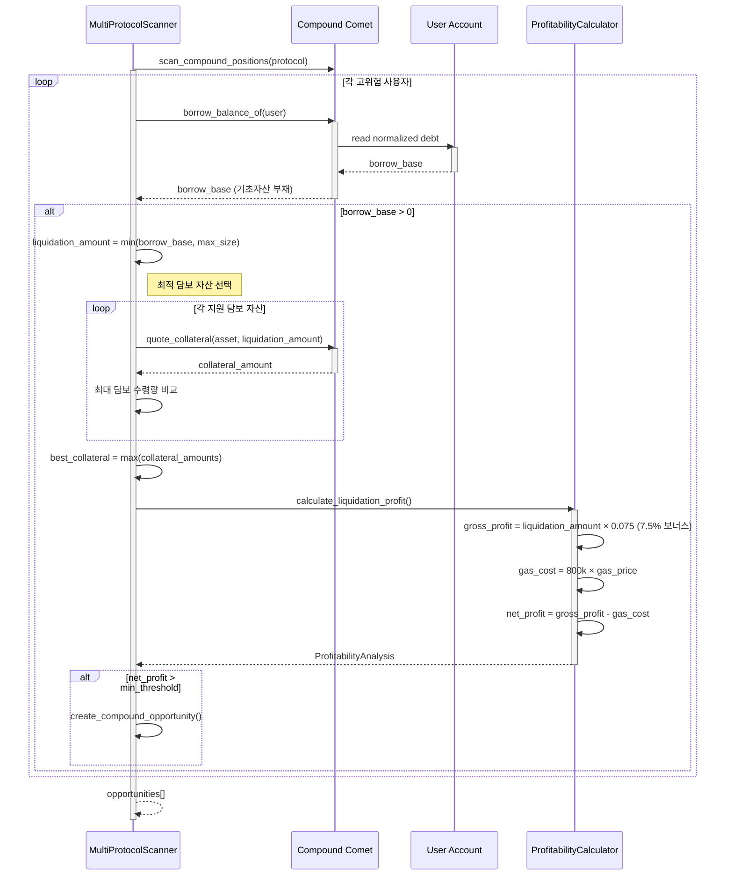
```mermaid
sequenceDiagram
    participant MPS as MultiProtocolScanner
    participant Comet as Compound Comet
    participant User as User Account
    participant PC as ProfitabilityCalculator

    MPS->>Comet: scan_compound_positions(protocol)
    activate MPS

    loop 각 고위험 사용자
        MPS->>Comet: borrow_balance_of(user)
        activate Comet
        Comet->>User: read normalized debt
        activate User
        User-->>Comet: borrow_base
        deactivate User
        Comet-->>MPS: borrow_base (기초자산 부채)
        deactivate Comet

        alt borrow_base > 0
            MPS->>MPS: liquidation_amount = min(borrow_base, max_size)

            Note right of MPS: 최적 담보 자산 선택
            loop 각 지원 담보 자산
                MPS->>Comet: quote_collateral(asset, liquidation_amount)
                activate Comet
                Comet-->>MPS: collateral_amount
                deactivate Comet

                MPS->>MPS: 최대 담보 수령량 비교
            end

            MPS->>MPS: best_collateral = max(collateral_amounts)

            MPS->>PC: calculate_liquidation_profit()
            activate PC
            PC->>PC: gross_profit = liquidation_amount × 0.075 (7.5% 보너스)
            PC->>PC: gas_cost = 800k × gas_price
            PC->>PC: net_profit = gross_profit - gas_cost
            PC-->>MPS: ProfitabilityAnalysis
            deactivate PC

            alt net_profit > min_threshold
                MPS->>MPS: create_compound_opportunity()
            end
        end
    end

    MPS-->>MPS: opportunities[]
    deactivate MPS
```

### 5️⃣ Compound v3 청산 실행

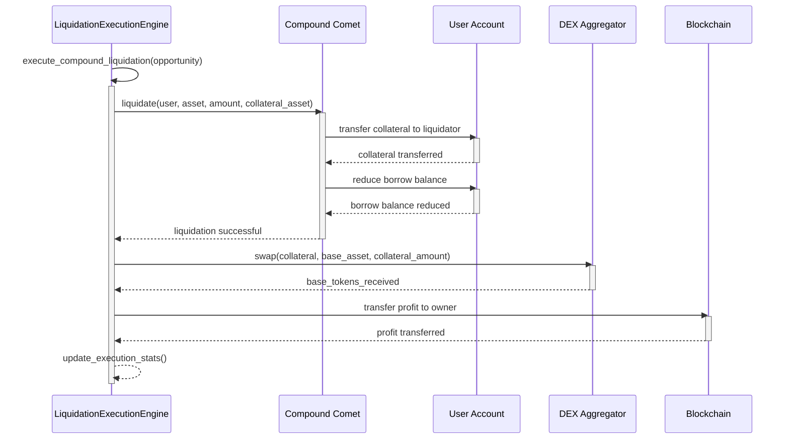
```mermaid
sequenceDiagram
    participant LEE as LiquidationExecutionEngine
    participant Comet as Compound Comet
    participant User as User Account
    participant DEX as DEX Aggregator
    participant BC as Blockchain

    LEE->>LEE: execute_compound_liquidation(opportunity)
    activate LEE

    LEE->>Comet: liquidate(user, asset, amount, collateral_asset)
    activate Comet

    Comet->>User: transfer collateral to liquidator
    activate User
    User-->>Comet: collateral transferred
    deactivate User

    Comet->>User: reduce borrow balance
    activate User
    User-->>Comet: borrow balance reduced
    deactivate User

    Comet-->>LEE: liquidation successful
    deactivate Comet

    LEE->>DEX: swap(collateral, base_asset, collateral_amount)
    activate DEX
    DEX-->>LEE: base_tokens_received
    deactivate DEX

    LEE->>BC: transfer profit to owner
    activate BC
    BC-->>LEE: profit transferred
    deactivate BC

    LEE-->>LEE: update_execution_stats()
    deactivate LEE
```

---

## 🏰 MakerDAO 청산 상세 플로우

### 6️⃣ MakerDAO 청산 기회 탐지

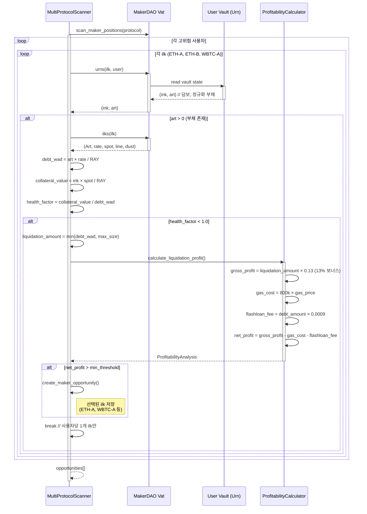
```mermaid
sequenceDiagram
    participant MPS as MultiProtocolScanner
    participant Vat as MakerDAO Vat
    participant User as User Vault (Urn)
    participant PC as ProfitabilityCalculator

    MPS->>Vat: scan_maker_positions(protocol)
    activate MPS

    loop 각 고위험 사용자
        loop 각 ilk (ETH-A, ETH-B, WBTC-A)
            MPS->>Vat: urns(ilk, user)
            activate Vat
            Vat->>User: read vault state
            activate User
            User-->>Vat: (ink, art) // 담보, 정규화 부채
            deactivate User
            Vat-->>MPS: (ink, art)
            deactivate Vat

            alt art > 0 (부채 존재)
                MPS->>Vat: ilks(ilk)
                activate Vat
                Vat-->>MPS: (Art, rate, spot, line, dust)
                deactivate Vat

                MPS->>MPS: debt_wad = art × rate / RAY
                MPS->>MPS: collateral_value = ink × spot / RAY
                MPS->>MPS: health_factor = collateral_value / debt_wad

                alt health_factor < 1.0
                    MPS->>MPS: liquidation_amount = min(debt_wad, max_size)

                    MPS->>PC: calculate_liquidation_profit()
                    activate PC
                    PC->>PC: gross_profit = liquidation_amount × 0.13 (13% 보너스)
                    PC->>PC: gas_cost = 800k × gas_price
                    PC->>PC: flashloan_fee = debt_amount × 0.0009
                    PC->>PC: net_profit = gross_profit - gas_cost - flashloan_fee
                    PC-->>MPS: ProfitabilityAnalysis
                    deactivate PC

                    alt net_profit > min_threshold
                        MPS->>MPS: create_maker_opportunity()
                        Note right of MPS: 선택된 ilk 저장<br/>(ETH-A, WBTC-A 등)
                    end

                    MPS->>MPS: break // 사용자당 1개 ilk만
                end
            end
        end
    end

    MPS-->>MPS: opportunities[]
    deactivate MPS
```

### 7️⃣ MakerDAO 청산 실행

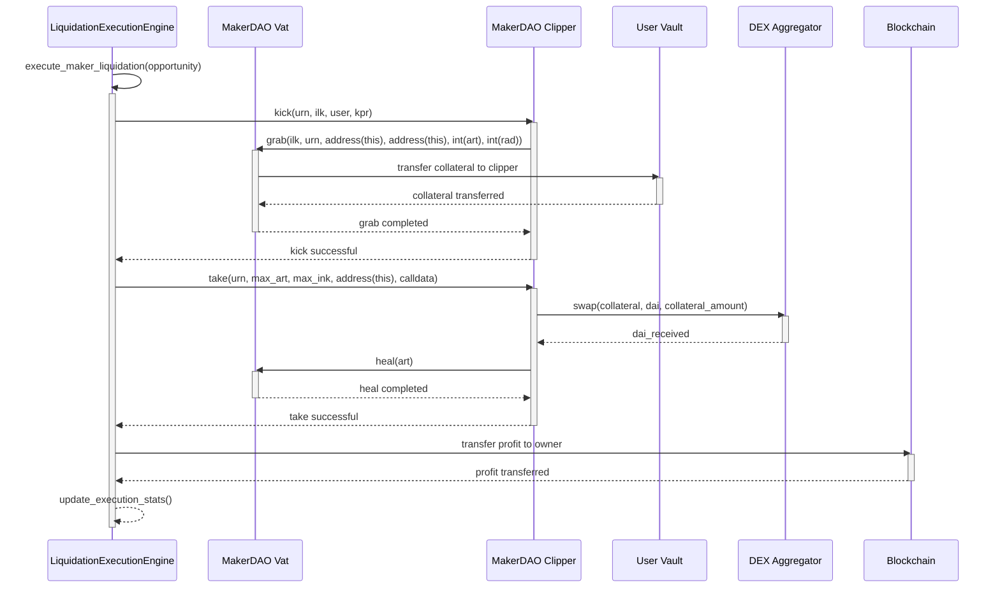
```mermaid
sequenceDiagram
    participant LEE as LiquidationExecutionEngine
    participant Vat as MakerDAO Vat
    participant Clipper as MakerDAO Clipper
    participant User as User Vault
    participant DEX as DEX Aggregator
    participant BC as Blockchain

    LEE->>LEE: execute_maker_liquidation(opportunity)
    activate LEE

    LEE->>Clipper: kick(urn, ilk, user, kpr)
    activate Clipper

    Clipper->>Vat: grab(ilk, urn, address(this), address(this), int(art), int(rad))
    activate Vat
    Vat->>User: transfer collateral to clipper
    activate User
    User-->>Vat: collateral transferred
    deactivate User
    Vat-->>Clipper: grab completed
    deactivate Vat

    Clipper-->>LEE: kick successful
    deactivate Clipper

    LEE->>Clipper: take(urn, max_art, max_ink, address(this), calldata)
    activate Clipper

    Clipper->>DEX: swap(collateral, dai, collateral_amount)
    activate DEX
    DEX-->>Clipper: dai_received
    deactivate DEX

    Clipper->>Vat: heal(art)
    activate Vat
    Vat-->>Clipper: heal completed
    deactivate Vat

    Clipper-->>LEE: take successful
    deactivate Clipper

    LEE->>BC: transfer profit to owner
    activate BC
    BC-->>LEE: profit transferred
    deactivate BC

    LEE-->>LEE: update_execution_stats()
    deactivate LEE
```

---

## 📦 MEV 번들 생성 및 제출 플로우

### 8️⃣ MEV 번들 생성 과정

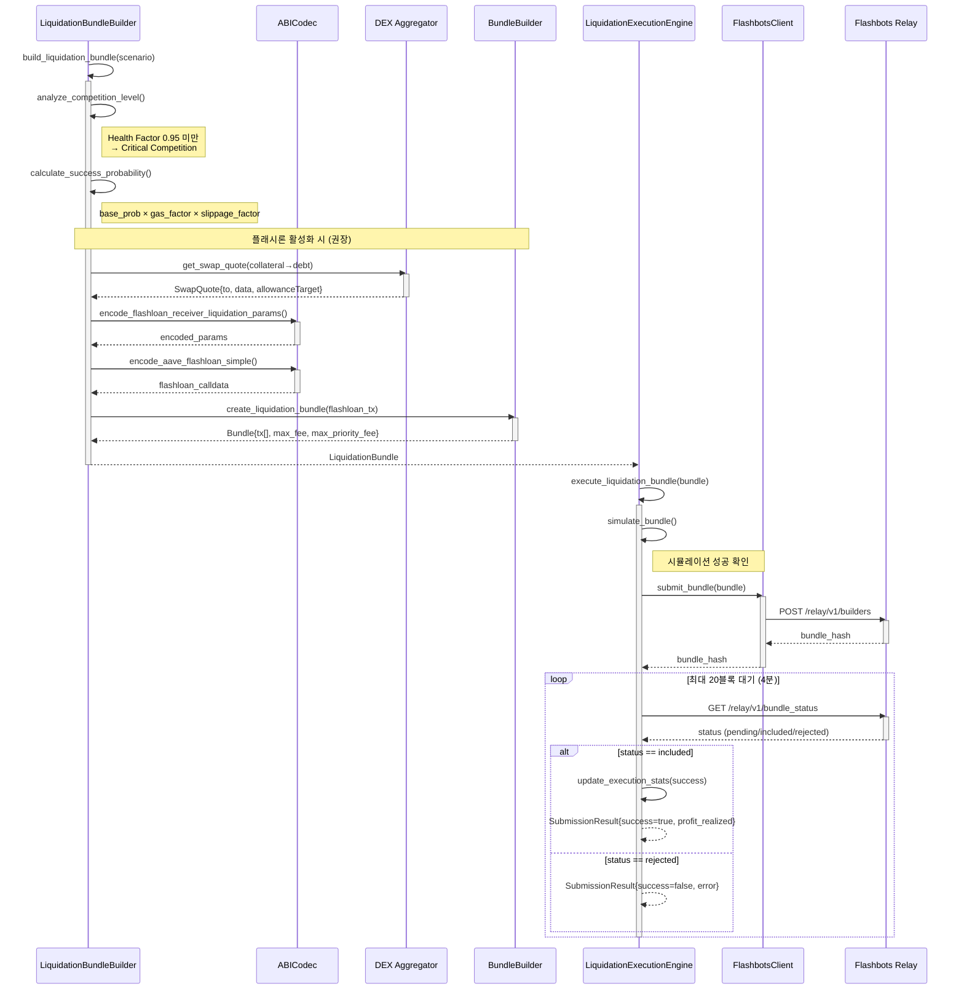
```mermaid
sequenceDiagram
    participant LBB as LiquidationBundleBuilder
    participant ABICodec as ABICodec
    participant DEX as DEX Aggregator
    participant Bundle as BundleBuilder
    participant LEE as LiquidationExecutionEngine
    participant FB as FlashbotsClient
    participant Relay as Flashbots Relay

    LBB->>LBB: build_liquidation_bundle(scenario)
    activate LBB

    LBB->>LBB: analyze_competition_level()
    Note right of LBB: Health Factor 0.95 미만<br/>→ Critical Competition

    LBB->>LBB: calculate_success_probability()
    Note right of LBB: base_prob × gas_factor × slippage_factor

    Note over LBB,Bundle: 플래시론 활성화 시 (권장)
    LBB->>DEX: get_swap_quote(collateral→debt)
    activate DEX
    DEX-->>LBB: SwapQuote{to, data, allowanceTarget}
    deactivate DEX

    LBB->>ABICodec: encode_flashloan_receiver_liquidation_params()
    activate ABICodec
    ABICodec-->>LBB: encoded_params
    deactivate ABICodec

    LBB->>ABICodec: encode_aave_flashloan_simple()
    activate ABICodec
    ABICodec-->>LBB: flashloan_calldata
    deactivate ABICodec

    LBB->>Bundle: create_liquidation_bundle(flashloan_tx)
    activate Bundle
    Bundle-->>LBB: Bundle{tx[], max_fee, max_priority_fee}
    deactivate Bundle

    LBB-->>LEE: LiquidationBundle
    deactivate LBB

    LEE->>LEE: execute_liquidation_bundle(bundle)
    activate LEE

    LEE->>LEE: simulate_bundle()
    Note right of LEE: 시뮬레이션 성공 확인

    LEE->>FB: submit_bundle(bundle)
    activate FB

    FB->>Relay: POST /relay/v1/builders
    activate Relay
    Relay-->>FB: bundle_hash
    deactivate Relay

    FB-->>LEE: bundle_hash
    deactivate FB

    loop 최대 20블록 대기 (4분)
        LEE->>Relay: GET /relay/v1/bundle_status
        activate Relay
        Relay-->>LEE: status (pending/included/rejected)
        deactivate Relay

        alt status == included
            LEE->>LEE: update_execution_stats(success)
            LEE-->>LEE: SubmissionResult{success=true, profit_realized}
        else status == rejected
            LEE-->>LEE: SubmissionResult{success=false, error}
        end
    end

    deactivate LEE
```

---

## 🔒 프라이빗 제출 vs 퍼블릭 폴백 플로우

### 9️⃣ MEV-lite 프라이빗 제출

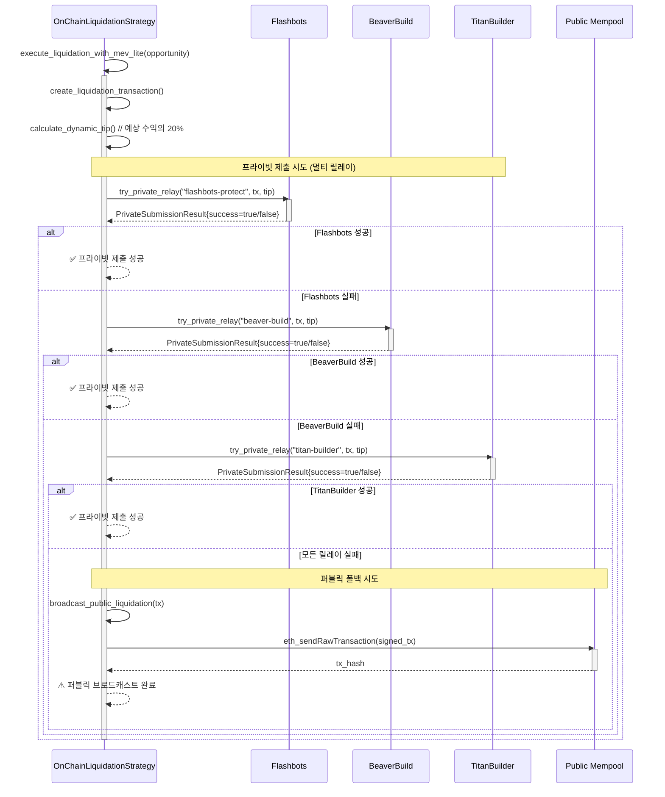
```mermaid
sequenceDiagram
    participant OCLS as OnChainLiquidationStrategy
    participant FB as Flashbots
    participant Beaver as BeaverBuild
    participant Titan as TitanBuilder
    participant Mempool as Public Mempool

    OCLS->>OCLS: execute_liquidation_with_mev_lite(opportunity)
    activate OCLS

    OCLS->>OCLS: create_liquidation_transaction()
    OCLS->>OCLS: calculate_dynamic_tip() // 예상 수익의 20%

    Note over OCLS,Titan: 프라이빗 제출 시도 (멀티 릴레이)

    OCLS->>FB: try_private_relay("flashbots-protect", tx, tip)
    activate FB
    FB-->>OCLS: PrivateSubmissionResult{success=true/false}
    deactivate FB

    alt Flashbots 성공
        OCLS-->>OCLS: ✅ 프라이빗 제출 성공
    else Flashbots 실패
        OCLS->>Beaver: try_private_relay("beaver-build", tx, tip)
        activate Beaver
        Beaver-->>OCLS: PrivateSubmissionResult{success=true/false}
        deactivate Beaver

        alt BeaverBuild 성공
            OCLS-->>OCLS: ✅ 프라이빗 제출 성공
        else BeaverBuild 실패
            OCLS->>Titan: try_private_relay("titan-builder", tx, tip)
            activate Titan
            Titan-->>OCLS: PrivateSubmissionResult{success=true/false}
            deactivate Titan

            alt TitanBuilder 성공
                OCLS-->>OCLS: ✅ 프라이빗 제출 성공
            else 모든 릴레이 실패
                Note over OCLS,Mempool: 퍼블릭 폴백 시도

                OCLS->>OCLS: broadcast_public_liquidation(tx)
                OCLS->>Mempool: eth_sendRawTransaction(signed_tx)
                activate Mempool
                Mempool-->>OCLS: tx_hash
                deactivate Mempool

                OCLS-->>OCLS: ⚠️ 퍼블릭 브로드캐스트 완료
            end
        end
    end

    deactivate OCLS
```

---

## 💰 Flashloan 청산 실행 플로우

### 🔟 Aave Flashloan 청산 상세 과정

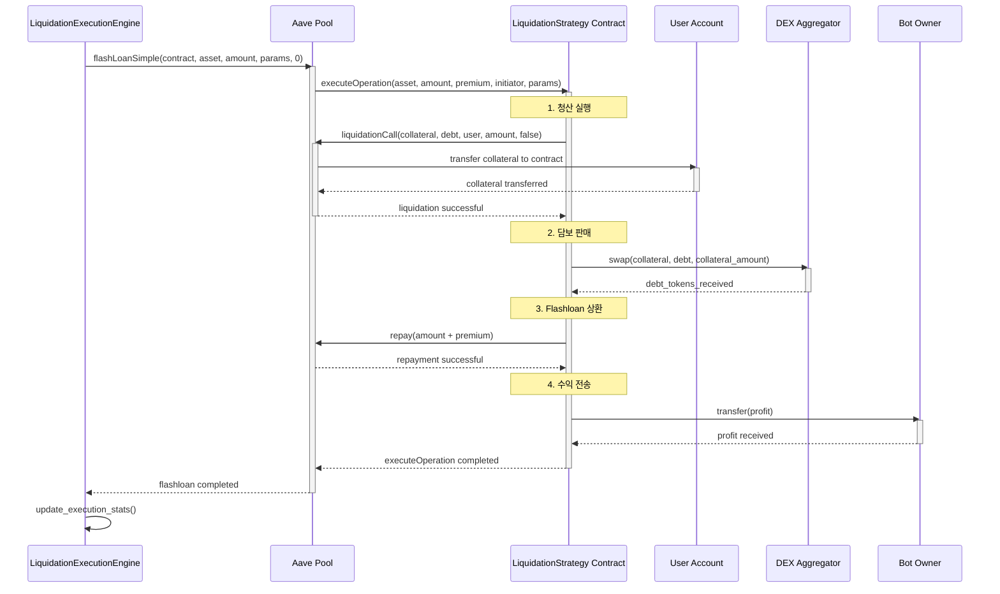
```mermaid
sequenceDiagram
    participant LEE as LiquidationExecutionEngine
    participant AavePool as Aave Pool
    participant LiquidationContract as LiquidationStrategy Contract
    participant User as User Account
    participant DEX as DEX Aggregator
    participant Owner as Bot Owner

    LEE->>AavePool: flashLoanSimple(contract, asset, amount, params, 0)
    activate AavePool

    AavePool->>LiquidationContract: executeOperation(asset, amount, premium, initiator, params)
    activate LiquidationContract

    Note over LiquidationContract: 1. 청산 실행
    LiquidationContract->>AavePool: liquidationCall(collateral, debt, user, amount, false)
    activate AavePool
    AavePool->>User: transfer collateral to contract
    activate User
    User-->>AavePool: collateral transferred
    deactivate User
    AavePool-->>LiquidationContract: liquidation successful
    deactivate AavePool

    Note over LiquidationContract: 2. 담보 판매
    LiquidationContract->>DEX: swap(collateral, debt, collateral_amount)
    activate DEX
    DEX-->>LiquidationContract: debt_tokens_received
    deactivate DEX

    Note over LiquidationContract: 3. Flashloan 상환
    LiquidationContract->>AavePool: repay(amount + premium)
    AavePool-->>LiquidationContract: repayment successful

    Note over LiquidationContract: 4. 수익 전송
    LiquidationContract->>Owner: transfer(profit)
    activate Owner
    Owner-->>LiquidationContract: profit received
    deactivate Owner

    LiquidationContract-->>AavePool: executeOperation completed
    deactivate LiquidationContract

    AavePool-->>LEE: flashloan completed
    deactivate AavePool

    LEE->>LEE: update_execution_stats()
```

---

## 🔄 DEX Aggregator 스왑 플로우

### 1️⃣1️⃣ 0x Protocol + 1inch 폴백

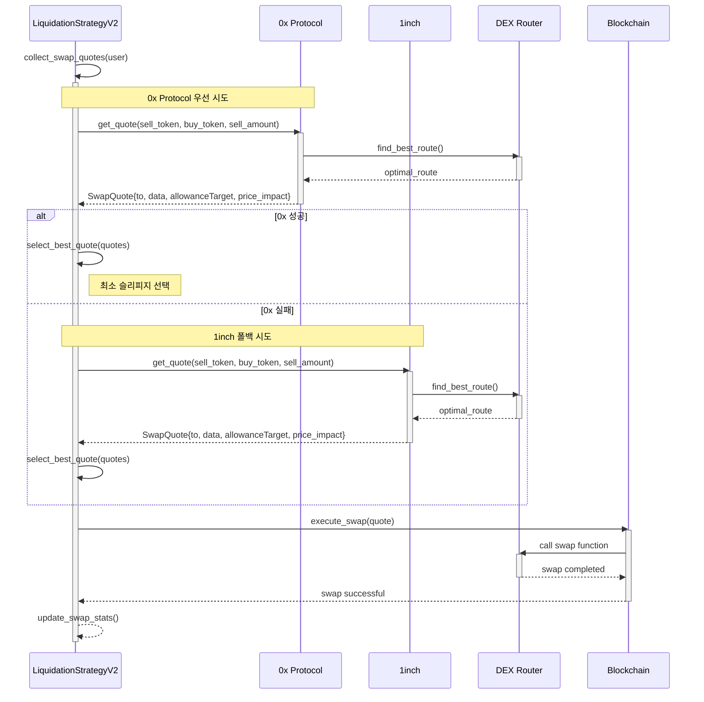
```mermaid
sequenceDiagram
    participant LSV2 as LiquidationStrategyV2
    participant ZeroX as 0x Protocol
    participant OneInch as 1inch
    participant DEX as DEX Router
    participant BC as Blockchain

    LSV2->>LSV2: collect_swap_quotes(user)
    activate LSV2

    Note over LSV2,ZeroX: 0x Protocol 우선 시도
    LSV2->>ZeroX: get_quote(sell_token, buy_token, sell_amount)
    activate ZeroX
    ZeroX->>DEX: find_best_route()
    activate DEX
    DEX-->>ZeroX: optimal_route
    deactivate DEX
    ZeroX-->>LSV2: SwapQuote{to, data, allowanceTarget, price_impact}
    deactivate ZeroX

    alt 0x 성공
        LSV2->>LSV2: select_best_quote(quotes)
        Note right of LSV2: 최소 슬리피지 선택
    else 0x 실패
        Note over LSV2,OneInch: 1inch 폴백 시도
        LSV2->>OneInch: get_quote(sell_token, buy_token, sell_amount)
        activate OneInch
        OneInch->>DEX: find_best_route()
        activate DEX
        DEX-->>OneInch: optimal_route
        deactivate DEX
        OneInch-->>LSV2: SwapQuote{to, data, allowanceTarget, price_impact}
        deactivate OneInch

        LSV2->>LSV2: select_best_quote(quotes)
    end

    LSV2->>BC: execute_swap(quote)
    activate BC
    BC->>DEX: call swap function
    activate DEX
    DEX-->>BC: swap completed
    deactivate DEX
    BC-->>LSV2: swap successful
    deactivate BC

    LSV2-->>LSV2: update_swap_stats()
    deactivate LSV2
```

---

## ⚡ 경쟁 분석 및 가스 최적화 플로우

### 1️⃣2️⃣ 실시간 경쟁 분석

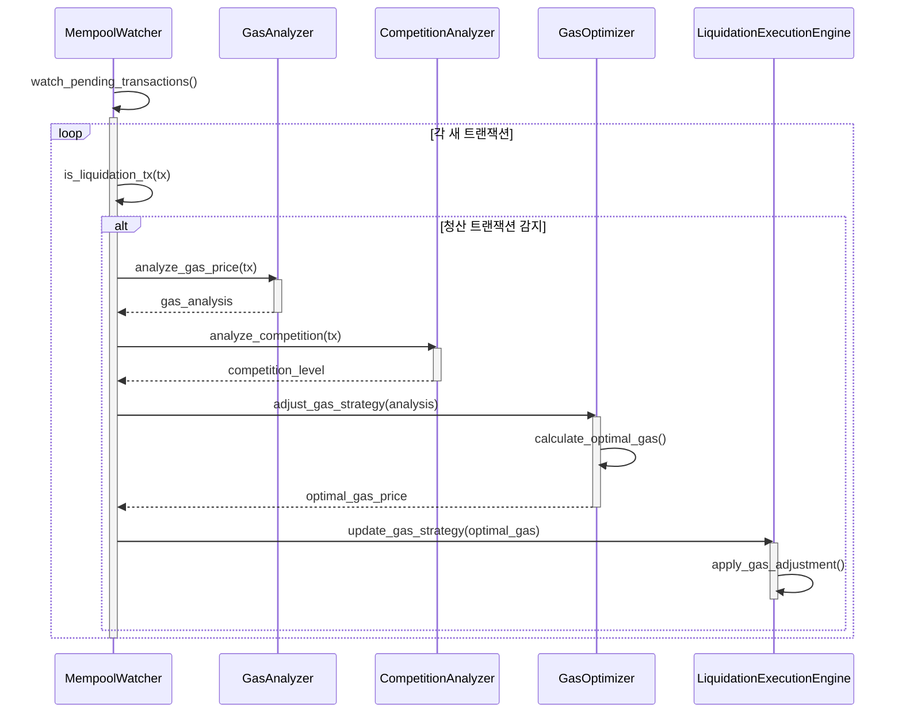
```mermaid
sequenceDiagram
    participant MempoolWatcher as MempoolWatcher
    participant GasAnalyzer as GasAnalyzer
    participant CompetitionAnalyzer as CompetitionAnalyzer
    participant GasOptimizer as GasOptimizer
    participant LEE as LiquidationExecutionEngine

    MempoolWatcher->>MempoolWatcher: watch_pending_transactions()
    activate MempoolWatcher

    loop 각 새 트랜잭션
        MempoolWatcher->>MempoolWatcher: is_liquidation_tx(tx)
        
        alt 청산 트랜잭션 감지
            MempoolWatcher->>GasAnalyzer: analyze_gas_price(tx)
            activate GasAnalyzer
            GasAnalyzer-->>MempoolWatcher: gas_analysis
            deactivate GasAnalyzer

            MempoolWatcher->>CompetitionAnalyzer: analyze_competition(tx)
            activate CompetitionAnalyzer
            CompetitionAnalyzer-->>MempoolWatcher: competition_level
            deactivate CompetitionAnalyzer

            MempoolWatcher->>GasOptimizer: adjust_gas_strategy(analysis)
            activate GasOptimizer
            GasOptimizer->>GasOptimizer: calculate_optimal_gas()
            GasOptimizer-->>MempoolWatcher: optimal_gas_price
            deactivate GasOptimizer

            MempoolWatcher->>LEE: update_gas_strategy(optimal_gas)
            activate LEE
            LEE->>LEE: apply_gas_adjustment()
            deactivate LEE
        end
    end

    deactivate MempoolWatcher
```

### 1️⃣3️⃣ 동적 가스 가격 조정

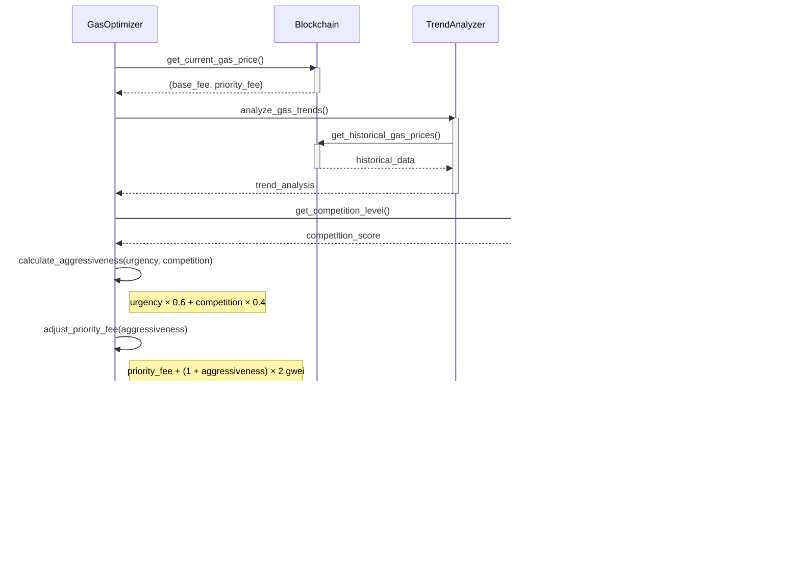
```mermaid
sequenceDiagram
    participant GasOptimizer as GasOptimizer
    participant BC as Blockchain
    participant TrendAnalyzer as TrendAnalyzer
    participant CompetitionAnalyzer as CompetitionAnalyzer
    participant LEE as LiquidationExecutionEngine

    GasOptimizer->>BC: get_current_gas_price()
    activate BC
    BC-->>GasOptimizer: (base_fee, priority_fee)
    deactivate BC

    GasOptimizer->>TrendAnalyzer: analyze_gas_trends()
    activate TrendAnalyzer
    TrendAnalyzer->>BC: get_historical_gas_prices()
    activate BC
    BC-->>TrendAnalyzer: historical_data
    deactivate BC
    TrendAnalyzer-->>GasOptimizer: trend_analysis
    deactivate TrendAnalyzer

    GasOptimizer->>CompetitionAnalyzer: get_competition_level()
    activate CompetitionAnalyzer
    CompetitionAnalyzer-->>GasOptimizer: competition_score
    deactivate CompetitionAnalyzer

    GasOptimizer->>GasOptimizer: calculate_aggressiveness(urgency, competition)
    Note right of GasOptimizer: urgency × 0.6 + competition × 0.4

    GasOptimizer->>GasOptimizer: adjust_priority_fee(aggressiveness)
    Note right of GasOptimizer: priority_fee + (1 + aggressiveness) × 2 gwei

    GasOptimizer->>GasOptimizer: calculate_max_fee()
    Note right of GasOptimizer: base_fee + priority_fee × 2

    GasOptimizer->>LEE: apply_gas_strategy(max_fee, priority_fee)
    activate LEE
    LEE->>LEE: update_transaction_gas()
    deactivate LEE
```

---

## 🚨 에러 처리 및 복구 플로우

### 1️⃣4️⃣ 청산 실행 실패 처리

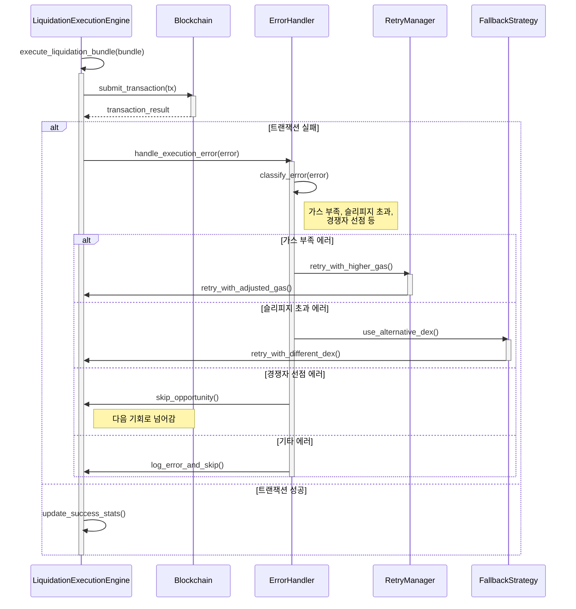
```mermaid
sequenceDiagram
    participant LEE as LiquidationExecutionEngine
    participant BC as Blockchain
    participant ErrorHandler as ErrorHandler
    participant RetryManager as RetryManager
    participant FallbackStrategy as FallbackStrategy

    LEE->>LEE: execute_liquidation_bundle(bundle)
    activate LEE

    LEE->>BC: submit_transaction(tx)
    activate BC
    BC-->>LEE: transaction_result
    deactivate BC

    alt 트랜잭션 실패
        LEE->>ErrorHandler: handle_execution_error(error)
        activate ErrorHandler

        ErrorHandler->>ErrorHandler: classify_error(error)
        Note right of ErrorHandler: 가스 부족, 슬리피지 초과,<br/>경쟁자 선점 등

        alt 가스 부족 에러
            ErrorHandler->>RetryManager: retry_with_higher_gas()
            activate RetryManager
            RetryManager->>LEE: retry_with_adjusted_gas()
            deactivate RetryManager
        else 슬리피지 초과 에러
            ErrorHandler->>FallbackStrategy: use_alternative_dex()
            activate FallbackStrategy
            FallbackStrategy->>LEE: retry_with_different_dex()
            deactivate FallbackStrategy
        else 경쟁자 선점 에러
            ErrorHandler->>LEE: skip_opportunity()
            Note right of LEE: 다음 기회로 넘어감
        else 기타 에러
            ErrorHandler->>LEE: log_error_and_skip()
        end

        deactivate ErrorHandler
    else 트랜잭션 성공
        LEE->>LEE: update_success_stats()
    end

    deactivate LEE
```

### 1️⃣5️⃣ DEX Aggregator 실패 처리

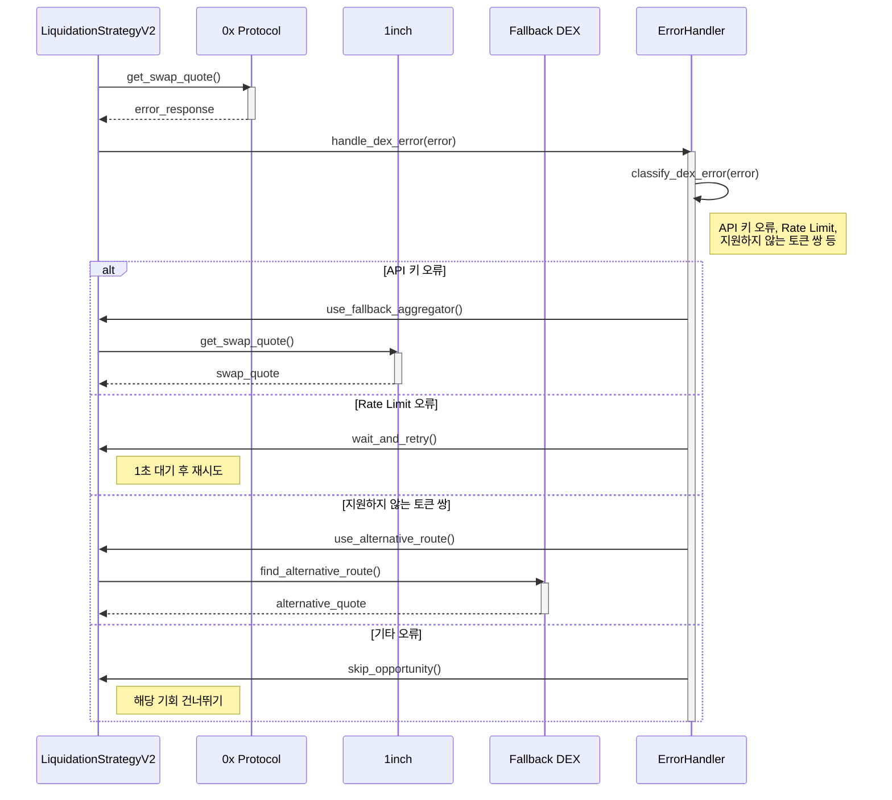
```mermaid
sequenceDiagram
    participant LSV2 as LiquidationStrategyV2
    participant ZeroX as 0x Protocol
    participant OneInch as 1inch
    participant FallbackDEX as Fallback DEX
    participant ErrorHandler as ErrorHandler

    LSV2->>ZeroX: get_swap_quote()
    activate ZeroX
    ZeroX-->>LSV2: error_response
    deactivate ZeroX

    LSV2->>ErrorHandler: handle_dex_error(error)
    activate ErrorHandler

    ErrorHandler->>ErrorHandler: classify_dex_error(error)
    Note right of ErrorHandler: API 키 오류, Rate Limit,<br/>지원하지 않는 토큰 쌍 등

    alt API 키 오류
        ErrorHandler->>LSV2: use_fallback_aggregator()
        LSV2->>OneInch: get_swap_quote()
        activate OneInch
        OneInch-->>LSV2: swap_quote
        deactivate OneInch
    else Rate Limit 오류
        ErrorHandler->>LSV2: wait_and_retry()
        Note right of LSV2: 1초 대기 후 재시도
    else 지원하지 않는 토큰 쌍
        ErrorHandler->>LSV2: use_alternative_route()
        LSV2->>FallbackDEX: find_alternative_route()
        activate FallbackDEX
        FallbackDEX-->>LSV2: alternative_quote
        deactivate FallbackDEX
    else 기타 오류
        ErrorHandler->>LSV2: skip_opportunity()
        Note right of LSV2: 해당 기회 건너뛰기
    end

    deactivate ErrorHandler
```

---

## 📊 성능 모니터링 플로우

### 1️⃣6️⃣ 실시간 성능 추적

```mermaid
sequenceDiagram
    participant ILM as IntegratedLiquidationManager
    participant MetricsCollector as MetricsCollector
    participant StatsCalculator as StatsCalculator
    participant Dashboard as Dashboard
    participant AlertManager as AlertManager

    ILM->>MetricsCollector: collect_execution_metrics()
    activate MetricsCollector

    MetricsCollector->>MetricsCollector: track_opportunities_detected()
    MetricsCollector->>MetricsCollector: track_bundles_submitted()
    MetricsCollector->>MetricsCollector: track_bundles_included()
    MetricsCollector->>MetricsCollector: track_profit_realized()

    MetricsCollector-->>ILM: raw_metrics
    deactivate MetricsCollector

    ILM->>StatsCalculator: calculate_performance_stats(raw_metrics)
    activate StatsCalculator

    StatsCalculator->>StatsCalculator: calculate_success_rate()
    StatsCalculator->>StatsCalculator: calculate_avg_profit()
    StatsCalculator->>StatsCalculator: calculate_uptime()
    StatsCalculator->>StatsCalculator: calculate_efficiency()

    StatsCalculator-->>ILM: performance_stats
    deactivate StatsCalculator

    ILM->>Dashboard: update_dashboard(performance_stats)
    activate Dashboard
    Dashboard-->>ILM: dashboard_updated
    deactivate Dashboard

    ILM->>AlertManager: check_alert_conditions(performance_stats)
    activate AlertManager

    alt 성공률 < 50%
        AlertManager->>ILM: trigger_alert("Low success rate")
    else 수익 < 임계값
        AlertManager->>ILM: trigger_alert("Low profitability")
    else 시스템 오류
        AlertManager->>ILM: trigger_alert("System error")
    end

    deactivate AlertManager
    deactivate ILM
```

---

## 🎯 결론

이 문서는 DeFi 청산 전략의 모든 주요 시나리오를 시퀀스 다이어그램으로 상세히 설명합니다. 각 다이어그램은:

1. **실제 컴포넌트 간 상호작용**을 정확히 반영
2. **외부 서비스와의 통신**을 포함
3. **에러 처리 및 복구 로직**을 명시
4. **성능 최적화 전략**을 시각화

이를 통해 개발자는 청산 시스템의 전체적인 흐름을 이해하고, 각 단계에서 발생할 수 있는 문제점을 파악할 수 있습니다.

---

**마지막 업데이트**: 2025-01-06  
**문서 버전**: v2.2  
**구현 완성도**: 98% (Production Ready)