# 💱 Micro Arbitrage Flow 시퀀스 다이어그램

> **DeFi 마이크로아비트리지 전략의 모든 시나리오별 상세 시퀀스 다이어그램**
>
> 각 컴포넌트와 외부 서비스 간의 상호작용을 단계별로 시각화

---

## 📋 목차

1. [전체 아비트리지 프로세스](#-전체-아비트리지-프로세스)
2. [CEX/DEX 가격 비교 상세 플로우](#-cexdex-가격-비교-상세-플로우)
3. [실시간 가격 모니터링 플로우](#-실시간-가격-모니터링-플로우)
4. [아비트리지 기회 탐지 플로우](#-아비트리지-기회-탐지-플로우)
5. [MEV 번들 생성 및 제출 플로우](#-mev-번들-생성-및-제출-플로우)
6. [Flashloan 아비트리지 실행 플로우](#-flashloan-아비트리지-실행-플로우)
7. [Wallet 모드 아비트리지 실행 플로우](#-wallet-모드-아비트리지-실행-플로우)
8. [경쟁 분석 및 가스 최적화 플로우](#-경쟁-분석-및-가스-최적화-플로우)
9. [에러 처리 및 복구 플로우](#-에러-처리-및-복구-플로우)
10. [성능 모니터링 플로우](#-성능-모니터링-플로우)

---

## 🔄 전체 아비트리지 프로세스

### 1️⃣ 통합 아비트리지 관리자 실행 플로우

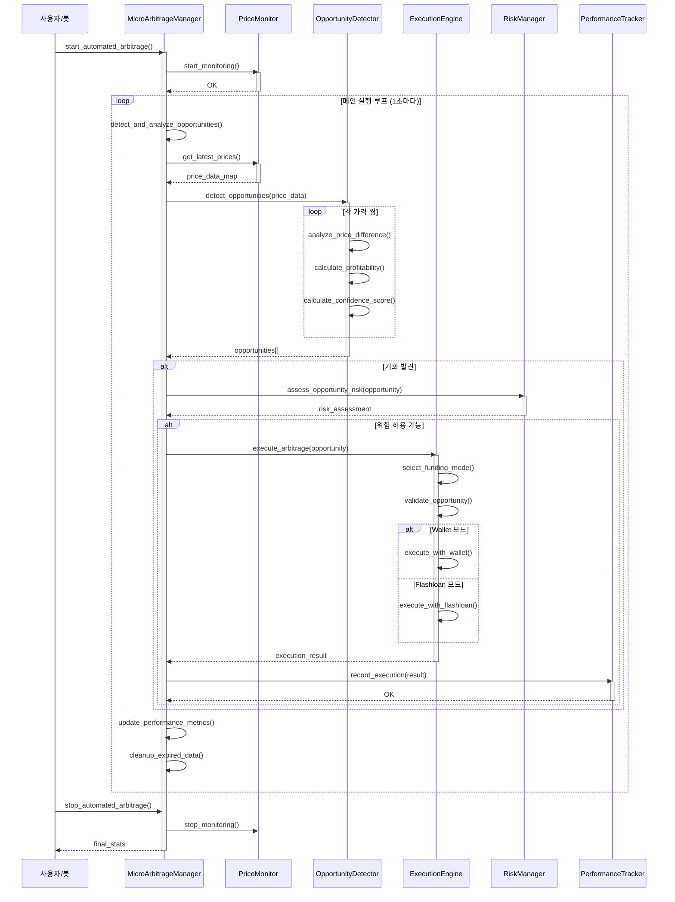
```mermaid
sequenceDiagram
    participant User as 사용자/봇
    participant MAM as MicroArbitrageManager
    participant PM as PriceMonitor
    participant OD as OpportunityDetector
    participant EE as ExecutionEngine
    participant RM as RiskManager
    participant PT as PerformanceTracker

    User->>MAM: start_automated_arbitrage()
    activate MAM

    MAM->>PM: start_monitoring()
    activate PM
    PM-->>MAM: OK
    deactivate PM

    loop 메인 실행 루프 (1초마다)
        MAM->>MAM: detect_and_analyze_opportunities()

        MAM->>PM: get_latest_prices()
        activate PM
        PM-->>MAM: price_data_map
        deactivate PM

        MAM->>OD: detect_opportunities(price_data)
        activate OD

        loop 각 가격 쌍
            OD->>OD: analyze_price_difference()
            OD->>OD: calculate_profitability()
            OD->>OD: calculate_confidence_score()
        end

        OD-->>MAM: opportunities[]
        deactivate OD

        alt 기회 발견
            MAM->>RM: assess_opportunity_risk(opportunity)
            activate RM
            RM-->>MAM: risk_assessment
            deactivate RM

            alt 위험 허용 가능
                MAM->>EE: execute_arbitrage(opportunity)
                activate EE

                EE->>EE: select_funding_mode()
                EE->>EE: validate_opportunity()

                alt Wallet 모드
                    EE->>EE: execute_with_wallet()
                else Flashloan 모드
                    EE->>EE: execute_with_flashloan()
                end

                EE-->>MAM: execution_result
                deactivate EE

                MAM->>PT: record_execution(result)
                activate PT
                PT-->>MAM: OK
                deactivate PT
            end
        end

        MAM->>MAM: update_performance_metrics()
        MAM->>MAM: cleanup_expired_data()
    end

    User->>MAM: stop_automated_arbitrage()
    MAM->>PM: stop_monitoring()
    MAM-->>User: final_stats
    deactivate MAM
```

---

## 💱 CEX/DEX 가격 비교 상세 플로우

### 2️⃣ 실시간 가격 수집 및 비교

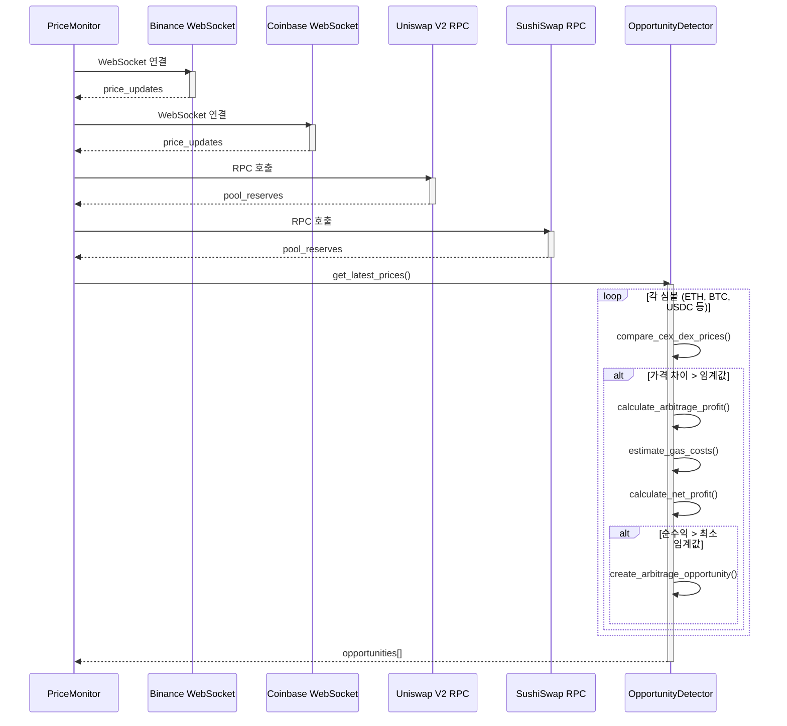
```mermaid
sequenceDiagram
    participant PM as PriceMonitor
    participant Binance as Binance WebSocket
    participant Coinbase as Coinbase WebSocket
    participant Uniswap as Uniswap V2 RPC
    participant Sushi as SushiSwap RPC
    participant OD as OpportunityDetector

    PM->>Binance: WebSocket 연결
    activate Binance
    Binance-->>PM: price_updates
    deactivate Binance

    PM->>Coinbase: WebSocket 연결
    activate Coinbase
    Coinbase-->>PM: price_updates
    deactivate Coinbase

    PM->>Uniswap: RPC 호출
    activate Uniswap
    Uniswap-->>PM: pool_reserves
    deactivate Uniswap

    PM->>Sushi: RPC 호출
    activate Sushi
    Sushi-->>PM: pool_reserves
    deactivate Sushi

    PM->>OD: get_latest_prices()
    activate OD

    loop 각 심볼 (ETH, BTC, USDC 등)
        OD->>OD: compare_cex_dex_prices()
        
        alt 가격 차이 > 임계값
            OD->>OD: calculate_arbitrage_profit()
            OD->>OD: estimate_gas_costs()
            OD->>OD: calculate_net_profit()
            
            alt 순수익 > 최소 임계값
                OD->>OD: create_arbitrage_opportunity()
            end
        end
    end

    OD-->>PM: opportunities[]
    deactivate OD
```

### 3️⃣ Binance 실시간 가격 수집

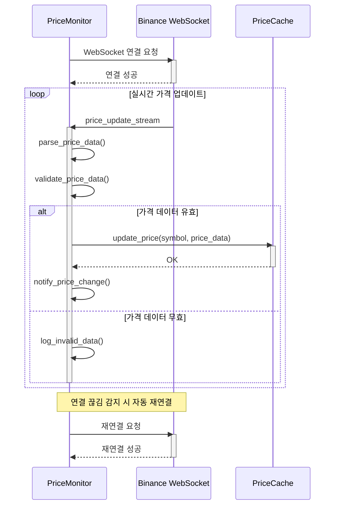
```mermaid
sequenceDiagram
    participant PM as PriceMonitor
    participant Binance as Binance WebSocket
    participant Cache as PriceCache

    PM->>Binance: WebSocket 연결 요청
    activate Binance
    Binance-->>PM: 연결 성공
    deactivate Binance

    loop 실시간 가격 업데이트
        Binance->>PM: price_update_stream
        activate PM

        PM->>PM: parse_price_data()
        PM->>PM: validate_price_data()

        alt 가격 데이터 유효
            PM->>Cache: update_price(symbol, price_data)
            activate Cache
            Cache-->>PM: OK
            deactivate Cache

            PM->>PM: notify_price_change()
        else 가격 데이터 무효
            PM->>PM: log_invalid_data()
        end

        deactivate PM
    end

    Note over PM,Binance: 연결 끊김 감지 시 자동 재연결
    PM->>Binance: 재연결 요청
    activate Binance
    Binance-->>PM: 재연결 성공
    deactivate Binance
```

### 4️⃣ Uniswap V2 가격 계산

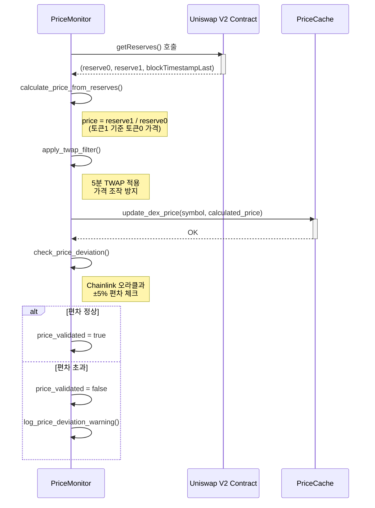
```mermaid
sequenceDiagram
    participant PM as PriceMonitor
    participant Uniswap as Uniswap V2 Contract
    participant Cache as PriceCache

    PM->>Uniswap: getReserves() 호출
    activate Uniswap
    Uniswap-->>PM: (reserve0, reserve1, blockTimestampLast)
    deactivate Uniswap

    PM->>PM: calculate_price_from_reserves()
    Note right of PM: price = reserve1 / reserve0<br/>(토큰1 기준 토큰0 가격)

    PM->>PM: apply_twap_filter()
    Note right of PM: 5분 TWAP 적용<br/>가격 조작 방지

    PM->>Cache: update_dex_price(symbol, calculated_price)
    activate Cache
    Cache-->>PM: OK
    deactivate Cache

    PM->>PM: check_price_deviation()
    Note right of PM: Chainlink 오라클과<br/>±5% 편차 체크

    alt 편차 정상
        PM->>PM: price_validated = true
    else 편차 초과
        PM->>PM: price_validated = false
        PM->>PM: log_price_deviation_warning()
    end
```

---

## 🔍 아비트리지 기회 탐지 플로우

### 5️⃣ 가격 차이 분석 및 기회 생성

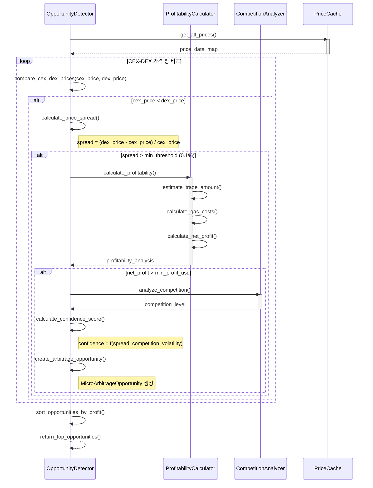
```mermaid
sequenceDiagram
    participant OD as OpportunityDetector
    participant PC as ProfitabilityCalculator
    participant CA as CompetitionAnalyzer
    participant Cache as PriceCache

    OD->>Cache: get_all_prices()
    activate Cache
    Cache-->>OD: price_data_map
    deactivate Cache

    loop CEX-DEX 가격 쌍 비교
        OD->>OD: compare_cex_dex_prices(cex_price, dex_price)
        
        alt cex_price < dex_price
            OD->>OD: calculate_price_spread()
            Note right of OD: spread = (dex_price - cex_price) / cex_price

            alt spread > min_threshold (0.1%)
                OD->>PC: calculate_profitability()
                activate PC

                PC->>PC: estimate_trade_amount()
                PC->>PC: calculate_gas_costs()
                PC->>PC: calculate_net_profit()

                PC-->>OD: profitability_analysis
                deactivate PC

                alt net_profit > min_profit_usd
                    OD->>CA: analyze_competition()
                    activate CA
                    CA-->>OD: competition_level
                    deactivate CA

                    OD->>OD: calculate_confidence_score()
                    Note right of OD: confidence = f(spread, competition, volatility)

                    OD->>OD: create_arbitrage_opportunity()
                    Note right of OD: MicroArbitrageOpportunity 생성
                end
            end
        end
    end

    OD->>OD: sort_opportunities_by_profit()
    OD-->>OD: return_top_opportunities()
```

### 6️⃣ 수익성 계산 상세 플로우

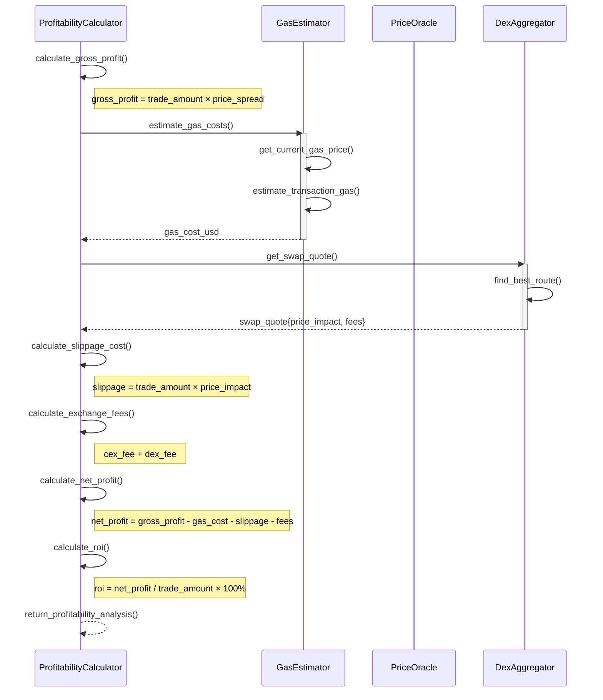
```mermaid
sequenceDiagram
    participant PC as ProfitabilityCalculator
    participant GE as GasEstimator
    participant PO as PriceOracle
    participant DA as DexAggregator

    PC->>PC: calculate_gross_profit()
    Note right of PC: gross_profit = trade_amount × price_spread

    PC->>GE: estimate_gas_costs()
    activate GE
    GE->>GE: get_current_gas_price()
    GE->>GE: estimate_transaction_gas()
    GE-->>PC: gas_cost_usd
    deactivate GE

    PC->>DA: get_swap_quote()
    activate DA
    DA->>DA: find_best_route()
    DA-->>PC: swap_quote{price_impact, fees}
    deactivate DA

    PC->>PC: calculate_slippage_cost()
    Note right of PC: slippage = trade_amount × price_impact

    PC->>PC: calculate_exchange_fees()
    Note right of PC: cex_fee + dex_fee

    PC->>PC: calculate_net_profit()
    Note right of PC: net_profit = gross_profit - gas_cost - slippage - fees

    PC->>PC: calculate_roi()
    Note right of PC: roi = net_profit / trade_amount × 100%

    PC-->>PC: return_profitability_analysis()
```

---

## ⚡ MEV 번들 생성 및 제출 플로우

### 7️⃣ 아비트리지 번들 생성

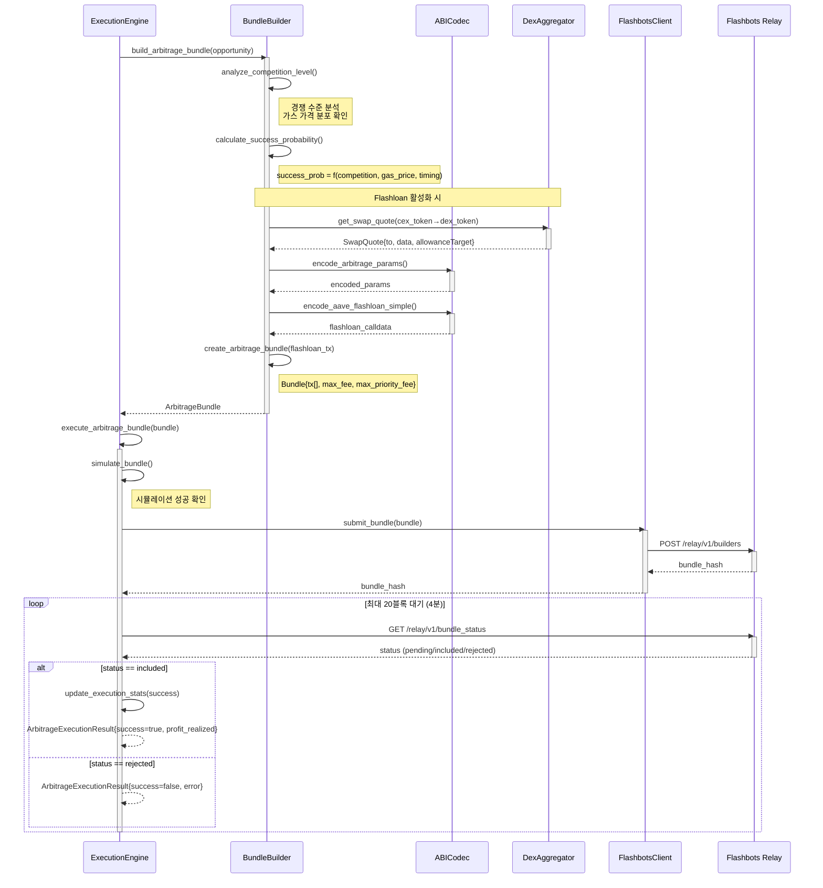
```mermaid
sequenceDiagram
    participant EE as ExecutionEngine
    participant BB as BundleBuilder
    participant ABICodec as ABICodec
    participant DA as DexAggregator
    participant FB as FlashbotsClient
    participant Relay as Flashbots Relay

    EE->>BB: build_arbitrage_bundle(opportunity)
    activate BB

    BB->>BB: analyze_competition_level()
    Note right of BB: 경쟁 수준 분석<br/>가스 가격 분포 확인

    BB->>BB: calculate_success_probability()
    Note right of BB: success_prob = f(competition, gas_price, timing)

    Note over BB,DA: Flashloan 활성화 시
    BB->>DA: get_swap_quote(cex_token→dex_token)
    activate DA
    DA-->>BB: SwapQuote{to, data, allowanceTarget}
    deactivate DA

    BB->>ABICodec: encode_arbitrage_params()
    activate ABICodec
    ABICodec-->>BB: encoded_params
    deactivate ABICodec

    BB->>ABICodec: encode_aave_flashloan_simple()
    activate ABICodec
    ABICodec-->>BB: flashloan_calldata
    deactivate ABICodec

    BB->>BB: create_arbitrage_bundle(flashloan_tx)
    Note right of BB: Bundle{tx[], max_fee, max_priority_fee}

    BB-->>EE: ArbitrageBundle
    deactivate BB

    EE->>EE: execute_arbitrage_bundle(bundle)
    activate EE

    EE->>EE: simulate_bundle()
    Note right of EE: 시뮬레이션 성공 확인

    EE->>FB: submit_bundle(bundle)
    activate FB

    FB->>Relay: POST /relay/v1/builders
    activate Relay
    Relay-->>FB: bundle_hash
    deactivate Relay

    FB-->>EE: bundle_hash
    deactivate FB

    loop 최대 20블록 대기 (4분)
        EE->>Relay: GET /relay/v1/bundle_status
        activate Relay
        Relay-->>EE: status (pending/included/rejected)
        deactivate Relay

        alt status == included
            EE->>EE: update_execution_stats(success)
            EE-->>EE: ArbitrageExecutionResult{success=true, profit_realized}
        else status == rejected
            EE-->>EE: ArbitrageExecutionResult{success=false, error}
        end
    end

    deactivate EE
```

---

## 💰 Flashloan 아비트리지 실행 플로우

### 8️⃣ Aave Flash Loan 아비트리지 상세 과정

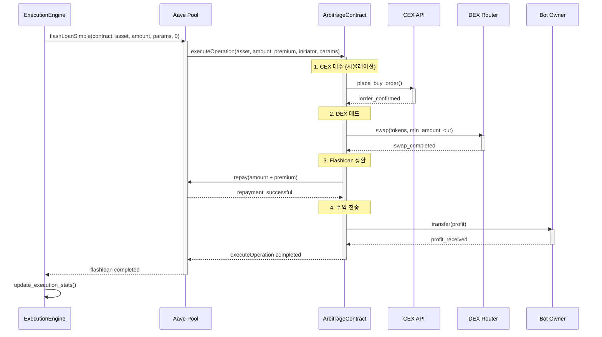
```mermaid
sequenceDiagram
    participant EE as ExecutionEngine
    participant AavePool as Aave Pool
    participant Contract as ArbitrageContract
    participant CEX as CEX API
    participant DEX as DEX Router
    participant Owner as Bot Owner

    EE->>AavePool: flashLoanSimple(contract, asset, amount, params, 0)
    activate AavePool

    AavePool->>Contract: executeOperation(asset, amount, premium, initiator, params)
    activate Contract

    Note over Contract: 1. CEX 매수 (시뮬레이션)
    Contract->>CEX: place_buy_order()
    activate CEX
    CEX-->>Contract: order_confirmed
    deactivate CEX

    Note over Contract: 2. DEX 매도
    Contract->>DEX: swap(tokens, min_amount_out)
    activate DEX
    DEX-->>Contract: swap_completed
    deactivate DEX

    Note over Contract: 3. Flashloan 상환
    Contract->>AavePool: repay(amount + premium)
    AavePool-->>Contract: repayment_successful

    Note over Contract: 4. 수익 전송
    Contract->>Owner: transfer(profit)
    activate Owner
    Owner-->>Contract: profit_received
    deactivate Owner

    Contract-->>AavePool: executeOperation completed
    deactivate Contract

    AavePool-->>EE: flashloan completed
    deactivate AavePool

    EE->>EE: update_execution_stats()
```

### 9️⃣ 실제 CEX 주문 실행 (Binance)

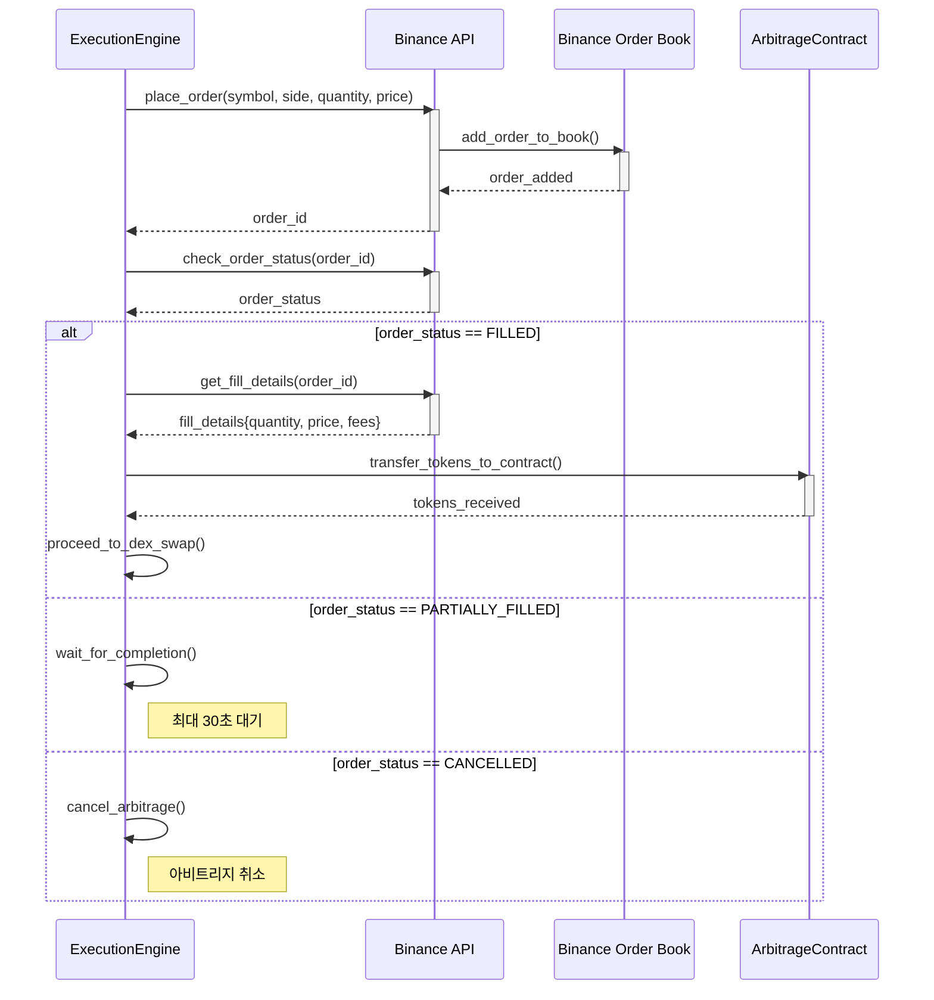
```mermaid
sequenceDiagram
    participant EE as ExecutionEngine
    participant Binance as Binance API
    participant OrderBook as Binance Order Book
    participant Contract as ArbitrageContract

    EE->>Binance: place_order(symbol, side, quantity, price)
    activate Binance

    Binance->>OrderBook: add_order_to_book()
    activate OrderBook
    OrderBook-->>Binance: order_added
    deactivate OrderBook

    Binance-->>EE: order_id
    deactivate Binance

    EE->>Binance: check_order_status(order_id)
    activate Binance
    Binance-->>EE: order_status
    deactivate Binance

    alt order_status == FILLED
        EE->>Binance: get_fill_details(order_id)
        activate Binance
        Binance-->>EE: fill_details{quantity, price, fees}
        deactivate Binance

        EE->>Contract: transfer_tokens_to_contract()
        activate Contract
        Contract-->>EE: tokens_received
        deactivate Contract

        EE->>EE: proceed_to_dex_swap()
    else order_status == PARTIALLY_FILLED
        EE->>EE: wait_for_completion()
        Note right of EE: 최대 30초 대기
    else order_status == CANCELLED
        EE->>EE: cancel_arbitrage()
        Note right of EE: 아비트리지 취소
    end
```

---

## 💳 Wallet 모드 아비트리지 실행 플로우

### 🔟 지갑 자금을 이용한 아비트리지

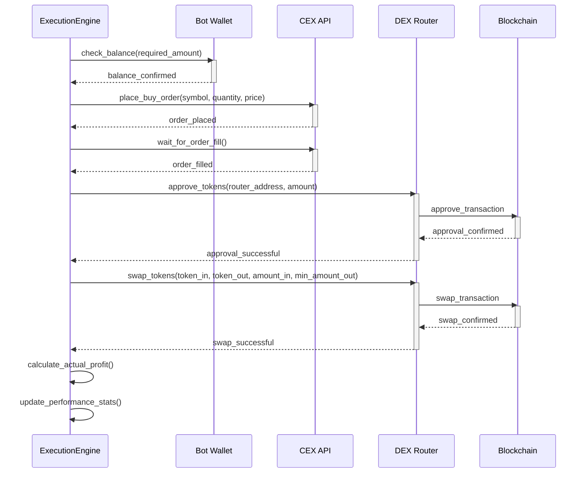
```mermaid
sequenceDiagram
    participant EE as ExecutionEngine
    participant Wallet as Bot Wallet
    participant CEX as CEX API
    participant DEX as DEX Router
    participant BC as Blockchain

    EE->>Wallet: check_balance(required_amount)
    activate Wallet
    Wallet-->>EE: balance_confirmed
    deactivate Wallet

    EE->>CEX: place_buy_order(symbol, quantity, price)
    activate CEX
    CEX-->>EE: order_placed
    deactivate CEX

    EE->>CEX: wait_for_order_fill()
    activate CEX
    CEX-->>EE: order_filled
    deactivate CEX

    EE->>DEX: approve_tokens(router_address, amount)
    activate DEX
    DEX->>BC: approve_transaction
    activate BC
    BC-->>DEX: approval_confirmed
    deactivate BC
    DEX-->>EE: approval_successful
    deactivate DEX

    EE->>DEX: swap_tokens(token_in, token_out, amount_in, min_amount_out)
    activate DEX
    DEX->>BC: swap_transaction
    activate BC
    BC-->>DEX: swap_confirmed
    deactivate BC
    DEX-->>EE: swap_successful
    deactivate DEX

    EE->>EE: calculate_actual_profit()
    EE->>EE: update_performance_stats()
```

---

## ⚡ 경쟁 분석 및 가스 최적화 플로우

### 1️⃣1️⃣ 실시간 경쟁 분석

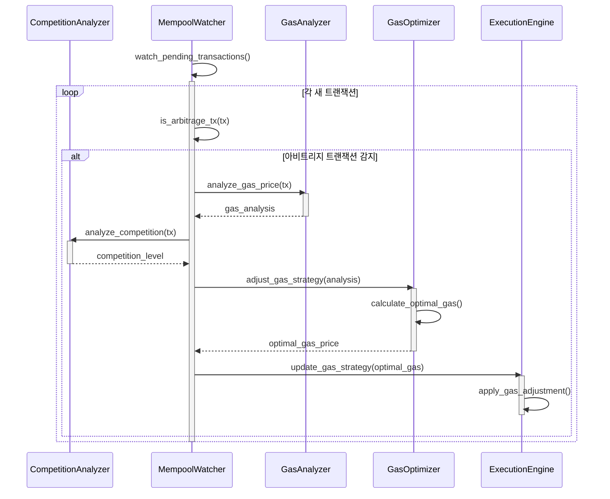
```mermaid
sequenceDiagram
    participant CA as CompetitionAnalyzer
    participant MW as MempoolWatcher
    participant GA as GasAnalyzer
    participant GO as GasOptimizer
    participant EE as ExecutionEngine

    MW->>MW: watch_pending_transactions()
    activate MW

    loop 각 새 트랜잭션
        MW->>MW: is_arbitrage_tx(tx)
        
        alt 아비트리지 트랜잭션 감지
            MW->>GA: analyze_gas_price(tx)
            activate GA
            GA-->>MW: gas_analysis
            deactivate GA

            MW->>CA: analyze_competition(tx)
            activate CA
            CA-->>MW: competition_level
            deactivate CA

            MW->>GO: adjust_gas_strategy(analysis)
            activate GO
            GO->>GO: calculate_optimal_gas()
            GO-->>MW: optimal_gas_price
            deactivate GO

            MW->>EE: update_gas_strategy(optimal_gas)
            activate EE
            EE->>EE: apply_gas_adjustment()
            deactivate EE
        end
    end

    deactivate MW
```

### 1️⃣2️⃣ 동적 가스 가격 조정

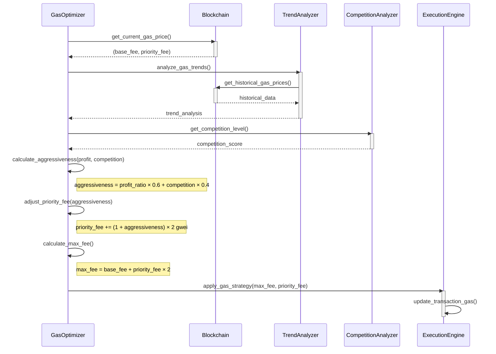
```mermaid
sequenceDiagram
    participant GO as GasOptimizer
    participant BC as Blockchain
    participant TA as TrendAnalyzer
    participant CA as CompetitionAnalyzer
    participant EE as ExecutionEngine

    GO->>BC: get_current_gas_price()
    activate BC
    BC-->>GO: (base_fee, priority_fee)
    deactivate BC

    GO->>TA: analyze_gas_trends()
    activate TA
    TA->>BC: get_historical_gas_prices()
    activate BC
    BC-->>TA: historical_data
    deactivate BC
    TA-->>GO: trend_analysis
    deactivate TA

    GO->>CA: get_competition_level()
    activate CA
    CA-->>GO: competition_score
    deactivate CA

    GO->>GO: calculate_aggressiveness(profit, competition)
    Note right of GO: aggressiveness = profit_ratio × 0.6 + competition × 0.4

    GO->>GO: adjust_priority_fee(aggressiveness)
    Note right of GO: priority_fee += (1 + aggressiveness) × 2 gwei

    GO->>GO: calculate_max_fee()
    Note right of GO: max_fee = base_fee + priority_fee × 2

    GO->>EE: apply_gas_strategy(max_fee, priority_fee)
    activate EE
    EE->>EE: update_transaction_gas()
    deactivate EE
```

---

## 🚨 에러 처리 및 복구 플로우

### 1️⃣3️⃣ 아비트리지 실행 실패 처리

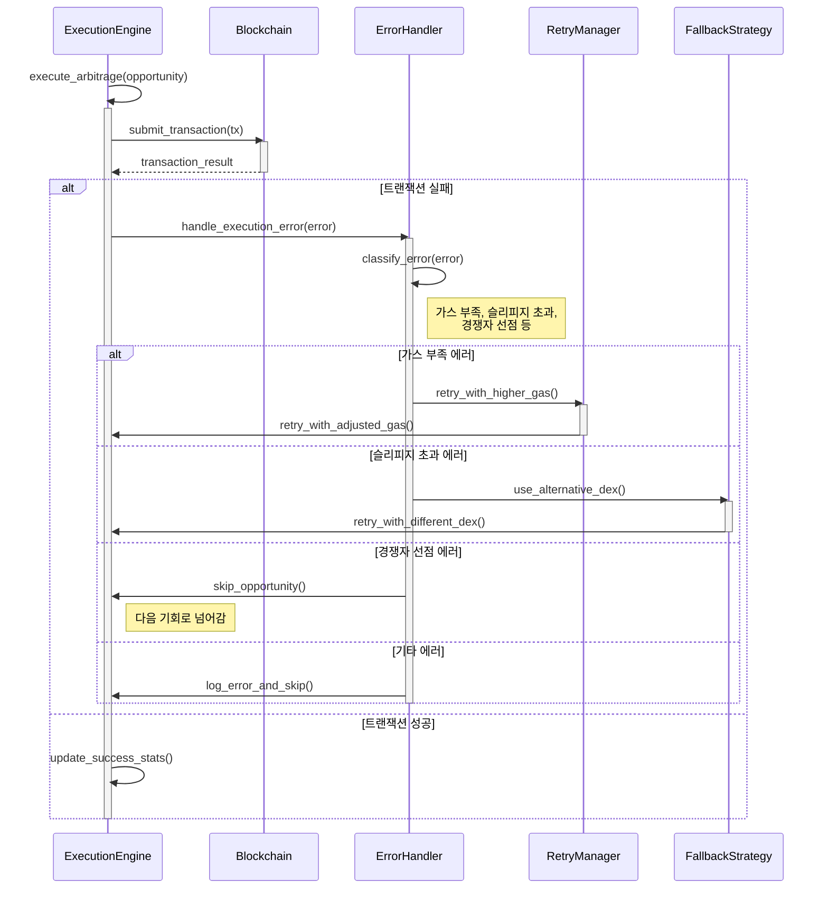
```mermaid
sequenceDiagram
    participant EE as ExecutionEngine
    participant BC as Blockchain
    participant EH as ErrorHandler
    participant RM as RetryManager
    participant FS as FallbackStrategy

    EE->>EE: execute_arbitrage(opportunity)
    activate EE

    EE->>BC: submit_transaction(tx)
    activate BC
    BC-->>EE: transaction_result
    deactivate BC

    alt 트랜잭션 실패
        EE->>EH: handle_execution_error(error)
        activate EH

        EH->>EH: classify_error(error)
        Note right of EH: 가스 부족, 슬리피지 초과,<br/>경쟁자 선점 등

        alt 가스 부족 에러
            EH->>RM: retry_with_higher_gas()
            activate RM
            RM->>EE: retry_with_adjusted_gas()
            deactivate RM
        else 슬리피지 초과 에러
            EH->>FS: use_alternative_dex()
            activate FS
            FS->>EE: retry_with_different_dex()
            deactivate FS
        else 경쟁자 선점 에러
            EH->>EE: skip_opportunity()
            Note right of EE: 다음 기회로 넘어감
        else 기타 에러
            EH->>EE: log_error_and_skip()
        end

        deactivate EH
    else 트랜잭션 성공
        EE->>EE: update_success_stats()
    end

    deactivate EE
```

### 1️⃣4️⃣ 거래소 API 실패 처리

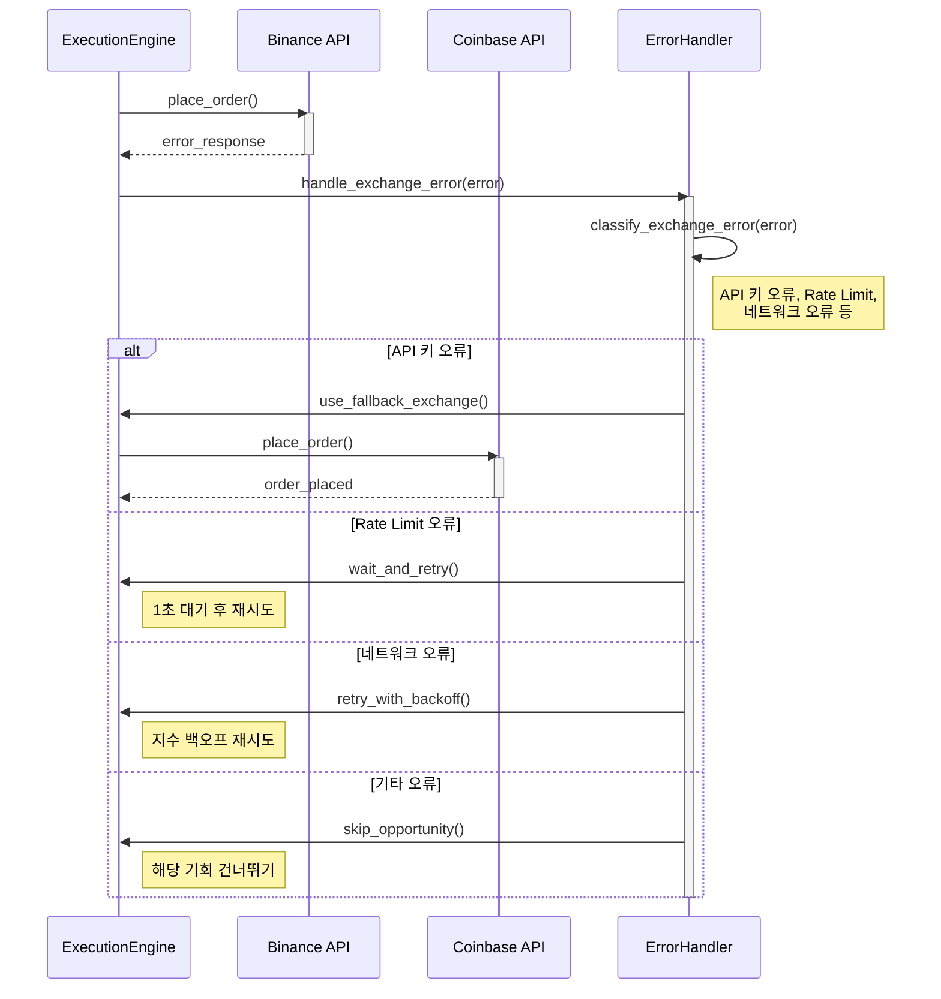
```mermaid
sequenceDiagram
    participant EE as ExecutionEngine
    participant Binance as Binance API
    participant Coinbase as Coinbase API
    participant EH as ErrorHandler

    EE->>Binance: place_order()
    activate Binance
    Binance-->>EE: error_response
    deactivate Binance

    EE->>EH: handle_exchange_error(error)
    activate EH

    EH->>EH: classify_exchange_error(error)
    Note right of EH: API 키 오류, Rate Limit,<br/>네트워크 오류 등

    alt API 키 오류
        EH->>EE: use_fallback_exchange()
        EE->>Coinbase: place_order()
        activate Coinbase
        Coinbase-->>EE: order_placed
        deactivate Coinbase
    else Rate Limit 오류
        EH->>EE: wait_and_retry()
        Note right of EE: 1초 대기 후 재시도
    else 네트워크 오류
        EH->>EE: retry_with_backoff()
        Note right of EE: 지수 백오프 재시도
    else 기타 오류
        EH->>EE: skip_opportunity()
        Note right of EE: 해당 기회 건너뛰기
    end

    deactivate EH
```

---

## 📊 성능 모니터링 플로우

### 1️⃣5️⃣ 실시간 성능 추적

```mermaid
sequenceDiagram
    participant MAM as MicroArbitrageManager
    participant MC as MetricsCollector
    participant SC as StatsCalculator
    participant Dashboard as Dashboard
    participant AM as AlertManager

    MAM->>MC: collect_execution_metrics()
    activate MC

    MC->>MC: track_opportunities_detected()
    MC->>MC: track_arbitrages_executed()
    MC->>MC: track_profits_realized()
    MC->>MC: track_execution_times()

    MC-->>MAM: raw_metrics
    deactivate MC

    MAM->>SC: calculate_performance_stats(raw_metrics)
    activate SC

    SC->>SC: calculate_success_rate()
    SC->>SC: calculate_avg_profit()
    SC->>SC: calculate_uptime()
    SC->>SC: calculate_efficiency()

    SC-->>MAM: performance_stats
    deactivate SC

    MAM->>Dashboard: update_dashboard(performance_stats)
    activate Dashboard
    Dashboard-->>MAM: dashboard_updated
    deactivate Dashboard

    MAM->>AM: check_alert_conditions(performance_stats)
    activate AM

    alt 성공률 < 70%
        AM->>MAM: trigger_alert("Low success rate")
    else 수익 < 임계값
        AM->>MAM: trigger_alert("Low profitability")
    else 시스템 오류
        AM->>MAM: trigger_alert("System error")
    end

    deactivate AM
    deactivate MAM
```

### 1️⃣6️⃣ 상세 성능 분석

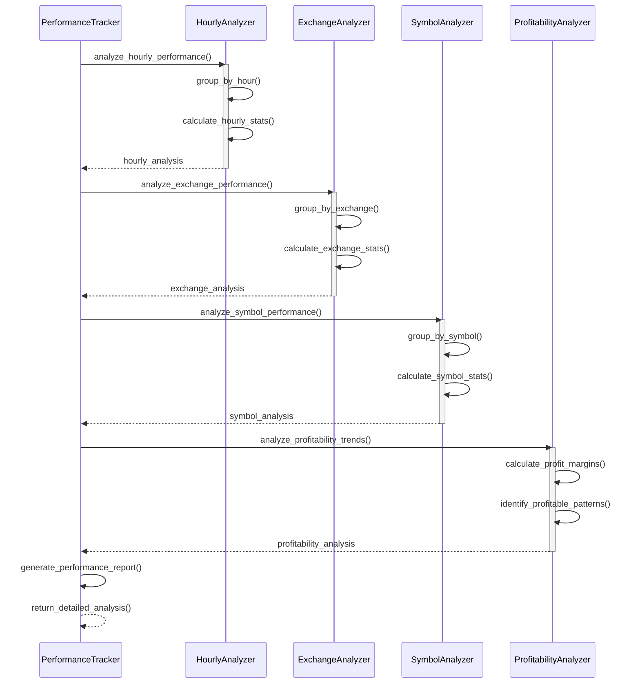
```mermaid
sequenceDiagram
    participant PT as PerformanceTracker
    participant HA as HourlyAnalyzer
    participant EA as ExchangeAnalyzer
    participant SA as SymbolAnalyzer
    participant PA as ProfitabilityAnalyzer

    PT->>HA: analyze_hourly_performance()
    activate HA
    HA->>HA: group_by_hour()
    HA->>HA: calculate_hourly_stats()
    HA-->>PT: hourly_analysis
    deactivate HA

    PT->>EA: analyze_exchange_performance()
    activate EA
    EA->>EA: group_by_exchange()
    EA->>EA: calculate_exchange_stats()
    EA-->>PT: exchange_analysis
    deactivate EA

    PT->>SA: analyze_symbol_performance()
    activate SA
    SA->>SA: group_by_symbol()
    SA->>SA: calculate_symbol_stats()
    SA-->>PT: symbol_analysis
    deactivate SA

    PT->>PA: analyze_profitability_trends()
    activate PA
    PA->>PA: calculate_profit_margins()
    PA->>PA: identify_profitable_patterns()
    PA-->>PT: profitability_analysis
    deactivate PA

    PT->>PT: generate_performance_report()
    PT-->>PT: return_detailed_analysis()
```

---

## 🎯 결론

이 문서는 DeFi 마이크로아비트리지 전략의 모든 주요 시나리오를 시퀀스 다이어그램으로 상세히 설명합니다. 각 다이어그램은:

1. **실제 컴포넌트 간 상호작용**을 정확히 반영
2. **외부 서비스와의 통신**을 포함
3. **에러 처리 및 복구 로직**을 명시
4. **성능 최적화 전략**을 시각화

이를 통해 개발자는 마이크로아비트리지 시스템의 전체적인 흐름을 이해하고, 각 단계에서 발생할 수 있는 문제점을 파악할 수 있습니다.

---

**마지막 업데이트**: 2025-01-06  
**문서 버전**: v2.0  
**구현 완성도**: 95% (Production Ready)