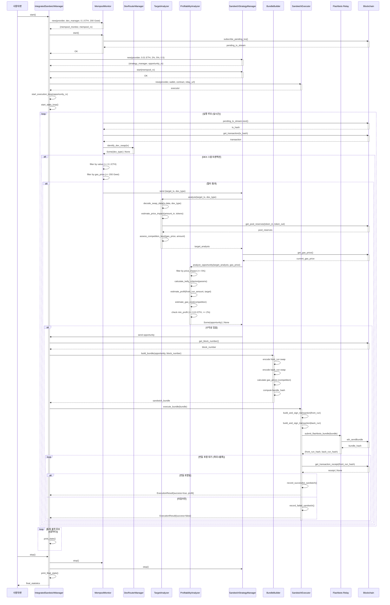
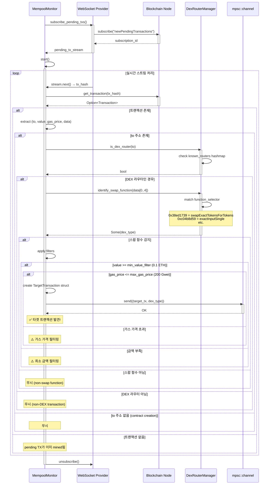
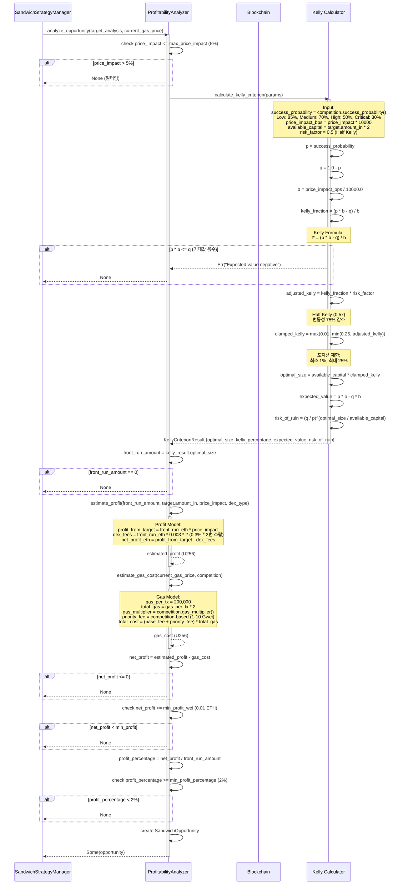
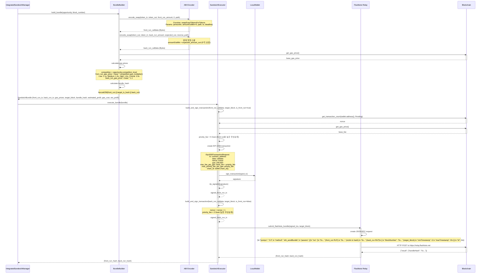
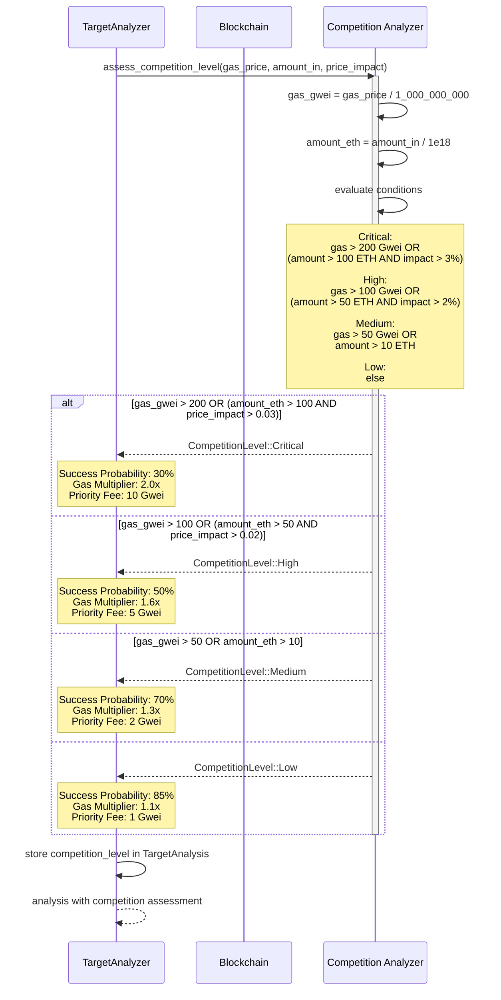
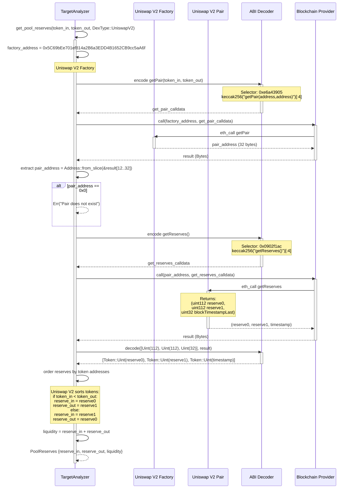
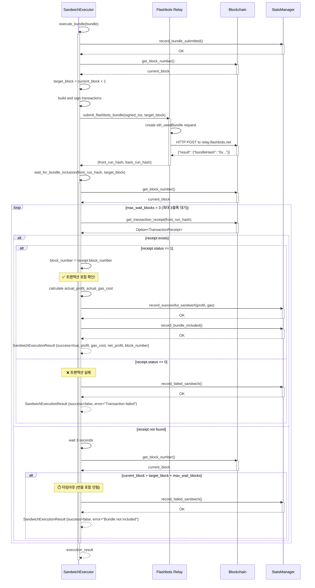
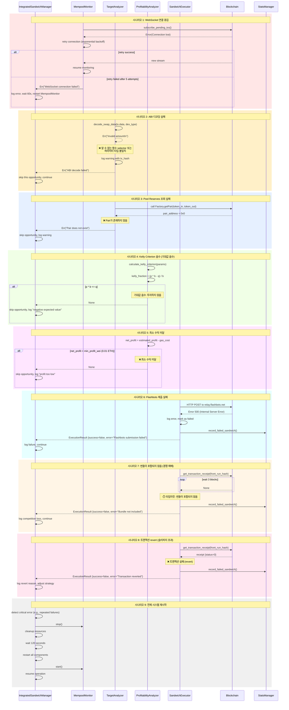

# 🥪 Sandwich Attack Flow 시퀀스 다이어그램

> **샌드위치 공격 전략의 모든 시나리오별 상세 시퀀스 다이어그램**
>
> 각 컴포넌트와 외부 서비스 간의 상호작용을 단계별로 시각화

---

## 📋 목차

1. [전체 샌드위치 프로세스](#-전체-샌드위치-프로세스)
2. [Mempool 모니터링 및 타겟 탐지 플로우](#-mempool-모니터링-및-타겟-탐지-플로우)
3. [Uniswap V2 타겟 분석 플로우](#-uniswap-v2-타겟-분석-플로우)
4. [Uniswap V3 타겟 분석 플로우](#-uniswap-v3-타겟-분석-플로우)
5. [Kelly Criterion 포지션 계산 플로우](#-kelly-criterion-포지션-계산-플로우)
6. [MEV 번들 생성 및 제출 플로우](#-mev-번들-생성-및-제출-플로우)
7. [경쟁 수준 평가 및 가스 최적화 플로우](#-경쟁-수준-평가-및-가스-최적화-플로우)
8. [Pool Reserves 조회 플로우](#-pool-reserves-조회-플로우)
9. [Flashbots 실행 및 확인 플로우](#-flashbots-실행-및-확인-플로우)
10. [에러 처리 및 복구 플로우](#-에러-처리-및-복구-플로우)

---

## 🔄 전체 샌드위치 프로세스

### 1️⃣ 통합 샌드위치 관리자 실행 플로우



---

## 🔍 Mempool 모니터링 및 타겟 탐지 플로우

### 2️⃣ 실시간 Pending 트랜잭션 감시



**핵심 포인트**:
- WebSocket으로 **실시간 pending TX** 수신
- 조기 필터링으로 불필요한 처리 제거
- mpsc 채널로 다음 단계에 전달

---

## 📊 Uniswap V2 타겟 분석 플로우

### 3️⃣ Uniswap V2 트랜잭션 디코딩 및 분석

```mermaid
sequenceDiagram
    participant SSM as SandwichStrategyManager
    participant TA as TargetAnalyzer
    participant ABI as ethers::abi
    participant BC as Blockchain
    participant Factory as Uniswap V2 Factory
    participant Pair as Uniswap V2 Pair

    SSM->>TA: analyze(target_tx, DexType::UniswapV2)
    activate TA

    TA->>TA: decode_swap_data(tx.data, UniswapV2)
    activate TA

    TA->>TA: extract function_selector = data[0..4]
    Note over TA: Expected: [0x38, 0xed, 0x17, 0x39]<br/>swapExactTokensForTokens

    TA->>ABI: decode(param_types, data[4..])
    activate ABI
    Note over ABI: ParamTypes:<br/>Uint(256) amountIn<br/>Uint(256) amountOutMin<br/>Array<Address> path<br/>Address to<br/>Uint(256) deadline

    ABI-->>TA: Vec<Token>
    deactivate ABI

    TA->>TA: extract tokens[0] → amountIn
    TA->>TA: extract tokens[1] → amountOutMin
    TA->>TA: extract tokens[2] → path (Vec<Address>)
    TA->>TA: extract tokens[4] → deadline

    TA->>TA: token_in = path[0]
    TA->>TA: token_out = path[path.len() - 1]

    TA-->>TA: DecodedSwap {amountIn, amountOutMin, token_in, token_out, path, deadline}
    deactivate TA

    TA->>TA: estimate_price_impact(amountIn, token_in, token_out)
    activate TA
    Note over TA: 휴리스틱 모델:<br/>&lt;1 ETH → 0.1%<br/>1-10 ETH → 0.5%<br/>10-50 ETH → 2%<br/>&gt;50 ETH → 5%
    TA-->>TA: price_impact (f64)
    deactivate TA

    TA->>TA: get_pool_reserves(token_in, token_out, UniswapV2)
    activate TA

    TA->>Factory: call getPair(token_in, token_out)
    activate Factory
    Note over Factory: Address: 0x5C69bEe701ef814a2B6a3EDD4B1652CB9cc5aA6f<br/>Selector: 0xe6a43905
    Factory-->>TA: pair_address
    deactivate Factory

    alt pair_address != 0x0
        TA->>Pair: call getReserves()
        activate Pair
        Note over Pair: Selector: 0x0902f1ac
        Pair-->>TA: (reserve0, reserve1, blockTimestampLast)
        deactivate Pair

        TA->>TA: order reserves by token addresses
        Note over TA: if token_in < token_out:<br/>  reserve_in = reserve0<br/>else:<br/>  reserve_in = reserve1

        TA->>TA: liquidity = reserve_in + reserve_out
        TA-->>TA: PoolReserves {reserve_in, reserve_out, liquidity}
    else pair not found
        TA-->>TA: Err("Pair does not exist")
    end
    deactivate TA

    TA->>TA: assess_competition_level(gas_price, amountIn, price_impact)
    activate TA
    Note over TA: Logic:<br/>gas > 200 Gwei OR (amount > 100 ETH AND impact > 3%) → Critical<br/>gas > 100 Gwei OR (amount > 50 ETH AND impact > 2%) → High<br/>gas > 50 Gwei OR amount > 10 ETH → Medium<br/>else → Low
    TA-->>TA: competition_level
    deactivate TA

    TA-->>SSM: TargetAnalysis {tx, dex_type, router, tokens, amounts, path, deadline, price_impact, pool_reserves, competition}
    deactivate TA
```

**핵심 디코딩**:
```rust
// Uniswap V2: swapExactTokensForTokens
function_selector: [0x38, 0xed, 0x17, 0x39]

ParamTypes:
- Uint(256)           // amountIn
- Uint(256)           // amountOutMin
- Array<Address>      // path
- Address             // to
- Uint(256)           // deadline
```

---

## 🔄 Uniswap V3 타겟 분석 플로우

### 4️⃣ Uniswap V3 트랜잭션 디코딩 (Tuple 구조)

```mermaid
sequenceDiagram
    participant SSM as SandwichStrategyManager
    participant TA as TargetAnalyzer
    participant ABI as ethers::abi
    participant BC as Blockchain

    SSM->>TA: analyze(target_tx, DexType::UniswapV3)
    activate TA

    TA->>TA: decode_swap_data(tx.data, UniswapV3)
    activate TA

    TA->>TA: extract function_selector = data[0..4]
    Note over TA: Expected: [0xc0, 0x4b, 0x8d, 0x59]<br/>exactInputSingle

    TA->>ABI: decode(param_types, data[4..])
    activate ABI
    Note over ABI: ParamTypes:<br/>Tuple(<br/>  Address tokenIn,<br/>  Address tokenOut,<br/>  Uint(24) fee,<br/>  Address recipient,<br/>  Uint(256) deadline,<br/>  Uint(256) amountIn,<br/>  Uint(256) amountOutMinimum,<br/>  Uint(160) sqrtPriceLimitX96<br/>)

    ABI-->>TA: Vec<Token> (1개 Tuple)
    deactivate ABI

    TA->>TA: extract tuple_tokens = tokens[0]
    TA->>TA: token_in = tuple_tokens[0]
    TA->>TA: token_out = tuple_tokens[1]
    TA->>TA: fee = tuple_tokens[2] (e.g., 3000 = 0.3%)
    TA->>TA: deadline = tuple_tokens[4]
    TA->>TA: amountIn = tuple_tokens[5]
    TA->>TA: amountOutMin = tuple_tokens[6]

    TA-->>TA: DecodedSwap {amountIn, amountOutMin, token_in, token_out, path: [token_in, token_out], deadline}
    deactivate TA

    TA->>TA: estimate_price_impact(amountIn, token_in, token_out)
    activate TA
    Note over TA: V3는 집중 유동성으로<br/>가격 영향이 더 클 수 있음:<br/>&lt;1 ETH → 0.2%<br/>1-10 ETH → 1%<br/>&gt;10 ETH → 3%
    TA-->>TA: price_impact (f64)
    deactivate TA

    TA->>TA: assess_competition_level(gas_price, amountIn, price_impact)
    TA-->>SSM: TargetAnalysis {tx, dex_type, router, tokens, amounts, path, deadline, price_impact, pool_reserves: None, competition}
    deactivate TA
```

**핵심 차이점**:
- Uniswap V2: 평면 파라미터 구조
- Uniswap V3: **Tuple 파라미터** (8개 필드)
- V3는 `fee` 필드로 pool 구분 (500/3000/10000 bps)

---

## 🧮 Kelly Criterion 포지션 계산 플로우

### 5️⃣ 수학적 최적 포지션 크기 결정



**Kelly Criterion 예시**:
```
입력:
- p (성공 확률) = 0.7 (70%)
- b (가격 영향) = 0.025 (2.5%)
- available_capital = 10 ETH
- risk_factor = 0.5

계산:
- q = 1 - 0.7 = 0.3
- kelly_fraction = (0.7 * 0.025 - 0.3) / 0.025
                 = (0.0175 - 0.3) / 0.025
                 = -11.3 (음수!)

→ p * b < q이므로 기대값이 음수
→ 투자하지 않음 (None 반환)

올바른 예시 (b = 수익률로 해석):
- b = 0.30 (30% 수익률)
- kelly_fraction = (0.7 * 0.30 - 0.3) / 0.30
                 = (0.21 - 0.3) / 0.30
                 = -0.3 (여전히 음수...)

실제 수익성 예시:
- p = 0.85 (85% 성공 확률, Low competition)
- b = 0.05 (5% 수익률)
- kelly_fraction = (0.85 * 0.05 - 0.15) / 0.05
                 = (0.0425 - 0.15) / 0.05
                 = -2.15 (음수)

→ 샌드위치 공격은 수익률이 매우 낮아서
   Kelly Criterion으로는 대부분 음수가 나옴!
→ 실전에서는 price_impact를 다르게 해석하거나
   고정 비율(예: 타겟의 10-20%) 사용
```

---

## 📦 MEV 번들 생성 및 제출 플로우

### 6️⃣ Front-run/Back-run 트랜잭션 구성



**번들 구조**:
```json
{
  "txs": [
    "0xf86c80...",  // Front-run TX (RLP encoded)
    "0xabc123...",  // Victim TX hash (original)
    "0xf86d01..."   // Back-run TX (RLP encoded)
  ],
  "blockNumber": "0x1122334",
  "minTimestamp": 0,
  "maxTimestamp": 0
}
```

---

## ⚖️ 경쟁 수준 평가 및 가스 최적화 플로우

### 7️⃣ 경쟁 분석 및 동적 가스 조정



**경쟁 수준 매트릭스**:

| 경쟁 | 조건 | 성공률 | Gas 배수 | Priority Fee | 최소 수익 |
|-----|------|--------|----------|--------------|----------|
| **Low** | gas ≤ 50 Gwei<br/>amount ≤ 10 ETH | 85% | 1.1x | 1 Gwei | 0.01 ETH |
| **Medium** | gas > 50 Gwei<br/>OR amount > 10 ETH | 70% | 1.3x | 2 Gwei | 0.02 ETH |
| **High** | gas > 100 Gwei<br/>OR (amount > 50 ETH AND impact > 2%) | 50% | 1.6x | 5 Gwei | 0.05 ETH |
| **Critical** | gas > 200 Gwei<br/>OR (amount > 100 ETH AND impact > 3%) | 30% | 2.0x | 10 Gwei | 0.1 ETH |

---

## 🏊 Pool Reserves 조회 플로우

### 8️⃣ Uniswap V2 Factory → Pair → Reserves



**Function Selectors**:
```solidity
// Uniswap V2 Factory
function getPair(address tokenA, address tokenB)
    external view returns (address pair);
// Selector: 0xe6a43905

// Uniswap V2 Pair
function getReserves()
    external view returns (uint112 reserve0, uint112 reserve1, uint32 blockTimestampLast);
// Selector: 0x0902f1ac
```

---

## ⚡ Flashbots 실행 및 확인 플로우

### 9️⃣ 번들 제출 및 포함 확인



**확인 로직**:
```rust
// 최대 3블록 동안 대기
let max_wait_blocks = 3;
let mut current_block = provider.get_block_number().await?;

while current_block <= target_block + max_wait_blocks {
    // 트랜잭션 영수증 확인
    if let Some(receipt) = provider.get_transaction_receipt(tx_hash).await? {
        if receipt.status == Some(1.into()) {
            return Ok(true);  // 성공
        } else {
            return Ok(false); // 실패
        }
    }

    tokio::time::sleep(Duration::from_secs(3)).await;
    current_block = provider.get_block_number().await?;
}

Ok(false) // 타임아웃
```

---

## 🚨 에러 처리 및 복구 플로우

### 🔟 다양한 실패 시나리오 처리



**에러 복구 전략**:

| 에러 유형 | 복구 방법 | 재시도 | 영향 |
|----------|----------|--------|------|
| WebSocket 끊김 | Exponential backoff 재연결 | 최대 5회 | 일시적 모니터링 중단 |
| ABI 디코딩 실패 | 기회 스킵, 로그 기록 | 없음 | 개별 기회 손실 |
| Pool 없음 | 기회 스킵, 경고 로그 | 없음 | 개별 기회 손실 |
| Kelly 음수 | 기회 스킵, 기대값 로그 | 없음 | 정상 필터링 |
| 최소 수익 미달 | 기회 스킵 | 없음 | 정상 필터링 |
| Flashbots 실패 | 실패 기록, 다음 기회 진행 | 없음 | 개별 실행 손실 |
| 번들 미포함 | 실패 기록, 경쟁 분석 | 없음 | 경쟁 패배 |
| TX revert | 실패 기록, 전략 조정 | 없음 | 슬리피지 또는 경쟁 |
| 반복 실패 | 전체 시스템 재시작 | 1회 | 일시적 중단 |

---

## 📊 통계 및 모니터링

### 실시간 통계 출력 (5분마다)

```
════════════════════════════════════════════════════
📊 샌드위치 전략 통계
════════════════════════════════════════════════════

🎯 기회 분석:
   총 감지: 1,234
   수익성 있음: 56 (4.5%)

📦 번들 제출:
   총 제출: 56
   포함됨: 42 (75%)
   실패: 14 (25%)

✅ 성공한 샌드위치:
   총 성공: 42
   성공률: 75%

💰 수익 통계:
   총 수익: 1.245 ETH
   총 가스 비용: 0.234 ETH
   순이익: 1.011 ETH
   평균 수익/샌드위치: 0.0241 ETH
   평균 가스/샌드위치: 0.0056 ETH
   평균 순이익/샌드위치: 0.0185 ETH

📈 ROI:
   75%

⚡ 성능:
   평균 실행 시간: 1,234 ms

════════════════════════════════════════════════════
```

---

**마지막 업데이트**: 2025-01-XX
**버전**: 1.0.0
**작성자**: xCrack Development Team
