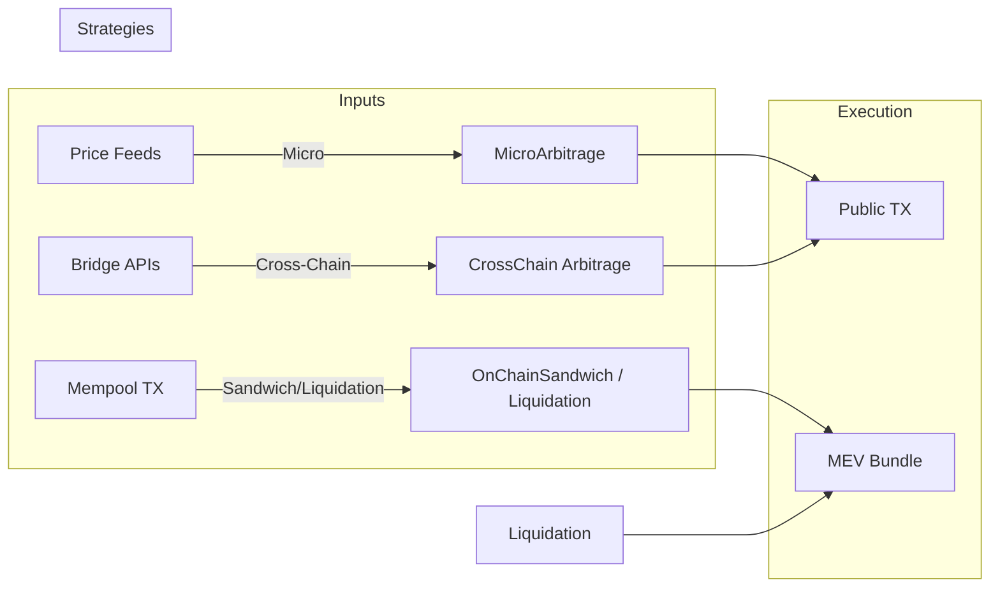
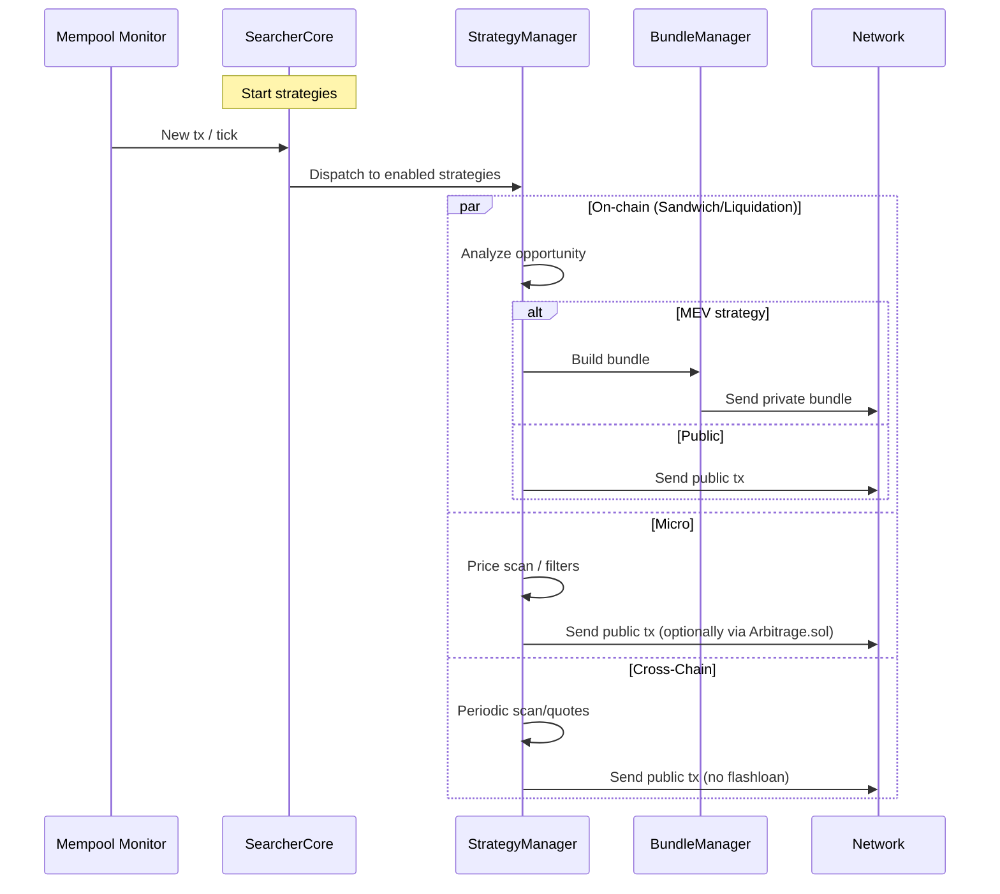

# xCrack Architecture (2025-08)

This document reflects the current code and policy state.

- Micro Arbitrage: no MEV, optional flashloan (via Arbitrage.sol)
- Cross-Chain Arbitrage: no MEV, no flashloan
- Liquidation: uses MEV, uses flashloan (via Liquidation.sol)
- Sandwich: uses MEV, no flashloan

## Components

- Core
  - SearcherCore: orchestrates strategies, channels, periodic tasks
  - StrategyManager: owns strategy instances
  - BundleManager: prepares/submits private bundles (for MEV strategies)
- Strategies
  - OnChainSandwichStrategy: mempool + on-chain pool reads, front/back tx
  - OnChainLiquidationStrategy: protocol scanners, quote, contract call, bundle
  - MicroArbitrageStrategy: price feeds, public tx broadcast, optional flashloan
  - CrossChainArbitrageStrategy: periodic scanner, quotes, bridge execution
- On-chain
  - Liquidation.sol (Aave V3 FlashLoanSimple) – used by Liquidation
  - Arbitrage.sol (Aave V3 FlashLoanSimple) – used by Micro (optional)
  - Sandwich: no flashloan contract used by policy
- Utilities
  - ABICodec: ABI encode/decode helpers (Uniswap, Aave, contracts)
  - BlockchainClient: gas, provider, basic on-chain ops
  - Oracles: Chainlink + Uniswap TWAP aggregator

## High-level data flow

- Sandwich/Liquidation submit private bundles when executing (MEV)
- Micro/CrossChain submit public transactions only

## Runtime sequence (strategy overview)

## Configuration (keys only)

- Contracts (config.default.toml)
  - [blockchain.primary_network]
    - arbitrage_contract: Arbitrage.sol (for Micro flashloan ON)
    - liquidation_contract: Liquidation.sol (Liquidation)
    - sandwich_contract: not used by policy
- Strategies
  - strategies.sandwich.use_flashloan = false (enforced by validation)
  - strategies.micro_arbitrage.use_flashloan = true|false
  - strategies.cross_chain_arbitrage.use_flashloan = false

## Notes

- Sandwich flashloan helpers and UI toggle are removed/blocked by policy.
- Micro broadcast uses ethers LocalWallet signing and send_transaction.
- Cross-chain flashloan path is intentionally disabled (non-atomic).
