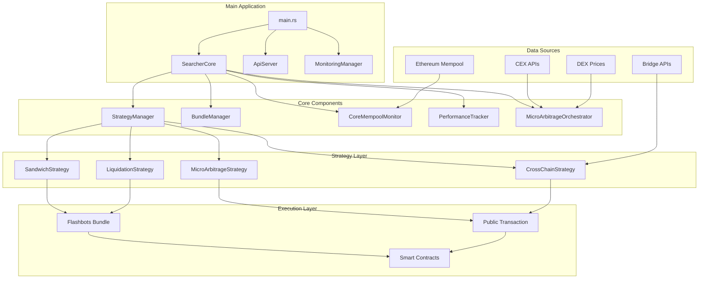
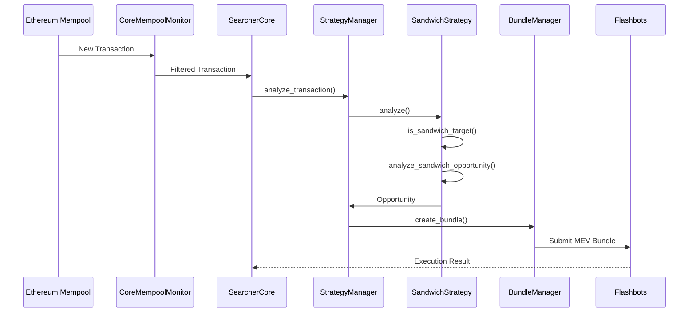
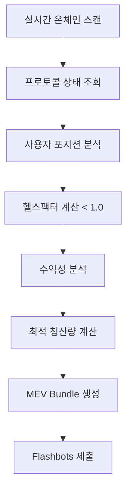
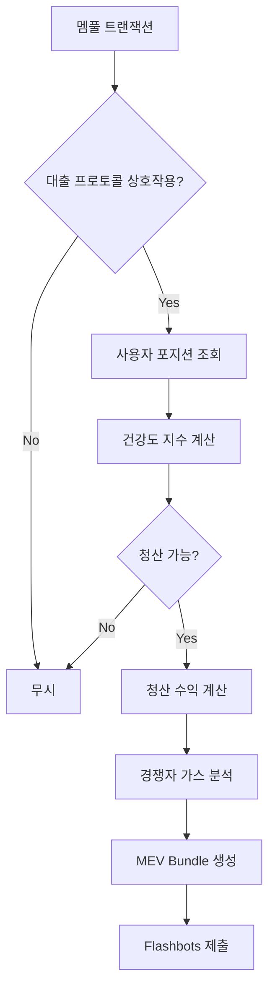
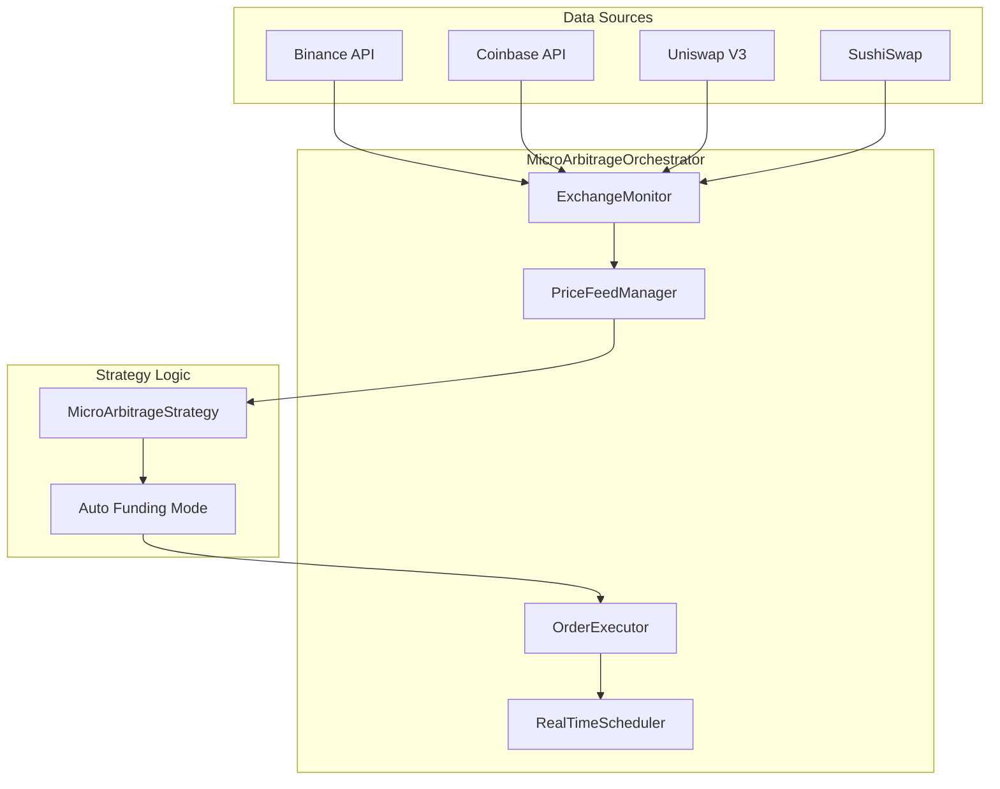
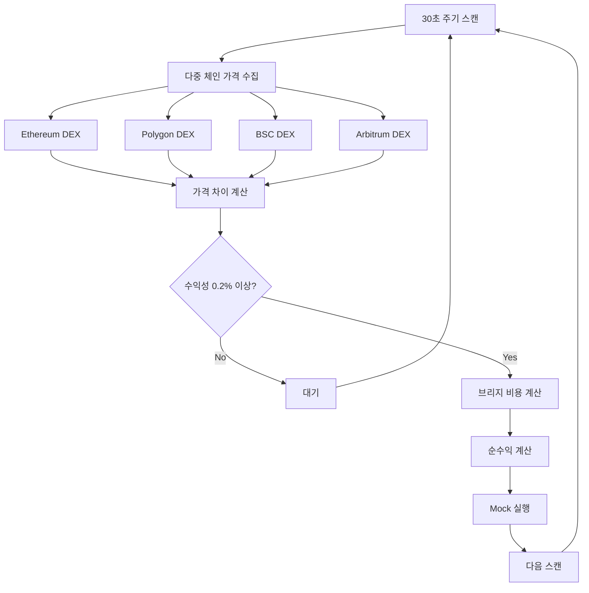
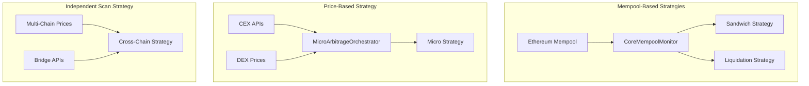
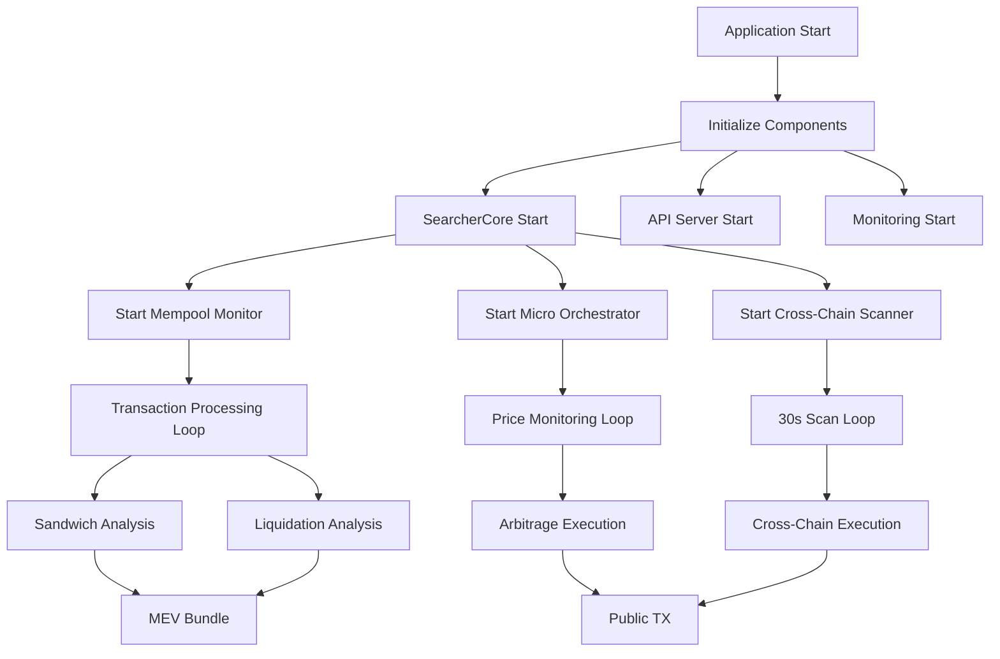
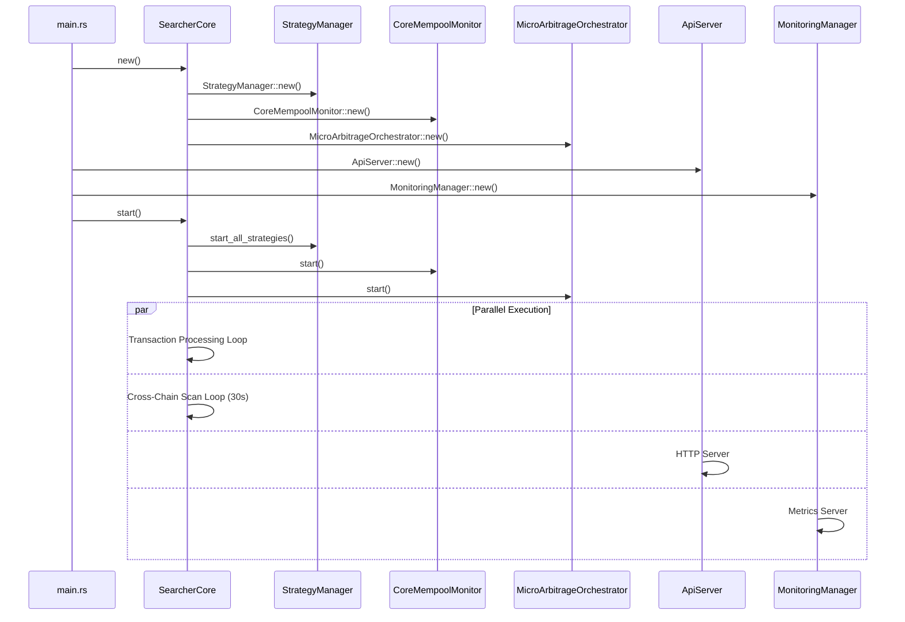
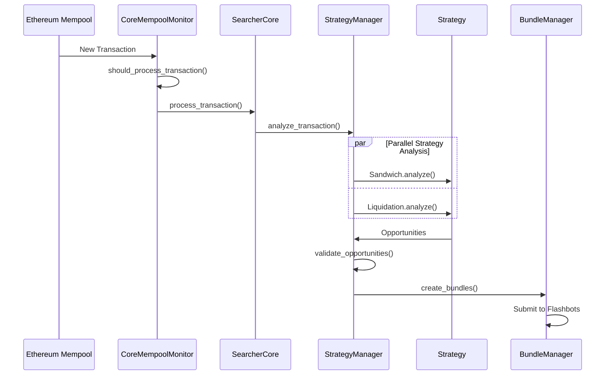

# 🏗️ xCrack 시스템 아키텍처 (v0.2.0 - 2025.01)

## 📋 목차
1. [시스템 개요](#시스템-개요)
2. [핵심 컴포넌트](#핵심-컴포넌트)
3. [전략별 아키텍처](#전략별-아키텍처)
4. [데이터 플로우](#데이터-플로우)
5. [실행 시퀀스](#실행-시퀀스)
6. [API 및 모니터링](#api-및-모니터링)
7. [보안 및 리스크 관리](#보안-및-리스크-관리)

---

## 🎯 시스템 개요

xCrack v0.2.0은 이더리움 네트워크에서 작동하는 고성능 MEV(Maximum Extractable Value) 서쳐 봇입니다.

### 주요 특징
- **🚀 고주파 거래**: 마이크로초 단위 지연시간 최적화
- **🌐 멀티체인 지원**: Ethereum, Polygon, BSC, Arbitrum, Optimism 
- **🔐 MEV 보호**: Flashbots 번들 및 프라이빗 트랜잭션
- **📊 실시간 분석**: 병렬 전략 실행 및 우선순위 관리
- **🛡️ 리스크 관리**: 동적 자금 조달 및 안전장치

### 전략 매트릭스

| 전략 | 데이터 소스 | 실행 방식 | 자금 조달 | 수익률 | 리스크 |
|-----|------------|----------|----------|--------|--------|
| 🥪 **Sandwich** | 멤풀 트랜잭션 | MEV Bundle | 지갑 자금 | 높음 | 높음 |
| 💧 **Liquidation** | 온체인 스캔 + 멤풀 | MEV Bundle | Flash Loan | 중간 | 중간 |
| ⚡ **Micro-Arbitrage** | 실시간 가격 | Public TX | **자동선택** | 낮음-중간 | 낮음 |
| 🌉 **Cross-Chain** | 독립 스캔 | Public TX | 지갑 자금 | 중간 | 중간 |

#### 자금 조달 방식 (Micro-Arbitrage)
- **auto**: 거래별 최적 모드 자동 선택 (비용 효율성 기준)
- **flashloan**: Aave v3 Flash Loan (9bp 수수료 + 가스)
- **wallet**: 보유 자금 직접 사용 (가스만)

---

## 🔧 핵심 컴포넌트

### 1. SearcherCore (중앙 조정자)

```rust
// src/core/searcher_core.rs:32-51
pub struct SearcherCore {
    config: Arc<Config>,
    provider: Arc<Provider<Ws>>,
    is_running: Arc<AtomicBool>,
    metrics: Arc<RwLock<PerformanceMetrics>>,
    
    // 핵심 컴포넌트들
    pub(crate) strategy_manager: Arc<StrategyManager>,
    bundle_manager: Arc<BundleManager>,
    mempool_monitor: Arc<CoreMempoolMonitor>,
    performance_tracker: Arc<PerformanceTracker>,
    
    // 마이크로아비트래지 시스템 (옵셔널)
    micro_arbitrage_orchestrator: Option<Arc<Mutex<MicroArbitrageOrchestrator>>>,
    
    // 통신 채널들
    tx_sender: Option<mpsc::UnboundedSender<Transaction>>,
    opportunity_sender: Option<mpsc::UnboundedSender<Opportunity>>,
    bundle_sender: Option<mpsc::UnboundedSender<Bundle>>,
}
```

### 2. 전체 시스템 아키텍처



### 3. 실제 디렉토리 구조

```
src/
├── main.rs                    # 애플리케이션 엔트리 포인트
├── core/                      # 핵심 시스템 모듈
│   ├── searcher_core.rs      # 메인 조정자
│   ├── bundle_manager.rs     # MEV 번들 관리
│   ├── mempool_monitor.rs    # 멤풀 모니터링
│   ├── performance_tracker.rs # 성능 추적
│   ├── micro_arbitrage_orchestrator.rs # 마이크로 오케스트레이터
│   └── mod.rs
│
├── strategies/               # 전략 구현체
│   ├── sandwich.rs          # 샌드위치 전략
│   ├── liquidation.rs       # 청산 전략  
│   ├── micro_arbitrage.rs   # 마이크로 차익거래
│   ├── cross_chain_arbitrage.rs # 크로스체인 차익거래
│   ├── manager.rs           # 전략 매니저
│   └── mod.rs
│
├── api/                     # Public HTTP API (Axum)
├── oracle/                  # 가격 오라클 시스템
├── opportunity/             # 기회 관리 시스템
├── storage/                 # Redis 기반 스토리지
├── monitoring/              # 모니터링 시스템
├── exchange/                # 거래소 통합 (마이크로 아비트래지)
├── bridges/                 # 브리지 통합 (크로스체인)
├── blockchain/              # 블록체인 인터페이스
├── flashbots/               # Flashbots 클라이언트
├── mempool/                 # 멤풀 모니터링
├── adapters/                # DEX 어댑터
├── utils/                   # 유틸리티
├── constants/               # 상수 정의
├── mocks/                   # Mock 시스템
├── backtest/                # 백테스트 시스템
├── config/                  # 설정 관리
└── types/                   # 타입 정의
```

---

## 🎮 전략별 아키텍처

### 1. 🥪 Sandwich 전략 (멤풀 기반)



**특징:**
- **데이터 소스**: 멤풀 트랜잭션 분석
- **실행 방식**: Flashbots MEV Bundle (Front-run + Victim + Back-run)
- **자금 조달**: 지갑 자금 (Flash Loan 사용 안함)
- **수익률**: 높음 (가격 영향 이용)
- **리스크**: 높음 (경쟁적 환경)

### 2. 💧 Liquidation 전략 (이중 탐지 시스템)

청산 전략은 두 가지 상호 보완적 방식으로 작동합니다:

#### A. 프로토콜 상태 기반 스캔 (주요 방식)


#### B. 멤풀 기반 타이밍 (경쟁 방식)


**특징:**
- **데이터 소스**: 온체인 프로토콜 스캔 + 멤풀 모니터링
- **탐지 방식**: 능동적 상태 스캔 + 수동적 멤풀 반응
- **실행 방식**: Flashbots MEV Bundle + Flash Loan
- **자금 조달**: Aave v3 Flash Loan 필수
- **지원 프로토콜**: Aave v3, Compound v2/v3
- **수익률**: 중간 (청산 보너스 5-10%)
- **리스크**: 중간 (안정적이지만 경쟁적)

### 3. ⚡ Micro-Arbitrage 전략 (실시간 가격 기반)



**특징:**
- **데이터 소스**: CEX/DEX 실시간 가격 (멤풀 독립적)
- **실행 방식**: Public Transaction (MEV Bundle 불필요)
- **자금 조달**: 자동선택 (auto/flashloan/wallet)
- **analyze() 함수**: 빈 벡터 반환 (트랜잭션 기반 아님)
- **수익률**: 낮음-중간 (0.1-0.3%)
- **리스크**: 낮음 (공개 거래, 안정적)

### 4. 🌉 Cross-Chain Arbitrage 전략 (독립 스캔)



**특징:**
- **데이터 소스**: 독립적 주기 스캔 (멤풀 독립적)
- **스캔 주기**: 30초 간격 (`SearcherCore`에서 직접 실행)
- **실행 방식**: Public Transaction + 브리지
- **자금 조달**: 지갑 자금 (Flash Loan 불가)
- **브리지**: Stargate, Hop, Multichain, LiFi
- **수익률**: 중간 (0.2-0.5%)
- **리스크**: 중간 (브리지 의존성)

---

## 📊 데이터 플로우

### 1. 전략별 데이터 소스



### 2. 실행 플로우



---

## 🔄 실행 시퀀스

### SearcherCore 시작 프로세스



### 트랜잭션 처리 플로우 (Sandwich & Liquidation)



---

## 📡 API 및 모니터링

### 1. Public HTTP API

```rust
// src/api/mod.rs - API 서버 구조
pub struct ApiServer {
    config: Arc<Config>,
    searcher_core: SearcherCore,
}

// API 엔드포인트 예시
GET  /status              // 시스템 상태
GET  /metrics             // 성능 메트릭
GET  /strategies          // 전략 상태
POST /strategies/{id}     // 전략 제어
GET  /opportunities       // 현재 기회 목록
```

### 2. 모니터링 시스템

```rust
// src/monitoring/manager.rs
pub struct MonitoringManager {
    config: Arc<Config>,
    metrics_server: Option<MetricsServer>,
    alert_system: Option<AlertSystem>,
}
```

**모니터링 대시보드**:
```
┌─────────────────────────────────────────────┐
│          xCrack v0.2.0 Dashboard            │
├───────────────┬─────────────────────────────┤
│ 상태          │ ✅ RUNNING                   │
│ 버전          │ 0.2.0                        │  
│ 활성 전략     │ [SAND] [LIQ] [MICRO] [CROSS] │
├───────────────┼─────────────────────────────┤
│ 실시간 메트릭 │                             │
│ - 처리 TX     │ 1,247                        │
│ - 발견 기회   │ 89                           │
│ - 제출 번들   │ 23                           │
│ - 총 수익     │ 12.37 ETH                    │
│ - 성공률      │ 94.3%                        │
├───────────────┼─────────────────────────────┤
│ 전략별 상태   │                             │
│ - Sandwich    │ ✅ 실행 중 (3 기회)          │
│ - Liquidation │ ✅ 실행 중 (1 기회)          │
│ - Micro-Arb   │ ✅ 실행 중 (2 기회)          │
│ - Cross-Chain │ ✅ 스캔 중 (다음: 15s)       │
└───────────────┴─────────────────────────────┘
```

### 3. 알림 시스템

**지원 채널**:
- 🎮 Discord 웹훅
- 📱 Telegram 봇  
- 📊 Prometheus/Grafana
- 📧 이메일 (Critical)

---

## 🛡️ 보안 및 리스크 관리

### 1. Mock 모드 지원

```bash
# Mock 모드 실행
API_MODE=mock cargo run

# 실제 모드 실행  
API_MODE=real cargo run
```

**Mock 시스템 특징**:
- 실제 네트워크 연결 없이 시뮬레이션
- 모든 전략의 Mock 구현 제공
- 개발 및 테스트 환경에서 안전한 실행
- Mock WebSocket Provider 지원

### 2. 리스크 관리 정책

| 리스크 유형 | 완화 전략 | 구현 위치 |
|------------|----------|----------|
| **슬리피지** | 동적 슬리피지 조정 | Strategy Level |
| **프론트러닝** | Flashbots Bundle | Bundle Manager |
| **가스 스파이크** | 가스 상한선 설정 | Strategy Config |
| **브리지 실패** | 다중 브리지 백업 | Cross-Chain Strategy |
| **유동성 부족** | 사전 유동성 체크 | DEX Adapter |
| **네트워크 지연** | 타임아웃 & 재시도 | Core Components |

### 3. 자금 보안

```rust
// 자금 조달 모드별 리스크 관리
pub enum FundingMode {
    Auto,       // 자동 선택 (최적화)
    FlashLoan,  // Flash Loan (9bp + Gas)
    Wallet,     // 지갑 자금 (Gas만)
}

// 포지션 리스크 관리
pub struct RiskManager {
    pub max_position_size: U256,
    pub daily_loss_limit: U256,
    pub max_concurrent_trades: u32,
}
```

---

## 🚀 성능 최적화

### 1. 지연시간 목표

| 컴포넌트 | 목표 지연시간 | 최적화 기법 |
|---------|-------------|------------|
| 멤풀 모니터링 | < 10ms | WebSocket + 필터링 |
| 전략 분석 | < 50ms | 병렬 처리 |
| 번들 생성 | < 20ms | 사전 계산 |
| 트랜잭션 제출 | < 100ms | 직접 연결 |

### 2. 병렬 처리 아키텍처

```rust
// src/core/searcher_core.rs:222-248 - 병렬 전략 분석
tokio::spawn(async move {
    while let Some(transaction) = tx_receiver.recv().await {
        // 모든 전략을 병렬로 분석
        let opportunities = strategy_manager.analyze_transaction(&transaction).await;
        
        // 발견된 기회들을 전송
        for opportunity in opportunities {
            if let Err(e) = opportunity_sender_clone.send(opportunity) {
                error!("❌ 기회 전송 실패: {}", e);
            }
        }
    }
});
```

### 3. 자원 효율성

- **메모리 최적화**: Arc를 통한 공유 데이터 구조
- **CPU 최적화**: 비동기 처리 및 병렬 실행
- **네트워크 최적화**: WebSocket 연결 풀링
- **I/O 최적화**: 배치 처리 및 캐싱

---

## 📚 참조 문서

### 내부 문서
- [🎯 전략별 기회 탐지](./opportunity-detection-sandwich.md)
- [💧 청산 전략 탐지](./opportunity-detection-liquidation.md) 
- [⚡ 마이크로 차익거래 탐지](./opportunity-detection-micro-arbitrage.md)
- [🌉 크로스체인 차익거래 탐지](./opportunity-detection-cross-chain.md)
- [📊 기회 탐지 튜토리얼](./opportunity-detection-tutorial.md)

### 외부 참조
- [Flashbots 문서](https://docs.flashbots.net/)
- [Aave V3 Flash Loan](https://docs.aave.com/developers/v3/)
- [Ethereum Yellow Paper](https://ethereum.github.io/yellowpaper/paper.pdf)

---

## 🔄 버전 이력

| 버전 | 날짜 | 주요 변경사항 |
|------|------|------------|
| v0.2.0 | 2025.01 | 마이크로아비트래지 자동 자금조달, API 서버, 크로스체인 독립스캔 |
| v0.1.0 | 2024.12 | 기본 MEV 전략 구현, Mock 시스템 |

---

**xCrack v0.2.0** - 차세대 MEV 서쳐 봇 🚀

*본 문서는 실제 코드베이스 (2025.01 기준)를 정확히 반영합니다.*