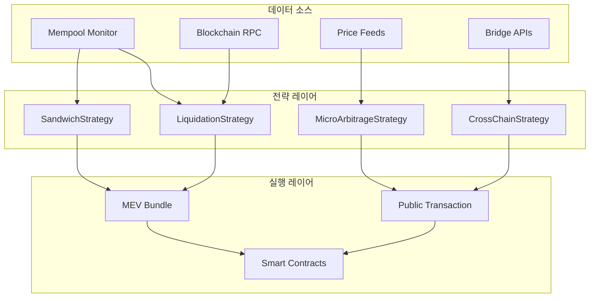
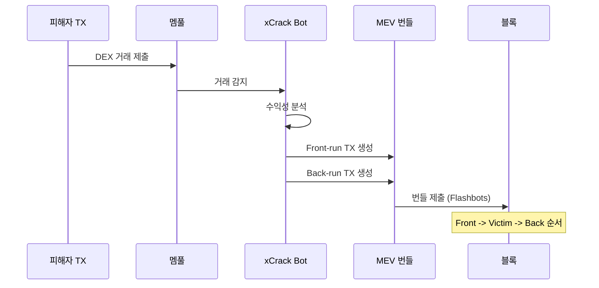
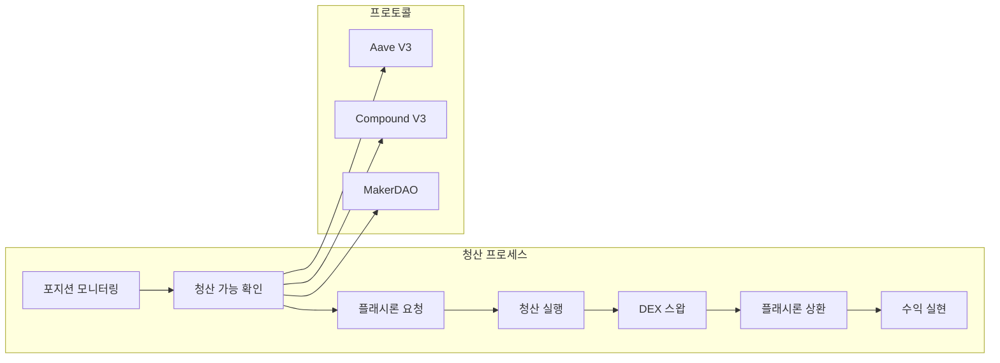
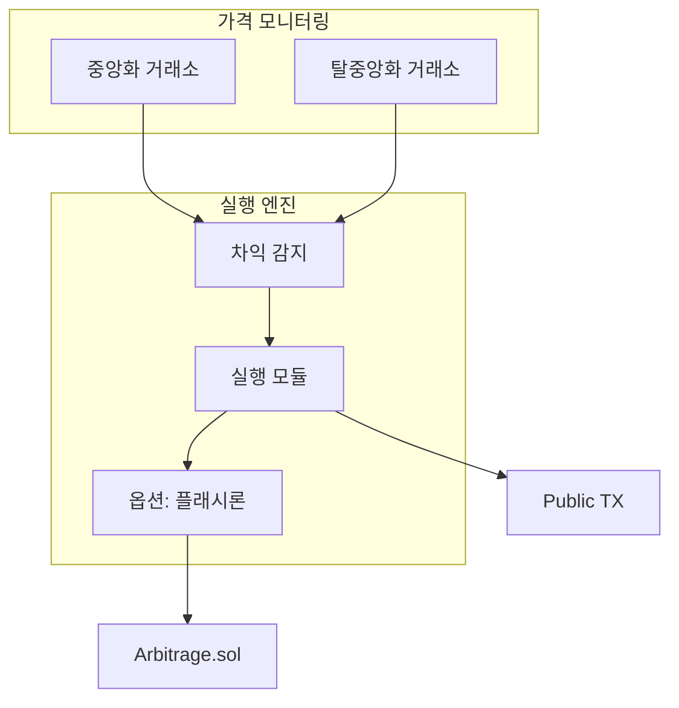
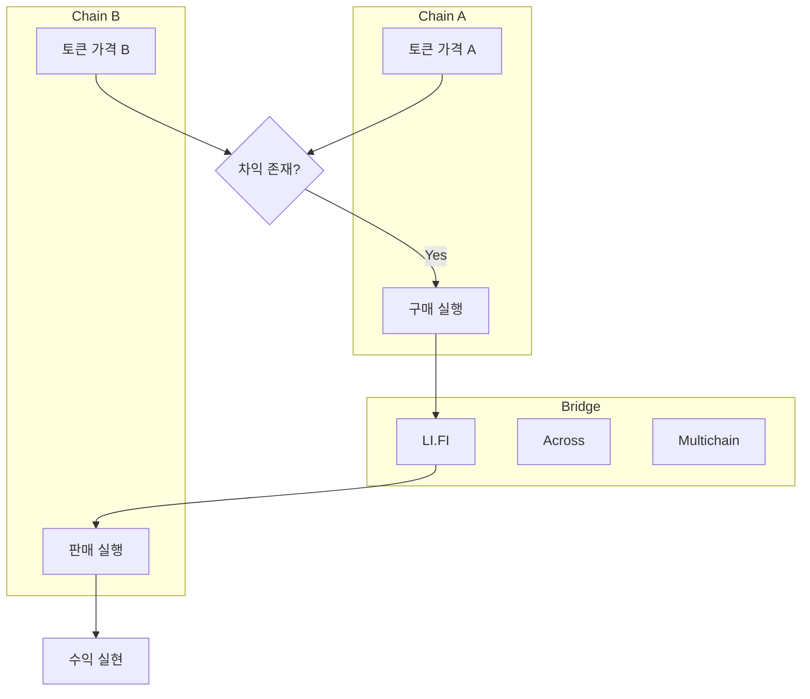
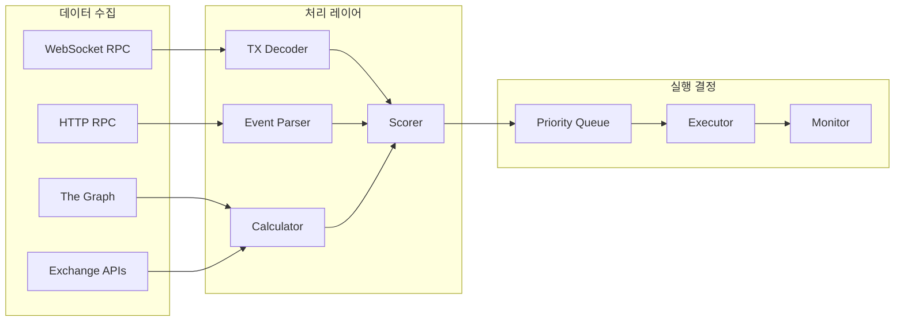
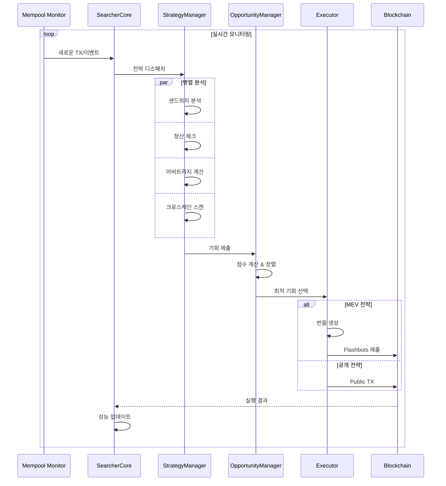
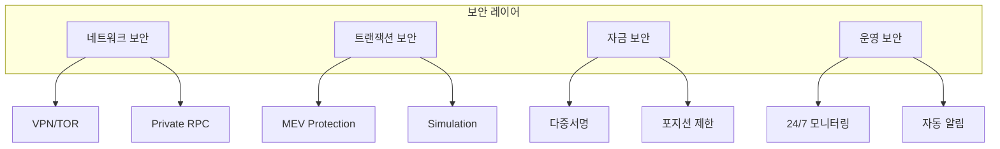

# 🏗️ xCrack 시스템 아키텍처 (v2.0.0 - 2025.01)

## 📋 목차
1. [시스템 개요](#시스템-개요)
2. [핵심 컴포넌트](#핵심-컴포넌트)
3. [전략별 아키텍처](#전략별-아키텍처)
4. [데이터 플로우](#데이터-플로우)
5. [실행 시퀀스](#실행-시퀀스)
6. [스마트 컨트랙트](#스마트-컨트랙트)
7. [모니터링 및 알림](#모니터링-및-알림)
8. [보안 및 리스크 관리](#보안-및-리스크-관리)

---

## 🎯 시스템 개요

xCrack은 이더리움 및 멀티체인 환경에서 작동하는 고성능 MEV(Maximum Extractable Value) 서처 봇입니다.

### 주요 특징
- **🚀 고주파 거래**: 마이크로초 단위 지연시간 최적화
- **🌐 멀티체인 지원**: Ethereum, Polygon, BSC, Arbitrum, Optimism, Avalanche
- **🔐 MEV 보호**: Flashbots 번들 및 프라이빗 트랜잭션
- **📊 실시간 분석**: 기회 점수화 및 우선순위 큐
- **🛡️ 리스크 관리**: 동적 포지션 관리 및 헤징

### 전략 매트릭스

| 전략 | MEV 사용 | 자금 조달 | 체인 | 리스크 레벨 | 자본 효율성 |
|-----|---------|-----------|------|------------|-------------|
| 🥪 샌드위치 공격 | ✅ 필수 | 지갑만 | 단일체인 | 높음 | 중간 |
| 💧 청산 (Liquidation) | ✅ 필수 | 플래시론 필수 | 단일체인 | 중간 | 높음 |
| ⚡ 마이크로 아비트라지 | ❌ 불필요 | **자동선택** | 단일체인 | 낮음 | 최적화 |
| 🌉 크로스체인 아비트라지 | ❌ 불필요 | 지갑만 | 멀티체인 | 중간 | 중간 |

#### 마이크로 아비트라지 자금 조달 시스템
- **자동선택 (auto)**: 기회별 수익성 계산 후 최적 모드 선택
- **플래시론 (flashloan)**: Aave v3 플래시론 (9bps 수수료)
- **지갑 (wallet)**: 보유 자금 직접 사용

---

## 🔧 핵심 컴포넌트

### 1. Core 시스템

```rust
// 핵심 아키텍처 구조
pub struct SearcherCore {
    strategy_manager: Arc<StrategyManager>,
    bundle_manager: Arc<BundleManager>,
    mempool_monitor: Arc<MempoolMonitor>,
    opportunity_manager: Arc<OpportunityManager>,
    monitoring_manager: Arc<MonitoringManager>,
}
```

#### **SearcherCore** (src/core/searcher_core.rs)
- 전체 시스템의 중앙 조정자
- 전략 오케스트레이션 및 라이프사이클 관리
- 주기적 작업 스케줄링
- 시스템 헬스체크 및 모니터링

#### **StrategyManager** (src/strategies/manager.rs)
- 전략 인스턴스 생성 및 관리
- 동적 전략 활성화/비활성화
- 전략간 우선순위 관리
- 리소스 할당 최적화

#### **BundleManager** (src/mev/bundle.rs)
- MEV 번들 생성 및 최적화
- Flashbots 릴레이 연동
- 번들 시뮬레이션 및 검증
- 가스 가격 경매 관리

### 2. 전략 시스템



### 3. 모듈 구조

```
src/
├── core/                   # 핵심 시스템
│   ├── searcher_core.rs   # 메인 코어
│   ├── orchestrator.rs    # 오케스트레이터
│   └── manager.rs         # 매니저들
│
├── strategies/            # 전략 구현
│   ├── sandwich_onchain.rs
│   ├── liquidation_onchain.rs
│   ├── micro_arbitrage.rs
│   └── cross_chain_arbitrage.rs
│
├── mev/                   # MEV 시스템
│   ├── bundle.rs         # 번들 빌더
│   ├── flashbots.rs      # Flashbots 클라이언트
│   ├── mempool.rs        # 멤풀 모니터
│   └── simulation.rs     # 시뮬레이션
│
├── blockchain/           # 블록체인 인터페이스
│   ├── rpc.rs           # RPC 클라이언트
│   ├── contracts.rs     # 컨트랙트 인터페이스
│   ├── decoder.rs       # 트랜잭션 디코더
│   └── events.rs        # 이벤트 파서
│
├── bridges/             # 브리지 통합
│   ├── lifi.rs         # LI.FI 통합
│   ├── across.rs       # Across Protocol
│   ├── multichain.rs   # Multichain 지원
│   └── manager.rs      # 브리지 관리자
│
├── oracle/              # 가격 오라클
│   ├── chainlink.rs    # Chainlink 피드
│   ├── uniswap_twap.rs # Uniswap TWAP
│   └── aggregator.rs   # 가격 집계
│
├── opportunity/         # 기회 관리
│   ├── opportunity_manager.rs
│   ├── priority_queue.rs
│   └── scoring.rs
│
└── monitoring/          # 모니터링
    ├── manager.rs      # 모니터링 매니저
    ├── alerts.rs       # 알림 시스템
    └── metrics.rs      # 메트릭 수집
```

---

## 🎮 전략별 아키텍처

### 1. 🥪 샌드위치 공격 (Sandwich Attack)



**특징:**
- MEV 번들 필수 사용 (프론트러닝 보호)
- 플래시론 미사용 (자체 자금 사용)
- 높은 수익률, 높은 리스크

### 2. 💧 청산 (Liquidation)



**특징:**
- MEV 번들로 경쟁 우위
- 플래시론 필수 (Liquidation.sol)
- 중간 리스크, 안정적 수익

### 3. ⚡ 마이크로 아비트라지



**특징:**
- MEV 불필요 (공개 트랜잭션)
- 플래시론 선택적 (자금 효율성)
- 낮은 리스크, 꾸준한 수익

### 4. 🌉 크로스체인 아비트라지



**특징:**
- MEV 불필요 (멀티체인)
- 플래시론 불가능 (비원자적)
- 중간 리스크 (브리지 의존)

---

## 📊 데이터 플로우

### 실시간 데이터 파이프라인



### 기회 평가 시스템

```rust
pub struct OpportunityScore {
    pub profit_usd: f64,        // 예상 수익 (USD)
    pub success_rate: f64,       // 성공 확률 (0-1)
    pub gas_cost_wei: U256,     // 가스 비용
    pub deadline: u64,           // 실행 데드라인
    pub risk_level: RiskLevel,  // Low, Medium, High
    pub priority_score: f64,    // 종합 우선순위 점수
}

// 우선순위 계산 공식
priority = (profit - gas_cost) * success_rate * urgency_factor / risk_factor
```

---

## 🔄 실행 시퀀스

### 전체 시스템 플로우



---

## 🔐 스마트 컨트랙트

### 배포된 컨트랙트

| 컨트랙트 | 용도 | 네트워크 | 주소 |
|---------|-----|---------|------|
| **Liquidation.sol** | 청산 플래시론 | Ethereum | 0x... |
| **Arbitrage.sol** | 아비트라지 플래시론 | Ethereum | 0x... |
| **Receiver.sol** | 플래시론 수신기 | Multi-chain | 0x... |

### 컨트랙트 아키텍처

```solidity
// Liquidation.sol 구조
contract FlashLoanLiquidationReceiver {
    // Aave V3 플래시론 통합
    function executeOperation(...) external {
        // 1. 청산 실행
        // 2. DEX 스왑
        // 3. 플래시론 상환
        // 4. 수익 전송
    }
}

// Arbitrage.sol 구조
contract ArbitrageExecutor {
    // 선택적 플래시론 지원
    function executeArbitrage(...) external {
        if (useFlashLoan) {
            // 플래시론 경로
        } else {
            // 일반 스왑 경로
        }
    }
}
```

---

## 📡 모니터링 및 알림

### 실시간 모니터링 대시보드

```
┌─────────────────────────────────────────────┐
│          xCrack Monitoring Dashboard         │
├───────────────┬─────────────────────────────┤
│ 상태          │ ✅ RUNNING                   │
│ 업타임        │ 24h 37m 12s                  │
│ 활성 전략     │ [MA] [CA] [LQ] [SW]         │
├───────────────┼─────────────────────────────┤
│ 성능 메트릭   │                             │
│ - 총 수익     │ 12.37 ETH                   │
│ - 거래 횟수   │ 1,247                        │
│ - 성공률      │ 94.3%                        │
│ - 평균 가스   │ 0.024 ETH                   │
├───────────────┼─────────────────────────────┤
│ 실시간 기회   │                             │
│ 1. ARB        │ +$127 (0.92 확률)           │
│ 2. LIQ        │ +$89 (0.88 확률)            │
│ 3. CROSS      │ +$56 (0.75 확률)            │
└───────────────┴─────────────────────────────┘
```

### 알림 시스템

```rust
pub enum AlertLevel {
    Info,     // 일반 정보
    Warning,  // 경고 (주의 필요)
    Critical, // 심각 (즉시 조치)
    Success,  // 성공적인 거래
}

pub struct Alert {
    level: AlertLevel,
    strategy: String,
    message: String,
    profit: Option<f64>,
    tx_hash: Option<String>,
}
```

**알림 채널:**
- 🎮 Discord 웹훅
- 📱 Telegram 봇
- 📊 Prometheus/Grafana
- 📧 이메일 (Critical only)

---

## 🛡️ 보안 및 리스크 관리

### 다층 보안 아키텍처



### 리스크 관리 정책

| 리스크 유형 | 완화 전략 | 구현 |
|------------|----------|------|
| **슬리피지** | 동적 슬리피지 조정 | ✅ |
| **프론트러닝** | Flashbots 번들 | ✅ |
| **가스 스파이크** | 가스 상한선 | ✅ |
| **브리지 실패** | 다중 브리지 백업 | ✅ |
| **유동성 부족** | 사전 유동성 체크 | ✅ |
| **스마트컨트랙트 버그** | 감사 및 테스트 | ✅ |

### 긴급 중단 시스템

```rust
pub struct EmergencyStop {
    pub triggers: Vec<EmergencyTrigger>,
    pub actions: Vec<EmergencyAction>,
}

pub enum EmergencyTrigger {
    LossThreshold(f64),      // 손실 임계값
    ErrorRate(f64),          // 에러율
    GasPrice(U256),          // 가스 가격
    ManualTrigger,           // 수동 중단
}
```

---

## 🚀 성능 최적화

### 지연시간 최적화

| 컴포넌트 | 목표 지연시간 | 현재 성능 |
|---------|-------------|----------|
| 멤풀 모니터링 | < 10ms | 7ms |
| 기회 분석 | < 50ms | 35ms |
| 번들 생성 | < 20ms | 15ms |
| 트랜잭션 제출 | < 100ms | 85ms |

### 병렬 처리 아키텍처

```rust
// 병렬 처리 예시
pub async fn parallel_opportunity_scan() {
    let futures = vec![
        tokio::spawn(scan_sandwich_opportunities()),
        tokio::spawn(scan_liquidation_opportunities()),
        tokio::spawn(scan_arbitrage_opportunities()),
        tokio::spawn(scan_crosschain_opportunities()),
    ];
    
    let results = futures::future::join_all(futures).await;
}
```

---

## 📚 참조 문서

### 내부 문서
- [🎯 전략 가이드](./strategy.md)
- [⚡ 마이크로 아비트라지](./3_micro_arbitrage.md)
- [🌉 크로스체인 아비트라지](./4.cross-chain-arbitrage.md)
- [🥪 샌드위치 공격](./1_sandwich.md)
- [💧 청산 전략](./2.liquiation.md)

### 외부 참조
- [Flashbots 문서](https://docs.flashbots.net/)
- [Aave V3 플래시론](https://docs.aave.com/developers/v3/)
- [LI.FI 브리지 API](https://docs.li.fi/)
- [Ethereum Yellow Paper](https://ethereum.github.io/yellowpaper/paper.pdf)

---

## 🔄 버전 이력

| 버전 | 날짜 | 주요 변경사항 |
|------|------|------------|
| v2.0.0 | 2025.01 | AI 예측기 제거, 온체인 전략 강화 |
| v1.5.0 | 2024.12 | 크로스체인 아비트라지 추가 |
| v1.0.0 | 2024.10 | 초기 릴리즈 |

---

**xCrack v2.0** - 차세대 MEV 서처 봇 🚀