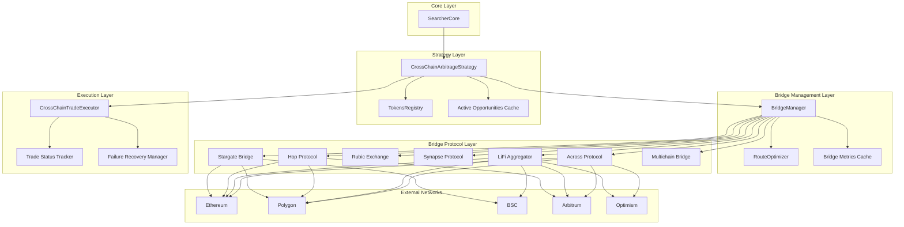
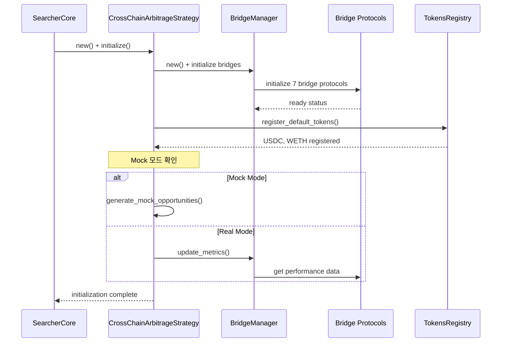
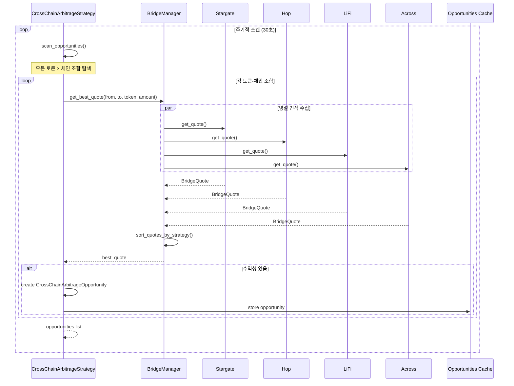
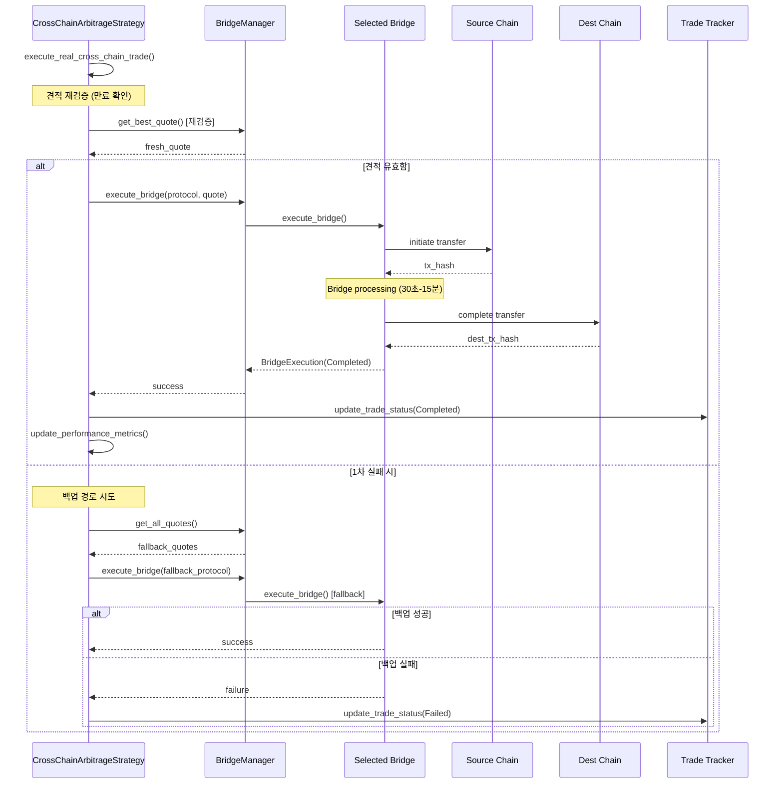
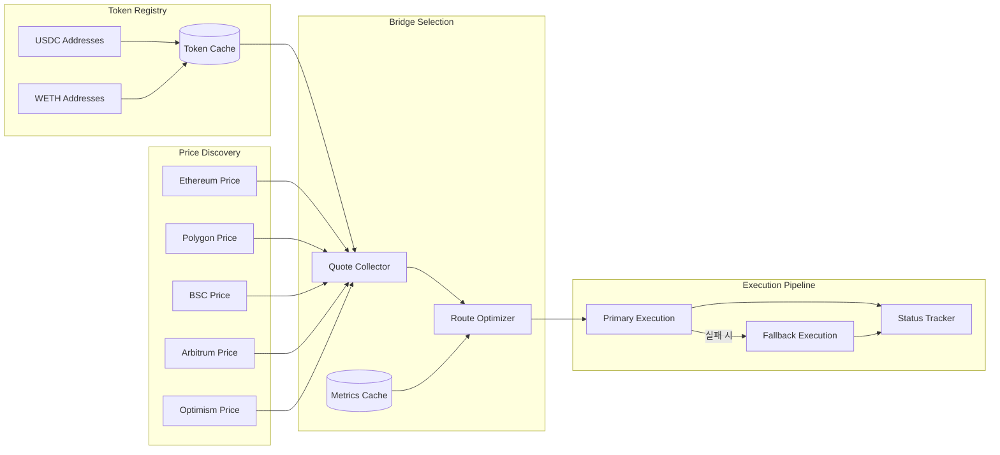

# 🌉 크로스체인 아비트러지 시스템 아키텍처 (v2.0)

## 📋 개요

xCrack의 크로스체인 아비트러지 시스템은 서로 다른 블록체인 네트워크 간의 가격 차이를 실시간으로 감지하고, 브리지 프로토콜을 활용하여 수익성 있는 크로스체인 거래를 자동으로 실행하는 복합 시스템입니다. 본 문서는 각 컴포넌트의 역할과 상호 작용을 실제 코드와 함께 상세히 설명합니다.

## 🎯 시스템 구성 요소

### 핵심 6대 컴포넌트
1. **SearcherCore**: 최상위 전략 조정자 및 생명주기 관리자
2. **CrossChainArbitrageStrategy**: 크로스체인 기회 탐지 및 실행 전략
3. **BridgeManager**: 다중 브리지 프로토콜 통합 관리자
4. **Bridge Protocols**: 7개 브리지 구현체 (Stargate, Hop, Rubic, Synapse, LiFi, Across, Multichain)
5. **RouteOptimizer**: 최적 브리지 경로 선택 엔진
6. **CrossChainTradeExecutor**: 크로스체인 거래 실행 및 상태 관리자

## 🏗️ 전체 시스템 아키텍처



## 📊 컴포넌트별 상세 분석

### 1. 🎛️ SearcherCore (최상위 전략 조정자)

**역할**: 전체 시스템의 생명주기 관리 및 크로스체인 아비트러지 전략 활성화

**위치**: `src/core/searcher_core.rs`

**크로스체인 전략 초기화**:
```rust
// SearcherCore가 StrategyManager를 통해 크로스체인 전략 초기화
// src/core/searcher_core.rs (유추)
let strategy_manager = Arc::new(StrategyManager::new(Arc::clone(&config), Arc::clone(&provider)).await?);

// 크로스체인 전략이 활성화된 경우
if config.strategies.cross_chain_arbitrage.enabled {
    let cross_chain_strategy = CrossChainArbitrageStrategy::new(Arc::clone(&config));
    strategy_manager.add_strategy(Box::new(cross_chain_strategy)).await?;
    
    // 백그라운드에서 자동 스캐닝 시작
    strategy_manager.start_strategy(StrategyType::CrossChainArbitrage).await?;
}
```

### 2. 🌉 CrossChainArbitrageStrategy (크로스체인 기회 탐지 및 실행)

**역할**: 멀티체인 가격 차이 감지, 브리지 비용 계산, 수익성 분석

**위치**: `src/strategies/cross_chain_arbitrage.rs`

**핵심 특징**:
- **멀티체인 모니터링**: Ethereum, Polygon, BSC, Arbitrum, Optimism
- **7개 브리지 프로토콜**: Stargate, Hop, Rubic, Synapse, LiFi, Across, Multichain
- **지능형 수익성 분석**: 브리지 비용, 가스비, 슬리피지 종합 계산
- **Flash Loan 지원**: 선택적 Flash Loan 모드 (원자성 한계 고려)

**전략 초기화**:
```rust
// src/strategies/cross_chain_arbitrage.rs:86-123
impl CrossChainArbitrageStrategy {
    pub fn new(config: Arc<Config>) -> Self {
        let mock_config = get_mock_config();
        
        let supported_chains = vec![
            ChainId::Ethereum,
            ChainId::Polygon, 
            ChainId::BSC,
            ChainId::Arbitrum,
            ChainId::Optimism,
        ];
        
        let supported_bridges = vec![
            BridgeProtocol::Stargate,
            BridgeProtocol::Hop,
            BridgeProtocol::Rubic,
            BridgeProtocol::Synapse,
            BridgeProtocol::LiFi,      // Bridge aggregator
            BridgeProtocol::Across,    // Fast bridge
            BridgeProtocol::Multichain, // Multi-chain bridge
        ];
        
        Self {
            id: Uuid::new_v4(),
            config,
            mock_config,
            bridge_manager: Arc::new(BridgeManager::new()),
            supported_chains,
            supported_bridges,
            tokens_registry: Arc::new(RwLock::new(HashMap::new())),
            active_opportunities: Arc::new(RwLock::new(HashMap::new())),
            active_trades: Arc::new(Mutex::new(HashMap::new())),
            is_running: Arc::new(RwLock::new(false)),
            performance_metrics: Arc::new(RwLock::new(CrossChainMetrics::default())),
            last_execution: Arc::new(RwLock::new(None)),
        }
    }
```

**토큰 등록 시스템**:
```rust
// src/strategies/cross_chain_arbitrage.rs:147-184
async fn register_default_tokens(&self) -> Result<()> {
    let mut registry = self.tokens_registry.write().unwrap();
    
    // USDC 토큰 등록 (주요 체인들)
    let mut usdc_addresses = HashMap::new();
    usdc_addresses.insert(ChainId::Ethereum, "0xA0b86a33E6417f8C681A1fFE6954e127c9cd8e46".parse().unwrap());
    usdc_addresses.insert(ChainId::Polygon, "0x2791Bca1f2de4661ED88A30C99A7a9449Aa84174".parse().unwrap());
    usdc_addresses.insert(ChainId::BSC, "0x8AC76a51cc950d9822D68b83fE1Ad97B32Cd580d".parse().unwrap());
    usdc_addresses.insert(ChainId::Arbitrum, "0xFF970A61A04b1cA14834A43f5dE4533eBDDB5CC8".parse().unwrap());
    usdc_addresses.insert(ChainId::Optimism, "0x7F5c764cBc14f9669B88837ca1490cCa17c31607".parse().unwrap());
    
    let usdc_token = CrossChainToken {
        symbol: "USDC".to_string(),
        addresses: usdc_addresses,
        decimals: 6,
    };
    
    registry.insert("USDC".to_string(), usdc_token);
    
    // WETH 토큰 등록 (모든 체인)
    let mut weth_addresses = HashMap::new();
    weth_addresses.insert(ChainId::Ethereum, "0xC02aaA39b223FE8D0A0e5C4F27eAD9083C756Cc2".parse().unwrap());
    weth_addresses.insert(ChainId::Polygon, "0x7ceB23fD6bC0adD59E62ac25578270cFf1b9f619".parse().unwrap());
    weth_addresses.insert(ChainId::BSC, "0x2170Ed0880ac9A755fd29B2688956BD959F933F8".parse().unwrap());
    weth_addresses.insert(ChainId::Arbitrum, "0x82aF49447D8a07e3bd95BD0d56f35241523fBab1".parse().unwrap());
    weth_addresses.insert(ChainId::Optimism, "0x4200000000000000000000000000000000000006".parse().unwrap());
    
    let weth_token = CrossChainToken {
        symbol: "WETH".to_string(),
        addresses: weth_addresses,
        decimals: 18,
    };
    
    registry.insert("WETH".to_string(), weth_token);
    
    info!("📝 기본 토큰 등록 완료: USDC, WETH");
    Ok(())
}
```

**기회 스캐닝 메인 로직**:
```rust
// src/strategies/cross_chain_arbitrage.rs:259-284
pub async fn scan_opportunities(&self) -> Result<Vec<CrossChainArbitrageOpportunity>> {
    debug!("🔍 크로스체인 기회 스캔 시작");
    
    let opportunities = if std::env::var("API_MODE").unwrap_or_default() == "mock" {
        // Mock 모드: 기존 방식 사용
        let active = self.active_opportunities.read().unwrap();
        active
            .values()
            .filter(|opp| opp.is_valid())
            .cloned()
            .collect()
    } else {
        // 실제 모드: 실시간 브리지 스캔
        self.scan_real_bridge_opportunities().await?
    };
        
    info!("🎯 발견한 크로스체인 기회: {} 개", opportunities.len());
    
    // 성능 메트릭 업데이트
    {
        let mut metrics = self.performance_metrics.write().unwrap();
        metrics.total_opportunities_found += opportunities.len() as u64;
    }
    
    Ok(opportunities)
}
```

**실제 브리지 기회 탐지**:
```rust
// src/strategies/cross_chain_arbitrage.rs:333-416
pub async fn scan_real_bridge_opportunities(&self) -> Result<Vec<CrossChainArbitrageOpportunity>> {
    debug!("🔍 실제 브리지를 통한 크로스체인 기회 스캔 시작");
    
    let tokens = {
        let tokens_guard = self.tokens_registry.read().unwrap();
        tokens_guard.values().cloned().collect::<Vec<_>>()
    };
    let mut opportunities = Vec::new();
    
    for token in tokens.iter() {
        // 모든 가능한 체인 조합에서 기회 탐색
        for &source_chain in &self.supported_chains {
            for &dest_chain in &self.supported_chains {
                if source_chain == dest_chain {
                    continue;
                }
                
                // 소량으로 테스트 (1000 USDC / 1 WETH)
                let test_amount = if token.symbol == "USDC" {
                    alloy::primitives::U256::from(1000_000000u64) // 1000 USDC
                } else {
                    alloy::primitives::U256::from(1_000000000000000000u64) // 1 ETH
                };
                
                // 최적 브리지 찾기
                match self.bridge_manager.get_best_quote(
                    source_chain,
                    dest_chain,
                    token,
                    test_amount,
                    0.5, // 0.5% 슬리패지
                    Some(RouteStrategy::LowestCost),
                ).await {
                    Ok(quote) => {
                        // 수익성 검증
                        if quote.is_profitable() && quote.net_profit() > 0 {
                            let opportunity = CrossChainArbitrageOpportunity {
                                id: Uuid::new_v4().to_string(),
                                token: token.clone(),
                                source_chain,
                                dest_chain,
                                source_price: quote.exchange_rate,
                                dest_price: quote.exchange_rate * (1.0 + quote.price_impact / 100.0),
                                price_diff_percent: quote.price_impact,
                                amount: quote.amount_in,
                                bridge_protocol: self.get_bridge_protocol_from_quote(&quote),
                                bridge_cost: quote.bridge_fee,
                                total_gas_cost: quote.gas_fee,
                                expected_profit: alloy::primitives::U256::from(quote.net_profit().max(0) as u128),
                                profit_percent: (quote.net_profit() as f64 / quote.amount_in.to::<u128>() as f64) * 100.0,
                                estimated_time: quote.estimated_time,
                                confidence: 0.8, // 실제 브리지라서 높은 신뢰도
                                discovered_at: Utc::now(),
                                expires_at: quote.expires_at,
                                selected_dex_adapters: Vec::new(),
                            };
                            
                            opportunities.push(opportunity);
                        }
                    }
                    Err(e) => {
                        debug!("브리지 견적 실패: {} -> {} ({}): {}", 
                               source_chain.name(), dest_chain.name(), token.symbol, e);
                    }
                }
            }
        }
    }
    
    info!("🎯 실제 브리지에서 {} 개의 수익 기회 발견", opportunities.len());
    Ok(opportunities)
}
```

**컴포넌트 구조**:
```rust
// src/strategies/cross_chain_arbitrage.rs:37-63
pub struct CrossChainArbitrageStrategy {
    /// 전략 ID
    id: Uuid,
    /// 설정 파일
    config: Arc<Config>,
    /// Mock 설정 (개발용)
    mock_config: MockConfig,
    /// 브리지 매니저
    bridge_manager: Arc<BridgeManager>,
    /// 지원하는 체인들
    supported_chains: Vec<ChainId>,
    /// 지원하는 브리지들
    supported_bridges: Vec<BridgeProtocol>,
    /// 체인별 토큰 목록
    tokens_registry: Arc<RwLock<HashMap<String, CrossChainToken>>>,
    /// 활성 기회들
    active_opportunities: Arc<RwLock<HashMap<String, CrossChainArbitrageOpportunity>>>,
    /// 실행 중인 거래들
    active_trades: Arc<Mutex<HashMap<String, CrossChainTrade>>>,
    /// 전략 상태
    is_running: Arc<RwLock<bool>>,
    /// 성능 메트릭
    performance_metrics: Arc<RwLock<CrossChainMetrics>>,
    /// 마지막 실행 시간
    last_execution: Arc<RwLock<Option<DateTime<Utc>>>>,
}
```

### 3. 🌐 BridgeManager (다중 브리지 프로토콜 통합 관리자)

**역할**: 7개 브리지 프로토콜 통합 관리 및 최적 경로 선택

**위치**: `src/bridges/manager.rs`

**핵심 기능**:
- 병렬 견적 수집 (7개 브리지 동시 조회)
- 전략별 최적화 (비용/시간/신뢰성/균형)
- 타임아웃 및 에러 처리
- 성능 메트릭 캐시

**브리지 초기화**:
```rust
// src/bridges/manager.rs:49-76
impl BridgeManager {
    pub fn new() -> Self {
        let mut bridges: HashMap<BridgeProtocol, Arc<dyn Bridge>> = HashMap::new();
        
        // Initialize all bridge implementations
        bridges.insert(BridgeProtocol::Stargate, Arc::new(StargateBridge::new()));
        bridges.insert(BridgeProtocol::Hop, Arc::new(HopBridge::new()));
        bridges.insert(BridgeProtocol::Rubic, Arc::new(RubicBridge::new()));
        bridges.insert(BridgeProtocol::Synapse, Arc::new(SynapseBridge::new()));
        
        // Add LI.FI bridge (primary aggregator)
        let lifi_api_key = std::env::var("LIFI_API_KEY").ok();
        bridges.insert(BridgeProtocol::LiFi, Arc::new(LiFiBridge::new(lifi_api_key)));
        
        // Add Across bridge (fast optimistic bridge)
        bridges.insert(BridgeProtocol::Across, Arc::new(AcrossBridge::new()));
        
        // Add Multichain bridge (comprehensive multi-chain support)
        bridges.insert(BridgeProtocol::Multichain, Arc::new(MultichainBridge::new()));
        
        Self {
            bridges,
            metrics_cache: tokio::sync::RwLock::new(HashMap::new()),
            default_strategy: RouteStrategy::Balanced,
            timeout_duration: Duration::from_secs(30),
        }
    }
```

**최적 견적 수집**:
```rust
// src/bridges/manager.rs:84-154
pub async fn get_best_quote(
    &self,
    from: ChainId,
    to: ChainId,
    token: &CrossChainToken,
    amount: U256,
    slippage: f64,
    strategy: Option<RouteStrategy>,
) -> BridgeResult<BridgeQuote> {
    let strategy = strategy.unwrap_or_else(|| self.default_strategy.clone());
    
    debug!("🔍 Getting quotes from all bridges for {} {} -> {}", 
           token.symbol, from.name(), to.name());
    
    // Get quotes from all supporting bridges in parallel
    let mut quote_futures = Vec::new();
    
    for (protocol, bridge) in &self.bridges {
        let protocol = protocol.clone();
        let bridge = Arc::clone(bridge);
        let token = token.clone();
        
        let future = async move {
            // Check if bridge supports this route
            match timeout(Duration::from_secs(5), bridge.supports_route(from, to, &token)).await {
                Ok(Ok(supports)) if supports => {
                    // Get quote with timeout
                    match timeout(Duration::from_secs(10), bridge.get_quote(from, to, &token, amount, slippage)).await {
                        Ok(Ok(quote)) => Some((protocol, quote)),
                        Ok(Err(e)) => {
                            debug!("❌ {} quote failed: {}", bridge.name(), e);
                            None
                        }
                        Err(_) => {
                            warn!("⏰ {} quote timeout", bridge.name());
                            None
                        }
                    }
                }
                _ => None,
            }
        };
        
        quote_futures.push(future);
    }
    
    // Execute all quote requests concurrently
    let results = futures::future::join_all(quote_futures).await;
    let mut valid_quotes: Vec<(BridgeProtocol, BridgeQuote)> = results.into_iter()
        .filter_map(|result| result)
        .collect();
    
    if valid_quotes.is_empty() {
        return Err(BridgeError::UnsupportedRoute { from, to });
    }
    
    info!("📊 Got {} valid quotes", valid_quotes.len());
    
    // Sort quotes based on strategy
    self.sort_quotes_by_strategy(&mut valid_quotes, &strategy).await;
    
    // Return the best quote
    let (best_protocol, best_quote) = valid_quotes.into_iter().next().unwrap();
    
    info!("🏆 Best quote: {} with {} cost and {}s completion", 
           best_protocol.name(),
           best_quote.total_cost().to::<u64>() as f64 / 1_000_000.0,
           best_quote.estimated_time);
    
    Ok(best_quote)
}
```

**전략별 견적 정렬**:
```rust
// src/bridges/manager.rs:261-309
async fn sort_quotes_by_strategy(
    &self,
    quotes: &mut Vec<(BridgeProtocol, BridgeQuote)>,
    strategy: &RouteStrategy,
) {
    match strategy {
        RouteStrategy::LowestCost => {
            quotes.sort_by(|a, b| a.1.total_cost().cmp(&b.1.total_cost()));
        }
        RouteStrategy::FastestTime => {
            quotes.sort_by(|a, b| a.1.estimated_time.cmp(&b.1.estimated_time));
        }
        RouteStrategy::MostReliable => {
            // Sort by success rate (descending)
            let cache = self.metrics_cache.read().await;
            quotes.sort_by(|a, b| {
                let rate_a = cache.get(&a.0).map(|m| m.success_rate).unwrap_or(0.0);
                let rate_b = cache.get(&b.0).map(|m| m.success_rate).unwrap_or(0.0);
                rate_b.partial_cmp(&rate_a).unwrap_or(std::cmp::Ordering::Equal)
            });
        }
        RouteStrategy::Balanced => {
            // Balanced scoring: (cost_score * 0.4 + time_score * 0.3 + reliability_score * 0.3)
            let cache = self.metrics_cache.read().await;
            
            quotes.sort_by(|a, b| {
                let cost_a = a.1.total_cost().to::<u128>() as f64;
                let cost_b = b.1.total_cost().to::<u128>() as f64;
                let time_a = a.1.estimated_time as f64;
                let time_b = b.1.estimated_time as f64;
                let rate_a = cache.get(&a.0).map(|m| m.success_rate).unwrap_or(0.5);
                let rate_b = cache.get(&b.0).map(|m| m.success_rate).unwrap_or(0.5);
                
                // Normalize scores (lower is better for cost and time, higher for reliability)
                let cost_score_a = cost_a / (cost_a + cost_b);
                let cost_score_b = cost_b / (cost_a + cost_b);
                let time_score_a = time_a / (time_a + time_b);
                let time_score_b = time_b / (time_a + time_b);
                let reliability_score_a = rate_a;
                let reliability_score_b = rate_b;
                
                let score_a = cost_score_a * 0.4 + time_score_a * 0.3 + (1.0 - reliability_score_a) * 0.3;
                let score_b = cost_score_b * 0.4 + time_score_b * 0.3 + (1.0 - reliability_score_b) * 0.3;
                
                score_a.partial_cmp(&score_b).unwrap_or(std::cmp::Ordering::Equal)
            });
        }
    }
}
```

### 4. 🔗 Bridge Protocols (7개 브리지 구현체)

**역할**: 각각 특화된 크로스체인 브리지 프로토콜 구현

**위치**: `src/bridges/` 디렉토리

**지원 브리지**:

#### **🌟 Stargate Bridge**
- **특징**: LayerZero 기반, 통합 유동성, 낮은 슬리피지
- **지원 체인**: Ethereum, Polygon, BSC, Arbitrum, Optimism
- **주요 토큰**: USDC, USDT, ETH, FRAX

#### **🦘 Hop Protocol** 
- **특징**: Optimistic rollup 전용, 빠른 전송, AMM 기반
- **지원 체인**: Ethereum L1 ↔ L2 (Arbitrum, Optimism, Polygon)
- **주요 토큰**: ETH, USDC, USDT, DAI

#### **🔄 Rubic Exchange**
- **특징**: Cross-chain DEX, 직접 스왓, 높은 유동성
- **지원 체인**: 15+ 체인 지원
- **주요 토큰**: 대부분의 주요 토큰 지원

#### **🔗 LiFi (Aggregator)**
- **특징**: 브리지 aggregator, 최적 경로 자동 선택
- **지원 체인**: 20+ 체인 광범위 지원
- **주요 기능**: 다중 브리지 경로 비교 및 최적화

#### **⚡ Across Protocol**
- **특징**: 최고속 브리지, Optimistic 검증, UMA Oracle
- **지원 체인**: Ethereum, Polygon, Arbitrum, Optimism
- **주요 토큰**: ETH, WBTC, USDC, DAI

### 5. 🎯 RouteOptimizer (최적 브리지 경로 선택 엔진)

**역할**: 4가지 최적화 전략에 따른 브리지 경로 선택

**위치**: `src/bridges/manager.rs`

**최적화 전략**:
```rust
// src/bridges/manager.rs:10-21
pub enum RouteStrategy {
    /// Minimize total cost (fees + gas)
    LowestCost,
    /// Minimize completion time
    FastestTime,
    /// Highest success rate
    MostReliable,
    /// Best overall score (balanced)
    Balanced,
}
```

**균형 점수 계산**:
```rust
// src/bridges/manager.rs:282-308 (Balanced 전략)
RouteStrategy::Balanced => {
    // Balanced scoring: (cost_score * 0.4 + time_score * 0.3 + reliability_score * 0.3)
    let cache = self.metrics_cache.read().await;
    
    quotes.sort_by(|a, b| {
        let cost_a = a.1.total_cost().to::<u128>() as f64;
        let cost_b = b.1.total_cost().to::<u128>() as f64;
        let time_a = a.1.estimated_time as f64;
        let time_b = b.1.estimated_time as f64;
        let rate_a = cache.get(&a.0).map(|m| m.success_rate).unwrap_or(0.5);
        let rate_b = cache.get(&b.0).map(|m| m.success_rate).unwrap_or(0.5);
        
        // Normalize scores (lower is better for cost and time, higher for reliability)
        let cost_score_a = cost_a / (cost_a + cost_b);
        let cost_score_b = cost_b / (cost_a + cost_b);
        let time_score_a = time_a / (time_a + time_b);
        let time_score_b = time_b / (time_a + time_b);
        let reliability_score_a = rate_a;
        let reliability_score_b = rate_b;
        
        let score_a = cost_score_a * 0.4 + time_score_a * 0.3 + (1.0 - reliability_score_a) * 0.3;
        let score_b = cost_score_b * 0.4 + time_score_b * 0.3 + (1.0 - reliability_score_b) * 0.3;
        
        score_a.partial_cmp(&score_b).unwrap_or(std::cmp::Ordering::Equal)
    });
}
```

### 6. 🚀 CrossChainTradeExecutor (크로스체인 거래 실행 및 상태 관리)

**역할**: 실제 크로스체인 거래 실행, 상태 추적, 실패 복구

**위치**: `src/strategies/cross_chain_arbitrage.rs`

**거래 실행 메인 로직**:
```rust
// src/strategies/cross_chain_arbitrage.rs:419-608
pub async fn execute_real_cross_chain_trade(&self, opportunity: &CrossChainArbitrageOpportunity) -> Result<bool> {
    info!("🚀 실제 크로스체인 거래 실행 시작: {} -> {}", 
        opportunity.source_chain.name(),
        opportunity.dest_chain.name()
    );
    
    // Flash Loan 보조 모드 확인 (설정 기반)
    if std::env::var("API_MODE").unwrap_or_default() != "mock" && self.config.strategies.cross_chain_arbitrage.use_flashloan {
        debug!("🔁 Flashloan 보조 모드 힌트 (크로스체인): 출발 자산을 대여하여 브리지+도착 DEX 청산 가능");
    }

    // 1) 최신 견적 1차 획득 (Balanced)
    let mut quote = self.bridge_manager.get_best_quote(
        opportunity.source_chain,
        opportunity.dest_chain,
        &opportunity.token,
        opportunity.amount,
        0.5,
        Some(RouteStrategy::Balanced),
    ).await?;

    // 1-1) 견적 만료/임박 재검증: 만료이거나 유효시간이 30초 미만이면 재조회 1회
    let now = chrono::Utc::now();
    let time_left = (quote.expires_at - now).num_seconds();
    if !quote.is_valid() || time_left < 30 {
        warn!("⚠️ 견적이 만료/임박({}s), 재조회 시도", time_left);
        quote = self.bridge_manager.get_best_quote(
            opportunity.source_chain,
            opportunity.dest_chain,
            &opportunity.token,
            opportunity.amount,
            0.5,
            Some(RouteStrategy::Balanced),
        ).await?;
        if !quote.is_valid() {
            warn!("❌ 재조회 견적도 유효하지 않음");
            return Ok(false);
        }
    }
    
    // 1-2) 최소 수익/시간 가드 (보수적)
    if !quote.is_profitable() {
        warn!("⚠️ 순이익이 0 이하로 추정, 실행 스킵");
        return Ok(false);
    }
    if quote.estimated_time > 900 { // 15분 초과
        warn!("⚠️ 예상 소요시간이 15분을 초과, 실행 스킵 ({}s)", quote.estimated_time);
        return Ok(false);
    }

    // 2) 1차 거래 실행
    let exec_timeout_secs = quote.estimated_time.saturating_add(60).max(60);
    let mut execution = match tokio_timeout(
        Duration::from_secs(exec_timeout_secs as u64),
        self.bridge_manager.execute_bridge(primary_protocol.clone(), &quote),
    ).await {
        Ok(res) => res,
        Err(_) => {
            warn!("⏰ 1차 실행 타임아웃({}s) | protocol={:?}", exec_timeout_secs, primary_protocol);
            Err(crate::bridges::traits::BridgeError::ApiError { message: "bridge execution timeout".to_string() })
        }
    };
    
    // 3) 실패 시 백업 경로 재시도
    let mut success = match &execution {
        Ok(exec) => matches!(exec.status, crate::bridges::traits::BridgeExecutionStatus::Completed),
        Err(_) => false,
    };

    if !success {
        // 백업 경로 시도
        let quotes = self.bridge_manager.get_all_quotes(
            opportunity.source_chain,
            opportunity.dest_chain,
            &opportunity.token,
            opportunity.amount,
            0.5,
        ).await?;
        
        // 최적 백업 경로 선택 및 실행
        if let Some((fallback_protocol, fallback_quote)) = quotes.first() {
            let exec2 = self.bridge_manager.execute_bridge(fallback_protocol.clone(), fallback_quote).await;
            success = exec2.is_ok();
        }
    }
    
    // 메트릭 업데이트
    let mut metrics = self.performance_metrics.write().unwrap();
    if success {
        metrics.successful_trades += 1;
        metrics.total_profit += quote.net_profit().max(0) as f64 / 1_000000.0;
        info!("✅ 실제 크로스체인 거래 성공: ${:.2} 수익", quote.net_profit() as f64 / 1_000000.0);
    } else {
        metrics.failed_trades += 1;
        warn!("❌ 실제 크로스체인 거래 실패");
    }
    
    Ok(success)
}
```

## 🔄 데이터 플로우 및 호출 관계

### 1. 시스템 시작 시퀀스



### 2. 크로스체인 기회 탐지 플로우



### 3. 크로스체인 거래 실행 플로우



### 4. 채널 및 데이터 흐름



## 📊 성능 특성 및 최적화

### 타이밍 특성
- **기회 스캔**: 30초 간격 (설정 가능)
- **견적 수집**: 브리지당 5-10초 (병렬 실행)
- **실행 시간**: 30초-15분 (브리지별 상이)
- **타임아웃**: 견적 10초, 실행 30-900초

### 처리량 특성
- **지원 체인**: 5개 메인 체인
- **지원 브리지**: 7개 프로토콜
- **동시 거래**: 최대 3개 (메모리 관리)
- **토큰 지원**: USDC, WETH 기본 + 확장 가능

### 수익성 임계값
- **최소 수익률**: 0.2-0.5% (브리지 비용 고려)
- **브리지 비용**: 프로토콜별 $5-50
- **가스 비용**: 체인별 $1-25
- **실행 시간**: 최대 15분

### 성능 메트릭
```rust
// src/strategies/cross_chain_arbitrage.rs:66-84
pub struct CrossChainMetrics {
    /// 발견한 총 기회 수
    pub total_opportunities_found: u64,
    /// 실행한 총 거래 수
    pub total_trades_executed: u64,
    /// 성공한 거래 수
    pub successful_trades: u64,
    /// 실패한 거래 수
    pub failed_trades: u64,
    /// 총 수익
    pub total_profit: f64,
    /// 총 손실
    pub total_loss: f64,
    /// 평균 실행 시간 (초)
    pub avg_execution_time: f64,
    /// 성공률
    pub success_rate: f64,
}
```

## 🔧 설정 및 튜닝

### 주요 설정 파라미터
```toml
[strategies.cross_chain_arbitrage]
enabled = true
use_flashloan = false  # 크로스체인 원자성 한계로 비권장
scan_interval_seconds = 30
min_profit_percentage = 0.2
max_execution_time_minutes = 15

# 지원 체인 설정
supported_chains = ["ethereum", "polygon", "bsc", "arbitrum", "optimism"]

# 브리지 우선순위 설정
bridge_preferences = [
    { name = "lifi", weight = 1.0 },      # Aggregator 우선
    { name = "across", weight = 0.9 },    # 빠른 전송
    { name = "stargate", weight = 0.8 },  # 안정성
    { name = "hop", weight = 0.7 },       # L2 전용
]

# API 키 설정
[bridges]
lifi_api_key = "your_lifi_api_key"
rubic_api_key = "your_rubic_api_key"
```

### 성능 튜닝 가이드
1. **스캔 간격 조정**: 가격 변동성에 따라 10-60초
2. **수익 임계값**: 브리지 비용 상승 시 임계값 상향 조정  
3. **타임아웃 설정**: 네트워크 상황에 따라 조정
4. **브리지 우선순위**: 성능 데이터 기반 가중치 조정

## 📈 모니터링 및 메트릭

### 핵심 메트릭
- **기회 발견율**: 시간당 발견된 기회 수
- **실행 성공률**: 시도한 거래 중 성공 비율
- **평균 수익률**: 거래당 평균 수익
- **브리지별 성능**: 각 브리지의 성공률 및 비용

### 알림 및 경고
- 🚨 **높은 수익률**: 1% 이상 수익 기회 발견
- ⚠️ **브리지 장애**: 특정 브리지 연속 실패
- 📊 **일일 리포트**: 수익, 실행 횟수, 체인별 성과

## 💰 수익 모델 및 리스크

### 수익 구조
```
총수익 = (목적지가격 - 출발지가격) × 거래량
총비용 = 브리지수수료 + 가스비 + 슬리피지
순수익 = 총수익 - 총비용
수익률 = 순수익 / 투자금액 × 100%
```

### 주요 리스크
1. **브리지 실패**: 자금이 브리지에 걸려있는 상황
2. **가격 변동**: 실행 중 가격이 반대로 움직이는 경우
3. **시간 지연**: 예상보다 긴 브리지 시간
4. **슬리피지**: 큰 거래로 인한 가격 영향

### 리스크 관리
```rust
// 수익성 재검증 및 안전 장치
if !quote.is_profitable() {
    warn!("⚠️ 순이익이 0 이하로 추정, 실행 스킵");
    return Ok(false);
}
if quote.estimated_time > 900 { // 15분 초과
    warn!("⚠️ 예상 소요시간이 15분을 초과, 실행 스킵 ({}s)", quote.estimated_time);
    return Ok(false);
}
```

## 🎯 크로스체인 거래 상태 관리

### 거래 상태 정의
```rust
// src/types.rs:1202-1226
pub enum CrossChainTradeStatus {
    /// Trade initiated
    Initiated,
    /// Source chain transaction confirmed
    SourceTxConfirmed { tx_hash: B256 },
    /// Bridge transaction in progress
    BridgeInProgress { bridge_tx_hash: Option<B256> },
    /// Bridge completed, destination chain transaction pending
    BridgeCompleted,
    /// Destination chain transaction confirmed
    DestTxConfirmed { tx_hash: B256 },
    /// Trade completed successfully
    Completed {
        source_tx_hash: B256,
        dest_tx_hash: B256,
        actual_profit: U256,
    },
    /// Trade failed
    Failed {
        reason: String,
        stage: CrossChainTradeStage,
        recovery_possible: bool,
    },
}
```

### 거래 실행 단계
```rust
// src/types.rs:1229-1234
pub enum CrossChainTradeStage {
    SourceChainBuy,     // 출발 체인에서 토큰 매수
    BridgeTransfer,     // 브리지를 통한 크로스체인 전송
    DestChainSell,      // 목적지 체인에서 토큰 매도
}
```

## 🎯 결론

xCrack의 크로스체인 아비트러지 시스템은 6개 핵심 컴포넌트가 유기적으로 협력하여:

1. **멀티체인 가격 모니터링** (CrossChainArbitrageStrategy, TokensRegistry)
2. **지능형 브리지 선택** (BridgeManager, RouteOptimizer) 
3. **안정적인 거래 실행** (CrossChainTradeExecutor, 7개 Bridge Protocols)
4. **포괄적인 상태 관리** (Trade Status Tracker, Performance Metrics)

이를 통해 **5개 주요 체인** 간의 가격 차이를 **7개 브리지 프로토콜**을 활용하여 안전하고 수익성 있게 실행합니다.

시스템은 **원자성 한계**를 인식하고 **보수적인 리스크 관리**를 통해 안정적인 크로스체인 수익을 추구합니다.

---

**버전**: v2.0 | **작성일**: 2025.01 | **기준 코드베이스**: xCrack v0.2.0