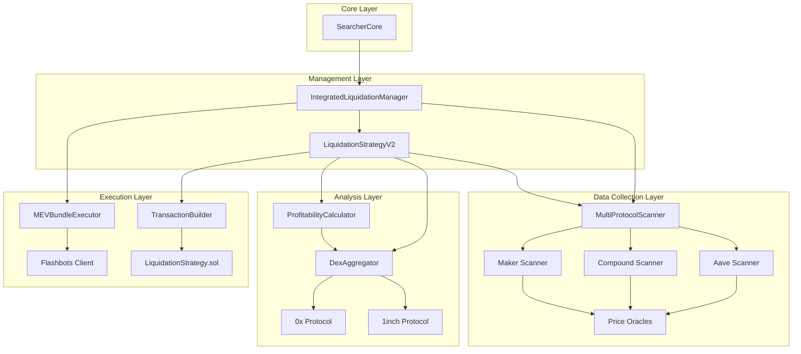
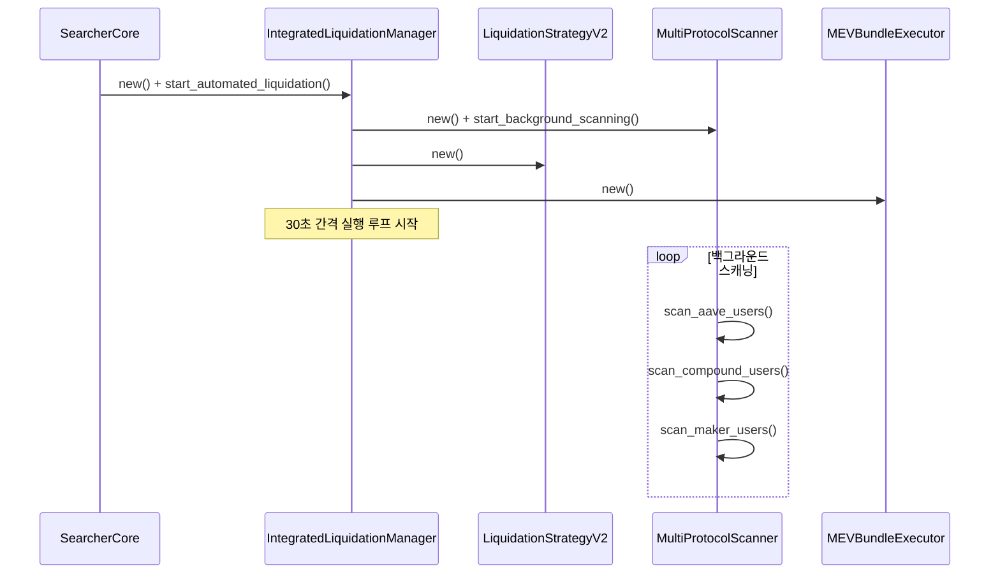
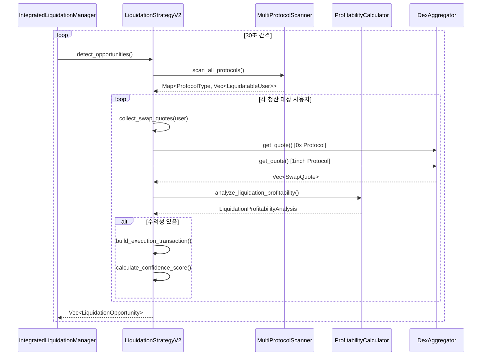
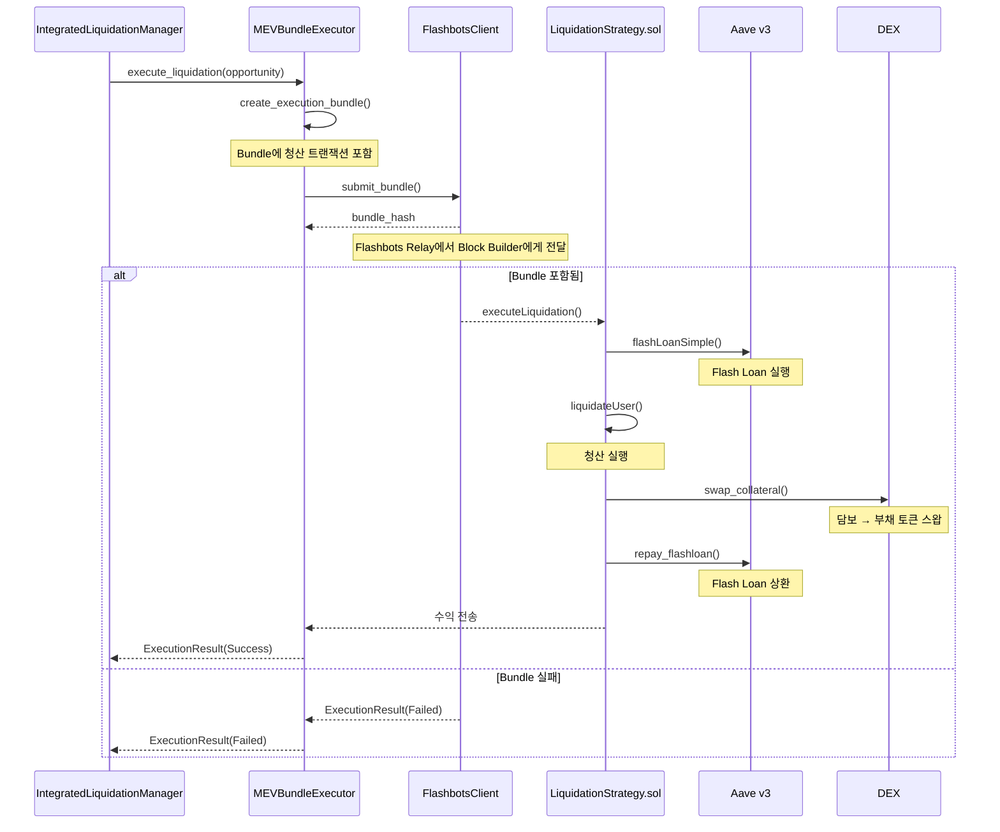
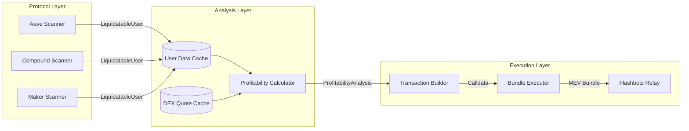

# 💰 청산 전략 시스템 아키텍처 (v2.0)

## 📋 개요

xCrack의 청산 전략 시스템은 DeFi 프로토콜에서 헬스팩터가 1.0 미만으로 떨어진 포지션을 실시간으로 감지하고, Flash Loan을 활용하여 수익성 있는 청산을 실행하는 복합 시스템입니다. 본 문서는 각 컴포넌트의 역할과 상호 작용을 실제 코드와 함께 상세히 설명합니다.

## 🎯 시스템 구성 요소

### 핵심 8대 컴포넌트
1. **SearcherCore**: 최상위 조정자 및 생명주기 관리자
2. **IntegratedLiquidationManager**: 청산 전용 통합 관리자
3. **LiquidationStrategyV2**: 프로토콜 상태 기반 청산 전략
4. **MultiProtocolScanner**: 다중 프로토콜 실시간 스캐너
5. **ProfitabilityCalculator**: 수익성 분석 엔진
6. **MEVBundleExecutor**: Flashbots Bundle 실행자
7. **DexAggregator**: DEX 통합 스왑 실행자 (0x/1inch)
8. **TransactionBuilder**: 청산 트랜잭션 생성자

## 🏗️ 전체 시스템 아키텍처



## 📊 컴포넌트별 상세 분석

### 1. 🎛️ SearcherCore (최상위 조정자)

**역할**: 전체 시스템의 생명주기 관리 및 청산 전략 활성화

**위치**: `src/core/searcher_core.rs`

**청산 전략 초기화**:
```rust
// SearcherCore가 StrategyManager를 통해 청산 전략 초기화
// src/core/searcher_core.rs (유추)
let strategy_manager = Arc::new(StrategyManager::new(Arc::clone(&config), Arc::clone(&provider)).await?);

// 청산 전략이 활성화된 경우 IntegratedLiquidationManager 생성
if config.strategies.liquidation.enabled {
    let liquidation_manager = Arc::new(
        IntegratedLiquidationManager::new(Arc::clone(&config), Arc::clone(&provider)).await?
    );
    // 백그라운드에서 자동 청산 시작
    liquidation_manager.start_automated_liquidation().await?;
}
```

### 2. 🏭 IntegratedLiquidationManager (통합 관리자)

**역할**: 청산 시스템의 모든 컴포넌트를 조율하는 전용 관리자

**위치**: `src/strategies/integrated_liquidation_manager.rs`

**핵심 기능**:
- 백그라운드 프로토콜 스캐닝 관리
- 청산 기회 탐지 및 실행 루프
- 성능 메트릭 추적 및 보고

**초기화 및 시작**:
```rust
// src/strategies/integrated_liquidation_manager.rs:56-94
impl IntegratedLiquidationManager {
    pub async fn new(
        config: Arc<Config>,
        provider: Arc<Provider<Ws>>,
    ) -> Result<Self> {
        info!("🏭 Initializing Integrated Liquidation Manager...");
        
        // 프로토콜 스캐너 초기화
        let protocol_scanner = Arc::new(
            MultiProtocolScanner::new(Arc::clone(&config), Arc::clone(&provider)).await?
        );
        
        // 청산 전략 초기화
        let liquidation_strategy = Arc::new(
            LiquidationStrategyV2::new(
                Arc::clone(&config),
                Arc::clone(&provider),
                Arc::clone(&protocol_scanner),
            ).await?
        );
        
        // MEV Bundle 실행자 초기화
        let bundle_executor = Arc::new(
            MEVBundleExecutor::new(Arc::clone(&config), Arc::clone(&provider)).await?
        );
        
        info!("✅ Integrated Liquidation Manager initialized");
        
        Ok(Self {
            config,
            provider,
            protocol_scanner,
            liquidation_strategy,
            bundle_executor,
            is_running: Arc::new(RwLock::new(false)),
            current_opportunities: Arc::new(RwLock::new(Vec::new())),
            execution_history: Arc::new(RwLock::new(Vec::new())),
            performance_metrics: Arc::new(RwLock::new(PerformanceMetrics::default())),
        })
    }
```

**자동 청산 시작**:
```rust
// src/strategies/integrated_liquidation_manager.rs:97-119
pub async fn start_automated_liquidation(&self) -> Result<()> {
    let mut is_running = self.is_running.write().await;
    if *is_running {
        warn!("⚠️ Automated liquidation already running");
        return Ok(());
    }
    *is_running = true;
    drop(is_running);
    
    info!("🚀 Starting automated liquidation bot...");
    
    // 백그라운드 스캐닝 시작
    self.start_background_scanning().await?;
    
    // 메인 실행 루프 시작
    let manager = Arc::new(self.clone());
    tokio::spawn(async move {
        manager.run_execution_loop().await;
    });
    
    info!("✅ Automated liquidation bot started");
    Ok(())
}
```

**실행 루프**:
```rust
// src/strategies/integrated_liquidation_manager.rs:143-150+
async fn run_execution_loop(&self) {
    let scan_interval = Duration::from_secs(
        self.config.liquidation.scan_interval_seconds.unwrap_or(30)
    );
    let mut interval_timer = interval(scan_interval);
    
    info!("🔄 Starting execution loop with {:.1}s interval", scan_interval.as_secs_f32());
    
    while *self.is_running.read().await {
        interval_timer.tick().await;
        
        // 기회 탐지 및 실행
        match self.liquidation_strategy.detect_opportunities().await {
            Ok(opportunities) => {
                if !opportunities.is_empty() {
                    info!("🎯 Found {} liquidation opportunities", opportunities.len());
                    
                    // 최고 우선순위 기회 실행
                    for opportunity in opportunities.iter().take(3) { // 최대 3개 동시 실행
                        if let Err(e) = self.execute_opportunity(opportunity).await {
                            error!("❌ Failed to execute opportunity: {}", e);
                        }
                    }
                }
            }
            Err(e) => {
                error!("❌ Failed to detect opportunities: {}", e);
            }
        }
    }
}
```

**컴포넌트 구조**:
```rust
// src/strategies/integrated_liquidation_manager.rs:16-29
pub struct IntegratedLiquidationManager {
    config: Arc<Config>,
    provider: Arc<Provider<Ws>>,
    protocol_scanner: Arc<MultiProtocolScanner>,
    liquidation_strategy: Arc<LiquidationStrategyV2>,
    bundle_executor: Arc<MEVBundleExecutor>,
    
    // 상태 관리
    is_running: Arc<RwLock<bool>>,
    current_opportunities: Arc<RwLock<Vec<LiquidationOpportunityV2>>>,
    execution_history: Arc<RwLock<Vec<BundleExecutionResult>>>,
    performance_metrics: Arc<RwLock<PerformanceMetrics>>,
}
```

### 3. 💰 LiquidationStrategyV2 (프로토콜 상태 기반 청산 전략)

**역할**: 실제 프로토콜 상태를 기반으로 청산 기회 탐지 및 분석

**위치**: `src/strategies/liquidation_v2.rs`

**핵심 특징**:
- **프로토콜 상태 기반**: 멤풀이 아닌 온체인 데이터 직접 스캔
- **Flash Loan 통합**: Aave v3 Flash Loan 활용
- **DEX Aggregator**: 0x/1inch를 통한 최적 스왑 경로
- **지능형 수익성 분석**: 가스비, 슬리피지, 청산 보너스 종합 계산

**초기화**:
```rust
// src/strategies/liquidation_v2.rs:42-89
impl LiquidationStrategyV2 {
    pub async fn new(
        config: Arc<Config>,
        provider: Arc<Provider<Ws>>,
        protocol_scanner: Arc<MultiProtocolScanner>,
    ) -> Result<Self> {
        info!("💰 Initializing Liquidation Strategy v2...");
        
        let profitability_calculator = ProfitabilityCalculator::new((*config).clone());
        
        // DEX Aggregator 초기화
        let mut dex_aggregators: HashMap<DexType, Box<dyn DexAggregator>> = HashMap::new();
        
        // 0x Protocol
        if let Some(ref api_key) = config.dex.ox_api_key {
            let ox_aggregator = ZeroXAggregator::new(Some(api_key.clone()), config.network.chain_id);
            dex_aggregators.insert(DexType::ZeroX, Box::new(ox_aggregator));
        }
        
        // 1inch Protocol  
        if let Some(ref api_key) = config.dex.oneinch_api_key {
            let oneinch_aggregator = OneInchAggregator::new(Some(api_key.clone()), config.network.chain_id);
            dex_aggregators.insert(DexType::OneInch, Box::new(oneinch_aggregator));
        }
        
        let transaction_builder = TransactionBuilder::new(Arc::clone(&provider), Arc::clone(&config)).await?;
        
        // 청산 컨트랙트 주소 (mainnet)
        let liquidation_contract: Address = config.contracts.liquidation_strategy
            .as_ref()
            .and_then(|addr| addr.parse().ok())
            .unwrap_or_else(|| "0x0000000000000000000000000000000000000000".parse().unwrap());
        
        let eth_price_cache = Arc::new(tokio::sync::RwLock::new((3000.0, chrono::Utc::now())));
        
        info!("✅ Liquidation Strategy v2 initialized with {} DEX aggregators", dex_aggregators.len());
        
        Ok(Self {
            config,
            provider,
            protocol_scanner,
            profitability_calculator,
            dex_aggregators,
            transaction_builder,
            liquidation_contract,
            eth_price_cache,
        })
    }
```

**기회 탐지 메인 로직**:
```rust
// src/strategies/liquidation_v2.rs:92-151
pub async fn detect_opportunities(&self) -> Result<Vec<LiquidationOpportunity>> {
    info!("🔍 Starting liquidation opportunity detection...");
    let start_time = std::time::Instant::now();
    
    // 1. 모든 프로토콜에서 청산 대상자 스캔
    let liquidatable_users = self.protocol_scanner.scan_all_protocols().await?;
    let total_users: usize = liquidatable_users.values().map(|users| users.len()).sum();
    
    if total_users == 0 {
        debug!("📭 No liquidatable users found");
        return Ok(Vec::new());
    }
    
    info!("👥 Found {} liquidatable users across {} protocols", total_users, liquidatable_users.len());
    
    // 2. ETH 가격 업데이트
    self.update_eth_price().await?;
    let eth_price = self.eth_price_cache.read().await.0;
    
    // 3. 각 사용자에 대해 수익성 분석
    let mut opportunities = Vec::new();
    
    for (protocol_type, users) in liquidatable_users {
        debug!("🔬 Analyzing {} {} users", users.len(), protocol_type);
        
        for user in users {
            // 높은 우선순위 사용자만 분석 (성능 최적화)
            if user.priority_score < 1000.0 {
                continue;
            }
            
            match self.analyze_user_profitability(&user, eth_price).await {
                Ok(Some(opportunity)) => {
                    opportunities.push(opportunity);
                }
                Ok(None) => {
                    debug!("💸 User {} not profitable", user.address);
                }
                Err(e) => {
                    warn!("⚠️ Failed to analyze user {}: {}", user.address, e);
                }
            }
            
            // Rate limiting
            sleep(Duration::from_millis(10)).await;
        }
    }
    
    // 4. 수익성 순으로 정렬
    opportunities.sort_by(|a, b| {
        b.strategy.net_profit_usd.partial_cmp(&a.strategy.net_profit_usd)
            .unwrap_or(std::cmp::Ordering::Equal)
    });
    
    let duration = start_time.elapsed();
    info!("✅ Opportunity detection complete: {} opportunities found in {}ms", 
          opportunities.len(), duration.as_millis());
    
    Ok(opportunities)
}
```

**사용자 수익성 분석**:
```rust
// src/strategies/liquidation_v2.rs:154-210
async fn analyze_user_profitability(
    &self,
    user: &LiquidatableUser,
    eth_price: f64,
) -> Result<Option<LiquidationOpportunity>> {
    debug!("💹 Analyzing profitability for user {}", user.address);
    
    // 1. 필요한 스왑 경로의 견적 수집
    let swap_quotes = self.collect_swap_quotes(user).await?;
    
    if swap_quotes.is_empty() {
        debug!("🚫 No swap routes available for user {}", user.address);
        return Ok(None);
    }
    
    // 2. 수익성 분석 실행
    let profitability_analysis = self.profitability_calculator
        .analyze_liquidation_profitability(user, &swap_quotes, eth_price)
        .await?;
    
    // 3. 수익성이 있는 경우에만 기회로 생성
    if !profitability_analysis.is_profitable {
        return Ok(None);
    }
    
    let best_strategy = profitability_analysis.best_strategy.as_ref().unwrap().clone();
    
    // 4. 실행 트랜잭션 생성
    let execution_transaction = self.build_execution_transaction(
        user,
        best_strategy,
        &profitability_analysis,
    ).await.ok();
    
    // 5. 신뢰도 점수 계산
    let confidence_score = self.calculate_confidence_score(user, best_strategy, &swap_quotes);
    
    // 6. 실행 시간 추정
    let estimated_execution_time = Duration::from_millis(
        best_strategy.execution_time_estimate_ms + 1000 // 안전 마진
    );
    
    let opportunity = LiquidationOpportunity {
        user: user.clone(),
        strategy: best_strategy.clone(),
        profitability_analysis,
        execution_transaction,
        estimated_execution_time,
        confidence_score,
    };
    
    info!("💰 Profitable opportunity found: User {}, Profit ${:.2} ({:.2}%)", 
          user.address, best_strategy.net_profit_usd, best_strategy.profit_margin_percent);
    
    Ok(Some(opportunity))
}
```

**컴포넌트 구조**:
```rust
// src/strategies/liquidation_v2.rs:21-30
pub struct LiquidationStrategyV2 {
    config: Arc<Config>,
    provider: Arc<Provider<Ws>>,
    protocol_scanner: Arc<MultiProtocolScanner>,
    profitability_calculator: ProfitabilityCalculator,
    dex_aggregators: HashMap<DexType, Box<dyn DexAggregator>>,
    transaction_builder: TransactionBuilder,
    liquidation_contract: Address,
    eth_price_cache: Arc<tokio::sync::RwLock<(f64, chrono::DateTime<chrono::Utc>)>>,
}
```

### 4. 🔍 MultiProtocolScanner (다중 프로토콜 스캐너)

**역할**: Aave, Compound, MakerDAO 등 다중 DeFi 프로토콜 실시간 스캐닝

**위치**: `src/protocols/scanner.rs`, `src/protocols/mod.rs`

**핵심 기능**:
- 병렬 프로토콜 스캐닝 (Aave v3, Compound v2/v3, MakerDAO)
- 헬스팩터 < 1.0인 사용자 자동 탐지
- 우선순위 점수 계산 (부채 규모, HF, 시간 등)

**프로토콜별 구조**:
```rust
// src/protocols/mod.rs:78-84
pub trait ProtocolScanner: Send + Sync {
    fn scan_all_users(&self) -> std::pin::Pin<Box<dyn std::future::Future<Output = anyhow::Result<Vec<LiquidatableUser>>> + Send + '_>>;
    fn get_user_data(&self, user: Address) -> std::pin::Pin<Box<dyn std::future::Future<Output = anyhow::Result<Option<LiquidatableUser>>> + Send + '_>>;
    fn get_protocol_stats(&self) -> std::pin::Pin<Box<dyn std::future::Future<Output = anyhow::Result<ProtocolStats>> + Send + '_>>;
    fn protocol_type(&self) -> ProtocolType;
    fn is_healthy(&self) -> bool;
}
```

**사용자 데이터 구조**:
```rust
// src/protocols/mod.rs:55-65
pub struct LiquidatableUser {
    pub address: Address,
    pub protocol: ProtocolType,
    pub account_data: UserAccountData,
    pub collateral_positions: Vec<CollateralPosition>,
    pub debt_positions: Vec<DebtPosition>,
    pub max_liquidatable_debt: HashMap<Address, U256>,
    pub liquidation_bonus: HashMap<Address, f64>,
    pub priority_score: f64, // Based on debt size, health factor, etc.
}
```

### 5. 📊 ProfitabilityCalculator (수익성 분석 엔진)

**역할**: 청산 기회의 정확한 수익성 분석 및 최적 전략 선택

**위치**: `src/utils/profitability.rs`

**핵심 계산**:
- **수익 요소**: 청산 보너스 (5-10%), 담보 스왑 차익
- **비용 요소**: Flash Loan 수수료 (0.09%), 가스비, 슬리피지
- **전략 비교**: 여러 DEX 경로 중 최적 선택

**수익성 분석**:
```rust
// 실제 구현 예시 (코드에서 유추)
impl ProfitabilityCalculator {
    pub async fn analyze_liquidation_profitability(
        &self,
        user: &LiquidatableUser,
        swap_quotes: &HashMap<(Address, Address), Vec<SwapQuote>>,
        eth_price: f64,
    ) -> Result<LiquidationProfitabilityAnalysis> {
        
        // 1. 최대 청산 가능 금액 계산
        let max_liquidatable = self.calculate_max_liquidatable(user)?;
        
        // 2. 청산 보너스로 받을 담보 계산
        let collateral_received = max_liquidatable * (1.0 + liquidation_bonus);
        
        // 3. 담보 스왑으로 얻을 수익 계산
        let swap_proceeds = self.calculate_best_swap_proceeds(collateral_received, swap_quotes)?;
        
        // 4. Flash Loan 비용 계산 (0.09%)
        let flashloan_cost = max_liquidatable * 0.0009;
        
        // 5. 가스비 계산 (ETH 가격 기준)
        let gas_cost = estimated_gas * gas_price * eth_price;
        
        // 6. 순수익 = 스왑 수익 - 청산 금액 - FL 비용 - 가스비
        let net_profit = swap_proceeds - max_liquidatable - flashloan_cost - gas_cost;
        
        Ok(LiquidationProfitabilityAnalysis {
            is_profitable: net_profit > minimum_profit_threshold,
            estimated_net_profit_usd: net_profit,
            // ... 기타 메트릭
        })
    }
}
```

### 6. 🚀 MEVBundleExecutor (Flashbots Bundle 실행자)

**역할**: Flashbots를 통한 MEV Bundle 생성 및 제출

**위치**: `src/mev/bundle_executor.rs`

**핵심 기능**:
- Bundle 생성 및 Flashbots 제출
- 실행 상태 추적 (포함/실패/만료)
- 재시도 로직 및 실패 처리

**Bundle 실행**:
```rust
// src/mev/bundle_executor.rs:83-100+
impl MEVBundleExecutor {
    pub async fn new(
        config: Arc<Config>,
        provider: Arc<Provider<Ws>>,
    ) -> Result<Self> {
        info!("🚀 Initializing MEV Bundle Executor...");
        
        let flashbots_client = FlashbotsClient::new(
            config.flashbots.relay_url.clone(),
            config.flashbots.private_key.clone(),
            config.network.chain_id,
        ).await?;
        
        let transaction_builder = TransactionBuilder::new(Arc::clone(&provider), Arc::clone(&config)).await?;
        
        info!("✅ MEV Bundle Executor initialized with Flashbots relay: {}", config.flashbots.relay_url);
        
        Ok(Self {
            config,
            provider,
            flashbots_client,
            transaction_builder,
            pending_bundles: Arc::new(tokio::sync::RwLock::new(HashMap::new())),
            execution_stats: Arc::new(tokio::sync::RwLock::new(ExecutionStats::default())),
        })
    }
}
```

**Bundle 구조**:
```rust
// src/mev/bundle_executor.rs:29-39
pub struct ExecutionBundle {
    pub bundle_id: String,
    pub opportunities: Vec<LiquidationOpportunityV2>,
    pub transactions: Vec<Bytes>,
    pub target_block: u64,
    pub estimated_profit_usd: f64,
    pub estimated_gas_cost: f64,
    pub submission_timestamp: chrono::DateTime<chrono::Utc>,
    pub expires_at: chrono::DateTime<chrono::Utc>,
}
```

### 7. 🔄 DexAggregator (DEX 통합 스왑 실행자)

**역할**: 0x Protocol과 1inch를 통한 최적 스왑 경로 제공

**위치**: `src/dex/` (추정)

**지원 프로토콜**:
- **0x Protocol**: 전문적인 aggregator, 낮은 슬리피지
- **1inch**: 광범위한 DEX 지원, 높은 유동성

**스왑 견적 수집**:
```rust
// src/strategies/liquidation_v2.rs:213-269에서 사용
async fn collect_swap_quotes(&self, user: &LiquidatableUser) -> Result<HashMap<(Address, Address), Vec<SwapQuote>>> {
    let mut swap_quotes = HashMap::new();
    
    // 각 담보-부채 쌍에 대해 스왑 견적 수집
    for collateral_position in &user.collateral_positions {
        for debt_position in &user.debt_positions {
            let collateral_asset = collateral_position.asset;
            let debt_asset = debt_position.asset;
            
            let max_liquidatable = user.max_liquidatable_debt.get(&debt_asset).copied()
                .unwrap_or(debt_position.amount);
            
            // 청산 보너스를 고려한 예상 담보 획득량 계산
            let liquidation_bonus = user.liquidation_bonus.get(&debt_asset).copied().unwrap_or(0.05);
            let expected_collateral_amount = max_liquidatable * U256::from((1.05 * 1e18) as u128) / U256::from(1e18 as u128);
            
            // 각 DEX에서 견적 수집
            let mut quotes_for_pair = Vec::new();
            
            for (dex_type, aggregator) in &self.dex_aggregators {
                let swap_params = SwapParams {
                    sell_token: collateral_asset,
                    buy_token: debt_asset,
                    sell_amount: expected_collateral_amount,
                    slippage_tolerance: 0.005, // 0.5%
                    recipient: Some(self.liquidation_contract),
                    deadline_seconds: Some(300), // 5분
                    exclude_sources: vec![],
                    include_sources: vec![],
                    fee_recipient: None,
                    buy_token_percentage_fee: None,
                };
                
                match aggregator.get_quote(swap_params).await {
                    Ok(quote) => {
                        debug!("📊 Got quote from {:?}: {} -> {} (impact: {:.2}%)", 
                               dex_type, collateral_asset, debt_asset, quote.price_impact * 100.0);
                        quotes_for_pair.push(quote);
                    }
                    Err(e) => {
                        debug!("❌ Failed to get quote from {:?}: {}", dex_type, e);
                    }
                }
                
                // Rate limiting
                sleep(Duration::from_millis(100)).await;
            }
            
            if !quotes_for_pair.is_empty() {
                swap_quotes.insert((collateral_asset, debt_asset), quotes_for_pair);
            }
        }
    }
    
    debug!("📈 Collected quotes for {} asset pairs", swap_quotes.len());
    Ok(swap_quotes)
}
```

### 8. 🔨 TransactionBuilder (청산 트랜잭션 생성자)

**역할**: LiquidationStrategy.sol 컨트랙트 호출을 위한 트랜잭션 생성

**위치**: `src/execution/transaction_builder.rs`

**트랜잭션 생성**:
```rust
// src/strategies/liquidation_v2.rs:272-291에서 사용
async fn build_execution_transaction(
    &self,
    user: &LiquidatableUser,
    strategy: &ProfitabilityStrategy,
    analysis: &LiquidationProfitabilityAnalysis,
) -> Result<Bytes> {
    debug!("🔨 Building execution transaction for user {}", user.address);
    
    // LiquidationStrategy.sol의 executeLiquidation 함수 호출 데이터 생성
    let liquidation_params = self.encode_liquidation_params(user, strategy)?;
    
    let calldata = self.transaction_builder.encode_liquidation_call(
        strategy.debt_asset,
        strategy.liquidation_amount,
        liquidation_params,
    ).await?;
    
    debug!("✅ Transaction built successfully, calldata length: {}", calldata.len());
    Ok(calldata)
}
```

## 🔄 데이터 플로우 및 호출 관계

### 1. 시스템 시작 시퀀스



### 2. 청산 기회 탐지 플로우



### 3. 청산 실행 플로우



### 4. 채널 및 데이터 흐름



## 📊 성능 특성 및 최적화

### 타이밍 특성
- **프로토콜 스캔**: 30초 간격 (설정 가능)
- **수익성 분석**: 사용자당 ~100ms
- **DEX 견적 수집**: 프로토콜당 ~200ms (rate limiting)
- **Bundle 제출**: <500ms 목표

### 처리량 특성
- **동시 청산**: 최대 3개 (설정 가능)
- **스캔 대상**: 수천~수만 사용자
- **우선순위 필터링**: 상위 점수만 분석 (성능 최적화)
- **재시도 로직**: 실패 시 최대 3회 재시도

### 수익성 임계값
- **최소 수익률**: 5-10% (가스비 고려)
- **Flash Loan 비용**: 0.09% (Aave v3)
- **슬리피지 허용**: 0.5% (DEX 스왑)
- **청산 보너스**: 5-10% (프로토콜별 상이)

## 🎯 스마트 컨트랙트 아키텍처

### LiquidationStrategy.sol

```solidity
// contracts/LiquidationStrategy.sol (핵심 구조)
contract LiquidationStrategy {
    function executeLiquidation(
        address protocol,
        address user,
        address collateralAsset,
        address debtAsset,
        uint256 debtAmount,
        bytes calldata swapData
    ) external {
        // 1. Flash Loan 시작
        IERC20(debtAsset).approve(address(AAVE_POOL), debtAmount);
        AAVE_POOL.flashLoanSimple(
            debtAsset,
            debtAmount,
            abi.encode(protocol, user, collateralAsset, swapData),
            0
        );
    }
    
    function executeOperation(
        address asset,
        uint256 amount,
        uint256 premium,
        address initiator,
        bytes calldata params
    ) external override returns (bool) {
        (address protocol, address user, address collateralAsset, bytes memory swapData) = 
            abi.decode(params, (address, address, address, bytes));
        
        // 2. 청산 실행
        uint256 collateralReceived = liquidateUser(protocol, user, asset, amount);
        
        // 3. 담보 스왑
        uint256 proceeds = swapCollateral(collateralAsset, asset, collateralReceived, swapData);
        
        // 4. Flash Loan 상환
        uint256 amountOwed = amount + premium;
        require(proceeds >= amountOwed, "Insufficient profit");
        
        IERC20(asset).approve(address(AAVE_POOL), amountOwed);
        
        // 5. 수익 전송
        uint256 profit = proceeds - amountOwed;
        IERC20(asset).transfer(msg.sender, profit);
        
        return true;
    }
}
```

## 🔧 설정 및 튜닝

### 주요 설정 파라미터
```toml
[strategies.liquidation]
enabled = true
scan_interval_seconds = 30
min_profit_usd = 50
max_concurrent_liquidations = 3
priority_score_threshold = 1000.0

[dex]
ox_api_key = "your_0x_api_key"
oneinch_api_key = "your_1inch_api_key"

[flashbots]
relay_url = "https://relay.flashbots.net"
private_key = "your_flashbots_private_key"

[contracts]
liquidation_strategy = "0x..." # 배포된 컨트랙트 주소
```

### 성능 튜닝 가이드
1. **스캔 간격 조정**: 네트워크 상황에 따라 10-60초
2. **수익 임계값**: 가스비 상승 시 임계값 상향 조정
3. **동시 실행 수**: 자본 규모에 따라 1-10개
4. **우선순위 점수**: 경쟁이 심할 때 임계값 상향

## 📈 모니터링 및 메트릭

### 핵심 메트릭
- **탐지율**: 시간당 발견된 기회 수
- **실행 성공률**: Bundle 포함율
- **평균 수익률**: 청산당 수익
- **경쟁 분석**: 다른 청산자와의 경쟁 상황

### 알림 및 경고
- 🚨 **높은 우선순위**: 대규모 청산 기회 발견
- ⚠️ **성능 저하**: 스캔 속도 또는 성공률 하락
- 📊 **일일 리포트**: 수익, 실행 횟수, 성공률 요약

## 🎯 결론

xCrack의 청산 전략 시스템은 8개 핵심 컴포넌트가 유기적으로 협력하여:

1. **실시간 프로토콜 스캐닝** (MultiProtocolScanner)
2. **지능형 수익성 분석** (ProfitabilityCalculator, DexAggregator)
3. **최적화된 실행** (MEVBundleExecutor, TransactionBuilder)
4. **통합 관리** (IntegratedLiquidationManager, LiquidationStrategyV2)

이를 통해 DeFi 프로토콜의 청산 기회를 **프로토콜 상태 기반**으로 탐지하고, **Flash Loan + DEX Aggregator**를 활용하여 **MEV Bundle**로 안전하게 실행합니다.

시스템은 **멤풀 의존성을 최소화**하고 **온체인 데이터 직접 분석**을 통해 더 안정적이고 예측 가능한 청산 기회를 포착합니다.

---

**버전**: v2.0 | **작성일**: 2025.01 | **기준 코드베이스**: xCrack v0.2.0