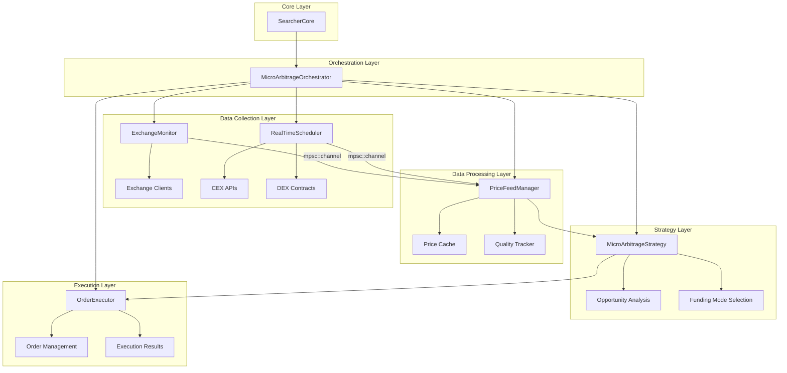
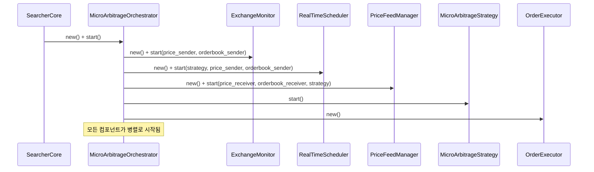
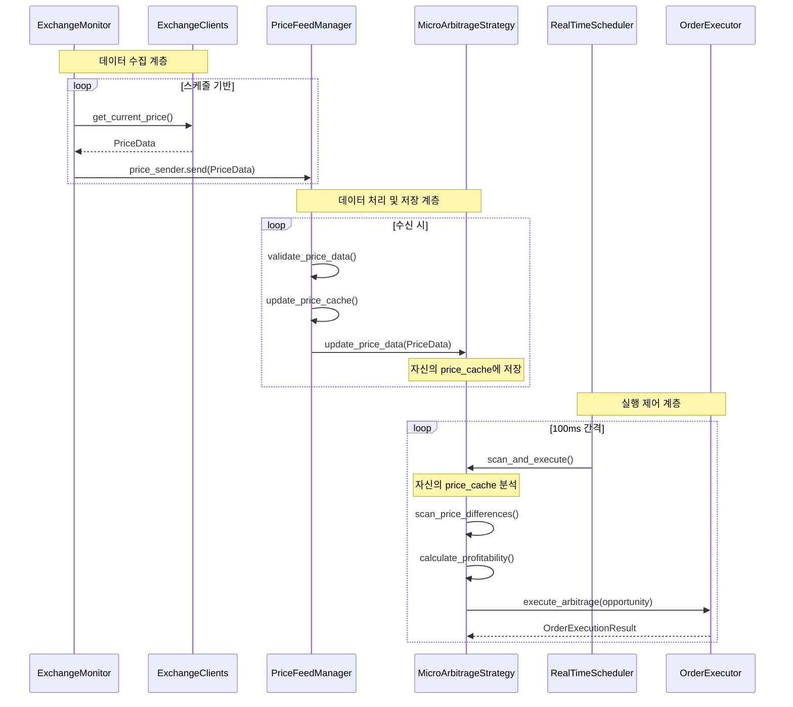
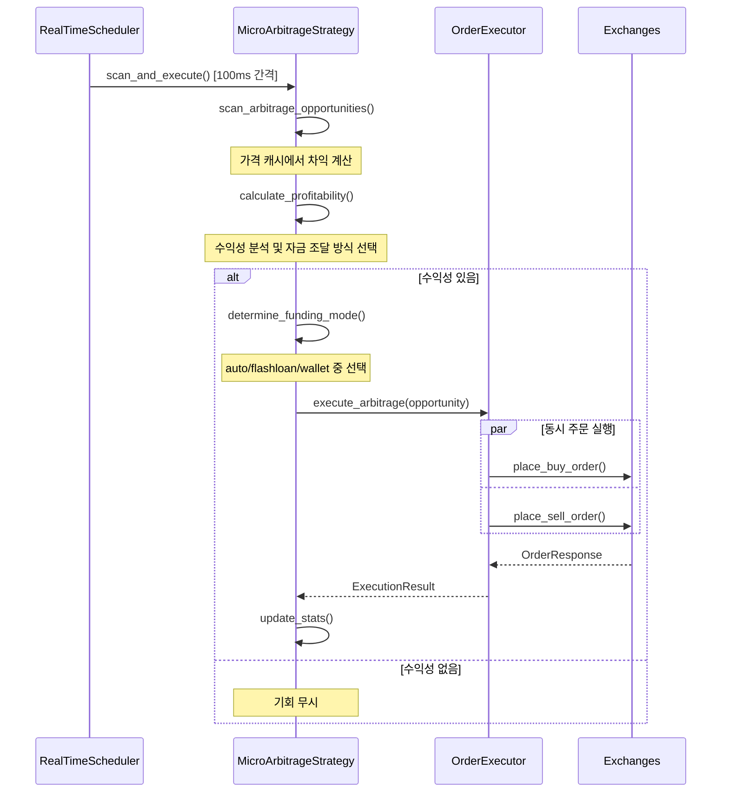

# 🔄 마이크로 아비트라지 시스템 아키텍처 (v2.0)

## 📋 개요

xCrack의 마이크로 아비트라지 시스템은 6개의 핵심 컴포넌트가 협력하여 초단타 차익거래를 실현하는 복합 시스템입니다. 본 문서는 각 컴포넌트의 역할과 상호 작용을 실제 코드와 함께 상세히 설명합니다.

## 🎯 시스템 구성 요소

### 핵심 6대 컴포넌트
1. **SearcherCore**: 최상위 조정자 및 생명주기 관리자
2. **MicroArbitrageOrchestrator**: 마이크로 아비트라지 전용 조정자
3. **RealTimeScheduler**: 다층 시간 기반 스케줄링 엔진
4. **ExchangeMonitor**: 거래소 모니터링 및 데이터 수집
5. **PriceFeedManager**: 데이터 품질 관리 및 캐싱 계층
6. **MicroArbitrageStrategy**: 차익거래 분석 및 실행 전략
7. **OrderExecutor**: 초고속 주문 실행 시스템

## 🏗️ 전체 시스템 아키텍처



## 📊 컴포넌트별 상세 분석

### 1. 🎛️ SearcherCore (최상위 조정자)

**역할**: 전체 시스템의 생명주기 관리 및 최상위 조정

**위치**: `src/core/searcher_core.rs`

**핵심 기능**:
- 모든 하위 시스템의 초기화 및 시작
- 마이크로 아비트라지 오케스트레이터 생성 및 관리
- 시스템 상태 모니터링 및 보고

**초기화 코드**:
```rust
// src/core/searcher_core.rs:76-98
let micro_arbitrage_orchestrator = if config.strategies.micro_arbitrage.enabled {
    info!("🎼 마이크로아비트래지 시스템 초기화 중...");
    
    // 타입 안전한 핸들로 직접 가져오기
    if let Some(micro_strategy) = strategy_manager.get_micro_arbitrage_strategy() {
        match MicroArbitrageOrchestrator::new(Arc::clone(&config), micro_strategy).await {
            Ok(orchestrator) => {
                info!("✅ 마이크로아비트래지 오케스트레이터 초기화 완료");
                Some(Arc::new(Mutex::new(orchestrator)))
            }
            Err(e) => {
                error!("❌ 마이크로아비트래지 오케스트레이터 초기화 실패: {}", e);
                None
            }
        }
    } else {
        warn!("⚠️ 마이크로아비트래지 전략을 찾을 수 없음");
        None
    }
} else {
    None
};
```

**컴포넌트 구조**:
```rust
// src/core/searcher_core.rs:32-51
pub struct SearcherCore {
    config: Arc<Config>,
    provider: Arc<Provider<Ws>>,
    is_running: Arc<AtomicBool>,
    metrics: Arc<RwLock<PerformanceMetrics>>,
    
    // 핵심 컴포넌트들
    pub(crate) strategy_manager: Arc<StrategyManager>,
    bundle_manager: Arc<BundleManager>,
    mempool_monitor: Arc<CoreMempoolMonitor>,
    performance_tracker: Arc<PerformanceTracker>,
    
    // 마이크로아비트래지 시스템 (옵셔널)
    micro_arbitrage_orchestrator: Option<Arc<Mutex<MicroArbitrageOrchestrator>>>,
    
    // 통신 채널들
    tx_sender: Option<mpsc::UnboundedSender<Transaction>>,
    opportunity_sender: Option<mpsc::UnboundedSender<Opportunity>>,
    bundle_sender: Option<mpsc::UnboundedSender<Bundle>>,
}
```

### 2. 🎼 MicroArbitrageOrchestrator (전용 조정자)

**역할**: 마이크로 아비트라지 컴포넌트들의 전용 조정자

**위치**: `src/core/micro_arbitrage_orchestrator.rs`

**핵심 기능**:
- 데이터 수집, 처리, 전략 실행의 전체 파이프라인 관리
- mpsc 채널을 통한 컴포넌트 간 데이터 플로우 조율
- 성능 모니터링 및 헬스 체크

**시작 프로세스**:
```rust
// src/core/micro_arbitrage_orchestrator.rs:62-132
pub async fn start(&self) -> Result<()> {
    info!("🚀 마이크로아비트래지 시스템 시작 중...");
    self.is_running.store(true, Ordering::SeqCst);
    
    // 데이터 플로우 채널 생성
    let (price_sender, price_receiver) = mpsc::unbounded_channel::<PriceData>();
    let (orderbook_sender, orderbook_receiver) = mpsc::unbounded_channel::<OrderBookSnapshot>();
    
    // 1. 거래소 모니터 시작
    info!("📡 거래소 모니터링 시작...");
    let mut exchange_monitor = ExchangeMonitor::new(Arc::clone(&self.config));
    exchange_monitor.start(price_sender, orderbook_sender).await?;
    
    // 2. 가격 피드 매니저 시작
    info!("📊 가격 피드 매니저 시작...");
    let mut price_feed_manager = PriceFeedManager::new(Arc::clone(&self.config));
    price_feed_manager.start(
        price_receiver,
        orderbook_receiver,
        Arc::clone(&self.micro_arbitrage_strategy),
    ).await?;
    
    // 3. 마이크로아비트래지 전략 시작
    info!("⚡ 마이크로아비트래지 전략 시작...");
    (*self.micro_arbitrage_strategy).start().await?;
    
    // 4. 실시간 스케줄러 시작 (새로운 고성능 스캔 시스템)
    info!("⏰ 실시간 스케줄러 시작...");
    let mut scheduler = RealTimeScheduler::new(Arc::clone(&self.config));
    
    // 새로운 채널 생성 (스케줄러 전용)
    let (scheduler_price_sender, scheduler_price_receiver) = mpsc::unbounded_channel::<PriceData>();
    let (scheduler_orderbook_sender, scheduler_orderbook_receiver) = mpsc::unbounded_channel::<OrderBookSnapshot>();
    
    // 실시간 스케줄러 시작
    scheduler.start(
        Arc::clone(&self.micro_arbitrage_strategy),
        scheduler_price_sender,
        scheduler_orderbook_sender,
    ).await?;
    
    // 가격 피드 매니저를 스케줄러의 데이터 수신자로 연결
    let mut price_feed_manager = PriceFeedManager::new(Arc::clone(&self.config));
    price_feed_manager.start(
        scheduler_price_receiver,
        scheduler_orderbook_receiver,
        Arc::clone(&self.micro_arbitrage_strategy),
    ).await?;
    
    info!("✅ 마이크로아비트래지 시스템 시작 완료");
    Ok(())
}
```

**컴포넌트 구조**:
```rust
// src/core/micro_arbitrage_orchestrator.rs:17-27
pub struct MicroArbitrageOrchestrator {
    config: Arc<Config>,
    is_running: Arc<AtomicBool>,
    
    // 핵심 컴포넌트들
    exchange_monitor: Arc<ExchangeMonitor>,
    _price_feed_manager: Arc<PriceFeedManager>,
    _real_time_scheduler: Option<RealTimeScheduler>,
    micro_arbitrage_strategy: Arc<MicroArbitrageStrategy>,
    order_executor: Arc<OrderExecutor>,
}
```

### 3. ⏰ RealTimeScheduler (실행 타이밍 제어자)

**역할**: 적절한 타이밍에 MicroArbitrageStrategy에게 "니가 보관하고 있는 데이터를 이제 분석해라" 명령하는 타이밍 제어 전담 컴포넌트

**위치**: `src/exchange/real_time_scheduler.rs`

**핵심 특징**:
- **실행 타이밍**: 100ms 간격으로 `scan_and_execute()` 호출 (`scan_interval_ms`)
- **전략 제어**: MicroArbitrageStrategy의 분석 및 실행을 시간 기반으로 트리거
- **독립적 역할**: 데이터 수집은 하지 않고, 순수하게 실행 타이밍만 제어
- **고정밀 스케줄링**: 밀리초 단위 정확한 타이밍 보장

**시작 프로세스**:
```rust
// src/exchange/real_time_scheduler.rs:82-117
pub async fn start(
    &mut self,
    micro_arbitrage_strategy: Arc<MicroArbitrageStrategy>,
    price_sender: mpsc::UnboundedSender<PriceData>,
    orderbook_sender: mpsc::UnboundedSender<OrderBookSnapshot>,
) -> Result<()> {
    info!("⏰ 실시간 스캔 스케줄러 시작");
    info!("  📊 스캔 간격: {}ms", self.scan_interval_ms);
    info!("  📈 가격 업데이트 간격: {}ms", self.price_update_interval_ms);
    
    self.micro_arbitrage_strategy = Some(micro_arbitrage_strategy);
    self.price_sender = Some(price_sender);
    self.orderbook_sender = Some(orderbook_sender);
    
    // 거래소 클라이언트들 초기화
    self.initialize_exchange_clients().await?;
    
    self.is_running.store(true, Ordering::SeqCst);
    
    // 실시간 가격 피드 태스크 시작
    self.start_price_feed_tasks().await?;
    
    // 스캔 스케줄러 태스크 시작
    self.start_scan_scheduler_task().await?;
    
    // 통계 업데이트 태스크 시작
    self.start_stats_update_task().await;
    
    info!("✅ 실시간 스캔 스케줄러 시작 완료");
    Ok(())
}
```

**스캔 스케줄러 태스크**:
```rust
// src/exchange/real_time_scheduler.rs:221-264
async fn start_scan_scheduler_task(&self) -> Result<()> {
    let is_running = Arc::clone(&self.is_running);
    let strategy = self.micro_arbitrage_strategy.as_ref().unwrap().clone();
    let stats = Arc::clone(&self.stats);
    let scan_interval_ms = self.scan_interval_ms;
    
    tokio::spawn(async move {
        info!("⚡ 스캔 스케줄러 태스크 시작 ({}ms 간격)", scan_interval_ms);
        
        let mut scan_interval = interval(Duration::from_millis(scan_interval_ms));
        
        while is_running.load(Ordering::SeqCst) {
            scan_interval.tick().await;
            
            let scan_start = Instant::now();
            
            // 마이크로 아비트래지 스캔 및 실행
            match strategy.scan_and_execute().await {
                Ok(executed_count) => {
                    let scan_time = scan_start.elapsed();
                    
                    // 통계 업데이트
                    Self::update_scan_stats(&stats, scan_time, true, executed_count).await;
                    
                    if executed_count > 0 {
                        debug!("⚡ 스캔 완료: {}개 기회 실행 ({:.2}ms)", executed_count, scan_time.as_millis());
                    }
                }
                Err(e) => {
                    let scan_time = scan_start.elapsed();
                    error!("💥 스캔 실행 실패: {} ({:.2}ms)", e, scan_time.as_millis());
                    
                    // 실패 통계 업데이트
                    Self::update_scan_stats(&stats, scan_time, false, 0).await;
                }
            }
        }
        
        info!("⚡ 스캔 스케줄러 태스크 종료");
    });
    
    Ok(())
}
```

**컴포넌트 구조**:
```rust
// src/exchange/real_time_scheduler.rs:22-43
pub struct RealTimeScheduler {
    config: Arc<Config>,
    is_running: Arc<AtomicBool>,
    
    // 전략 참조
    micro_arbitrage_strategy: Option<Arc<MicroArbitrageStrategy>>,
    
    // 거래소 클라이언트들
    exchange_clients: Vec<Arc<dyn ExchangeClient>>,
    
    // 스캔 설정
    scan_interval_ms: u64,
    price_update_interval_ms: u64,
    
    // 데이터 전송 채널
    price_sender: Option<mpsc::UnboundedSender<PriceData>>,
    orderbook_sender: Option<mpsc::UnboundedSender<OrderBookSnapshot>>,
    
    // 통계
    stats: Arc<RwLock<SchedulerStats>>,
}
```

### 4. 🔍 ExchangeMonitor (거래소 데이터 수집자)

**역할**: 정해진 스케줄에 따라 각종 CEX/DEX에서 데이터를 모아서 전송하는 데이터 수집 전담 컴포넌트

**위치**: `src/exchange/monitor.rs`

**핵심 기능**:
- **데이터 수집**: 다중 거래소에서 가격/오더북 데이터 수집
- **연결 관리**: 거래소별 연결 상태 추적 및 장애 감지  
- **데이터 전송**: mpsc 채널을 통해 PriceFeedManager로 데이터 전송
- **품질 보장**: 수집된 데이터의 기본 무결성 검증

**시작 프로세스**:
```rust
// src/exchange/monitor.rs:112-145
pub async fn start(
    &mut self,
    price_sender: mpsc::UnboundedSender<PriceData>,
    orderbook_sender: mpsc::UnboundedSender<OrderBookSnapshot>,
) -> Result<()> {
    if self.is_running.load(Ordering::SeqCst) {
        return Err(anyhow!("ExchangeMonitor is already running"));
    }
    
    self.price_sender = Some(price_sender);
    self.orderbook_sender = Some(orderbook_sender);
    
    info!("🔍 거래소 모니터링 시작");
    info!("  📊 모니터링 대상: {}개 거래소", self.config.strategies.micro_arbitrage.exchanges.len());
    info!("  💱 거래 페어: {}개", self.config.strategies.micro_arbitrage.trading_pairs.len());
    
    self.is_running.store(true, Ordering::SeqCst);
    
    // 각 거래소별 모니터링 태스크 시작
    for exchange_config in &self.config.strategies.micro_arbitrage.exchanges {
        if exchange_config.enabled {
            self.start_exchange_monitoring(exchange_config.clone()).await?;
        }
    }
    
    // 통계 업데이트 태스크 시작
    self.start_stats_updater().await;
    
    // 연결 상태 모니터링 태스크 시작
    self.start_health_monitor().await;
    
    info!("✅ 거래소 모니터링 시작 완료");
    Ok(())
}
```

**컴포넌트 구조**:
```rust
// src/exchange/monitor.rs:46-59
pub struct ExchangeMonitor {
    config: Arc<Config>,
    is_running: Arc<AtomicBool>,
    
    // 데이터 전송 채널들
    price_sender: Option<mpsc::UnboundedSender<PriceData>>,
    orderbook_sender: Option<mpsc::UnboundedSender<OrderBookSnapshot>>,
    
    // 거래소별 연결 상태
    connection_status: Arc<tokio::sync::Mutex<HashMap<String, ConnectionStatus>>>,
    
    // 모니터링 통계
    stats: Arc<tokio::sync::Mutex<MonitoringStats>>,
}
```

### 5. 📡 PriceFeedManager (데이터 브릿지)

**역할**: ExchangeMonitor에서 받은 데이터를 검증하고 MicroArbitrageStrategy의 캐시에 전달하는 데이터 브릿지

**위치**: `src/exchange/price_feed_manager.rs`

**핵심 기능**:
- **데이터 수신**: ExchangeMonitor가 보낸 데이터를 mpsc 채널로 수신
- **품질 검증**: 실시간 데이터 검증 (가격 범위, 스프레드, 시간 유효성)
- **캐시 업데이트**: 검증된 데이터를 MicroArbitrageStrategy.update_price_data() 호출로 전달
- **품질 관리**: 품질 점수 추적 및 거래소별 신뢰도 관리

**시작 프로세스**:
```rust
// src/exchange/price_feed_manager.rs:107-145
pub async fn start(
    &mut self,
    price_receiver: mpsc::UnboundedReceiver<PriceData>,
    orderbook_receiver: mpsc::UnboundedReceiver<OrderBookSnapshot>,
    micro_arbitrage_strategy: Arc<MicroArbitrageStrategy>,
) -> Result<()> {
    if self.is_running.load(Ordering::SeqCst) {
        return Err(anyhow!("PriceFeedManager is already running"));
    }
    
    self.price_receiver = Some(price_receiver);
    self.orderbook_receiver = Some(orderbook_receiver);
    self.micro_arbitrage_strategy = Some(micro_arbitrage_strategy);
    
    info!("📡 가격 피드 매니저 시작");
    
    self.is_running.store(true, Ordering::SeqCst);
    
    // 데이터 품질 추적기 초기화
    self.initialize_data_quality_tracker().await;
    
    // 가격 데이터 처리 태스크 시작
    self.start_price_data_processor().await?;
    
    // 오더북 데이터 처리 태스크 시작
    self.start_orderbook_data_processor().await?;
    
    // 데이터 품질 모니터링 태스크 시작
    self.start_data_quality_monitor().await;
    
    // 캐시 정리 태스크 시작
    self.start_cache_cleanup_task().await;
    
    // 통계 업데이트 태스크 시작
    self.start_stats_updater().await;
    
    info!("✅ 가격 피드 매니저 시작 완료");
    Ok(())
}
```

**데이터 검증 로직**:
```rust
// src/exchange/price_feed_manager.rs:299-329
async fn validate_price_data(price_data: &PriceData) -> Result<bool> {
    // 기본 유효성 검사
    if price_data.bid <= Decimal::ZERO || price_data.ask <= Decimal::ZERO {
        return Ok(false);
    }
    
    // 스프레드 검사 (bid >= ask는 비정상)
    if price_data.bid >= price_data.ask {
        return Ok(false);
    }
    
    // 시간 검사 (너무 오래된 데이터 제외)
    let age = Utc::now() - price_data.timestamp;
    if age.num_seconds() > 10 {
        return Ok(false);
    }
    
    // 가격 범위 검사 (너무 극단적인 값 제외)
    let price_f64 = price_data.last_price.to_f64().unwrap_or(0.0);
    if price_f64 < 0.001 || price_f64 > 1_000_000.0 {
        return Ok(false);
    }
    
    // 스프레드 비율 검사 (50% 이상 스프레드는 비정상)
    let spread_ratio = ((price_data.ask - price_data.bid) / price_data.last_price).to_f64().unwrap_or(0.0);
    if spread_ratio > 0.5 {
        return Ok(false);
    }
    
    Ok(true)
}
```

**컴포넌트 구조**:
```rust
// src/exchange/price_feed_manager.rs:22-42
pub struct PriceFeedManager {
    config: Arc<Config>,
    is_running: Arc<AtomicBool>,
    
    // 데이터 수신 채널들
    price_receiver: Option<mpsc::UnboundedReceiver<PriceData>>,
    orderbook_receiver: Option<mpsc::UnboundedReceiver<OrderBookSnapshot>>,
    
    // 전략 참조
    micro_arbitrage_strategy: Option<Arc<MicroArbitrageStrategy>>,
    
    // 데이터 캐시 (최신 가격 정보)
    price_cache: Arc<RwLock<HashMap<String, HashMap<String, PriceData>>>>, // exchange -> symbol -> price
    orderbook_cache: Arc<RwLock<HashMap<String, HashMap<String, OrderBookSnapshot>>>>, // exchange -> symbol -> orderbook
    
    // 데이터 품질 관리
    data_quality_tracker: Arc<RwLock<DataQualityTracker>>,
    
    // 성능 통계
    stats: Arc<RwLock<FeedManagerStats>>,
}
```

### 6. ⚡ MicroArbitrageStrategy (데이터 보관 및 차익거래 분석자)

**역할**: PriceFeedManager가 전송한 데이터를 보관하고, RealTimeScheduler의 명령에 따라 저장된 데이터를 분석하여 차익거래를 실행

**위치**: `src/strategies/micro_arbitrage.rs`

**핵심 기능**:
- **데이터 저장**: PriceFeedManager로부터 받은 데이터를 price_cache에 보관
- **기회 분석**: 저장된 데이터를 바탕으로 거래소 간 가격 차이 분석
- **자금 조달**: 자동 선택 (auto/flashloan/wallet)
- **실행 결정**: 수익성 계산 및 실행 여부 결정

**핵심 데이터 구조** (가격 데이터 저장소):
```rust
// src/strategies/micro_arbitrage.rs:599-603
pub struct MicroArbitrageStrategy {
    // 실시간 가격 데이터 캐시 (거래소별, 심볼별)
    price_cache: Arc<Mutex<HashMap<String, HashMap<String, PriceData>>>>,
    
    // 오더북 캐시
    orderbook_cache: Arc<Mutex<HashMap<String, HashMap<String, OrderBookSnapshot>>>>,
}
```

**데이터 업데이트 인터페이스** (PriceFeedManager가 호출):
```rust
// PriceFeedManager에서 호출하는 메서드들
impl MicroArbitrageStrategy {
    /// 가격 데이터 업데이트 (PriceFeedManager로부터 호출)
    pub async fn update_price_data(&self, price_data: PriceData) -> Result<()> {
        let mut cache = self.price_cache.lock().await;
        let exchange_cache = cache.entry(price_data.exchange.clone()).or_insert_with(HashMap::new);
        exchange_cache.insert(price_data.symbol.clone(), price_data);
        Ok(())
    }
    
    /// 오더북 데이터 업데이트 (PriceFeedManager로부터 호출)  
    pub async fn update_orderbook_data(&self, orderbook_data: OrderBookSnapshot) -> Result<()> {
        let mut cache = self.orderbook_cache.lock().await;
        let exchange_cache = cache.entry(orderbook_data.exchange.clone()).or_insert_with(HashMap::new);
        exchange_cache.insert(orderbook_data.symbol.clone(), orderbook_data);
        Ok(())
    }
}
```

**분석 및 실행 인터페이스** (RealTimeScheduler가 호출):
```rust
// RealTimeScheduler에서 호출하는 메서드
impl MicroArbitrageStrategy {
    /// 자신의 캐시 데이터를 분석하여 차익거래 기회를 찾고 실행
    pub async fn scan_and_execute(&self) -> Result<usize> {
        // 자신의 price_cache에서 데이터 읽어서 분석
        let opportunities = self.scan_price_differences().await?;
        
        // 수익성 있는 기회들 실행
        let mut executed_count = 0;
        for opportunity in opportunities {
            if self.execute_arbitrage_opportunity(&opportunity).await.is_ok() {
                executed_count += 1;
            }
        }
        Ok(executed_count)
    }
    
    /// 거래소간 가격 차이 스캔 (자신의 캐시 사용)
    async fn scan_price_differences(&self) -> Result<Vec<MicroArbitrageOpportunity>> {
        let price_cache = self.price_cache.lock().await;  // 자신의 캐시 읽기
        // 캐시된 데이터로 차익거래 기회 분석
    }
}
```

**자금 조달 방식 선택**:
```rust
// src/strategies/micro_arbitrage.rs:187-197
async fn determine_funding_mode(
    &self,
    opportunity: &MicroArbitrageOpportunity,
) -> Result<(String, FundingMetrics)> {
    match self.funding_mode.as_str() {
        "flashloan" => Ok(("flashloan".to_string(), self.calculate_flashloan_metrics(opportunity).await?)),
        "wallet" => Ok(("wallet".to_string(), self.calculate_wallet_metrics(opportunity).await?)),
        "auto" | _ => self.auto_select_funding_mode(opportunity).await,
    }
}
```

**컴포넌트 구조**:
```rust
// src/strategies/micro_arbitrage.rs:51-88
pub struct MicroArbitrageStrategy {
    config: Arc<Config>,
    provider: Arc<Provider<Ws>>,
    enabled: Arc<AtomicBool>,
    
    // 거래소 정보
    exchanges: HashMap<String, ExchangeInfo>,
    
    // 실시간 가격 데이터 캐시 (거래소별, 심볼별)
    price_cache: Arc<Mutex<HashMap<String, HashMap<String, PriceData>>>>,
    
    // 오더북 캐시
    orderbook_cache: Arc<Mutex<HashMap<String, HashMap<String, OrderBookSnapshot>>>>,
    
    // 활성 거래 추적
    active_trades: Arc<Mutex<HashMap<String, MicroArbitrageOpportunity>>>,
    
    // 성능 통계
    stats: Arc<Mutex<MicroArbitrageStats>>,
    
    // 수익률 임계값
    min_profit_percentage: f64,
    min_profit_usd: Decimal,
    
    // 실행 매개변수
    execution_timeout_ms: u64,
    max_concurrent_trades: usize,
    latency_threshold_ms: u64,
    
    // 위험 관리
    daily_volume_limit: U256,
    risk_limit_per_trade: U256,
    
    // 자금 조달 모드 설정
    funding_mode: String, // "auto", "flashloan", "wallet"
}
```

### 7. 🎯 OrderExecutor (주문 실행자)

**역할**: 초고속 주문 실행 및 결과 추적

**위치**: `src/exchange/order_executor.rs`

**핵심 기능**:
- 다중 거래소 동시 주문 실행
- 타임아웃 관리 및 실패 처리
- 실행 통계 및 성능 추적

**컴포넌트 구조**:
```rust
// src/exchange/order_executor.rs:91-100+
pub struct OrderExecutor {
    config: Arc<Config>,
    is_running: Arc<AtomicBool>,
    
    // 거래소별 연결 정보
    exchange_clients: HashMap<String, Arc<dyn ExchangeClient>>,
    // 거래소 설정 조회용 메타
    exchange_config_by_name: HashMap<String, ExchangeConfig>,
    
    // 동시 실행 제한
    // ... 더 많은 필드들
}
```

## 🔄 데이터 플로우 및 호출 관계

### 1. 시스템 시작 시퀀스



### 2. 실시간 데이터 플로우



### 3. 차익거래 실행 플로우



## 📊 성능 특성 및 최적화

### 타이밍 특성
- **가격 업데이트**: 10ms 간격 (100Hz)
- **기회 스캔**: 100ms 간격 (10Hz)
- **데이터 검증**: <1ms
- **주문 실행**: <50ms 목표

### 처리량 특성
- **가격 데이터**: 초당 수천 건 처리
- **필터링율**: 20-30% (품질 낮은 데이터 제외)
- **캐시 히트율**: 90%+
- **동시 거래**: 최대 10개 (설정 가능)

### 메모리 사용 패턴
- **가격 캐시**: 거래소별 × 심볼별 구조
- **오더북 캐시**: 깊이 10레벨, 5분 TTL
- **통계 데이터**: 실시간 집계 및 주기적 업데이트

## 🔧 설정 및 튜닝

### 주요 설정 파라미터
```toml
[strategies.micro_arbitrage]
enabled = true
min_profit_percentage = 0.002  # 0.2%
execution_timeout_ms = 5000
max_concurrent_trades = 10
price_update_interval_ms = 10  # 10ms
latency_threshold_ms = 100
funding_mode = "auto"  # auto/flashloan/wallet

[[strategies.micro_arbitrage.exchanges]]
name = "binance"
enabled = true
exchange_type = "CEX"
fee_percentage = 0.001
```

### 성능 튜닝 가이드
1. **지연시간 최적화**: `price_update_interval_ms` 조정
2. **처리량 최적화**: `max_concurrent_trades` 증가
3. **수익성 조정**: `min_profit_percentage` 미세 조정
4. **안정성 확보**: `latency_threshold_ms` 보수적 설정

## 🎯 결론

xCrack의 마이크로 아비트라지 시스템은 6개 핵심 컴포넌트가 유기적으로 협력하여:

1. **고빈도 데이터 수집** (RealTimeScheduler, ExchangeMonitor)
2. **지능형 데이터 처리** (PriceFeedManager)
3. **정교한 기회 분석** (MicroArbitrageStrategy)
4. **초고속 실행** (OrderExecutor)
5. **통합 관리** (SearcherCore, MicroArbitrageOrchestrator)

이를 통해 밀리초 단위의 시장 비효율성을 포착하여 안정적인 수익을 창출합니다. 

각 컴포넌트는 독립적으로 최적화 가능하며, mpsc 채널을 통한 비동기 통신으로 고성능을 보장합니다.

---

**버전**: v2.0 | **작성일**: 2025.01 | **기준 코드베이스**: xCrack v0.2.0