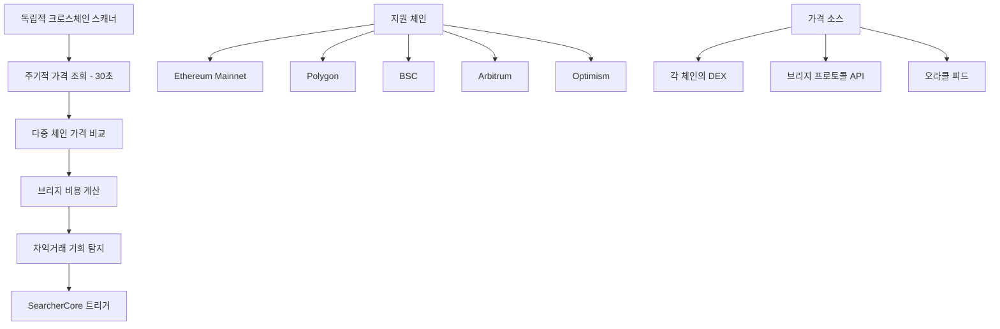
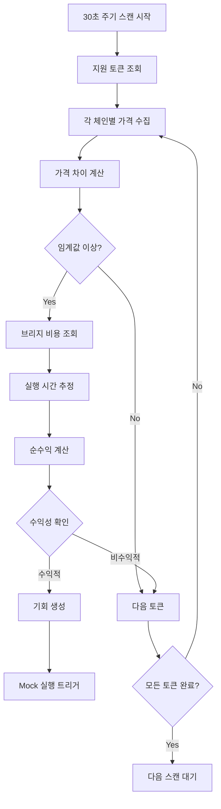
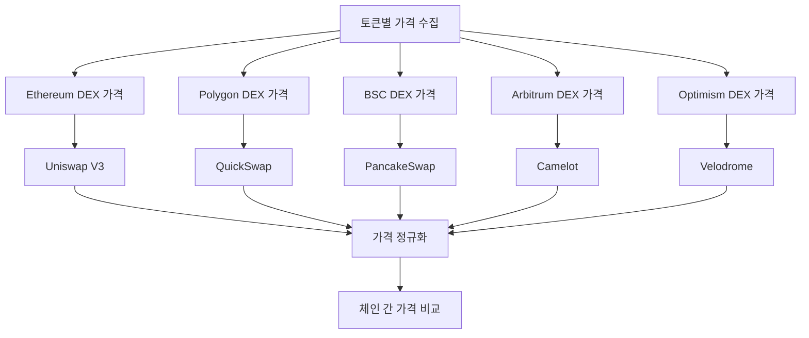
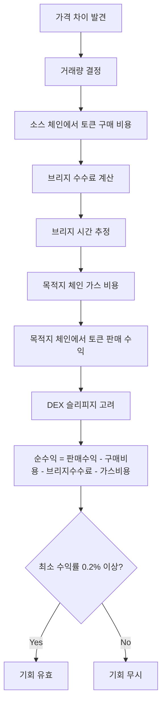
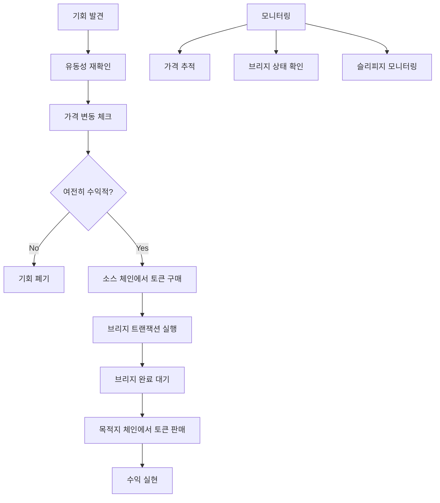

# xCrack v2.0 - Cross-Chain Arbitrage 전략 기회 탐지 시스템

## 개요

Cross-Chain Arbitrage 전략은 서로 다른 블록체인 네트워크 간의 토큰 가격 차이를 이용하여 차익거래를 수행하는 MEV 전략입니다. 멤풀 트랜잭션에 의존하지 않고 독립적인 가격 스캔 시스템을 운영합니다.

## 데이터 소스 및 정보 획득

### 1. 정보 획득 방식 (멤풀 독립적)



### 2. 핵심 데이터 구조

```rust
// src/strategies/cross_chain_arbitrage.rs 구조
pub struct CrossChainArbitrageStrategy {
    config: Arc<Config>,
    enabled: Arc<AtomicBool>,
    
    // 지원 체인 및 토큰
    supported_chains: Vec<ChainId>,
    tokens_registry: Arc<RwLock<HashMap<String, CrossChainToken>>>,
    
    // 브리지 프로토콜
    bridge_protocols: HashMap<BridgeProtocol, BridgeConfig>,
    
    // 활성 기회 및 거래
    active_opportunities: Arc<RwLock<HashMap<String, CrossChainArbitrageOpportunity>>>,
    active_trades: Arc<Mutex<HashMap<String, CrossChainTrade>>>,
    
    // 성능 메트릭
    performance_metrics: Arc<RwLock<CrossChainMetrics>>,
}
```

### 3. 지원 체인 및 브리지

```rust
#[derive(Debug, Clone, Copy, PartialEq, Eq, Hash)]
pub enum ChainId {
    Ethereum = 1,
    Polygon = 137,
    BSC = 56,
    Arbitrum = 42161,
    Optimism = 10,
}

#[derive(Debug, Clone)]
pub enum BridgeProtocol {
    Stargate,    // LayerZero 기반
    Hop,         // Hop Protocol
    Multichain,  // Multichain (구 AnySwap)
    LiFi,        // LiFi 통합 라우터
}
```

### 4. 토큰 레지스트리

```rust
#[derive(Debug, Clone)]
pub struct CrossChainToken {
    pub symbol: String,
    pub name: String,
    pub decimals: u8,
    pub addresses: HashMap<ChainId, alloy::primitives::Address>,
    pub is_native: bool,
    pub bridge_support: Vec<BridgeProtocol>,
}
```

## 기회 탐지 프로세스 (트랜잭션 독립적)

### 1. 전체 탐지 플로우



### 2. 핵심 스캔 함수

```rust
// src/strategies/cross_chain_arbitrage.rs:259-284
pub async fn scan_opportunities(&self) -> Result<Vec<CrossChainArbitrageOpportunity>> {
    debug!("🔍 크로스체인 기회 스캔 시작");
    
    let opportunities = if std::env::var("API_MODE").unwrap_or_default() == "mock" {
        // Mock 모드: 시뮬레이션 데이터 사용
        let active = self.active_opportunities.read().unwrap();
        active
            .values()
            .filter(|opp| opp.is_valid())
            .cloned()
            .collect()
    } else {
        // 실제 모드: 실시간 브리지 스캔
        self.scan_real_bridge_opportunities().await?
    };
        
    info!("🎯 발견한 크로스체인 기회: {} 개", opportunities.len());
    
    // 성능 메트릭 업데이트
    {
        let mut metrics = self.performance_metrics.write().unwrap();
        metrics.total_opportunities_found += opportunities.len() as u64;
    }
    
    Ok(opportunities)
}
```

### 3. 실제 브리지 기회 스캔

```rust
// src/strategies/cross_chain_arbitrage.rs:333-349
pub async fn scan_real_bridge_opportunities(&self) -> Result<Vec<CrossChainArbitrageOpportunity>> {
    debug!("🔍 실제 브리지를 통한 크로스체인 기회 스캔 시작");
    
    let tokens = {
        let tokens_guard = self.tokens_registry.read().unwrap();
        tokens_guard.values().cloned().collect::<Vec<_>>()
    };
    let mut opportunities = Vec::new();
    
    for token in tokens.iter() {
        // 모든 가능한 체인 조합에서 기회 탐색
        for &source_chain in &self.supported_chains {
            for &dest_chain in &self.supported_chains {
                if source_chain == dest_chain {
                    continue;
                }
                
                // 가격 차이 및 수익성 계산
                if let Ok(opportunity) = self.calculate_arbitrage_opportunity(
                    token, source_chain, dest_chain
                ).await {
                    opportunities.push(opportunity);
                }
            }
        }
    }
    
    Ok(opportunities)
}
```

## 가격 수집 및 차이 계산

### 1. 다중 체인 가격 수집



### 2. 가격 수집 구현

```rust
// 체인별 토큰 가격 수집
async fn get_token_price_on_chain(&self, token: &CrossChainToken, chain: ChainId) -> Result<f64> {
    // 1. 해당 체인의 토큰 주소 조회
    let token_address = token.addresses.get(&chain)
        .ok_or_else(|| anyhow!("Token not available on chain {:?}", chain))?;
    
    // 2. 체인별 주요 DEX에서 가격 조회
    let price = match chain {
        ChainId::Ethereum => {
            // Uniswap V3에서 USDC 페어 가격 조회
            self.get_uniswap_v3_price(*token_address, self.usdc_address(chain)).await?
        }
        ChainId::Polygon => {
            // QuickSwap에서 가격 조회
            self.get_quickswap_price(*token_address, self.usdc_address(chain)).await?
        }
        ChainId::BSC => {
            // PancakeSwap에서 가격 조회
            self.get_pancakeswap_price(*token_address, self.usdt_address(chain)).await?
        }
        ChainId::Arbitrum => {
            // Camelot에서 가격 조회
            self.get_camelot_price(*token_address, self.usdc_address(chain)).await?
        }
        ChainId::Optimism => {
            // Velodrome에서 가격 조회
            self.get_velodrome_price(*token_address, self.usdc_address(chain)).await?
        }
    };
    
    Ok(price)
}
```

### 3. Mock 기회 생성 (개발/테스트용)

```rust
// src/strategies/cross_chain_arbitrage.rs:202-256
async fn generate_mock_opportunities(&self) -> Result<()> {
    let tokens = self.tokens_registry.read().unwrap();
    let mut opportunities = self.active_opportunities.write().unwrap();
    
    // USDC 크로스체인 기회 시뮬레이션
    if let Some(usdc_token) = tokens.get("USDC") {
        let opportunity = CrossChainArbitrageOpportunity {
            id: Uuid::new_v4().to_string(),
            token: usdc_token.clone(),
            source_chain: ChainId::Polygon, // Polygon에서 저렴
            dest_chain: ChainId::Ethereum,  // Ethereum에서 비쌈
            source_price: 0.998, // $0.998
            dest_price: 1.003,   // $1.003
            price_diff_percent: 0.50, // 0.5% 차이
            amount: U256::from(10000_000000u64), // 10,000 USDC
            bridge_protocol: BridgeProtocol::Stargate,
            bridge_cost: U256::from(5_000000u64), // $5 브리지 비용
            total_gas_cost: U256::from(15_000000u64), // $15 가스 비용
            expected_profit: U256::from(30_000000u64), // $30 예상 수익
            profit_percent: 0.30, // 0.3% 수익률
            estimated_time: 300, // 5분
            confidence: 0.85, // 85% 신뢰도
            discovered_at: Utc::now(),
            expires_at: Utc::now() + Duration::minutes(10),
        };
        
        opportunities.insert(opportunity.id.clone(), opportunity);
    }
    
    Ok(())
}
```

## 차익거래 수익성 계산

### 1. 수익성 계산 모델



### 2. 차익거래 기회 계산

```rust
// 차익거래 기회 계산 구현
async fn calculate_arbitrage_opportunity(
    &self, 
    token: &CrossChainToken, 
    source_chain: ChainId, 
    dest_chain: ChainId
) -> Result<CrossChainArbitrageOpportunity> {
    // 1. 각 체인에서 토큰 가격 조회
    let source_price = self.get_token_price_on_chain(token, source_chain).await?;
    let dest_price = self.get_token_price_on_chain(token, dest_chain).await?;
    
    // 2. 가격 차이 계산
    let price_diff = dest_price - source_price;
    let price_diff_percent = (price_diff / source_price) * 100.0;
    
    // 3. 최소 임계값 확인 (0.2%)
    if price_diff_percent < 0.2 {
        return Err(anyhow!("Price difference too small: {:.3}%", price_diff_percent));
    }
    
    // 4. 최적 거래량 계산 (유동성 고려)
    let optimal_amount = self.calculate_optimal_trade_size(
        token, source_chain, dest_chain, price_diff_percent
    ).await?;
    
    // 5. 브리지 비용 조회
    let bridge_protocol = self.select_optimal_bridge(token, source_chain, dest_chain).await?;
    let bridge_cost = self.get_bridge_cost(&bridge_protocol, token, optimal_amount).await?;
    
    // 6. 가스 비용 계산
    let source_gas_cost = self.estimate_gas_cost(source_chain, "buy").await?;
    let dest_gas_cost = self.estimate_gas_cost(dest_chain, "sell").await?;
    let total_gas_cost = source_gas_cost + dest_gas_cost;
    
    // 7. 총 수익 계산
    let gross_profit = optimal_amount * U256::from((price_diff * 1_000_000.0) as u64) / U256::from(1_000_000);
    let net_profit = gross_profit.saturating_sub(bridge_cost).saturating_sub(total_gas_cost);
    
    // 8. 수익률 재계산
    let final_profit_percent = net_profit.to::<u64>() as f64 / optimal_amount.to::<u64>() as f64 * 100.0;
    
    if final_profit_percent < 0.1 {
        return Err(anyhow!("Net profit too low after costs: {:.3}%", final_profit_percent));
    }
    
    // 9. 실행 시간 추정
    let estimated_time = self.estimate_execution_time(&bridge_protocol).await?;
    
    Ok(CrossChainArbitrageOpportunity {
        id: Uuid::new_v4().to_string(),
        token: token.clone(),
        source_chain,
        dest_chain,
        source_price,
        dest_price,
        price_diff_percent,
        amount: optimal_amount,
        bridge_protocol,
        bridge_cost,
        total_gas_cost,
        expected_profit: net_profit,
        profit_percent: final_profit_percent,
        estimated_time,
        confidence: self.calculate_confidence(price_diff_percent, estimated_time),
        discovered_at: Utc::now(),
        expires_at: Utc::now() + Duration::minutes(15),
        selected_dex_adapters: Vec::new(),
    })
}
```

## 브리지 프로토콜 선택 및 최적화

### 1. 브리지 프로토콜 비교

| 브리지 | 속도 | 비용 | 안정성 | 지원 체인 |
|---------|------|------|---------|-----------|
| **Stargate** | 3-5분 | 0.05-0.1% | 높음 | 주요 EVM 체인 |
| **Hop** | 5-15분 | 0.1-0.3% | 높음 | L2 중심 |
| **Multichain** | 2-10분 | 0.1-0.2% | 중간 | 광범위 |
| **LiFi** | 변동적 | 최적화됨 | 높음 | 통합 라우터 |

### 2. 최적 브리지 선택

```rust
// 최적 브리지 프로토콜 선택
async fn select_optimal_bridge(
    &self, 
    token: &CrossChainToken, 
    source_chain: ChainId, 
    dest_chain: ChainId
) -> Result<BridgeProtocol> {
    let mut bridge_options = Vec::new();
    
    // 1. 지원되는 브리지 프로토콜 필터링
    for &protocol in &token.bridge_support {
        if self.is_bridge_supported(protocol, source_chain, dest_chain) {
            let cost = self.get_bridge_cost(&protocol, token, U256::from(1000_000000u64)).await?;
            let time = self.estimate_execution_time(&protocol).await?;
            let reliability = self.get_bridge_reliability(&protocol);
            
            // 점수 계산 (비용 40%, 시간 30%, 안정성 30%)
            let score = (1.0 / cost.to::<u64>() as f64) * 0.4 + 
                       (1.0 / time as f64) * 0.3 + 
                       reliability * 0.3;
            
            bridge_options.push((protocol, score));
        }
    }
    
    // 2. 가장 높은 점수의 브리지 선택
    bridge_options.sort_by(|a, b| b.1.partial_cmp(&a.1).unwrap());
    
    bridge_options.first()
        .map(|(protocol, _)| *protocol)
        .ok_or_else(|| anyhow!("No suitable bridge found"))
}
```

## 실행 전략 및 리스크 관리

### 1. 실행 프로세스



### 2. Mock 실행 구현

```rust
// src/strategies/cross_chain_arbitrage.rs:287-330
pub async fn execute_cross_chain_trade_mock(&self, opportunity: &CrossChainArbitrageOpportunity) -> Result<bool> {
    info!("🚀 Mock 크로스체인 거래 실행 시작: {} -> {}", 
        opportunity.source_chain.name(),
        opportunity.dest_chain.name()
    );
    
    let trade = CrossChainTrade::new(opportunity.clone());
    let trade_id = trade.id.clone();
    
    {
        let mut active_trades = self.active_trades.lock().await;
        active_trades.insert(trade_id.clone(), trade);
    }
    
    // Mock 실행 시뮬레이션 (80% 성공률)
    let success = fastrand::f64() < self.mock_config.order_execution_success_rate;
    
    if success {
        info!("✅ Mock 크로스체인 거래 성공: ${:.2} 수익", 
            opportunity.expected_profit.to::<u64>() as f64 / 1_000000.0
        );
        
        // 성공 메트릭 업데이트
        let mut metrics = self.performance_metrics.write().unwrap();
        metrics.total_trades_executed += 1;
        metrics.successful_trades += 1;
        metrics.total_profit += opportunity.expected_profit.to::<u64>() as f64 / 1_000000.0;
        metrics.success_rate = metrics.successful_trades as f64 / metrics.total_trades_executed as f64;
        
    } else {
        warn!("❌ Mock 크로스체인 거래 실패: 브리지 오류 시뮬레이션");
        
        // 실패 메트릭 업데이트
        let mut metrics = self.performance_metrics.write().unwrap();
        metrics.total_trades_executed += 1;
        metrics.failed_trades += 1;
        metrics.total_loss += opportunity.bridge_cost.to::<u64>() as f64 / 1_000000.0;
    }
    
    Ok(success)
}
```

## 리스크 요소 및 대응 방안

### 1. 주요 리스크

| 리스크 유형 | 설명 | 발생 확률 | 대응 방안 |
|------------|------|----------|----------|
| **브리지 실패** | 브리지 트랜잭션 실패 또는 지연 | 5-10% | 신뢰할 수 있는 브리지 사용, 타임아웃 설정 |
| **가격 변동** | 브리지 시간 동안 가격 역전 | 20-30% | 빠른 브리지 선택, 최소 마진 확보 |
| **유동성 부족** | 목적지 체인에서 판매 불가 | 10-15% | 사전 유동성 확인, 분할 거래 |
| **가스 급등** | 예상보다 높은 가스 비용 | 15-20% | 가스 한도 설정, 실시간 모니터링 |

### 2. 기회 검증

```rust
// src/strategies/cross_chain_arbitrage.rs:714-723 (validate_opportunity 일부)
async fn validate_opportunity(&self, opportunity: &Opportunity) -> Result<bool> {
    // 기본 검증: 수익성과 신뢰도 확인
    if opportunity.expected_profit < U256::from(10000000000000000u64) { // 0.01 ETH 미만
        return Ok(false);
    }
    
    if opportunity.confidence < 0.7 { // 70% 미만 신뢰도
        return Ok(false);
    }
    
    // 가스비 대비 수익성 검증
    let gas_cost = U256::from(opportunity.gas_estimate) * U256::from(20000000000u64); // 20 gwei
    if opportunity.expected_profit <= gas_cost {
        return Ok(false);
    }
    
    Ok(true)
}
```

## 성능 메트릭 및 모니터링

### 1. 성능 지표

```rust
#[derive(Debug, Default)]
pub struct CrossChainMetrics {
    pub total_opportunities_found: u64,
    pub total_trades_executed: u64,
    pub successful_trades: u64,
    pub failed_trades: u64,
    pub total_profit: f64,
    pub total_loss: f64,
    pub avg_execution_time: f64,
    pub success_rate: f64,
    pub avg_profit_per_trade: f64,
}
```

### 2. 핵심 모니터링 지표

- **스캔 주기**: 30초마다 실행
- **기회 탐지율**: 스캔당 발견되는 유효 기회 수
- **실행 성공률**: 약 80% (브리지 의존성으로 인해 상대적으로 낮음)
- **평균 수익률**: 0.2-0.5% (브리지 비용 고려)
- **평균 실행 시간**: 5-15분 (브리지별 차이)

### 3. SearcherCore 통합

```rust
// src/core/searcher_core.rs:179-191 (크로스체인 주기 스캐너)
if let Some(cross_strategy) = self.strategy_manager.get_cross_chain_strategy() {
    let cross = Arc::clone(&cross_strategy);
    tokio::spawn(async move {
        let mut interval = tokio::time::interval(Duration::from_secs(30));
        loop {
            interval.tick().await;
            if let Err(e) = cross.scan_opportunities().await {
                tracing::warn!("cross-scan error: {}", e);
            }
        }
    });
    info!("🌉 크로스체인 기회 주기 스캐너 시작(30s interval)");
}
```

## 결론

Cross-Chain Arbitrage 전략은 멤풀 트랜잭션과 독립적으로 동작하며, 다양한 블록체인 네트워크 간의 가격 차이를 체계적으로 스캔하여 수익 기회를 포착합니다. 브리지의 지연 시간과 비용을 고려한 신중한 수익성 계산과 리스크 관리가 성공의 핵심입니다.