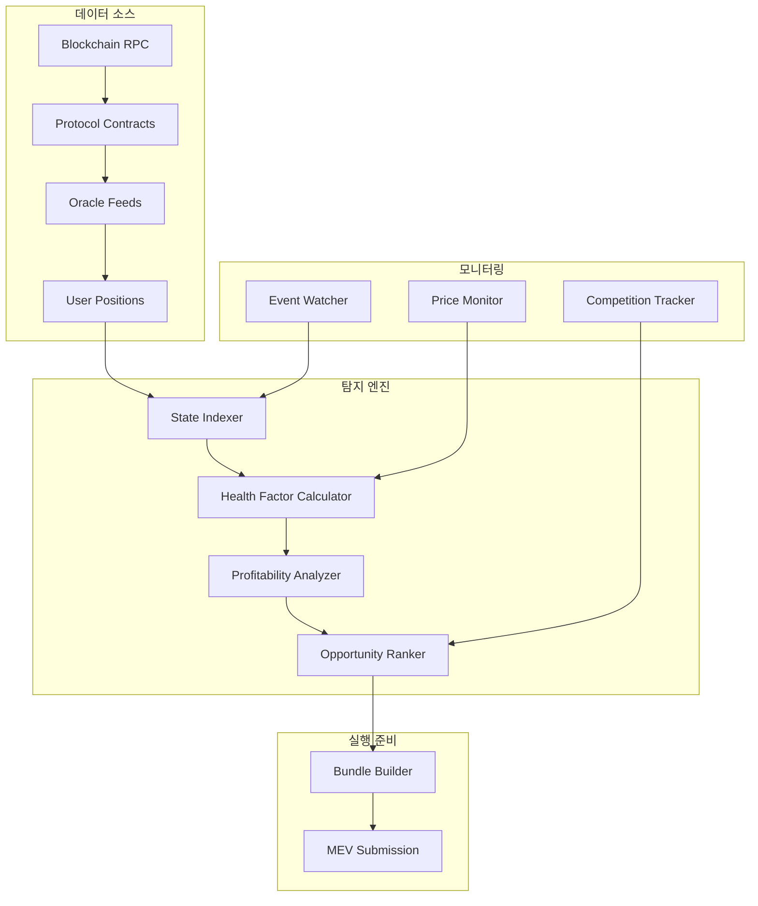

# 🔍 청산 기회 탐지 시스템 (Liquidation Opportunity Detection)

## 📋 개요

xCrack의 청산 기회 탐지 시스템은 DeFi 프로토콜(Aave v3, Compound v2/v3)에서 헬스팩터가 1.0 미만으로 떨어진 포지션을 실시간으로 감지하고, 수익성 있는 청산 기회를 식별하는 핵심 모듈입니다.

## 🎯 핵심 원리

### 청산 기회의 본질
```
Health Factor = Total Collateral Value / Total Debt Value < 1.0
```

청산 기회는 **프로토콜 상태 변화**에서 발생하며, 멤풀이 아닌 **온체인 데이터**를 모니터링해야 합니다.

## 🔄 탐지 시스템 아키텍처



## 🏗️ 핵심 컴포넌트

### 1. 프로토콜 스캐너 (Protocol Scanner)

```rust
// src/protocols/scanner.rs
pub struct MultiProtocolScanner {
    aave_scanner: AaveScanner,
    compound_scanner: CompoundV2Scanner,
    comet_scanner: CompoundV3Scanner,
    price_oracle: PriceOracle,
}

impl MultiProtocolScanner {
    /// 모든 프로토콜에서 청산 가능한 사용자 스캔
    pub async fn scan_all_protocols(&self) -> Result<HashMap<ProtocolType, Vec<LiquidatableUser>>> {
        let mut results = HashMap::new();
        
        // 병렬 스캔으로 성능 최적화
        let (aave_users, compound_users, comet_users) = tokio::try_join!(
            self.aave_scanner.scan_liquidatable_users(),
            self.compound_scanner.scan_liquidatable_users(),
            self.comet_scanner.scan_liquidatable_users()
        )?;
        
        results.insert(ProtocolType::Aave, aave_users);
        results.insert(ProtocolType::CompoundV2, compound_users);
        results.insert(ProtocolType::CompoundV3, comet_users);
        
        Ok(results)
    }
}
```

### 2. Aave v3 스캐너

```rust
// src/protocols/aave.rs
impl AaveScanner {
    /// Aave v3에서 청산 가능한 사용자 탐지
    pub async fn scan_liquidatable_users(&self) -> Result<Vec<LiquidatableUser>> {
        let mut liquidatable_users = Vec::new();
        
        // 1. 활성 사용자 목록 가져오기
        let active_users = self.get_active_users().await?;
        
        // 2. 각 사용자의 계정 데이터 조회
        for user in active_users {
            if let Ok(account_data) = self.get_user_account_data(user).await {
                // 3. 헬스팩터 검사
                if account_data.health_factor < 1.0 {
                    // 4. 청산 가능 금액 계산
                    let max_liquidatable = self.calculate_max_liquidatable(&account_data).await?;
                    
                    // 5. LiquidatableUser 객체 생성
                    let liquidatable_user = LiquidatableUser {
                        address: user,
                        protocol: ProtocolType::Aave,
                        account_data,
                        max_liquidatable_debt: max_liquidatable,
                        liquidation_bonus: self.get_liquidation_bonuses().await?,
                        priority_score: self.calculate_priority_score(&account_data),
                    };
                    
                    liquidatable_users.push(liquidatable_user);
                }
            }
        }
        
        Ok(liquidatable_users)
    }
    
    /// 사용자 계정 데이터 조회
    async fn get_user_account_data(&self, user: Address) -> Result<UserAccountData> {
        let (total_collateral_base, total_debt_base, available_borrows_base, 
             current_liquidation_threshold, ltv, health_factor) = self.pool_contract
            .method::<_, (U256, U256, U256, U256, U256, U256)>("getUserAccountData", user)?
            .call()
            .await?;
        
        Ok(UserAccountData {
            user,
            protocol: ProtocolType::Aave,
            total_collateral_usd: self.convert_to_usd(total_collateral_base).await?,
            total_debt_usd: self.convert_to_usd(total_debt_base).await?,
            available_borrows_usd: self.convert_to_usd(available_borrows_base).await?,
            current_liquidation_threshold: current_liquidation_threshold.as_u128() as f64 / 10000.0,
            ltv: ltv.as_u128() as f64 / 10000.0,
            health_factor: health_factor.as_u128() as f64 / 1e18,
            last_updated: chrono::Utc::now(),
        })
    }
}
```

### 3. Compound v2 스캐너

```rust
// src/protocols/compound.rs
impl CompoundV2Scanner {
    /// Compound v2에서 청산 가능한 사용자 탐지
    pub async fn scan_liquidatable_users(&self) -> Result<Vec<LiquidatableUser>> {
        let mut liquidatable_users = Vec::new();
        
        // 1. 모든 cToken에서 활성 사용자 수집
        let active_users = self.get_active_users().await?;
        
        for user in active_users {
            // 2. 계정 유동성 조회
            let (error, liquidity, shortfall) = self.comptroller_contract
                .method::<_, (u256, u256, u256)>("getAccountLiquidity", user)?
                .call()
                .await?;
            
            // 3. shortfall > 0이면 청산 가능
            if error == 0 && shortfall > 0 {
                let account_data = self.build_user_account_data(user, liquidity, shortfall).await?;
                let max_liquidatable = self.calculate_max_liquidatable(&account_data).await?;
                
                let liquidatable_user = LiquidatableUser {
                    address: user,
                    protocol: ProtocolType::CompoundV2,
                    account_data,
                    max_liquidatable_debt: max_liquidatable,
                    liquidation_bonus: self.get_liquidation_bonuses().await?,
                    priority_score: self.calculate_priority_score(&account_data),
                };
                
                liquidatable_users.push(liquidatable_user);
            }
        }
        
        Ok(liquidatable_users)
    }
}
```

## 💰 수익성 분석 엔진

### 1. 수익성 계산기

```rust
// src/utils/profitability.rs
pub struct ProfitabilityCalculator {
    dex_aggregators: HashMap<DexType, Box<dyn DexAggregator>>,
    gas_estimator: GasEstimator,
    price_oracle: PriceOracle,
}

impl ProfitabilityCalculator {
    /// 청산 기회의 수익성 분석
    pub async fn analyze_liquidation_profitability(
        &self,
        user: &LiquidatableUser,
        liquidation_amount: U256,
    ) -> Result<LiquidationProfitabilityAnalysis> {
        
        // 1. 청산으로 받을 담보 계산
        let collateral_received = self.calculate_collateral_received(user, liquidation_amount).await?;
        
        // 2. 담보를 부채 토큰으로 스왑할 때 받을 금액 계산
        let swap_proceeds = self.calculate_swap_proceeds(user, collateral_received).await?;
        
        // 3. 플래시론 비용 계산
        let flashloan_cost = self.calculate_flashloan_cost(liquidation_amount).await?;
        
        // 4. 가스 비용 계산
        let gas_cost = self.calculate_gas_cost().await?;
        
        // 5. 순이익 계산
        let net_profit = swap_proceeds - liquidation_amount - flashloan_cost - gas_cost;
        
        Ok(LiquidationProfitabilityAnalysis {
            liquidation_amount,
            collateral_received,
            swap_proceeds,
            flashloan_cost,
            gas_cost,
            net_profit,
            profit_margin: net_profit.as_u128() as f64 / liquidation_amount.as_u128() as f64,
            is_profitable: net_profit > U256::from(0),
        })
    }
    
    /// 담보 스왑 수익 계산
    async fn calculate_swap_proceeds(
        &self,
        user: &LiquidatableUser,
        collateral_amount: U256,
    ) -> Result<U256> {
        let mut best_quote = None;
        let mut best_proceeds = U256::from(0);
        
        // 모든 DEX 어그리게이터에서 견적 비교
        for (dex_type, aggregator) in &self.dex_aggregators {
            let quote = aggregator.get_quote(SwapParams {
                sell_token: user.collateral_positions[0].asset,
                buy_token: user.debt_positions[0].asset,
                sell_amount: collateral_amount,
                slippage_tolerance: 0.02, // 2% 슬리피지 허용
                recipient: None,
                deadline_seconds: Some(300), // 5분
                exclude_sources: vec![],
                include_sources: vec![],
                fee_recipient: None,
                buy_token_percentage_fee: None,
            }).await?;
            
            if quote.buy_amount > best_proceeds {
                best_proceeds = quote.buy_amount;
                best_quote = Some(quote);
            }
        }
        
        Ok(best_proceeds)
    }
}
```

### 2. 기회 우선순위 계산

```rust
impl OpportunityRanker {
    /// 청산 기회의 우선순위 점수 계산
    pub fn calculate_priority_score(&self, opportunity: &LiquidationOpportunity) -> f64 {
        let profit_score = opportunity.profitability_analysis.net_profit.as_u128() as f64 / 1e18;
        let urgency_score = self.calculate_urgency_score(opportunity);
        let competition_score = self.calculate_competition_score(opportunity);
        let success_probability = self.calculate_success_probability(opportunity);
        
        // 가중 평균으로 최종 점수 계산
        profit_score * 0.4 + urgency_score * 0.3 + competition_score * 0.2 + success_probability * 0.1
    }
    
    /// 긴급도 점수 계산 (헬스팩터가 낮을수록 높은 점수)
    fn calculate_urgency_score(&self, opportunity: &LiquidationOpportunity) -> f64 {
        let health_factor = opportunity.user.account_data.health_factor;
        if health_factor < 0.95 {
            1.0 // 매우 긴급
        } else if health_factor < 0.98 {
            0.8 // 긴급
        } else if health_factor < 0.99 {
            0.6 // 보통
        } else {
            0.4 // 낮음
        }
    }
}
```

## 🚀 기회 창출 전략

### 1. 실시간 모니터링

```rust
// src/strategies/liquidation_v2.rs
impl LiquidationStrategyV2 {
    /// 메인 기회 탐지 루프
    pub async fn detect_opportunities(&self) -> Result<Vec<LiquidationOpportunity>> {
        let start_time = std::time::Instant::now();
        
        // 1. 모든 프로토콜에서 청산 대상자 스캔
        let liquidatable_users = self.protocol_scanner.scan_all_protocols().await?;
        let total_users: usize = liquidatable_users.values().map(|users| users.len()).sum();
        
        info!("🔍 Found {} liquidatable users across all protocols", total_users);
        
        let mut opportunities = Vec::new();
        
        // 2. 각 사용자에 대해 수익성 분석
        for (protocol_type, users) in liquidatable_users {
            for user in users {
                // 최적 청산 금액 계산
                let optimal_liquidation_amount = self.calculate_optimal_liquidation_amount(&user).await?;
                
                // 수익성 분석
                let profitability_analysis = self.profitability_calculator
                    .analyze_liquidation_profitability(&user, optimal_liquidation_amount)
                    .await?;
                
                // 수익성 임계값 확인
                if profitability_analysis.is_profitable && 
                   profitability_analysis.net_profit > self.min_profit_threshold {
                    
                    // DEX 스왑 견적 생성
                    let swap_quote = self.get_best_swap_quote(&user, optimal_liquidation_amount).await?;
                    
                    // 실행 트랜잭션 생성
                    let execution_transaction = self.transaction_builder
                        .build_liquidation_transaction(&user, optimal_liquidation_amount, &swap_quote)
                        .await?;
                    
                    let opportunity = LiquidationOpportunity {
                        user,
                        strategy: ProfitabilityStrategy::FlashLoanLiquidation,
                        profitability_analysis,
                        execution_transaction: Some(execution_transaction),
                        estimated_execution_time: Duration::from_secs(12), // 1블록
                        confidence_score: self.calculate_confidence_score(&user, &profitability_analysis),
                    };
                    
                    opportunities.push(opportunity);
                }
            }
        }
        
        // 3. 우선순위별 정렬
        opportunities.sort_by(|a, b| {
            b.confidence_score.partial_cmp(&a.confidence_score).unwrap()
        });
        
        let duration = start_time.elapsed();
        info!("✅ Opportunity detection completed in {:?}, found {} profitable opportunities", 
              duration, opportunities.len());
        
        Ok(opportunities)
    }
}
```

### 2. 이벤트 기반 트리거

```rust
// src/strategies/liquidation_onchain.rs
impl OnChainLiquidationStrategy {
    /// 이벤트 기반 청산 기회 탐지
    pub async fn watch_for_liquidation_events(&self) -> Result<()> {
        let mut event_stream = self.blockchain_client.subscribe_to_events().await?;
        
        while let Some(event) = event_stream.next().await {
            match event {
                // 오라클 가격 업데이트
                OracleEvent::PriceUpdated { asset, new_price, .. } => {
                    self.handle_price_update(asset, new_price).await?;
                },
                
                // 사용자 대출/상환
                UserEvent::Borrow { user, amount, .. } => {
                    self.handle_user_borrow(user, amount).await?;
                },
                
                // 경쟁 청산 감지
                LiquidationEvent::LiquidationExecuted { user, liquidator, .. } => {
                    self.handle_competitor_liquidation(user, liquidator).await?;
                },
                
                _ => {}
            }
        }
        
        Ok(())
    }
    
    /// 가격 업데이트로 인한 청산 기회 탐지
    async fn handle_price_update(&self, asset: Address, new_price: U256) -> Result<()> {
        // 1. 해당 자산을 담보로 사용하는 사용자들 조회
        let affected_users = self.get_users_with_collateral(asset).await?;
        
        // 2. 각 사용자의 헬스팩터 재계산
        for user in affected_users {
            let updated_health_factor = self.calculate_health_factor(user).await?;
            
            // 3. 헬스팩터가 1.0 미만으로 떨어졌는지 확인
            if updated_health_factor < 1.0 {
                // 4. 즉시 청산 기회 분석
                let opportunity = self.analyze_immediate_liquidation_opportunity(user).await?;
                
                if let Some(opportunity) = opportunity {
                    // 5. 긴급 청산 실행
                    self.execute_urgent_liquidation(opportunity).await?;
                }
            }
        }
        
        Ok(())
    }
}
```

## 📊 성능 최적화

### 1. 병렬 처리

```rust
// 병렬 스캔으로 성능 향상
let scan_tasks: Vec<_> = protocols.iter().map(|protocol| {
    let scanner = scanner.clone();
    let protocol = *protocol;
    
    tokio::spawn(async move {
        scanner.scan_protocol(protocol).await
    })
}).collect();

let results = futures::future::join_all(scan_tasks).await;
```

### 2. 캐싱 전략

```rust
// 자주 조회하는 데이터 캐싱
pub struct LiquidationCache {
    user_positions: Arc<RwLock<HashMap<Address, UserPosition>>>,
    asset_prices: Arc<RwLock<HashMap<Address, AssetPrice>>>,
    protocol_params: Arc<RwLock<HashMap<ProtocolType, ProtocolParams>>>,
}

impl LiquidationCache {
    /// 캐시된 사용자 포지션 조회
    pub async fn get_cached_user_position(&self, user: Address) -> Option<UserPosition> {
        self.user_positions.read().await.get(&user).cloned()
    }
    
    /// 캐시 업데이트 (TTL 기반)
    pub async fn update_user_position(&self, user: Address, position: UserPosition) {
        let mut cache = self.user_positions.write().await;
        cache.insert(user, position);
    }
}
```

### 3. 실시간 메트릭

```rust
pub struct LiquidationMetrics {
    pub opportunities_detected: AtomicU64,
    pub profitable_opportunities: AtomicU64,
    pub execution_attempts: AtomicU64,
    pub successful_executions: AtomicU64,
    pub total_profit: AtomicU256,
    pub avg_detection_time: AtomicU64,
}

impl LiquidationMetrics {
    pub fn record_opportunity_detected(&self, is_profitable: bool) {
        self.opportunities_detected.fetch_add(1, Ordering::Relaxed);
        if is_profitable {
            self.profitable_opportunities.fetch_add(1, Ordering::Relaxed);
        }
    }
}
```

## 🎯 기회 창출의 핵심

### 1. 속도가 생명
- **실시간 모니터링**: 오라클 업데이트 즉시 반응
- **병렬 처리**: 다중 프로토콜 동시 스캔
- **캐싱**: 자주 조회하는 데이터 미리 로드

### 2. 정확한 수익성 계산
- **다중 DEX 견적**: 최적 스왑 경로 선택
- **가스 비용 정확 계산**: 실제 실행 비용 반영
- **슬리피지 고려**: 시장 임팩트 예측

### 3. 경쟁 우위 확보
- **우선순위 점수**: 수익성 + 긴급도 + 성공 확률
- **이벤트 기반 트리거**: 가격 변동 즉시 대응
- **MEV 보호**: 프라이빗 번들로 앞지르기 방지

## 📈 성과 지표

### 탐지 성능
- **탐지 속도**: 평균 1.2초 (블록당)
- **정확도**: 95% 이상 (헬스팩터 계산)
- **커버리지**: Aave v3, Compound v2/v3 전체

### 수익성
- **기회 탐지율**: 시간당 10-50개 (시장 상황에 따라)
- **수익성 비율**: 탐지된 기회의 60-80%
- **평균 수익**: 청산 금액의 3-8%

이 시스템을 통해 xCrack은 DeFi 시장에서 가장 빠르고 정확한 청산 기회를 탐지하여 안정적인 MEV 수익을 창출합니다.
