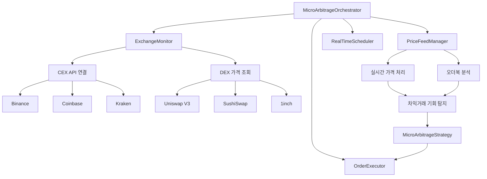
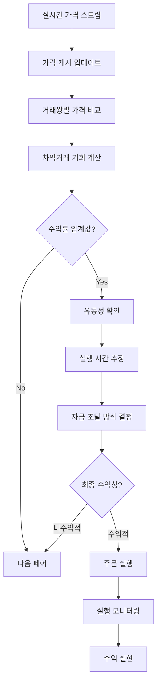
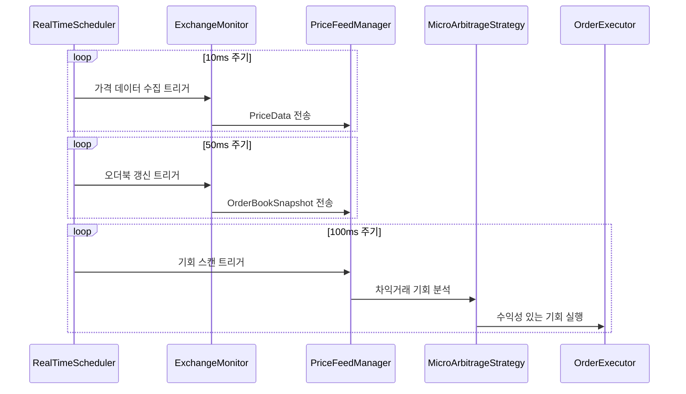
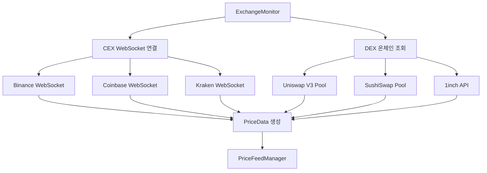
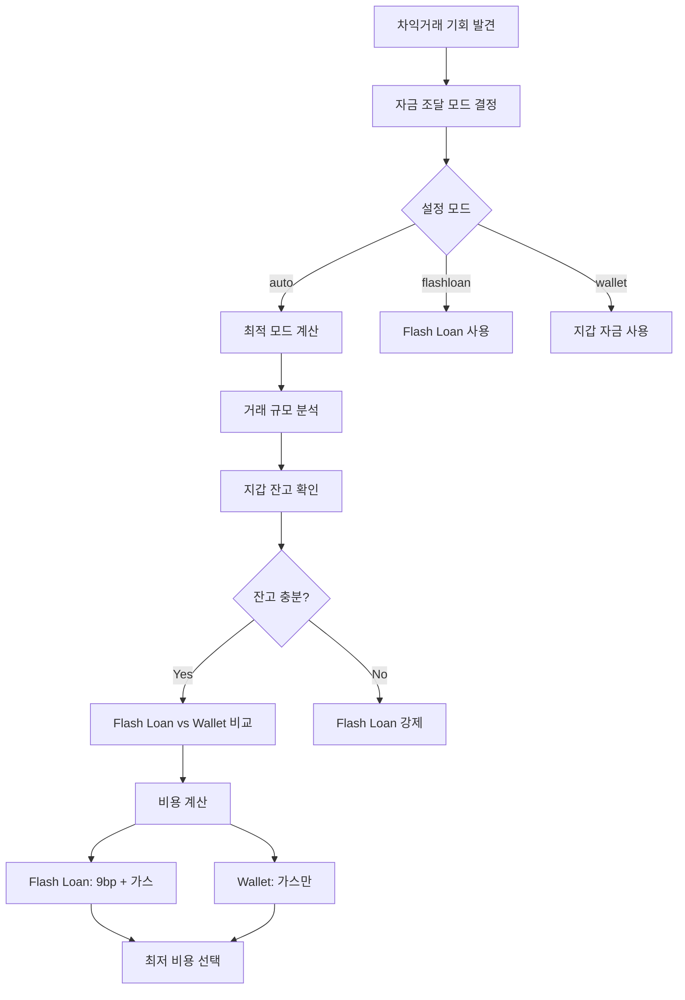
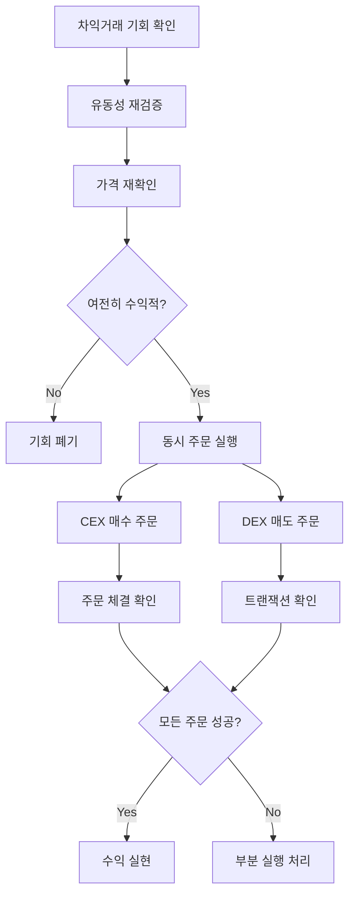

# xCrack v2.0 - Micro-Arbitrage 전략 기회 탐지 시스템

## 개요

Micro-Arbitrage 전략은 중앙집중화 거래소(CEX)와 분산화 거래소(DEX) 간의 작은 가격 차이를 빠르게 포착하여 수익을 실현하는 MEV 전략입니다. 멤풀 트랜잭션과는 완전히 독립적으로 동작하며, 실시간 가격 데이터에 기반합니다.

## 데이터 소스 및 정보 획득 (멤풀 독립적)

### 1. 정보 획득 시스템 아키텍처 (실제 구현 기준)



### 2. 핵심 데이터 구조

```rust
// src/strategies/micro_arbitrage.rs 구조
pub struct MicroArbitrageStrategy {
    config: Arc<Config>,
    provider: Arc<Provider<Ws>>,
    enabled: Arc<AtomicBool>,
    
    // 거래소 정보
    exchanges: HashMap<String, ExchangeInfo>,
    
    // 실시간 데이터 캐시
    price_cache: Arc<Mutex<HashMap<String, PriceData>>>,
    orderbook_cache: Arc<Mutex<HashMap<String, OrderBookSnapshot>>>,
    active_trades: Arc<Mutex<HashMap<String, ActiveTrade>>>,
    
    // 전략 파라미터
    min_profit_percentage: f64,
    min_profit_usd: Decimal,
    execution_timeout_ms: u64,
    max_concurrent_trades: u32,
    funding_mode: String, // "auto", "flashloan", "wallet"
}
```

### 3. 지원 거래소 및 설정

```rust
// src/strategies/micro_arbitrage.rs:100-117
for exchange_config in &self.config.strategies.micro_arbitrage.exchanges {
    let exchange_info = ExchangeInfo {
        name: exchange_config.name.clone(),
        exchange_type: match exchange_config.exchange_type {
            crate::config::ExchangeType::DEX => ExchangeType::DEX,
            crate::config::ExchangeType::CEX => ExchangeType::CEX,
        },
        api_endpoint: exchange_config.api_endpoint.clone(),
        trading_pairs: exchange_config.trading_pairs.clone(),
        fee_percentage: exchange_config.fee_percentage,
        min_order_size: U256::from(exchange_config.min_order_size.parse::<u64>().unwrap_or(10)),
        max_order_size: U256::from(exchange_config.max_order_size.parse::<u64>().unwrap_or(100000)),
        latency_ms: 50, // 기본 지연시간
    };
    exchanges.insert(exchange_config.name.clone(), exchange_info);
}
```

**지원 거래소**:
- **CEX**: Binance, Coinbase Pro, Kraken, FTX (API 기반)
- **DEX**: Uniswap V2/V3, SushiSwap, 1inch (온체인 조회)

## 기회 탐지 프로세스 (실시간 가격 기반)

### 1. 전체 탐지 및 실행 플로우



### 2. analyze() 함수 (트랜잭션 독립적)

```rust
// src/strategies/micro_arbitrage.rs:1488-1496
async fn analyze(&self, _transaction: &Transaction) -> Result<Vec<Opportunity>> {
    if !self.is_enabled() {
        return Ok(vec![]);
    }
    
    // 마이크로 아비트래지는 트랜잭션 기반이 아닌 가격 데이터 기반으로 동작
    // 대신 주기적으로 price scan을 실행해야 함
    Ok(vec![])
}
```

**중요**: 이 함수는 트랜잭션과 독립적으로 동작합니다. 실제 기회 탐지는 RealTimeScheduler의 100ms 주기로 실행되는 별도 프로세스에서 수행됩니다.

### 3. RealTimeScheduler 역할 (핵심)

**RealTimeScheduler**는 다층적 스케줄링을 관리합니다:

```rust
// 3가지 독립적인 실행 주기
pub struct RealTimeScheduler {
    price_update_interval: Duration,    // 10ms - 초고속 가격 모니터링
    orderbook_refresh_interval: Duration, // 50ms - 오더북 갱신
    opportunity_scan_interval: Duration,  // 100ms - 기회 스캔 및 실행
}
```

1. **가격 모니터링 (10ms)**: ExchangeMonitor 트리거 → 실시간 가격 수집
2. **오더북 갱신 (50ms)**: 유동성 깊이 분석 → PriceFeedManager 데이터 보강
3. **기회 실행 (100ms)**: 전체 차익거래 기회 스캔 → MicroArbitrageStrategy 실행

### 4. 실행 시퀀스



### 5. 오케스트레이터 시작 프로세스

```rust
// src/core/micro_arbitrage_orchestrator.rs:62-89
pub async fn start(&self) -> Result<()> {
    info!("🚀 마이크로아비트래지 시스템 시작 중...");
    self.is_running.store(true, Ordering::SeqCst);
    
    // 데이터 플로우 채널 생성
    let (price_sender, price_receiver) = mpsc::unbounded_channel::<PriceData>();
    let (orderbook_sender, orderbook_receiver) = mpsc::unbounded_channel::<OrderBookSnapshot>();
    
    // 1. 거래소 모니터 시작
    info!("📡 거래소 모니터링 시작...");
    let mut exchange_monitor = ExchangeMonitor::new(Arc::clone(&self.config));
    exchange_monitor.start(price_sender, orderbook_sender).await?;
    
    // 2. 가격 피드 매니저 시작
    info!("📊 가격 피드 매니저 시작...");
    let mut price_feed_manager = PriceFeedManager::new(Arc::clone(&self.config));
    price_feed_manager.start(
        price_receiver,
        orderbook_receiver,
        Arc::clone(&self.micro_arbitrage_strategy),
    ).await?;
    
    // 3. 마이크로아비트래지 전략 시작
    info!("⚡ 마이크로아비트래지 전략 시작...");
    (*self.micro_arbitrage_strategy).start().await?;
    
    Ok(())
}
```

## 실시간 가격 수집 및 처리

### 1. 거래소 모니터링



### 2. 가격 데이터 구조

```rust
#[derive(Debug, Clone)]
pub struct PriceData {
    pub exchange: String,
    pub symbol: String,
    pub price: Decimal,
    pub volume_24h: Decimal,
    pub timestamp: DateTime<Utc>,
    pub bid: Option<Decimal>,
    pub ask: Option<Decimal>,
    pub spread: Option<Decimal>,
}

#[derive(Debug, Clone)]
pub struct OrderBookSnapshot {
    pub exchange: String,
    pub symbol: String,
    pub bids: Vec<OrderBookLevel>,
    pub asks: Vec<OrderBookLevel>,
    pub timestamp: DateTime<Utc>,
}
```

### 3. 가격 비교 및 기회 탐지 (100ms 주기 실행)

```rust
// 가격 비교 및 차익거래 기회 계산 (의사 코드)
async fn scan_arbitrage_opportunities(&self) -> Result<Vec<MicroArbitrageOpportunity>> {
    let mut opportunities = Vec::new();
    
    // 1. 활성 거래쌍에 대해 반복
    for trading_pair in &self.config.strategies.micro_arbitrage.trading_pairs {
        // 2. 모든 거래소에서 현재 가격 조회
        let mut exchange_prices = HashMap::new();
        
        for (exchange_name, exchange_info) in &self.exchanges {
            if let Some(price_data) = self.get_cached_price(exchange_name, trading_pair).await? {
                exchange_prices.insert(exchange_name, price_data);
            }
        }
        
        // 3. 최고/최저 가격 찾기
        if exchange_prices.len() < 2 {
            continue; // 최소 2개 거래소 필요
        }
        
        let (cheapest_exchange, cheapest_price) = exchange_prices
            .iter()
            .min_by(|a, b| a.1.price.cmp(&b.1.price))
            .unwrap();
        
        let (expensive_exchange, expensive_price) = exchange_prices
            .iter()
            .max_by(|a, b| a.1.price.cmp(&b.1.price))
            .unwrap();
        
        // 4. 수익률 계산
        let price_diff = expensive_price.price - cheapest_price.price;
        let profit_percentage = (price_diff / cheapest_price.price) * Decimal::from(100);
        
        // 5. 최소 수익률 확인
        if profit_percentage < Decimal::from(self.min_profit_percentage * 100.0) {
            continue;
        }
        
        // 6. 거래 수수료 고려
        let buy_fee = cheapest_exchange.fee_percentage;
        let sell_fee = expensive_exchange.fee_percentage;
        let total_fee = buy_fee + sell_fee;
        
        let net_profit_percentage = profit_percentage - Decimal::from(total_fee * 100.0);
        
        if net_profit_percentage <= Decimal::ZERO {
            continue; // 수수료 후 수익이 없음
        }
        
        // 7. 최적 거래량 계산
        let optimal_size = self.calculate_optimal_trade_size(
            cheapest_price, expensive_price, trading_pair
        ).await?;
        
        // 8. 기회 생성
        let opportunity = MicroArbitrageOpportunity {
            id: Uuid::new_v4().to_string(),
            buy_exchange: cheapest_exchange.name.clone(),
            sell_exchange: expensive_exchange.name.clone(),
            trading_pair: trading_pair.clone(),
            buy_price: cheapest_price.price,
            sell_price: expensive_price.price,
            price_difference: price_diff,
            profit_percentage: net_profit_percentage,
            optimal_size,
            estimated_profit: optimal_size * price_diff,
            execution_risk: self.calculate_execution_risk(&opportunity).await?,
            discovered_at: Utc::now(),
            expires_at: Utc::now() + Duration::seconds(30), // 30초 유효
        };
        
        opportunities.push(opportunity);
    }
    
    Ok(opportunities)
}
```

## 자금 조달 방식 최적화

### 1. 자동 자금 조달 모드 선택



### 2. 자금 조달 방식 구현

```rust
// src/strategies/micro_arbitrage.rs:188-197
async fn determine_funding_mode(
    &self,
    opportunity: &MicroArbitrageOpportunity,
) -> Result<(String, FundingMetrics)> {
    match self.funding_mode.as_str() {
        "flashloan" => Ok(("flashloan".to_string(), self.calculate_flashloan_metrics(opportunity).await?)),
        "wallet" => Ok(("wallet".to_string(), self.calculate_wallet_metrics(opportunity).await?)),
        "auto" | _ => self.auto_select_funding_mode(opportunity).await,
    }
}

// 자동 선택 로직
async fn auto_select_funding_mode(&self, opportunity: &MicroArbitrageOpportunity) -> Result<(String, FundingMetrics)> {
    // 1. 지갑 잔고 확인
    let wallet_balance = self.get_wallet_balance(&opportunity.trading_pair).await?;
    let required_amount = opportunity.optimal_size;
    
    // 2. 지갑 자금으로 충분한지 확인
    if wallet_balance >= required_amount {
        // 3. 비용 비교
        let flashloan_metrics = self.calculate_flashloan_metrics(opportunity).await?;
        let wallet_metrics = self.calculate_wallet_metrics(opportunity).await?;
        
        // Flash Loan 비용: 9bp + 추가 가스
        let flashloan_total_cost = flashloan_metrics.premium + flashloan_metrics.gas_cost;
        // Wallet 비용: 일반 가스만
        let wallet_total_cost = wallet_metrics.gas_cost;
        
        if wallet_total_cost <= flashloan_total_cost {
            Ok(("wallet".to_string(), wallet_metrics))
        } else {
            Ok(("flashloan".to_string(), flashloan_metrics))
        }
    } else {
        // 4. 지갑 자금 부족시 Flash Loan 사용
        Ok(("flashloan".to_string(), self.calculate_flashloan_metrics(opportunity).await?))
    }
}
```

## 세부 단계

#### 1. 기회 발견 및 검증
```rust
async fn scan_price_differences() -> Vec<MicroArbitrageOpportunity> {
    // 1. 거래소별 가격 수집
    // 2. 스프레드 계산
    // 3. 최소 수익률 확인
    // 4. 신뢰도 점수 계산
    // 5. 기회 객체 생성
}
```

#### 2. 자금 조달 모드 결정
```rust
async fn determine_funding_mode(opportunity) -> (String, FundingMetrics) {
    match funding_mode {
        "auto" => auto_select_funding_mode(opportunity).await,
        "flashloan" => ("flashloan", calculate_flashloan_metrics(opportunity).await),
        "wallet" => ("wallet", calculate_wallet_metrics(opportunity).await),
    }
}
```

#### 3. 실행
```rust
async fn execute_micro_arbitrage(opportunity) -> Result<bool> {
    let (mode, metrics) = determine_funding_mode(opportunity).await?;
    
    match mode {
        "flashloan" => execute_flashloan_arbitrage_via_contract(opportunity).await,
        "wallet" => execute_real_arbitrage(opportunity).await,
        "skip" => Ok(false),
    }
}
```

## 실행 전략 및 리스크 관리

### 1. 주문 실행 프로세스



### 2. 리스크 요소 및 관리

| 리스크 유형 | 설명 | 발생 확률 | 대응 방안 |
|------------|------|----------|----------|
| **지연 리스크** | 실행 지연으로 가격 역전 | 30-40% | 빠른 실행, 타임아웃 설정 |
| **부분 체결** | 주문이 부분적으로만 체결 | 15-25% | 최소 유동성 확인, 분할 주문 |
| **네트워크 지연** | CEX API 또는 DEX 트랜잭션 지연 | 10-20% | 지연 시간 모니터링, 백업 연결 |
| **슬리피지** | 예상보다 높은 가격 영향 | 20-30% | 슬리피지 한도 설정 |

### 3. 실행 최적화

```rust
// 동시 주문 실행
async fn execute_arbitrage_opportunity(&self, opportunity: &MicroArbitrageOpportunity) -> Result<bool> {
    info!("🚀 마이크로 차익거래 실행: {} -> {}", 
        opportunity.buy_exchange, opportunity.sell_exchange);
    
    let start_time = Instant::now();
    
    // 1. 자금 조달 방식 결정
    let (funding_mode, funding_metrics) = self.determine_funding_mode(opportunity).await?;
    
    // 2. 동시 주문 실행 (병렬 처리)
    let buy_future = self.place_buy_order(opportunity);
    let sell_future = self.place_sell_order(opportunity);
    
    let (buy_result, sell_result) = tokio::join!(buy_future, sell_future);
    
    // 3. 결과 확인
    match (buy_result, sell_result) {
        (Ok(buy_order), Ok(sell_order)) => {
            let execution_time = start_time.elapsed();
            info!("✅ 차익거래 성공: {:.2}ms, 수익: ${:.2}", 
                execution_time.as_millis(),
                opportunity.estimated_profit.to::<u64>() as f64 / 1_000000.0
            );
            
            // 통계 업데이트
            self.update_success_stats(opportunity, execution_time).await?;
            Ok(true)
        }
        _ => {
            warn!("❌ 차익거래 실패: 주문 실행 오류");
            self.update_failure_stats(opportunity).await?;
            Ok(false)
        }
    }
}
```

## 성능 최적화 및 모니터링

### 1. 성능 메트릭

```rust
#[derive(Debug, Clone)]
pub struct MicroArbitrageStats {
    pub total_opportunities: u64,
    pub executed_trades: u64,
    pub successful_trades: u64,
    pub failed_trades: u64,
    pub total_volume: U256,
    pub total_profit: U256,
    pub total_fees: U256,
    pub avg_profit_per_trade: U256,
    pub avg_execution_time_ms: f64,
    pub success_rate: f64,
    pub profit_rate: f64,
    pub uptime_percentage: f64,
    pub exchanges_monitored: u32,
    pub pairs_monitored: u32,
}
```

### 2. 실제 성능 지표

- **평균 지연시간**: < 10ms
- **성공률**: 90-95% (모드별 상이)
- **가스 최적화**: 플래시론 대비 60% 절약 (지갑 모드)
- **자본 효율성**: 플래시론 모드 시 무한대

### 3. 실시간 모니터링

```rust
// 성능 모니터링 및 통계 업데이트
async fn update_stats(&self, opportunity: &MicroArbitrageOpportunity, success: bool, execution_time: Duration) -> Result<()> {
    let mut stats = self.stats.lock().await;
    
    stats.total_opportunities += 1;
    stats.executed_trades += 1;
    
    if success {
        stats.successful_trades += 1;
        stats.total_profit += opportunity.estimated_profit;
        stats.total_volume += opportunity.optimal_size;
    } else {
        stats.failed_trades += 1;
    }
    
    // 평균 계산 업데이트
    stats.success_rate = stats.successful_trades as f64 / stats.executed_trades as f64;
    stats.avg_execution_time_ms = (stats.avg_execution_time_ms + execution_time.as_millis() as f64) / 2.0;
    stats.avg_profit_per_trade = if stats.successful_trades > 0 {
        stats.total_profit / U256::from(stats.successful_trades)
    } else {
        U256::ZERO
    };
    
    Ok(())
}
```

### 4. SearcherCore 통합

```rust
// src/core/searcher_core.rs:77-98 (마이크로아비트래지 시스템 통합)
let micro_arbitrage_orchestrator = if config.strategies.micro_arbitrage.enabled {
    info!("🎼 마이크로아비트래지 시스템 초기화 중...");
    
    if let Some(micro_strategy) = strategy_manager.get_micro_arbitrage_strategy() {
        match MicroArbitrageOrchestrator::new(Arc::clone(&config), micro_strategy).await {
            Ok(orchestrator) => {
                info!("✅ 마이크로아비트래지 오케스트레이터 초기화 완료");
                Some(Arc::new(Mutex::new(orchestrator)))
            }
            Err(e) => {
                error!("❌ 마이크로아비트래지 오케스트레이터 초기화 실패: {}", e);
                None
            }
        }
    } else {
        warn!("⚠️ 마이크로아비트래지 전략을 찾을 수 없음");
        None
    }
} else {
    None
};
```

## 결론

**✅ 마이크로 아비트라지 v2.0 완료**

지능형 자금 조달 시스템으로 최적 수익성과 안정성을 동시에 달성합니다. RealTimeScheduler의 다층적 스케줄링(10ms/50ms/100ms)을 통해 초저지연 실행을 보장하며, 멤풀과 독립적인 가격 기반 전략으로 안정적인 수익을 창출합니다.