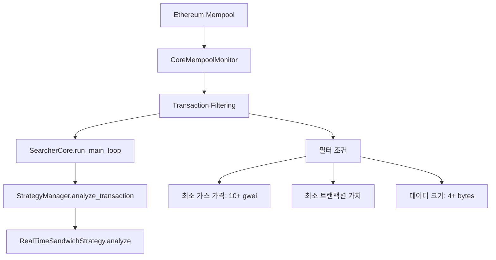
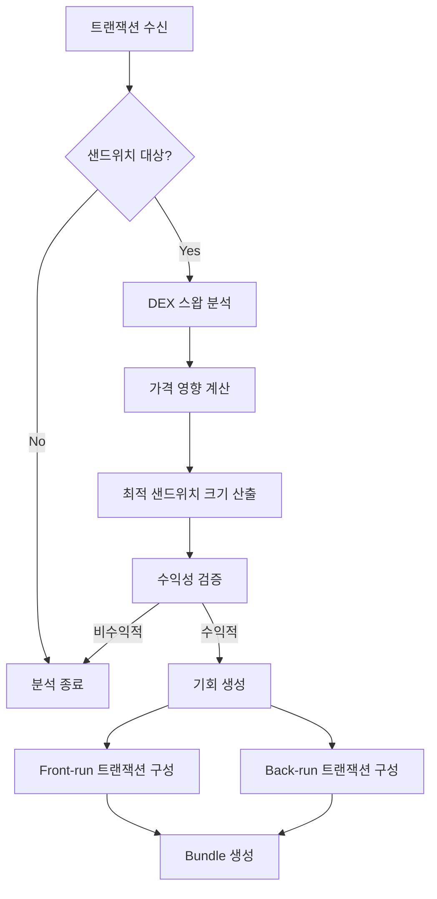
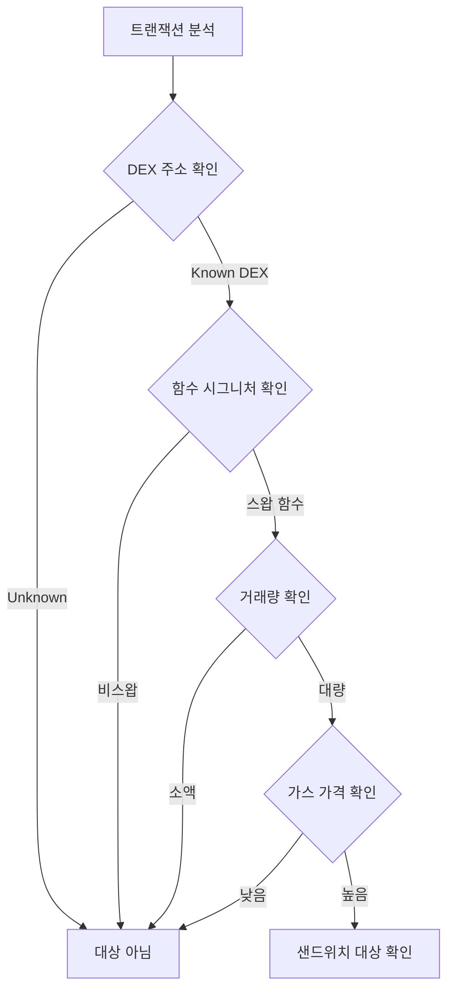
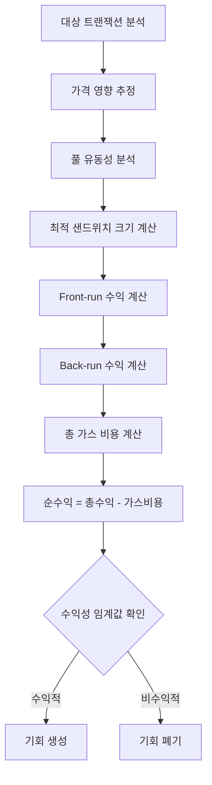
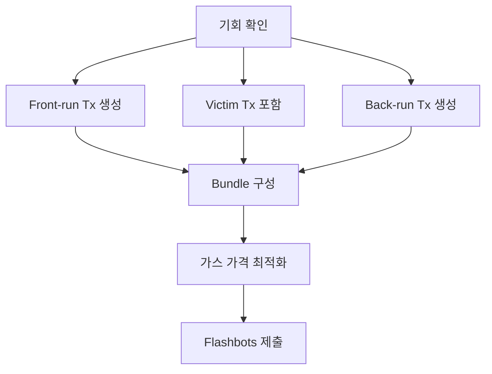

# xCrack v2.0 - Sandwich 전략 기회 탐지 시스템

## 개요

Sandwich 전략은 멤풀에서 대량 스왑 트랜잭션을 감지하고, 해당 트랜잭션의 앞뒤로 우리의 트랜잭션을 삽입하여 가격 변동으로부터 수익을 추출하는 MEV 전략입니다.

## 데이터 소스 및 정보 획득

### 1. 트랜잭션 정보 소스



### 2. 핵심 데이터 구조

```rust
// src/strategies/sandwich.rs:28-46
pub struct RealTimeSandwichStrategy {
    config: Arc<Config>,
    provider: Arc<Provider<Ws>>,
    enabled: Arc<AtomicBool>,
    
    // 샌드위치 대상 DEX 정보
    dex_addresses: HashMap<Address, DexInfo>,
    
    // 최소 수익성 임계값
    min_profit_eth: U256,
    min_profit_percentage: f64,
    
    // 가스 가격 전략
    gas_multiplier: f64,
    max_gas_price: U256,
    
    // 통계
    stats: Arc<Mutex<SandwichStats>>,
}
```

### 3. 지원 DEX 및 설정

```rust
// src/strategies/sandwich.rs:84-94
// Uniswap V2
dex_addresses.insert(
    "0x7a250d5630B4cF539739dF2C5dAcb4c659F2488D".parse()?,
    DexInfo {
        name: "Uniswap V2".to_string(),
        router_address: "0x7a250d5630B4cF539739dF2C5dAcb4c659F2488D".parse()?,
        factory_address: "0x5C69bEe701ef814a2B6a3EDD4B1652CB9cc5aA6f".parse()?,
        swap_function: vec![0x38, 0xed, 0x17, 0x39], // swapExactTokensForTokens
        fee: 30, // 0.3%
    }
);
```

## 기회 탐지 프로세스

### 1. 전체 탐지 플로우



### 2. 핵심 분석 함수

```rust
// src/strategies/sandwich.rs:528-569
async fn analyze(&self, transaction: &Transaction) -> Result<Vec<Opportunity>> {
    if !self.is_enabled() {
        return Ok(vec![]);
    }
    
    let start_time = Instant::now();
    let mut opportunities = Vec::new();
    
    // 1단계: 샌드위치 대상인지 확인
    if !self.is_sandwich_target(transaction) {
        return Ok(opportunities);
    }
    
    // 2단계: 샌드위치 기회 분석
    if let Some(sandwich_opp) = self.analyze_sandwich_opportunity(transaction).await? {
        let opportunity = Opportunity::new(
            OpportunityType::Sandwich,
            StrategyType::Sandwich,
            sandwich_opp.net_profit,
            sandwich_opp.success_probability,
            300_000, // 예상 가스 비용
            0, // 만료 블록
            OpportunityDetails::Sandwich(SandwichDetails {
                victim_transaction: sandwich_opp.target_tx.clone(),
                frontrun_amount: sandwich_opp.front_run_tx.value,
                backrun_amount: sandwich_opp.back_run_tx.value,
                target_slippage: 0.03, // 3% 슬리피지
                pool_address: sandwich_opp.target_tx.to.unwrap_or(Address::ZERO),
            }),
        );
        
        opportunities.push(opportunity);
    }
    
    // 통계 업데이트
    self.update_stats(opportunities.len(), None).await;
    
    Ok(opportunities)
}
```

### 3. 샌드위치 대상 식별 로직



### 4. 대상 식별 구현

```rust
// 샌드위치 대상 판별 로직 (의사 코드)
fn is_sandwich_target(&self, transaction: &Transaction) -> bool {
    // 1. DEX 라우터 주소 확인
    let target_address = transaction.to.unwrap_or(Address::ZERO);
    if !self.dex_addresses.contains_key(&target_address) {
        return false;
    }
    
    // 2. 스왑 함수 시그니처 확인
    if transaction.data.len() < 4 {
        return false;
    }
    
    let function_selector = &transaction.data[0..4];
    let dex_info = &self.dex_addresses[&target_address];
    
    if function_selector != dex_info.swap_function.as_slice() {
        return false;
    }
    
    // 3. 최소 거래량 확인
    if transaction.value < self.min_profit_eth {
        return false;
    }
    
    // 4. 가스 가격 확인 (경쟁력 있는 거래)
    let min_gas_price = U256::from(20_000_000_000u64); // 20 gwei
    if transaction.gas_price < min_gas_price {
        return false;
    }
    
    true
}
```

## 수익성 계산 및 최적화

### 1. 수익성 계산 모델



### 2. 가격 영향 계산

```rust
// 가격 영향 계산 로직 (의사 코드)
async fn calculate_price_impact(&self, transaction: &Transaction) -> Result<PriceImpact> {
    // 1. 풀 정보 조회
    let pool_info = self.get_pool_info(transaction).await?;
    let (reserve_in, reserve_out) = pool_info.reserves;
    
    // 2. 스왑 양 추출
    let swap_amount = self.extract_swap_amount(transaction)?;
    
    // 3. AMM 공식 적용 (Uniswap V2 예시)
    // amount_out = (amount_in * 997 * reserve_out) / (reserve_in * 1000 + amount_in * 997)
    let amount_out_before = (swap_amount * 997 * reserve_out) / (reserve_in * 1000 + swap_amount * 997);
    
    // 4. 가격 변화율 계산
    let price_before = reserve_out / reserve_in;
    let price_after = (reserve_out - amount_out_before) / (reserve_in + swap_amount);
    let price_impact_percent = ((price_after - price_before) / price_before) * 100.0;
    
    Ok(PriceImpact {
        amount_in: swap_amount,
        amount_out: amount_out_before,
        price_impact_percent,
        slippage: price_impact_percent,
    })
}
```

### 3. 최적 샌드위치 크기 계산

```rust
// Kelly Criterion 적용한 최적 크기 계산
async fn calculate_optimal_sandwich_size(&self, price_impact: &PriceImpact) -> OptimalSize {
    let win_probability = 0.85; // 85% 성공 확률 가정
    let average_return = price_impact.price_impact_percent / 100.0;
    
    // Kelly Criterion: f* = (bp - q) / b
    // b = odds received on the wager
    // p = probability of winning  
    // q = probability of losing (1 - p)
    let kelly_fraction = (win_probability * average_return - (1.0 - win_probability)) / average_return;
    
    // 보수적으로 Kelly 비율의 25% 사용
    let conservative_fraction = kelly_fraction * 0.25;
    
    let optimal_amount = price_impact.amount_in * U256::from((conservative_fraction * 1000.0) as u64) / U256::from(1000);
    
    OptimalSize {
        amount: optimal_amount,
        confidence: win_probability,
    }
}
```

## 실행 전략

### 1. Bundle 구성



### 2. 가스 전략

```rust
// 가스 가격 최적화
async fn optimize_gas_prices(&self, sandwich_opp: &SandwichOpportunity) -> Result<GasStrategy> {
    let base_gas_price = self.provider.get_gas_price().await?;
    let victim_gas_price = sandwich_opp.target_tx.gas_price;
    
    // Front-run: 희생자보다 1 gwei 높게
    let frontrun_gas_price = victim_gas_price + U256::from(1_000_000_000u64);
    
    // Back-run: 희생자보다 1 gwei 낮게 (블록에 포함되도록)
    let backrun_gas_price = victim_gas_price - U256::from(1_000_000_000u64);
    
    // 최대 가스 가격 제한 확인
    if frontrun_gas_price > self.max_gas_price {
        return Err(anyhow!("Gas price too high for profitable sandwich"));
    }
    
    Ok(GasStrategy {
        frontrun_gas_price,
        backrun_gas_price,
        total_gas_cost: frontrun_gas_price * U256::from(150_000) + backrun_gas_price * U256::from(150_000),
    })
}
```

## 리스크 관리 및 검증

### 1. 기회 검증

```rust
// src/strategies/sandwich.rs:571-599
async fn validate_opportunity(&self, opportunity: &Opportunity) -> Result<bool> {
    // 1. 전략 타입 확인
    if opportunity.strategy != StrategyType::Sandwich {
        return Ok(false);
    }
    
    // 2. 수익성 재검증
    if opportunity.expected_profit < self.min_profit_eth {
        return Ok(false);
    }
    
    // 3. 가스 가격 검증
    let current_gas_price = self.provider.get_gas_price().await?;
    if current_gas_price > self.max_gas_price {
        return Ok(false);
    }
    
    // 4. 신뢰도 확인
    if opportunity.confidence < 0.7 {
        return Ok(false);
    }
    
    Ok(true)
}
```

### 2. 리스크 요소

| 리스크 유형 | 설명 | 대응 방안 |
|------------|------|----------|
| **Front-running** | 다른 MEV 봇이 먼저 실행 | 가스 가격 최적화, 빠른 탐지 |
| **가격 변동** | 분석 시점과 실행 시점 가격 차이 | 실시간 검증, 슬리피지 한도 |
| **가스 비용 초과** | 예상보다 높은 가스 비용 | 가스 한도 설정, 수익성 재계산 |
| **풀 유동성 부족** | 예상한 스왑이 실행되지 않음 | 유동성 확인, 최소 풀 크기 |

## 성능 메트릭 및 모니터링

### 1. 성능 통계

```rust
#[derive(Debug, Clone)]
struct SandwichStats {
    transactions_analyzed: u64,
    opportunities_found: u64,
    successful_sandwiches: u64,
    total_profit: U256,
    avg_profit_per_sandwich: U256,
    last_analysis_time: Option<Instant>,
}
```

### 2. 모니터링 지표

- **분석 속도**: 트랜잭션 분석 시간 < 50ms
- **기회 탐지율**: 분석된 트랜잭션 대비 기회 발견 비율
- **성공률**: 제출된 샌드위치 중 성공적으로 실행된 비율
- **평균 수익**: 성공한 샌드위치당 평균 순수익
- **가스 효율성**: 가스 비용 대비 수익 비율

## 결론

Sandwich 전략은 멤풀 트랜잭션을 실시간으로 분석하여 대량 스왑 거래를 탐지하고, 정교한 가격 영향 계산을 통해 수익성 있는 샌드위치 기회를 포착합니다. 성공적인 실행을 위해서는 빠른 탐지, 정확한 수익성 계산, 그리고 효과적인 가스 전략이 필수입니다.