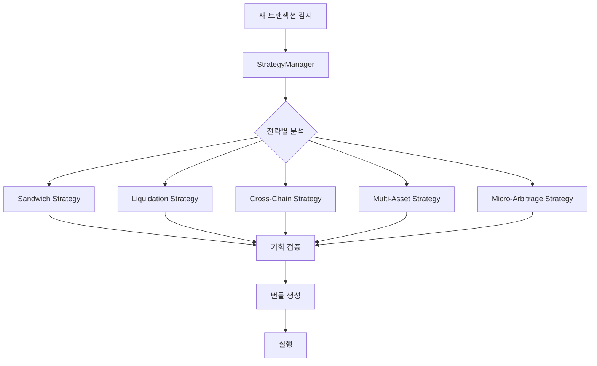
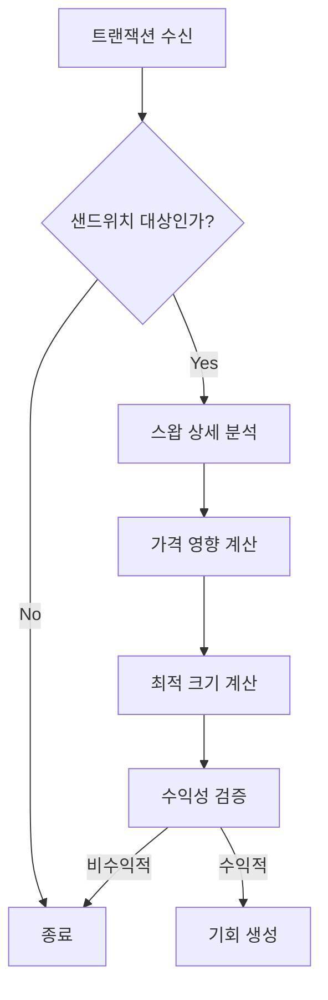
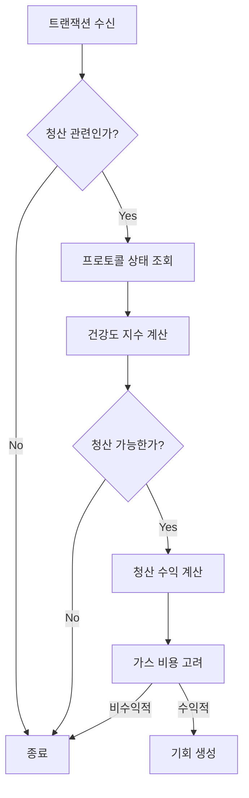
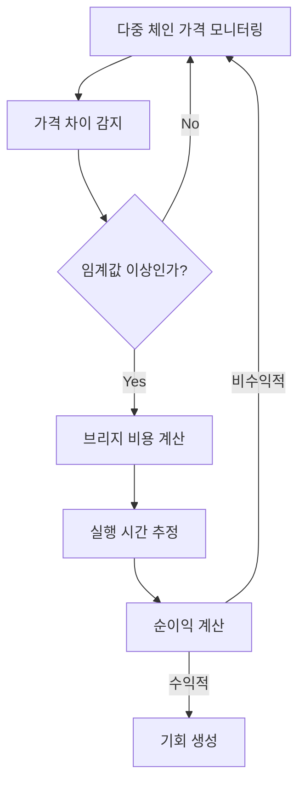
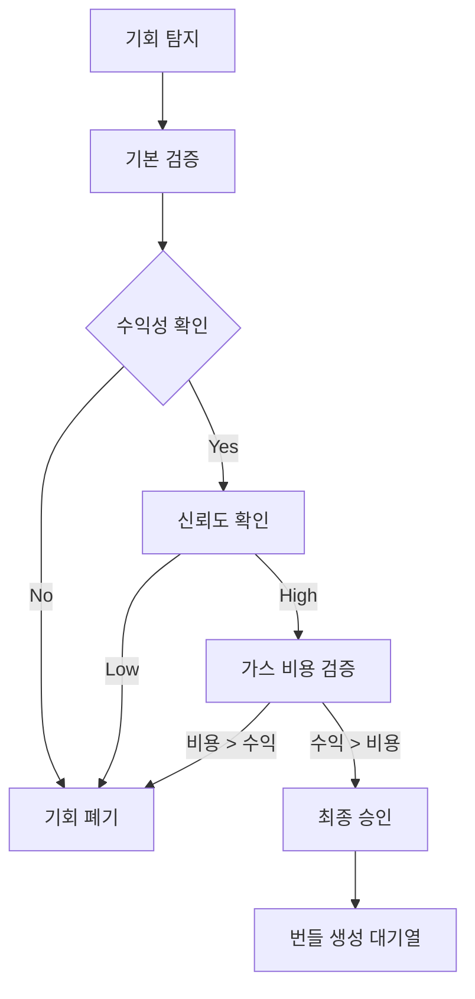

# xCrack v2.0 기회 탐지 시스템 튜토리얼

## 개요

xCrack v2.0은 다양한 MEV 전략을 통해 수익 기회를 탐지하고 실행하는 시스템입니다. 각 전략은 고유한 방식으로 블록체인 트랜잭션을 분석하여 수익 기회를 찾아냅니다.

## 전체 시스템 아키텍처



## 전략별 기회 탐지 상세

### 1. Sandwich 전략 (샌드위치 어택)

**목적**: 대량 거래를 앞뒤로 감싸서 가격 변동으로부터 이익을 얻습니다.

#### 탐지 프로세스



#### 핵심 코드 분석

```rust
// src/strategies/sandwich.rs:528
async fn analyze(&self, transaction: &Transaction) -> Result<Vec<Opportunity>> {
    if !self.is_enabled() {
        return Ok(vec![]);
    }
    
    let mut opportunities = Vec::new();
    
    // 1. 샌드위치 대상인지 확인
    if !self.is_sandwich_target(transaction) {
        return Ok(opportunities);
    }
    
    // 2. 샌드위치 기회 분석
    if let Some(sandwich_opp) = self.analyze_sandwich_opportunity(transaction).await? {
        let opportunity = Opportunity::new(
            OpportunityType::Sandwich,
            StrategyType::Sandwich,
            sandwich_opp.net_profit,
            sandwich_opp.success_probability,
            300_000, // 예상 가스 비용
            0, // 만료 블록
            OpportunityDetails::Sandwich(SandwichDetails {
                victim_transaction: sandwich_opp.target_tx.clone(),
                frontrun_amount: sandwich_opp.front_run_tx.value,
                backrun_amount: sandwich_opp.back_run_tx.value,
                target_slippage: 0.03, // 3% 슬리피지
                pool_address: sandwich_opp.target_tx.to.unwrap_or(Address::ZERO),
            }),
        );
        
        opportunities.push(opportunity);
    }
    
    Ok(opportunities)
}
```

#### 판단 기준

1. **대상 식별**:
   - DEX 스왑 트랜잭션
   - 충분한 거래량 (최소 임계값 이상)
   - 높은 가스비 (우선순위 있는 거래)

2. **수익성 계산**:
   - 예상 가격 영향: `impact = (amount / pool_size) * 100`
   - 최적 크기: Kelly Criterion 적용
   - 순이익 = 프론트런 이익 + 백런 이익 - 가스 비용

### 2. Liquidation 전략 (청산)

**목적**: 대출 프로토콜에서 담보가 부족해진 포지션을 청산하여 청산 보너스를 획득합니다.

#### 탐지 프로세스



#### 핵심 코드 분석

```rust
// src/strategies/liquidation.rs:493
async fn analyze(&self, transaction: &Transaction) -> Result<Vec<Opportunity>> {
    if !self.is_enabled() {
        return Ok(vec![]);
    }
    
    let mut opportunities = Vec::new();
    
    // 1. 청산 관련 트랜잭션인지 확인
    if !self.is_liquidation_related(transaction) {
        return Ok(opportunities);
    }
    
    // 2. 청산 기회 분석
    if let Some(liquidation_opp) = self.analyze_liquidation_opportunity(transaction).await? {
        let opportunity = Opportunity::new(
            OpportunityType::Liquidation,
            StrategyType::Liquidation,
            convert_ethers_u256_to_alloy(liquidation_opp.net_profit),
            liquidation_opp.success_probability,
            500_000, // 청산 가스 비용
            0,
            OpportunityDetails::Liquidation(LiquidationDetails {
                protocol: "Compound".to_string(),
                user: convert_address(liquidation_opp.target_user),
                collateral_asset: convert_address(liquidation_opp.collateral_token),
                debt_asset: convert_address(liquidation_opp.debt_token),
                collateral_amount: convert_ethers_u256_to_alloy(liquidation_opp.liquidation_amount),
                debt_amount: convert_ethers_u256_to_alloy(liquidation_opp.debt_amount),
                liquidation_bonus: 0.05, // 5% 청산 보너스
            }),
        );
        
        opportunities.push(opportunity);
    }
    
    Ok(opportunities)
}
```

#### 판단 기준

1. **청산 대상 식별**:
   - 대출 프로토콜 상호작용
   - 담보 비율 < 청산 임계값
   - 충분한 유동성

2. **수익성 계산**:
   - 청산 보너스 (일반적으로 5-10%)
   - 가스 비용 (복잡한 트랜잭션으로 높음)
   - 슬리피지 고려

### 3. Cross-Chain Arbitrage 전략 (크로스체인 차익거래)

**목적**: 서로 다른 체인 간의 가격 차이를 이용하여 차익거래를 수행합니다.

#### 탐지 프로세스



#### 핵심 코드 분석

```rust
// src/strategies/cross_chain_arbitrage.rs:674
async fn analyze(&self, transaction: &Transaction) -> Result<Vec<Opportunity>> {
    // 크로스체인 기회 스캔
    let cross_chain_opportunities = self.scan_opportunities().await?;
    
    let mut opportunities = Vec::new();
    
    // 크로스체인 기회를 일반 Opportunity로 변환
    for cc_opp in cross_chain_opportunities {
        if cc_opp.profit_percent > 0.2 { // 0.2% 이상 수익률
            let opportunity = Opportunity::new(
                OpportunityType::CrossChainArbitrage,
                StrategyType::CrossChainArbitrage,
                cc_opp.expected_profit,
                cc_opp.confidence,
                cc_opp.estimated_time * 21000, // 가스 추정값
                999999, // 만료 블록 (크로스체인은 시간 기반)
                OpportunityDetails::Arbitrage(ArbitrageDetails {
                    token_in: *cc_opp.token.addresses.get(&cc_opp.source_chain).unwrap(),
                    token_out: *cc_opp.token.addresses.get(&cc_opp.dest_chain).unwrap(),
                    amount_in: cc_opp.amount,
                    amount_out: cc_opp.amount + cc_opp.expected_profit,
                    dex_path: vec![format!("{}_{}", cc_opp.bridge_protocol.name(), cc_opp.dest_chain.name())],
                    price_impact: cc_opp.price_diff_percent / 100.0,
                }),
            );
            
            opportunities.push(opportunity);
            
            // Mock 실행
            if opportunities.len() <= 2 { // 최대 2개만 실행
                self.execute_cross_chain_trade_mock(&cc_opp).await?;
            }
        }
    }
    
    debug!("🎯 Cross-Chain 기회 반환: {} 개", opportunities.len());
    Ok(opportunities)
}
```

#### 판단 기준

1. **가격 차이 식별**:
   - 최소 0.2% 가격 차이
   - 충분한 유동성
   - 브리지 가능한 토큰

2. **비용 고려**:
   - 브리지 수수료
   - 양쪽 체인의 가스 비용
   - 시간 지연 위험

### 4. Micro-Arbitrage 전략 (마이크로 차익거래)

**목적**: CEX와 DEX 간의 작은 가격 차이를 빠르게 이용합니다.

#### 특징

```rust
// src/strategies/micro_arbitrage.rs:1488
async fn analyze(&self, _transaction: &Transaction) -> Result<Vec<Opportunity>> {
    if !self.is_enabled() {
        return Ok(vec![]);
    }
    
    // 마이크로 아비트래지는 트랜잭션 기반이 아닌 가격 데이터 기반으로 동작
    // 대신 주기적으로 price scan을 실행해야 함
    Ok(vec![])
}
```

이 전략은 **트랜잭션 기반이 아닌 가격 데이터 기반**으로 동작하므로, 별도의 주기적 스캔이 필요합니다.

## 기회 검증 시스템

모든 탐지된 기회는 다음 단계를 거쳐 검증됩니다:



### 공통 검증 기준

1. **최소 수익 기준**: 0.01 ETH 이상
2. **신뢰도 기준**: 70% 이상
3. **가스 비용**: 예상 수익 > 가스 비용
4. **시간 제약**: 만료 시간 내 실행 가능

### Cross-Chain 전용 검증

```rust
async fn validate_opportunity(&self, opportunity: &Opportunity) -> Result<bool> {
    // 기본 검증: 수익성과 신뢰도 확인
    if opportunity.expected_profit < U256::from(10000000000000000u64) { // 0.01 ETH 미만
        return Ok(false);
    }
    
    if opportunity.confidence < 0.7 { // 70% 미만 신뢰도
        return Ok(false);
    }
    
    // 가스비 대비 수익성 검증
    let gas_cost = U256::from(opportunity.gas_estimate) * U256::from(20000000000u64); // 20 gwei
    if opportunity.expected_profit <= gas_cost {
        return Ok(false);
    }
    
    Ok(true)
}
```

## 성능 최적화 팁

### 1. 병렬 처리
```rust
// StrategyManager에서 모든 전략을 병렬로 실행
let results = join_all(analysis_futures).await;
```

### 2. 조기 종료
각 전략은 기본 조건을 만족하지 않으면 즉시 종료:
```rust
if !self.is_enabled() {
    return Ok(vec![]);
}
```

### 3. 메모리 효율성
- 불필요한 클론 최소화
- Arc를 통한 공유 데이터 구조 사용

## 모니터링 및 디버깅

### 로그 활용
```rust
debug!("🎯 Cross-Chain 기회 반환: {} 개", opportunities.len());
```

### 성능 추적
```rust
let start_time = Instant::now();
// ... 분석 로직
let duration = start_time.elapsed();
```

### 메트릭 수집
각 전략은 성능 통계를 자동으로 수집하여 최적화에 활용합니다.

## 결론

xCrack v2.0의 기회 탐지 시스템은 각 전략의 특성에 맞게 최적화되어 있으며, 실시간으로 수익 기회를 탐지하고 검증하여 안전하고 수익적인 MEV 기회를 제공합니다.

각 전략을 이해하고 적절히 조정하면, 변화하는 시장 상황에 맞춰 최적의 성능을 달성할 수 있습니다.