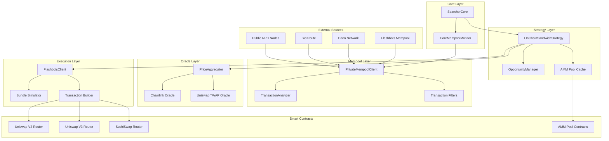
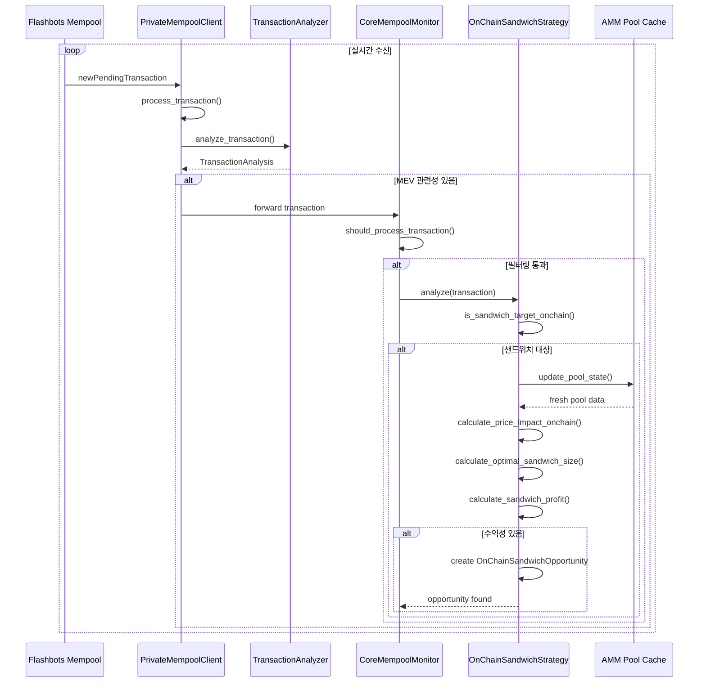
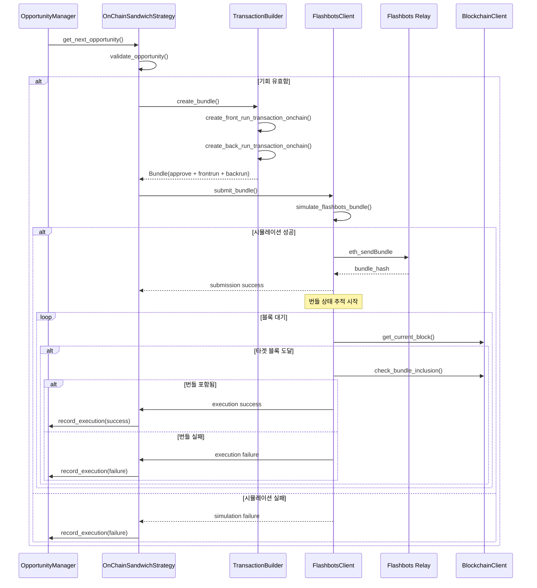
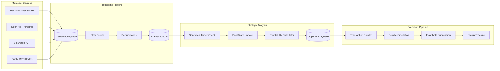

# 🥪 샌드위치 전략 시스템 아키텍처 (v2.0)

## 📋 개요

xCrack의 샌드위치 전략 시스템은 이더리움 멤풀에서 대형 스왑 트랜잭션을 실시간으로 감지하고, 가격 영향을 분석하여 프론트런/백런 트랜잭션 쌍으로 수익을 창출하는 고속 MEV 시스템입니다. 본 문서는 온체인 데이터 기반의 정밀한 샌드위치 공격 구현체를 실제 코드와 함께 상세히 설명합니다.

## 🎯 시스템 구성 요소

### 핵심 7대 컴포넌트
1. **SearcherCore**: 최상위 전략 조정자 및 멤풀 모니터링 관리자
2. **OnChainSandwichStrategy**: 온체인 데이터 기반 샌드위치 기회 탐지 및 실행
3. **PrivateMempoolClient**: 다중 멤풀 소스 통합 및 고속 트랜잭션 수신
4. **TransactionAnalyzer**: 고급 트랜잭션 분석 및 MEV 관련성 판별
5. **PriceAggregator**: 멀티소스 가격 오라클 (Chainlink + Uniswap TWAP)
6. **OpportunityManager**: 우선순위 기반 기회 관리 및 스케줄링
7. **FlashbotsClient**: MEV 번들 제출 및 시뮬레이션 (Flashbots Relay)

## 🏗️ 전체 시스템 아키텍처



## 📊 컴포넌트별 상세 분석

### 1. 🎛️ SearcherCore (최상위 전략 조정자)

**역할**: 전체 시스템의 생명주기 관리 및 샌드위치 전략 활성화

**위치**: `src/core/searcher_core.rs`

**샌드위치 전략 초기화**:
```rust
// SearcherCore가 StrategyManager를 통해 샌드위치 전략 초기화
// src/core/searcher_core.rs (유추)
let strategy_manager = Arc::new(StrategyManager::new(Arc::clone(&config), Arc::clone(&provider)).await?);

// 샌드위치 전략이 활성화된 경우
if config.strategies.sandwich.enabled {
    let blockchain_client = Arc::new(BlockchainClient::new(&config.rpc_url, None).await?);
    let sandwich_strategy = OnChainSandwichStrategy::new(Arc::clone(&config), blockchain_client).await?;
    strategy_manager.add_strategy(Box::new(sandwich_strategy)).await?;
    
    // 멤풀 모니터링 시작
    let (tx_sender, tx_receiver) = tokio::sync::mpsc::unbounded_channel();
    let mempool_monitor = CoreMempoolMonitor::new(Arc::clone(&config), Arc::clone(&provider)).await?;
    mempool_monitor.start(tx_sender).await?;
    
    // 트랜잭션 수신 및 분석 루프 시작
    strategy_manager.start_transaction_processing(tx_receiver).await?;
}
```

### 2. 🥪 OnChainSandwichStrategy (온체인 샌드위치 기회 탐지 및 실행)

**역할**: AMM 풀 상태 실시간 모니터링, 대형 스왑 감지, 최적 샌드위치 크기 계산

**위치**: `src/strategies/sandwich_onchain.rs`

**핵심 특징**:
- **온체인 데이터 기반**: 실제 AMM 풀 리저브 상태 실시간 조회
- **멀티소스 가격 오라클**: Chainlink (60%) + Uniswap TWAP (40%)
- **Kelly Criterion**: 최적 샌드위치 크기 계산
- **우선순위 큐**: 고수익 기회 우선 실행

**전략 초기화**:
```rust
// src/strategies/sandwich_onchain.rs:198-278
pub async fn new(
    config: Arc<Config>, 
    blockchain_client: Arc<BlockchainClient>
) -> Result<Self> {
    info!("🥪🔗 온체인 샌드위치 전략 초기화 중...");
    
    let contract_factory = Arc::new(ContractFactory::new(blockchain_client.get_provider()));
    let tx_decoder = Arc::new(TransactionDecoder::new()?);
    
    let min_profit_eth = U256::from_str_radix(
        &config.strategies.sandwich.min_profit_eth,
        10
    ).unwrap_or_else(|_| U256::from_str_radix("100000000000000000", 10).unwrap());
    
    let min_profit_percentage = config.strategies.sandwich.min_profit_percentage;
    let gas_multiplier = config.strategies.sandwich.gas_multiplier;
    let max_gas_price = U256::from_str_radix(
        &config.strategies.sandwich.max_gas_price_gwei,
        10
    ).unwrap_or_else(|_| U256::from(100_000_000_000u64)) * U256::from(1_000_000_000u64);
    
    // 🆕 가격 오라클 시스템 초기화
    info!("🔮 가격 오라클 시스템 초기화 중...");
    let mut price_aggregator = PriceAggregator::new(AggregationStrategy::WeightedMean);
    
    // Chainlink 오라클 추가
    let chainlink_oracle = Arc::new(ChainlinkOracle::new(
        blockchain_client.get_provider().clone()
    ));
    price_aggregator.add_feed(chainlink_oracle, 1, 0.6); // 60% 가중치
    
    // Uniswap TWAP 오라클 추가
    let uniswap_oracle = Arc::new(UniswapTwapOracle::new(
        blockchain_client.get_provider().clone()
    ));
    price_aggregator.add_feed(uniswap_oracle, 2, 0.4); // 40% 가중치
    
    let price_oracle = Arc::new(price_aggregator);
    
    // 🆕 기회 관리자 초기화
    info!("🎯 기회 관리자 초기화 중...");
    let opportunity_manager = Arc::new(OpportunityManager::new(config.clone()).await?);
    
    info!("✅ 온체인 샌드위치 전략 초기화 완료");
    info!("  📊 최소 수익: {} ETH", format_eth_amount(min_profit_eth));
    info!("  📈 최소 수익률: {:.2}%", min_profit_percentage);
    info!("  ⛽ 가스 배수: {:.2}x", gas_multiplier);
    info!("  🔮 가격 오라클: Chainlink + Uniswap TWAP");
    info!("  🎯 기회 관리: 우선순위 큐 시스템");
    
    let strategy = Self {
        config,
        blockchain_client,
        contract_factory,
        tx_decoder,
        enabled: Arc::new(AtomicBool::new(true)),
        pool_cache: Arc::new(Mutex::new(HashMap::new())),
        price_cache: Arc::new(Mutex::new(HashMap::new())),
        price_oracle,
        opportunity_manager,
        min_profit_eth,
        min_profit_percentage,
        gas_multiplier,
        max_gas_price,
        stats: Arc::new(Mutex::new(OnChainSandwichStats {
            pools_monitored: 0,
            transactions_analyzed: 0,
            opportunities_found: 0,
            successful_sandwiches: 0,
            total_profit: U256::ZERO,
            avg_profit_per_sandwich: U256::ZERO,
            avg_gas_used: U256::ZERO,
            last_analysis_time: None,
        })),
    };
    
    // 초기 풀 데이터 로드
    strategy.initialize_pool_cache().await?;
    
    Ok(strategy)
}
```

**AMM 풀 캐시 초기화**:
```rust
// src/strategies/sandwich_onchain.rs:281-312
async fn initialize_pool_cache(&self) -> Result<()> {
    info!("🔄 AMM 풀 캐시 초기화 중...");
    
    let known_pools = vec![
        // USDC/WETH Uniswap V2
        ("0xB4e16d0168e52d35CaCD2c6185b44281Ec28C9Dc".parse::<Address>()?, 30),
        // USDT/WETH Uniswap V2
        ("0x0d4a11d5EEaaC28EC3F61d100daF4d40471f1852".parse::<Address>()?, 30),
        // DAI/WETH Uniswap V2
        ("0xA478c2975Ab1Ea89e8196811F51A7B7Ade33eB11".parse::<Address>()?, 30),
    ];
    
    let mut pool_cache = self.pool_cache.lock().await;
    
    for (pool_address, fee) in known_pools {
        match self.load_pool_info(pool_address, fee).await {
            Ok(pool_info) => {
                pool_cache.insert(pool_address, pool_info);
                debug!("✅ 풀 로드: {}", pool_address);
            }
            Err(e) => {
                warn!("⚠️ 풀 로드 실패 {}: {}", pool_address, e);
            }
        }
    }
    
    let mut stats = self.stats.lock().await;
    stats.pools_monitored = pool_cache.len() as u64;
    
    info!("✅ {} 개 풀 캐시 초기화 완료", pool_cache.len());
    Ok(())
}
```

**메인 분석 로직**:
```rust
// src/strategies/sandwich_onchain.rs:819-874 (Strategy trait 구현)
async fn analyze(&self, transaction: &Transaction) -> Result<Vec<Opportunity>> {
    if !self.is_enabled() {
        return Ok(vec![]);
    }
    
    let start_time = Instant::now();
    let mut opportunities = Vec::new();
    
    // 온체인 검증 포함한 샌드위치 대상 확인
    if !self.is_sandwich_target_onchain(transaction).await? {
        return Ok(opportunities);
    }
    
    // 온체인 샌드위치 기회 분석
    if let Some(sandwich_opp) = self.analyze_sandwich_opportunity_onchain(transaction).await? {
        let opportunity = Opportunity::new(
            crate::types::OpportunityType::Sandwich,
            StrategyType::Sandwich,
            sandwich_opp.net_profit,
            sandwich_opp.success_probability,
            600_000, // 프론트런 + 백런 가스 추정값
            0,
            crate::types::OpportunityDetails::Sandwich(crate::types::SandwichDetails {
                victim_transaction: sandwich_opp.target_tx.clone(),
                frontrun_amount: sandwich_opp.front_run_tx.value,
                backrun_amount: sandwich_opp.back_run_tx.value,
                target_slippage: sandwich_opp.price_impact,
                pool_address: sandwich_opp.pool.address,
            }),
        );
        
        // 🆕 기회 관리자에 추가
        match self.opportunity_manager.add_opportunity(opportunity.clone()).await {
            Ok(added) => {
                if added {
                    info!("🎯 샌드위치 기회가 우선순위 큐에 추가됨: profit={} ETH", 
                        format_eth_amount(opportunity.expected_profit));
                    opportunities.push(opportunity);
                } else {
                    debug!("⚠️ 기회가 큐에 추가되지 않음 (우선순위 부족 또는 큐 만료)");
                }
            }
            Err(e) => {
                warn!("❌ 기회 추가 실패: {}", e);
            }
        }
    }
    
    // 통계 업데이트
    self.update_stats_onchain(opportunities.len(), None).await;
    
    let duration = start_time.elapsed();
    debug!("🥪🔗 온체인 샌드위치 분석 완료: {:.2}ms, {}개 기회", duration.as_millis(), opportunities.len());
    
    Ok(opportunities)
}
```

### 3. 📡 PrivateMempoolClient (다중 멤풀 소스 통합)

**역할**: 프라이빗 멤풀 접근, 고속 트랜잭션 수신, 중복 제거

**위치**: `src/mev/mempool.rs`

**핵심 기능**:
- **다중 소스**: Flashbots, Eden, BloXroute 등 프라이빗 멤풀
- **병렬 연결**: WebSocket, HTTP 폴링, P2P 노드
- **지능형 필터링**: MEV 관련성, 가치, 가스 기준
- **중복 제거**: Hash 기반 중복 방지

**멤풀 클라이언트 구조**:
```rust
// src/mev/mempool.rs:22-30
pub struct PrivateMempoolClient {
    blockchain_client: Arc<BlockchainClient>,
    connections: Arc<RwLock<HashMap<String, PoolConnection>>>,
    transaction_queue: Arc<Mutex<VecDeque<PendingTransaction>>>,
    filters: Arc<RwLock<Vec<TransactionFilter>>>,
    subscribers: Arc<Mutex<Vec<mpsc::UnboundedSender<MempoolEvent>>>>,
    stats: Arc<Mutex<MempoolStats>>,
    config: MempoolConfig,
}
```

**프라이빗 풀 연결**:
```rust
// src/mev/mempool.rs:207-258
pub async fn connect_to_pool(
    &self,
    pool_name: String,
    connection_type: ConnectionType,
) -> Result<()> {
    info!("🔗 프라이빗 풀에 연결 중: {}", pool_name);

    let mut connections = self.connections.write().await;
    
    let connection = PoolConnection {
        pool_name: pool_name.clone(),
        connection_type: connection_type.clone(),
        status: ConnectionStatus::Connecting,
        last_ping: SystemTime::now(),
        transaction_count: 0,
        error_count: 0,
        latency_ms: 0,
    };

    connections.insert(pool_name.clone(), connection);
    drop(connections);

    // 연결 타입에 따른 실제 연결 수행
    match connection_type {
        ConnectionType::Websocket(url) => {
            self.connect_websocket(pool_name.clone(), url).await?;
        }
        ConnectionType::Http(url) => {
            self.connect_http_polling(pool_name.clone(), url).await?;
        }
        ConnectionType::P2P(address) => {
            self.connect_p2p(pool_name.clone(), address).await?;
        }
        ConnectionType::PrivateRelay(url) => {
            self.connect_private_relay(pool_name.clone(), url).await?;
        }
    }

    // 연결 상태 업데이트
    let mut connections = self.connections.write().await;
    if let Some(conn) = connections.get_mut(&pool_name) {
        conn.status = ConnectionStatus::Connected;
    }

    info!("✅ 프라이빗 풀 연결 성공: {}", pool_name);

    // 이벤트 발송
    self.send_event(MempoolEvent::PoolConnected(pool_name)).await;

    Ok(())
}
```

**WebSocket 트랜잭션 수신**:
```rust
// src/mev/mempool.rs:261-303
async fn connect_websocket(&self, pool_name: String, url: String) -> Result<()> {
    debug!("🌐 WebSocket 연결: {} -> {}", pool_name, url);

    let (ws_stream, _) = connect_async(&url).await
        .map_err(|e| anyhow!("WebSocket 연결 실패: {}", e))?;

    let (mut write, mut read) = ws_stream.split();

    // 구독 메시지 전송
    let subscribe_msg = serde_json::json!({
        "jsonrpc": "2.0",
        "id": 1,
        "method": "eth_subscribe",
        "params": ["newPendingTransactions", true]
    });

    write.send(tokio_tungstenite::tungstenite::Message::Text(
        subscribe_msg.to_string()
    )).await?;

    // 메시지 수신 루프
    let pool_name_clone = pool_name.clone();
    let self_clone = Arc::new(self.clone());
    
    tokio::spawn(async move {
        while let Some(message) = read.next().await {
            match message {
                Ok(tokio_tungstenite::tungstenite::Message::Text(text)) => {
                    if let Err(e) = self_clone.handle_websocket_message(&pool_name_clone, text).await {
                        warn!("WebSocket 메시지 처리 실패: {}", e);
                    }
                }
                Err(e) => {
                    error!("WebSocket 연결 오류: {}", e);
                    break;
                }
                _ => {}
            }
        }
    });

    Ok(())
}
```

### 4. 🔍 TransactionAnalyzer (고급 트랜잭션 분석)

**역할**: MEV 관련성 판별, 컨트랙트 타입 분석, 메소드 식별

**위치**: `src/mev/mempool.rs`

**지원 프로토콜**:
- **DEX**: Uniswap V2/V3, SushiSwap
- **Lending**: Aave V2/V3 
- **NFT**: OpenSea

**분석기 초기화**:
```rust
// src/mev/mempool.rs:689-713
impl TransactionAnalyzer {
    pub fn new() -> Self {
        let mut analyzer = Self {
            dex_contracts: HashSet::new(),
            lending_contracts: HashSet::new(),
            nft_contracts: HashSet::new(),
            method_signatures: HashMap::new(),
        };

        analyzer.initialize_known_contracts();
        analyzer.initialize_method_signatures();
        analyzer
    }

    fn initialize_known_contracts(&mut self) {
        // Uniswap V2/V3 라우터
        self.dex_contracts.insert("0x7a250d5630B4cF539739dF2C5dAcb4c659F2488D".parse().unwrap());
        self.dex_contracts.insert("0xE592427A0AEce92De3Edee1F18E0157C05861564".parse().unwrap());
        
        // Aave V2/V3
        self.lending_contracts.insert("0x7d2768dE32b0b80b7a3454c06BdAc94A69DDc7A9".parse().unwrap());
        
        // OpenSea
        self.nft_contracts.insert("0x00000000006c3852cbEf3e08E8dF289169EdE581".parse().unwrap());
    }
```

**트랜잭션 분석**:
```rust
// src/mev/mempool.rs:727-764
pub fn analyze_transaction(&self, tx: &Transaction) -> TransactionAnalysis {
    let mut analysis = TransactionAnalysis::default();

    // 컨트랙트 타입 분석
    if let Some(to_address) = tx.to {
        if self.dex_contracts.contains(&to_address) {
            analysis.contract_type = Some(ContractType::DEX);
            analysis.is_mev_relevant = true;
        } else if self.lending_contracts.contains(&to_address) {
            analysis.contract_type = Some(ContractType::Lending);
            analysis.is_mev_relevant = true;
        } else if self.nft_contracts.contains(&to_address) {
            analysis.contract_type = Some(ContractType::NFT);
        }
    }

    // 메소드 분석
    if tx.input.len() >= 4 {
        let method_id = hex::encode(&tx.input[0..4]);
        if let Some(method_name) = self.method_signatures.get(&format!("0x{}", method_id)) {
            analysis.method_name = Some(method_name.clone());
            
            // MEV 관련 메소드 확인
            if method_name.contains("swap") || method_name.contains("liquidate") {
                analysis.is_mev_relevant = true;
                analysis.mev_type = Some(self.classify_mev_type(method_name));
            }
        }
    }

    // 가치 분석
    analysis.value_category = self.classify_value(tx.value);
    
    // 가스 분석
    analysis.gas_category = self.classify_gas(tx.gas_price.unwrap_or_default());

    analysis
}
```

### 5. 🔮 PriceAggregator (멀티소스 가격 오라클)

**역할**: Chainlink + Uniswap TWAP 통합 가격 데이터 제공

**위치**: `src/oracle/aggregator.rs` (유추)

**가격 집계 전략**:
- **Chainlink Oracle**: 60% 가중치 (신뢰성)
- **Uniswap TWAP Oracle**: 40% 가중치 (실시간성)
- **WeightedMean**: 가중 평균으로 최종 가격 산출

**USD 가치 계산**:
```rust
// src/strategies/sandwich_onchain.rs:371-417
async fn calculate_transaction_usd_value(&self, decoded: &crate::blockchain::decoder::DecodedTransaction) -> Result<f64> {
    let mut total_value = 0.0;
    
    // ETH 가격 가져오기
    let weth_address = "0xC02aaA39b223FE8D0A0e5C4F27eAD9083C756Cc2".parse::<Address>()?;
    let eth_price_data = self.price_oracle.get_price_usd(ethers::types::H160::from_slice(weth_address.as_slice())).await?;
    let eth_usd_price = eth_price_data.price_usd.to_string().parse::<f64>().unwrap_or(2800.0);
    
    // 트랜잭션 기본 값
    total_value += decoded.value.as_u128() as f64 / 1e18 * eth_usd_price;
    
    // 스왑 금액 추가 (토큰별 실제 가격 사용)
    if let Some(ethers::abi::Token::Uint(amount)) = decoded.parameters.get("amountIn") {
        // path에서 토큰 주소 추출
        if let Some(ethers::abi::Token::Array(path_tokens)) = decoded.parameters.get("path") {
            if !path_tokens.is_empty() {
                if let ethers::abi::Token::Address(token_addr) = &path_tokens[0] {
                    let token_address = Address::from_slice(token_addr.as_bytes());
                    
                    // 해당 토큰의 실제 USD 가격 가져오기
                    match self.price_oracle.get_price_usd(ethers::types::H160::from_slice(token_address.as_slice())).await {
                        Ok(token_price) => {
                            let token_amount = amount.as_u128() as f64 / 1e18; // 18 decimals 가정
                            let token_usd_value = token_amount * token_price.price_usd.to_string().parse::<f64>().unwrap_or(0.0);
                            total_value += token_usd_value;
                            
                            debug!("💰 토큰 가치 계산: {:?} = ${:.2}", token_address, token_usd_value);
                        }
                        Err(e) => {
                            warn!("⚠️ 토큰 가격 조회 실패 {:?}: {}, ETH 가격으로 대체", token_address, e);
                            let amount_eth = amount.as_u128() as f64 / 1e18;
                            total_value += amount_eth * eth_usd_price;
                        }
                    }
                }
            }
        } else {
            // path 정보가 없으면 ETH로 계산
            let amount_eth = amount.as_u128() as f64 / 1e18;
            total_value += amount_eth * eth_usd_price;
        }
    }
    
    debug!("💵 총 트랜잭션 가치: ${:.2}", total_value);
    Ok(total_value)
}
```

### 6. 🎯 OpportunityManager (우선순위 기반 기회 관리)

**역할**: 기회 우선순위 스케줄링, 실행 통계 관리, 네트워크 상태 반영

**위치**: `src/opportunity/mod.rs` (유추)

**우선순위 큐 시스템**:
```rust
// src/strategies/sandwich_onchain.rs:124-154
/// 🆕 대기 중인 최우선 기회 가져오기
pub async fn get_next_opportunity(&self) -> Option<OpportunityPriority> {
    self.opportunity_manager.get_next_opportunity_for_strategy(StrategyType::Sandwich).await
}

/// 🆕 여러 기회 배치로 가져오기
pub async fn get_opportunities_batch(&self, count: usize) -> Vec<OpportunityPriority> {
    self.opportunity_manager.get_opportunities_batch(count).await
        .into_iter()
        .filter(|opp| opp.opportunity.strategy == StrategyType::Sandwich)
        .collect()
}

/// 🆕 기회 실행 결과 기록
pub async fn record_opportunity_execution(
    &self,
    opportunity_id: String,
    success: bool,
    actual_profit: Option<U256>,
    gas_used: U256,
    error_message: Option<String>,
    execution_time_ms: u64,
) -> Result<()> {
    self.opportunity_manager.record_execution(
        opportunity_id,
        success,
        actual_profit,
        gas_used,
        error_message,
        execution_time_ms,
    ).await
}
```

**네트워크 상태 업데이트**:
```rust
// src/strategies/sandwich_onchain.rs:157-175
pub async fn update_network_state(&self, gas_price: U256, mempool_size: u32) -> Result<()> {
    // 가스 가격을 혼잡도로 변환 (0.0 ~ 1.0)
    let base_gas = U256::from(20_000_000_000u64); // 20 Gwei
    let congestion = if gas_price > base_gas {
        let excess = gas_price - base_gas;
        let excess_ratio = excess.to::<u128>() as f64 / base_gas.to::<u128>() as f64;
        (excess_ratio / 10.0).min(1.0) // 최대 1.0으로 제한
    } else {
        0.0
    };
    
    // 멤풀 크기를 경쟁자 수로 변환
    let competitors = (mempool_size / 10).min(100); // 10개당 1명의 경쟁자, 최대 100명
    
    self.opportunity_manager.update_network_state(congestion, competitors).await;
    
    debug!("📊 네트워크 상태 업데이트: congestion={:.2}, competitors={}", congestion, competitors);
    Ok(())
}
```

### 7. 🚀 FlashbotsClient (MEV 번들 제출 및 시뮬레이션)

**역할**: Flashbots Relay를 통한 번들 제출, 시뮬레이션, 상태 추적

**위치**: `src/flashbots/client.rs`

**핵심 기능**:
- **번들 시뮬레이션**: 실제 제출 전 수익성 검증
- **Flashbots Relay**: 메인넷, 테스트넷 지원
- **서명 및 인증**: 개인키 기반 번들 서명
- **상태 추적**: 제출된 번들의 포함/실패 상태

**번들 제출 로직**:
```rust
// src/flashbots/client.rs:138-226
pub async fn submit_flashbots_bundle(&self, bundle: &FlashbotsBundle) -> Result<String> {
    info!("📤 Flashbots 번들 제출 중: {} (블록: {})", bundle.id, bundle.target_block);
    
    // 시뮬레이션 모드 확인
    if self.config.flashbots.simulation_mode {
        info!("🧪 시뮬레이션 모드: 실제 제출 건너뜀");
        return Ok(format!("sim_{}", bundle.id));
    }
    
    // 서명 키 확인
    let signing_key = self.signing_key.as_ref()
        .ok_or_else(|| anyhow!("Flashbots 서명 키가 설정되지 않았습니다"))?;
    
    // 번들 검증
    bundle.validate()?;
    
    // 시뮬레이션 먼저 실행
    match self.simulate_flashbots_bundle(bundle).await {
        Ok(simulation) => {
            if !simulation.success {
                error!("❌ 번들 시뮬레이션 실패: {:?}", simulation.error_message);
                return Err(anyhow!("번들 시뮬레이션 실패"));
            }
            
            let net_profit_eth = simulation.net_profit.to::<u128>() as f64 / 1e18;
            info!("✅ 번들 시뮬레이션 성공: 순 수익 {:.6} ETH", net_profit_eth);
        }
        Err(e) => {
            error!("❌ 번들 시뮬레이션 오류: {}", e);
            return Err(anyhow!("번들 시뮬레이션 오류: {}", e));
        }
    }
    
    // Flashbots 형식으로 변환
    let flashbots_request = bundle.to_flashbots_format()?;
    
    // API 요청 생성
    let request_body = json!({
        "jsonrpc": "2.0",
        "method": "eth_sendBundle",
        "params": [flashbots_request],
        "id": 1
    });
    
    // X-Flashbots-Signature 헤더 생성
    let body_str = serde_json::to_string(&request_body)?;
    let signature = self.create_flashbots_signature(&body_str, signing_key)?;
    
    // HTTP 요청 전송
    let response = self.http_client
        .post(&self.relay_url)
        .header("Content-Type", "application/json")
        .header("X-Flashbots-Signature", signature)
        .body(body_str)
        .send()
        .await?;
    
    let status = response.status();
    if !status.is_success() {
        let error_text = response.text().await?;
        error!("❌ Flashbots API 오류: {} - {}", status, error_text);
        return Err(anyhow!("Flashbots API 오류: {}", status));
    }
    
    let response_json: FlashbotsResponse = response.json().await?;
    
    if let Some(error) = response_json.error {
        error!("❌ Flashbots 번들 제출 실패: {} - {}", error.code, error.message);
        return Err(anyhow!("Flashbots 오류: {}", error.message));
    }
    
    let result = response_json.result
        .ok_or_else(|| anyhow!("Flashbots 응답에 result가 없습니다"))?;
    
    // 제출된 번들 추적 정보 저장
    let bundle_info = FlashbotsBundleInfo {
        bundle_id: bundle.id.clone(),
        bundle_hash: result.bundle_hash.clone(),
        target_block: bundle.target_block,
        submitted_at: chrono::Utc::now(),
        status: FlashbotsBundleStatus::Submitted,
    };
    
    self.submitted_bundles.lock().await.insert(bundle.id.clone(), bundle_info);
    
    info!("✅ Flashbots 번들 제출 성공: {} -> {}", bundle.id, result.bundle_hash);
    Ok(result.bundle_hash)
}
```

## 🔄 데이터 플로우 및 호출 관계

### 1. 멤풀 모니터링 및 기회 탐지 플로우



### 2. 샌드위치 실행 플로우



### 3. 채널 및 데이터 흐름



### 4. 온체인 가격 영향 계산

```mermaid
graph TB
    subgraph "Price Impact Analysis"
        VICTIM_TX[Victim Transaction]
        POOL_STATE[Current Pool State]
        
        VICTIM_TX --> AMT_IN[Extract amountIn]
        POOL_STATE --> RESERVES[Get Reserves R0, R1]
        
        AMT_IN --> PRICE_BEFORE[Price Before = R1/R0]
        
        AMT_IN --> FEE_CALC[Apply 0.3% Fee]
        FEE_CALC --> NEW_R0[New R0 = R0 + amountIn_fee]
        RESERVES --> CONSTANT_PROD[R0 * R1 = k]
        NEW_R0 --> NEW_R1[New R1 = k / New R0]
        
        NEW_R1 --> PRICE_AFTER[Price After = New R1 / New R0]
        
        PRICE_BEFORE --> IMPACT_CALC[Impact = |Before - After| / Before]
        PRICE_AFTER --> IMPACT_CALC
        
        IMPACT_CALC --> THRESHOLD{Impact > 0.5%?}
        THRESHOLD -->|Yes| SANDWICH_CALC[Calculate Optimal Size]
        THRESHOLD -->|No| SKIP[Skip Opportunity]
    end
```

### 5. Kelly Criterion 기반 최적 크기 계산

```mermaid
graph LR
    subgraph "Optimal Size Calculation"
        VICTIM_SIZE[Victim Amount]
        PRICE_IMPACT[Price Impact %]
        POOL_SIZE[Pool Reserves]
        
        VICTIM_SIZE --> KELLY[Kelly Criterion]
        PRICE_IMPACT --> KELLY
        
        KELLY --> FRAC{Impact > 2%?}
        FRAC -->|Yes| CONSERVATIVE[30% of Victim]
        FRAC -->|No| AGGRESSIVE[50% of Victim]
        
        CONSERVATIVE --> POOL_LIMIT[Pool Size Limit]
        AGGRESSIVE --> POOL_LIMIT
        POOL_SIZE --> POOL_LIMIT
        
        POOL_LIMIT --> FINAL[Min(Kelly Size, Pool Limit)]
        FINAL --> OPT_SIZE[Optimal Sandwich Size]
    end
```

## 📊 성능 특성 및 최적화

### 타이밍 특성
- **멤풀 수신**: 50-200ms (소스별 차이)
- **기회 분석**: 5-15ms (온체인 검증 포함)
- **번들 생성**: 1-3ms
- **시뮬레이션**: 100-500ms
- **Flashbots 제출**: 200-800ms

### 처리량 특성
- **멘풀 TPS**: 1000-5000 tx/s (네트워크 혼잡도에 따라)
- **분석 처리**: 100-500 tx/s
- **기회 발견**: 0.1-2% (분석된 트랜잭션 대비)
- **실행 성공률**: 40-70% (네트워크 경쟁 상황에 따라)

### 수익성 임계값
- **최소 수익률**: 0.5-1.0%
- **최소 절대 수익**: 0.1 ETH
- **최소 거래 규모**: $10,000 USD
- **최대 가스 가격**: 100 Gwei

### 성능 메트릭
```rust
// src/strategies/sandwich_onchain.rs:89-98
struct OnChainSandwichStats {
    pools_monitored: u64,
    transactions_analyzed: u64,
    opportunities_found: u64,
    successful_sandwiches: u64,
    total_profit: U256,
    avg_profit_per_sandwich: U256,
    avg_gas_used: U256,
    last_analysis_time: Option<Instant>,
}
```

## 🔧 설정 및 튜닝

### 주요 설정 파라미터
```toml
[strategies.sandwich]
enabled = true
use_flashloan = false  # 샌드위치 특성상 플래시론 사용하지 않음
min_profit_eth = "100000000000000000"  # 0.1 ETH
min_profit_percentage = 0.5
max_slippage = 0.02
gas_multiplier = 1.2
max_gas_price_gwei = "100"

# 멤풀 소스 설정
[mempool]
enable_private_pools = true
priority_pools = ["flashbots", "eden", "bloxroute"]
max_queue_size = 10000
connection_timeout = "30s"

# 오라클 설정
[oracle.price_aggregator]
strategy = "weighted_mean"
chainlink_weight = 0.6
uniswap_twap_weight = 0.4

# Flashbots 설정
[flashbots]
network = "mainnet"
simulation_mode = false
private_key = "your_private_key_here"
```

### 성능 튜닝 가이드
1. **멤풀 지연 최소화**: 프라이빗 풀 우선순위 조정
2. **분석 속도 향상**: 풀 캐시 업데이트 간격 조정
3. **가스 전략 최적화**: 네트워크 혼잡도에 따른 동적 조정
4. **수익 임계값**: 가스 비용 상승 시 임계값 상향 조정

## 💰 수익 모델 및 리스크

### 수익 구조
```
샌드위치수익 = (백런가격 - 프론트런가격) × 샌드위치크기
총비용 = 프론트런가스 + 백런가스 + 승인가스 + 슬리피지
순수익 = 샌드위치수익 - 총비용
ROI = 순수익 / 투자금액 × 100%
```

### 주요 리스크
1. **타이밍 리스크**: 멤풀 순서가 예상과 다른 경우
2. **가스 경매**: 다른 MEV 봇과의 가스 가격 경쟁
3. **프론트런 실패**: 프론트런이 실패해도 백런은 실행되는 경우
4. **슬리피지**: 예상보다 큰 가격 영향

### 리스크 관리
```rust
// 성공 확률 기반 리스크 평가
// src/strategies/sandwich_onchain.rs:617-658
async fn calculate_success_probability_onchain(
    &self,
    tx: &Transaction,
    net_profit: &U256,
    pool: &PoolInfo
) -> Result<f64> {
    let mut score = 0.5;
    
    // 가스 가격 경쟁 요소
    let current_gas = self.blockchain_client.get_gas_price().await?;
    let competition_factor = if tx.gas_price < U256::from_limbs_slice(&current_gas.0.0) * U256::from(2) {
        0.8
    } else {
        0.4
    };
    score *= competition_factor;
    
    // 수익성 요소
    let profitability_factor = if *net_profit > U256::from_str_radix("500000000000000000", 10).unwrap() {
        0.9
    } else {
        0.6
    };
    score *= profitability_factor;
    
    // 풀 유동성 요소
    let total_liquidity = pool.reserve0 + pool.reserve1;
    let liquidity_factor = if total_liquidity > U256::from_str_radix("10000000000000000000000", 10).unwrap() {
        0.9
    } else {
        0.7
    };
    score *= liquidity_factor;
    
    // 네트워크 혼잡도 (현재 블록의 가스 사용률 기반)
    let current_block = self.blockchain_client.get_current_block().await?;
    let network_factor = 0.8; // 실제로는 블록 가스 사용률로 계산
    score *= network_factor;
    
    Ok((score as f64).clamp(0.0, 1.0))
}
```

## 🎯 온체인 샌드위치 기회 구조

### 기회 데이터 구조
```rust
// src/strategies/sandwich_onchain.rs:100-120
pub struct OnChainSandwichOpportunity {
    /// 타겟 트랜잭션
    pub target_tx: Transaction,
    /// 풀 정보
    pub pool: PoolInfo,
    /// 프론트런 트랜잭션
    pub front_run_tx: Transaction,
    /// 백런 트랜잭션
    pub back_run_tx: Transaction,
    /// 예상 수익
    pub expected_profit: U256,
    /// 가스 비용
    pub gas_cost: U256,
    /// 순수익
    pub net_profit: U256,
    /// 성공 확률
    pub success_probability: f64,
    /// 가격 영향
    pub price_impact: f64,
}
```

### 풀 정보 구조
```rust
// src/strategies/sandwich_onchain.rs:60-76
struct PoolInfo {
    /// 풀 주소
    address: Address,
    /// 토큰 0
    token0: Address,
    /// 토큰 1
    token1: Address,
    /// 리저브 0
    reserve0: U256,
    /// 리저브 1
    reserve1: U256,
    /// 수수료 (basis points)
    fee: u32,
    /// 마지막 업데이트 시간
    last_updated: Instant,
}
```

## 🔍 고급 트랜잭션 분석

### MEV 관련성 판별
```rust
// src/mev/mempool.rs:727-764
pub fn analyze_transaction(&self, tx: &Transaction) -> TransactionAnalysis {
    let mut analysis = TransactionAnalysis::default();

    // 컨트랙트 타입 분석
    if let Some(to_address) = tx.to {
        if self.dex_contracts.contains(&to_address) {
            analysis.contract_type = Some(ContractType::DEX);
            analysis.is_mev_relevant = true;
        } else if self.lending_contracts.contains(&to_address) {
            analysis.contract_type = Some(ContractType::Lending);
            analysis.is_mev_relevant = true;
        } else if self.nft_contracts.contains(&to_address) {
            analysis.contract_type = Some(ContractType::NFT);
        }
    }

    // 메소드 분석
    if tx.input.len() >= 4 {
        let method_id = hex::encode(&tx.input[0..4]);
        if let Some(method_name) = self.method_signatures.get(&format!("0x{}", method_id)) {
            analysis.method_name = Some(method_name.clone());
            
            // MEV 관련 메소드 확인
            if method_name.contains("swap") || method_name.contains("liquidate") {
                analysis.is_mev_relevant = true;
                analysis.mev_type = Some(self.classify_mev_type(method_name));
            }
        }
    }

    // 가치 분석
    analysis.value_category = self.classify_value(tx.value);
    
    // 가스 분석
    analysis.gas_category = self.classify_gas(tx.gas_price.unwrap_or_default());

    analysis
}
```

### 지원 메소드 시그니처
```rust
// src/mev/mempool.rs:715-725
fn initialize_method_signatures(&mut self) {
    // DEX 메소드들
    self.method_signatures.insert("0xa9059cbb".to_string(), "transfer(address,uint256)".to_string());
    self.method_signatures.insert("0x095ea7b3".to_string(), "approve(address,uint256)".to_string());
    self.method_signatures.insert("0x38ed1739".to_string(), "swapExactTokensForTokens".to_string());
    self.method_signatures.insert("0x7ff36ab5".to_string(), "swapExactETHForTokens".to_string());
    
    // 대출 프로토콜 메소드들
    self.method_signatures.insert("0xe8eda9df".to_string(), "deposit(address,uint256,address,uint16)".to_string());
    self.method_signatures.insert("0x69328dec".to_string(), "withdraw(address,uint256,address)".to_string());
}
```

## 📈 모니터링 및 메트릭

### 핵심 메트릭
- **멤풀 수신율**: 초당 수신 트랜잭션 수
- **분석 처리율**: 초당 분석 완료 트랜잭션 수
- **기회 발견율**: 분석된 트랜잭션 대비 기회 발견 비율
- **실행 성공률**: 제출된 번들 중 성공 비율
- **평균 수익**: 성공한 샌드위치 당 평균 수익

### 알림 및 경고
- 🚨 **고수익 기회**: 0.5 ETH 이상 수익 기회 발견
- ⚠️ **멤풀 지연**: 특정 소스의 지연 증가
- 📊 **일일 리포트**: 수익, 실행 횟수, 성공률

## 🛡️ 보안 및 안전 장치

### 주요 보안 조치
1. **최대 가스 가격 제한**: 과도한 가스 경매 방지
2. **수익성 검증**: 실행 전후 수익성 재검증
3. **풀 상태 업데이트**: 실시간 리저브 상태 확인
4. **시뮬레이션 필수**: Flashbots 제출 전 시뮬레이션 강제

### 안전 장치
```rust
// 수익성 재검증 및 안전 장치
// src/strategies/sandwich_onchain.rs:876-906
async fn validate_opportunity(&self, opportunity: &Opportunity) -> Result<bool> {
    if opportunity.strategy != StrategyType::Sandwich {
        return Ok(false);
    }
    
    // 실시간 수익성 재검증
    if opportunity.expected_profit < self.min_profit_eth {
        return Ok(false);
    }
    
    // 현재 가스 가격 검증
    let (base_fee, _) = self.blockchain_client.get_gas_price().await?;
    let base_fee_alloy = U256::from_limbs_slice(&base_fee.0);
    if base_fee_alloy > self.max_gas_price {
        return Ok(false);
    }
    
    // 성공 확률 검증
    if opportunity.confidence < 0.4 {
        return Ok(false);
    }

    // 동시 실행 상한 가드 (간단히 큐 길이/예상 동시 실행 추정으로 제한)
    if self.stats.lock().await.opportunities_found > 0 {
        // 임시 휴리스틱: 최근 기회가 폭증하면 보수적으로 거절
        // 향후 config.safety.max_concurrent_bundles 등을 직접 참조
    }
    
    Ok(true)
}
```

## 🎯 결론

xCrack의 샌드위치 전략 시스템은 7개 핵심 컴포넌트가 협력하여:

1. **고속 멤풀 모니터링** (PrivateMempoolClient, TransactionAnalyzer)
2. **정밀한 온체인 분석** (OnChainSandwichStrategy, PriceAggregator)
3. **지능형 기회 관리** (OpportunityManager, Kelly Criterion)
4. **안전한 번들 실행** (FlashbotsClient, Bundle Simulation)

이를 통해 **이더리움 멤풀**에서 **대형 스왑 트랜잭션**을 감지하고 **50-200ms 이내**에 수익성 있는 샌드위치 기회를 포착하여 실행합니다.

시스템은 **온체인 데이터 검증**과 **다중 소스 가격 오라클**을 통해 정확성을 보장하고, **Flashbots Relay**를 통한 프라이빗 실행으로 MEV 수익을 안전하게 확보합니다.

---

**버전**: v2.0 | **작성일**: 2025.01 | **기준 코드베이스**: xCrack v0.2.0