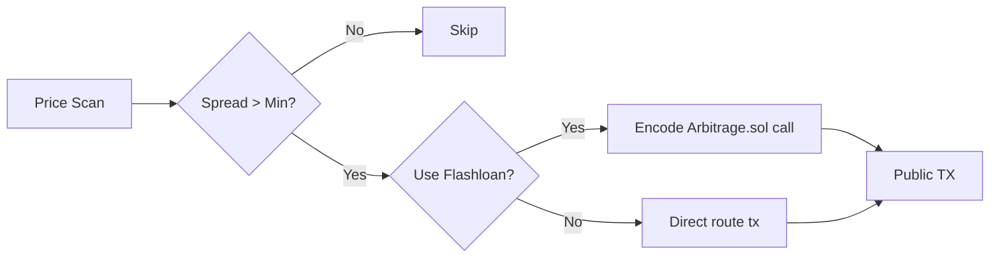

# Micro Arbitrage Strategy (No MEV, Flashloan Optional)

CEX/DEX 혹은 DEX/DEX 간 소규모 가격 차이를 포착하여 공개 트랜잭션으로 즉시 실행합니다. 필요 시 `Arbitrage.sol`을 통해 플래시론을 사용합니다.

## 정책 요약
- MEV 사용: No (공개 브로드캐스트)
- Flashloan 사용: Optional (Arbitrage.sol 경유)

## 데이터 소스
- 실시간 가격 피드: 내부 PriceFeedManager → 각 거래소
- 오더북 스냅샷/틱 데이터(옵션)

## 처리 흐름 (요약)

## 실행 단계
1) 스프레드 스캔: 우선순위 페어/거래소에 대해 latency/fee/슬리피지 고려
2) 리스크 가드: min_profit_%/USD, per-trade/day 한도
3) 실행 경로 결정:
   - Flashloan ON: `executeArbitrage(asset, amount, params)` tx 인코딩 후 서명/전송
   - Flashloan OFF: 현실 유동성 내 직접 스왑 경로 실행
4) 브로드캐스트: ethers LocalWallet로 서명 → `send_transaction`

## 구성/환경
- `blockchain.primary_network.arbitrage_contract` (ON일 때 필요)
- `PRIVATE_KEY` (필수)

## 실패/리스크 처리
- 타임아웃/슬리피지/수수료 초과 시 실행 취소
- 레이턴시 초과/동시 실행 상한 가드
