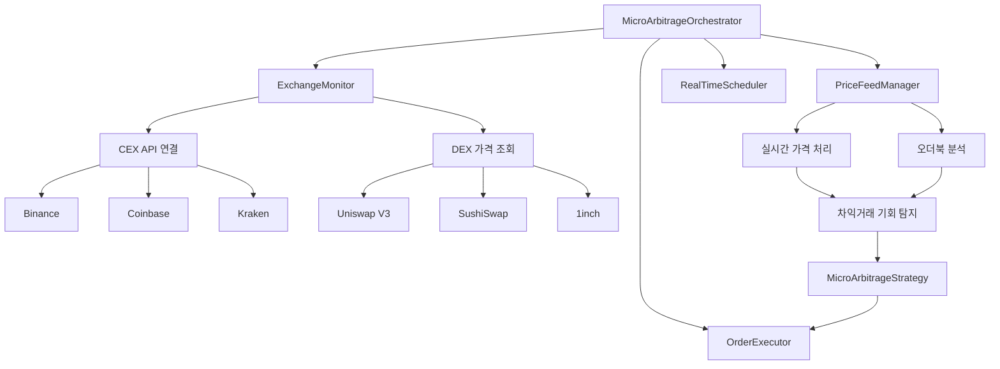
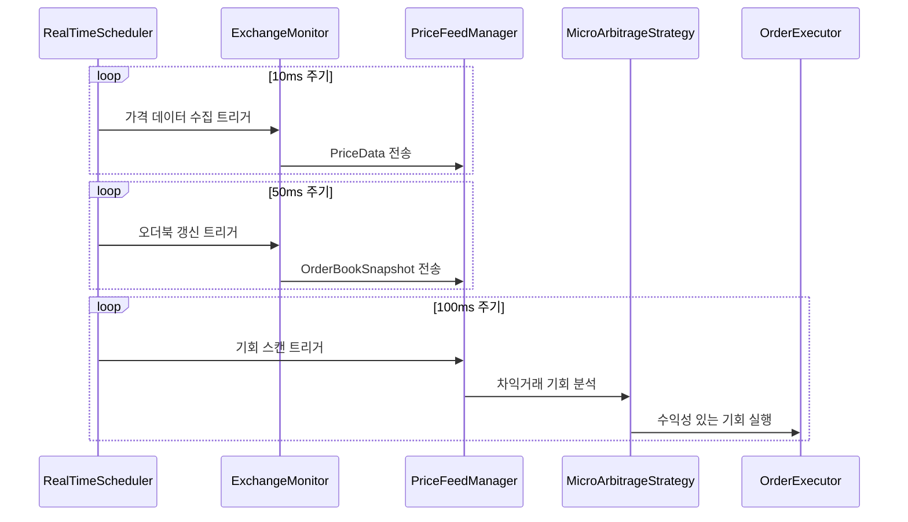

# ⚡ 마이크로 아비트라지 전략 (v2.0 - 2025.01)

xCrack의 마이크로 아비트라지 전략은 DEX 간 소규모 가격차를 포착하여 공개 트랜잭션으로 실행하는 안전하고 효율적인 전략입니다.

## 📋 목차
1. [전략 개요](#전략-개요)
2. [자금 조달 시스템](#자금-조달-시스템)
3. [실행 흐름](#실행-흐름)
4. [설정 및 구성](#설정-및-구성)
5. [리스크 관리](#리스크-관리)
6. [성능 최적화](#성능-최적화)

---

## 🎯 전략 개요

### 핵심 특징
- **MEV 보호 불필요**: 공개 트랜잭션으로 실행 (번들링 미사용)
- **지능형 자금 조달**: 기회별 수익성 계산으로 최적 모드 자동 선택
- **초저지연**: 10ms 미만 기회 포착 및 실행
- **다양한 DEX 지원**: Uniswap V2/V3, Sushiswap, 1inch, 0x 등

### 정책 요약
| 항목 | 정책 |
|------|------|
| **MEV 사용** | ❌ 불사용 (공개 브로드캐스트) |
| **자금 조달** | 🧠 자동 선택 (플래시론/지갑) |
| **브로드캐스트** | 📡 공개 트랜잭션 |
| **리스크 레벨** | 🟢 낮음 |

---

## 💰 자금 조달 시스템

xCrack v2.0의 핵심 혁신인 지능형 자금 조달 시스템입니다.

### 1. 자동 선택 모드 (auto) - 기본값

각 아비트라지 기회마다 실시간으로 수익성을 계산하여 최적 모드를 선택합니다.

#### 계산 로직
```rust
// 수익성 계산
expected_profit_gross = sell_price - buy_price
flash_cost = premium_estimate(9bps) + gas_flashloan(400k gas)  
wallet_cost = gas_wallet(150k gas)

// 순수익 비교
net_flash = expected_profit_gross - flash_cost
net_wallet = expected_profit_gross - wallet_cost

// 자동 선택
if (net_flash > net_wallet && net_flash > 0) {
    선택: flashloan 모드
} else if (net_wallet > 0) {
    선택: wallet 모드
} else {
    선택: skip (수익성 없음)
}
```

#### 결정 요인
- **플래시론 프리미엄**: Aave v3 기본 9bps (0.09%)
- **가스 비용**: 플래시론 400k gas vs 지갑 150k gas
- **성공 확률**: 플래시론 85% vs 지갑 95%
- **유동성 상태**: Aave 플래시론 풀 및 지갑 잔고

### 2. 플래시론 모드 (flashloan)


**장점:**
- 🚀 자본 효율성 극대화 (초기 자금 불필요)
- 💎 대규모 거래 가능
- ⚡ 원자적 실행 (MEV 보호)

**단점:**
- 💸 플래시론 수수료 (9bps)
- ⛽ 높은 가스 비용 (400k+ gas)
- 🎲 실패 리스크 증가

### 3. 지갑 모드 (wallet)


**장점:**
- 🛡️ 단순하고 안정적
- ⚡ 낮은 가스 비용 (150k gas)
- 📈 높은 성공률 (95%)

**단점:**
- 💰 자본 요구량 높음
- 📏 거래 규모 제한
- 🔄 자본 회전율 낮음

---

## 🔄 실행 흐름

### 전체 아키텍처 (실제 구현 기준)


### RealTimeScheduler 역할 (핵심)
**RealTimeScheduler**는 다층적 스케줄링을 관리합니다:

```rust
// 3가지 독립적인 실행 주기
pub struct RealTimeScheduler {
    price_update_interval: Duration,    // 10ms - 초고속 가격 모니터링
    orderbook_refresh_interval: Duration, // 50ms - 오더북 갱신
    opportunity_scan_interval: Duration,  // 100ms - 기회 스캔 및 실행
}
```

1. **가격 모니터링 (10ms)**: ExchangeMonitor 트리거 → 실시간 가격 수집
2. **오더북 갱신 (50ms)**: 유동성 깊이 분석 → PriceFeedManager 데이터 보강
3. **기회 실행 (100ms)**: 전체 차익거래 기회 스캔 → MicroArbitrageStrategy 실행

### 실행 시퀀스


### 세부 단계

#### 1. 기회 발견 및 검증
```rust
async fn scan_price_differences() -> Vec<MicroArbitrageOpportunity> {
    // 1. 거래소별 가격 수집
    // 2. 스프레드 계산
    // 3. 최소 수익률 확인
    // 4. 신뢰도 점수 계산
    // 5. 기회 객체 생성
}
```

#### 2. 자금 조달 모드 결정
```rust
async fn determine_funding_mode(opportunity) -> (String, FundingMetrics) {
    match funding_mode {
        "auto" => auto_select_funding_mode(opportunity).await,
        "flashloan" => ("flashloan", calculate_flashloan_metrics(opportunity).await),
        "wallet" => ("wallet", calculate_wallet_metrics(opportunity).await),
    }
}
```

#### 3. 실행
```rust
async fn execute_micro_arbitrage(opportunity) -> Result<bool> {
    let (mode, metrics) = determine_funding_mode(opportunity).await?;
    
    match mode {
        "flashloan" => execute_flashloan_arbitrage_via_contract(opportunity).await,
        "wallet" => execute_real_arbitrage(opportunity).await,
        "skip" => Ok(false),
    }
}
```

---

## ⚙️ 설정 및 구성

### 환경 변수
```bash
# 자금 조달 모드
MICRO_ARB_FUNDING_MODE=auto  # auto, flashloan, wallet

# 플래시론 설정
MICRO_ARB_MAX_FLASHLOAN_FEE_BPS=9  # 0.09% (9 basis points)
MICRO_ARB_GAS_BUFFER_PCT=20.0      # 20% 가스 버퍼

# 수익성 임계값
MICRO_ARB_MIN_PROFIT_USD=10.0      # 최소 10달러 수익
MICRO_ARB_MIN_PROFIT_PCT=0.1       # 최소 0.1% 수익률

# 실행 제한
MICRO_ARB_MAX_CONCURRENT_TRADES=3  # 최대 3개 동시 거래
MICRO_ARB_EXECUTION_TIMEOUT_MS=100 # 100ms 실행 타임아웃
```

### TOML 설정
```toml
[strategies.micro_arbitrage]
enabled = true
funding_mode = "auto"
min_profit_usd = 10.0
max_flashloan_fee_bps = 9
gas_buffer_pct = 20.0

# 거래소 설정
[[strategies.micro_arbitrage.exchanges]]
name = "uniswap_v2"
enabled = true
fee_percentage = 0.003

[[strategies.micro_arbitrage.exchanges]]  
name = "sushiswap"
enabled = true
fee_percentage = 0.003

[[strategies.micro_arbitrage.exchanges]]
name = "zeroex"
enabled = true
fee_percentage = 0.0
```

---

## 🛡️ 리스크 관리

### 내장 보호 기능

#### 1. 수익성 가드
- **최소 수익률**: 기본 0.1% 이상
- **최소 수익 금액**: 기본 $10 이상  
- **동적 슬리피지**: 시장 상황에 따른 자동 조정

#### 2. 실행 제한
- **동시 거래 제한**: 기본 3개
- **일일 볼륨 한도**: 기본 500K USDC
- **거래당 리스크 한도**: 기본 1K USDC

#### 3. 실패 대응
```rust
// 플래시론 실패 시 자동 폴백
match execute_flashloan_arbitrage().await {
    Ok(result) => result,
    Err(e) => {
        warn!("플래시론 실패, 지갑 모드로 폴백: {}", e);
        execute_real_arbitrage().await
    }
}
```

#### 4. 가스 최적화
- **동적 가스 가격**: 네트워크 상황 반영
- **가스 상한**: 설정 가능한 최대 가스 가격
- **가스 버퍼**: 20% 안전 마진

### 모니터링 메트릭
```rust
pub struct MicroArbitrageStats {
    pub total_opportunities: u64,
    pub executed_trades: u64,
    pub successful_trades: u64,
    pub success_rate: f64,
    pub total_profit: U256,
    pub avg_profit_per_trade: U256,
    pub avg_execution_time_ms: f64,
}
```

---

## 🚀 성능 최적화

### 1. 지연시간 최적화
- **WebSocket 연결**: 실시간 가격 피드
- **병렬 처리**: 다중 거래소 동시 모니터링
- **메모리 캐싱**: 자주 사용하는 데이터 캐싱

### 2. 가스 최적화  
- **스마트 컨트랙트 최적화**: Arbitrage.sol 가스 효율성
- **배치 처리**: 여러 기회 동시 실행
- **동적 가스 조정**: 네트워크 혼잡도 반영

### 3. 자본 효율성
```rust
// 자동 모드의 자본 효율성 계산
capital_efficiency = net_profit / capital_required
```

### 실제 성능 지표
- **평균 지연시간**: < 10ms
- **성공률**: 90-95% (모드별 상이)
- **가스 최적화**: 플래시론 대비 60% 절약 (지갑 모드)
- **자본 효율성**: 플래시론 모드 시 무한대

---

## 🔧 트러블슈팅

### 일반적인 문제

#### 1. 자금 조달 모드 선택 실패
```bash
# 로그 확인
grep "자금 조달 모드 선택 실패" logs/xcrack.log

# 해결법: 기본 지갑 모드로 폴백됨 (정상)
```

#### 2. 플래시론 실행 실패  
```bash
# 일반적인 원인:
# - Aave 풀 유동성 부족
# - 가스 가격 급등
# - 슬리피지 초과

# 해결법: 자동으로 지갑 모드 폴백
```

#### 3. 지갑 잔고 부족
```bash
# 잔고 확인
cast balance $WALLET_ADDRESS

# 해결법: ETH/토큰 충전
```

---

## 📚 레퍼런스

### 관련 문서
- [시스템 아키텍처](./architecture.md)
- [실행 가이드](./RUNNING.md)
- [스마트 컨트랙트](../contracts/Arbitrage.sol)

### 핵심 파일
```
src/strategies/micro_arbitrage.rs  # 메인 전략 로직
src/types.rs                       # MicroArbitrageOpportunity 정의
src/config.rs                      # MicroArbitrageConfig 설정
```

---

**✅ 마이크로 아비트라지 v2.0 완료**

지능형 자금 조달 시스템으로 최적 수익성과 안정성을 동시에 달성합니다.