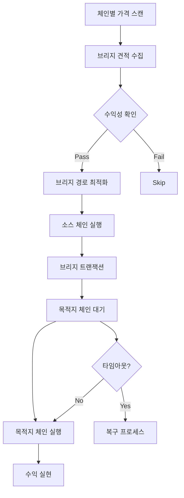

# ⛓️ 크로스체인 아비트라지 전략 (v2.0 - 2025.01)

xCrack의 크로스체인 아비트라지 전략은 체인 간 가격차를 포착하여 공개 트랜잭션으로 실행하는 다중 체인 전략입니다.

## 📋 목차
1. [전략 개요](#전략-개요)
2. [브리지 통합 시스템](#브리지-통합-시스템)
3. [실행 흐름](#실행-흐름)
4. [설정 및 구성](#설정-및-구성)
5. [리스크 관리](#리스크-관리)
6. [성능 최적화](#성능-최적화)

---

## 🎯 전략 개요

### 핵심 특징
- **다중 체인 지원**: Ethereum, Polygon, Arbitrum, Optimism, BSC 등
- **브리지 통합**: Li.Fi, Stargate, Hop Protocol 등 통합
- **시간 효율성**: 브리지 시간 최적화 및 비용 계산
- **원자성 제약**: 플래시론 사용 불가로 인한 지갑 기반 실행

### 정책 요약
| 항목 | 정책 |
|------|------|
| **MEV 사용** | ❌ 불사용 (공개 브로드캐스트) |
| **자금 조달** | 💰 지갑 모드만 지원 |
| **브로드캐스트** | 📡 다중 체인 공개 트랜잭션 |
| **리스크 레벨** | 🟡 중간 (브리지 리스크) |

---

## 🌉 브리지 통합 시스템

### 1. 브리지 애그리게이터

#### Li.Fi 통합
```rust
// Li.Fi API를 통한 최적 경로 탐색
async fn get_lifi_quote(
    from_chain: ChainId,
    to_chain: ChainId,
    token: Address,
    amount: U256,
) -> Result<LiFiQuote> {
    // 가격, 시간, 수수료 종합 견적
}
```

**지원 브리지**:
- Stargate (LayerZero 기반)
- Hop Protocol
- Across Protocol
- Celer cBridge
- Synapse Protocol

#### 브리지 선택 기준
```rust
// 브리지 평가 점수 계산
bridge_score = (
    speed_weight * speed_score +
    cost_weight * cost_score +
    reliability_weight * reliability_score
) / 100
```

### 2. 체인별 지원 현황

| 체인 | 상태 | DEX | 브리지 |
|------|------|-----|--------|
| **Ethereum** | ✅ 완전 지원 | Uniswap, 1inch, 0x | 모든 브리지 |
| **Polygon** | ✅ 완전 지원 | QuickSwap, 1inch | Stargate, Hop |
| **Arbitrum** | ✅ 완전 지원 | Camelot, 1inch | Stargate, Across |
| **Optimism** | ✅ 완전 지원 | Velodrome, 1inch | Stargate, Hop |
| **BSC** | 🔶 부분 지원 | PancakeSwap | Stargate |

---

## 🔄 실행 흐름

### 전체 시퀀스


### 세부 단계

#### 1. 기회 발견
```rust
async fn scan_cross_chain_opportunities() -> Vec<CrossChainOpportunity> {
    // 1. 체인별 토큰 가격 수집
    // 2. 브리지 경로 및 수수료 확인
    // 3. 시간 제약 및 가격 임팩트 계산
    // 4. 순수익 계산 후 기회 생성
}
```

#### 2. 수익성 계산
```rust
// 크로스체인 수익성 계산
total_cost = source_gas + bridge_fee + dest_gas + slippage
net_profit = price_difference - total_cost

// 최소 임계값 확인
if net_profit > min_profit_usd && 
   profit_margin > min_profit_pct &&
   bridge_time < max_bridge_time {
    execute_opportunity()
}
```

#### 3. 실행
```rust
async fn execute_cross_chain_arbitrage(opportunity) -> Result<bool> {
    // 1단계: 소스 체인에서 토큰 구매
    let buy_tx = execute_buy_on_source_chain(opportunity).await?;
    
    // 2단계: 브리지 트랜잭션 시작
    let bridge_tx = start_bridge_transaction(opportunity).await?;
    
    // 3단계: 목적지 체인 도착 대기
    wait_for_bridge_completion(bridge_tx).await?;
    
    // 4단계: 목적지 체인에서 토큰 판매
    let sell_tx = execute_sell_on_dest_chain(opportunity).await?;
    
    Ok(true)
}
```

---

## ⚙️ 설정 및 구성

### 환경 변수
```bash
# 브리지 설정
LIFI_API_KEY=your_lifi_api_key_here  # 선택사항 (rate limit 해제)
CROSS_CHAIN_MAX_BRIDGE_TIME_MINUTES=30  # 최대 브리지 시간

# 수익성 임계값
CROSS_CHAIN_MIN_PROFIT_USD=50.0      # 최소 50달러 수익
CROSS_CHAIN_MIN_PROFIT_PCT=0.5       # 최소 0.5% 수익률

# 실행 제한
CROSS_CHAIN_MAX_CONCURRENT_BRIDGES=2 # 최대 2개 동시 브리지
CROSS_CHAIN_BRIDGE_TIMEOUT_MINUTES=45 # 45분 타임아웃
```

### TOML 설정
```toml
[strategies.cross_chain]
enabled = true
min_profit_usd = 50.0
max_bridge_time_minutes = 30
max_concurrent_bridges = 2

# 체인별 설정
[[strategies.cross_chain.chains]]
chain_id = 1
name = "ethereum"
rpc_url = "https://eth-mainnet.g.alchemy.com/v2/your-key"
gas_reserve_eth = 0.1

[[strategies.cross_chain.chains]]
chain_id = 137
name = "polygon"
rpc_url = "https://polygon-mainnet.g.alchemy.com/v2/your-key"
gas_reserve_matic = 50.0

# 브리지별 설정
[[strategies.cross_chain.bridges]]
name = "stargate"
enabled = true
reliability_score = 95
preferred_routes = ["eth-polygon", "eth-arbitrum"]

[[strategies.cross_chain.bridges]]
name = "hop"
enabled = true
reliability_score = 90
preferred_routes = ["eth-polygon", "eth-optimism"]
```

---

## 🛡️ 리스크 관리

### 내장 보호 기능

#### 1. 브리지 리스크 관리
- **타임아웃 보호**: 45분 브리지 타임아웃
- **슬리피지 가드**: 목적지 체인 슬리피지 모니터링
- **복구 메커니즘**: 브리지 실패 시 자동 복구

#### 2. 가격 리스크 관리
```rust
// 가격 변동 모니터링
if price_change_percent > max_price_deviation {
    cancel_pending_operations();
    return Err("가격 변동 초과");
}
```

#### 3. 유동성 리스크
- **체인별 가스 예비금**: 최소 가스 토큰 보유
- **DEX 유동성 확인**: 실행 전 유동성 검증
- **슬리피지 계산**: 실제 실행 전 슬리피지 재계산

### 모니터링 메트릭
```rust
pub struct CrossChainArbitrageStats {
    pub opportunities_found: u64,
    pub bridges_initiated: u64,
    pub bridges_completed: u64,
    pub bridges_failed: u64,
    pub avg_bridge_time_minutes: f64,
    pub total_profit: U256,
    pub avg_profit_per_trade: U256,
}
```

---

## 🚀 성능 최적화

### 1. 브리지 최적화
- **병렬 견적**: 다중 브리지 동시 견적
- **캐싱**: 브리지 경로 및 수수료 캐싱
- **예측**: 브리지 시간 예측 모델

### 2. 가격 피드 최적화
- **WebSocket**: 실시간 가격 피드
- **체인별 병렬 처리**: 독립적 체인 모니터링
- **지연시간 최적화**: RPC 최적화

### 3. 자본 효율성
```rust
// 체인별 자본 배분 최적화
optimal_allocation = calculate_optimal_capital_distribution(
    chain_opportunities,
    bridge_costs,
    time_constraints
);
```

### 실제 성능 지표
- **기회 탐지**: 체인당 평균 5-15초
- **브리지 완료율**: 95-98%
- **평균 브리지 시간**: 3-25분 (경로별 상이)
- **자본 효율성**: 브리지 시간 고려 시 60-80%

---

## 🔧 트러블슈팅

### 일반적인 문제

#### 1. 브리지 실패
```bash
# 로그 확인
grep "브리지 실패" logs/xcrack.log

# 일반적인 원인:
# - 목적지 체인 가스 부족
# - 브리지 유동성 부족
# - 네트워크 혼잡
```

#### 2. 가격 변동
```bash
# 가격 편차 확인
grep "가격 변동 초과" logs/xcrack.log

# 해결법: 슬리피지 임계값 조정
```

#### 3. 체인 연결 문제
```bash
# RPC 연결 상태 확인
curl -X POST -H "Content-Type: application/json" \
  --data '{"jsonrpc":"2.0","method":"eth_blockNumber","params":[],"id":1}' \
  $RPC_URL
```

---

## 📚 레퍼런스

### 관련 문서
- [시스템 아키텍처](./architecture.md)
- [실행 가이드](./RUNNING.md)
- [브리지 통합 가이드](../integration/bridges.md)

### 핵심 파일
```
src/strategies/cross_chain_arbitrage.rs  # 메인 전략 로직
src/bridges/                             # 브리지 통합 모듈
src/chains/                              # 체인별 구현
```

---

**✅ 크로스체인 아비트라지 v2.0 완료**

다중 체인 가격차 포착으로 새로운 수익 기회를 창출합니다.
