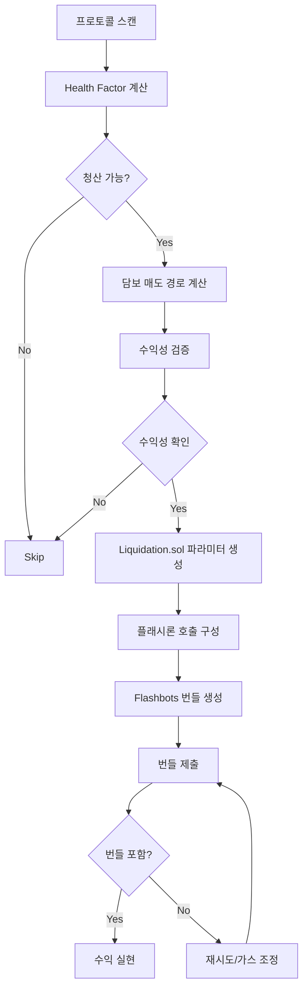

# 🏦 리퀴데이션 전략 (v2.0 - 2025.01)

xCrack의 리퀴데이션 전략은 DeFi 프로토콜의 과도한 부채 포지션을 청산하여 수익을 창출하는 MEV 기반 전략입니다.

## 📋 목차
1. [전략 개요](#전략-개요)
2. [프로토콜 통합](#프로토콜-통합)
3. [실행 흐름](#실행-흐름)
4. [설정 및 구성](#설정-및-구성)
5. [리스크 관리](#리스크-관리)
6. [성능 최적화](#성능-최적화)

---

## 🎯 전략 개요

### 핵심 특징
- **MEV 보호 강화**: Flashbots 번들을 통한 우선 실행
- **플래시론 자금 조달**: Aave v3 flashLoanSimple 활용
- **다중 프로토콜**: Aave, Compound, MakerDAO 지원
- **스마트 컨트랙트**: 전용 Liquidation.sol로 원자적 실행

### 정책 요약
| 항목 | 정책 |
|------|------|
| **MEV 사용** | ✅ 사용 (Flashbots 번들) |
| **자금 조달** | ⚡ 플래시론 (Aave v3) |
| **브로드캐스트** | 🔒 MEV 번들 (비공개) |
| **리스크 레벨** | 🔴 높음 (경쟁 및 MEV) |

---

## 🏛️ 프로토콜 통합

### 1. 지원 프로토콜

#### Aave v3
```rust
// Health Factor 계산
health_factor = (collateral_in_eth * liquidation_threshold) / debt_in_eth

// 청산 조건: HF < 1.0
if health_factor < 1.0 {
    liquidatable = true;
}
```

**청산 매개변수**:
- **청산 임계값**: 프로토콜별 Liquidation Threshold
- **청산 보너스**: 담보 자산별 5-15%
- **최대 청산**: 포지션의 50% (일부 자산은 100%)

#### Compound v3 (Comet)
```rust
// 담보/부채 비율 계산
collateral_ratio = total_collateral_usd / total_debt_usd

// 청산 조건
if collateral_ratio < liquidation_factor {
    liquidatable = true;
}
```

#### MakerDAO CDP
```rust
// CDP 담보 비율 계산  
collateral_ratio = (collateral * price) / debt

// 청산 조건
if collateral_ratio < liquidation_ratio {
    liquidatable = true;
}
```

### 2. 프로토콜별 청산 로직

| 프로토콜 | 청산 임계값 | 보너스 | 가스 비용 |
|----------|-------------|--------|-----------|
| **Aave v3** | HF < 1.0 | 5-15% | 400-500k |
| **Compound v3** | CR < LF | 8-10% | 350-450k |
| **MakerDAO** | CR < LR | 13% | 300-400k |

---

## 🔄 실행 흐름

### 전체 시퀀스


### 세부 단계

#### 1. 청산 기회 탐지
```rust
async fn scan_liquidation_opportunities() -> Vec<LiquidationOpportunity> {
    // 1. 각 프로토콜에서 포지션 스캔
    // 2. Health Factor 또는 담보 비율 계산
    // 3. 청산 가능 포지션 필터링
    // 4. 수익성 기본 검증
}
```

#### 2. 담보 매도 경로 최적화
```rust
// DEX Aggregator를 통한 최적 매도 경로
let sell_quote = get_best_sell_quote(
    collateral_token,
    debt_token,
    collateral_amount,
    &[dex_0x, dex_1inch, dex_uniswap]
).await?;
```

#### 3. 수익성 계산
```rust
// 리퀴데이션 수익성 계산
estimated_collateral_received = debt_amount * (1.0 + liquidation_bonus)
collateral_sell_proceeds = estimated_collateral_received * sell_price * (1.0 - slippage)

flashloan_fee = debt_amount * 0.0009  // 0.09% Aave v3
gas_cost = gas_price * estimated_gas_used

net_profit = collateral_sell_proceeds - debt_amount - flashloan_fee - gas_cost

// 최소 수익 임계값 확인
if net_profit > min_liquidation_profit {
    proceed_with_liquidation()
}
```

#### 4. 스마트 컨트랙트 실행
```solidity
// Liquidation.sol 호출 예제
function executeLiquidation(
    address asset,           // 부채 자산
    uint256 amount,         // 청산할 부채 금액  
    bytes calldata params   // 청산 파라미터
) external {
    // 1. Aave v3에서 부채 토큰 플래시론
    // 2. 해당 프로토콜에서 포지션 청산
    // 3. 받은 담보를 DEX에서 매도
    // 4. 플래시론 상환 + 수익 실현
}
```

---

## ⚙️ 설정 및 구성

### 환경 변수
```bash
# 리퀴데이션 계약
LIQUIDATION_CONTRACT_ADDRESS=0x...  # 필수

# MEV 설정  
FLASHBOTS_PRIVATE_KEY=0x...         # Flashbots 서명 키
FLASHBOTS_RELAY_URL=https://relay.flashbots.net  # 릴레이 URL

# DEX Aggregator
ONEINCH_API_KEY=your_1inch_key      # 1inch API 키 (선택)
ZEROEX_API_KEY=your_0x_key          # 0x API 키 (선택)

# 수익성 임계값
LIQUIDATION_MIN_PROFIT_USD=100.0    # 최소 100달러 수익
LIQUIDATION_MAX_GAS_PRICE_GWEI=200  # 최대 가스 가격
LIQUIDATION_SLIPPAGE_TOLERANCE=0.02 # 2% 슬리피지 허용
```

### TOML 설정
```toml
[strategies.liquidation]
enabled = true
min_profit_usd = 100.0
max_gas_price_gwei = 200
slippage_tolerance = 0.02
max_concurrent_liquidations = 3

# 프로토콜별 설정
[[strategies.liquidation.protocols]]
name = "aave_v3"
enabled = true
health_factor_threshold = 1.0
max_liquidation_pct = 0.5

[[strategies.liquidation.protocols]]
name = "compound_v3"
enabled = true
collateral_ratio_threshold = 1.1
max_liquidation_pct = 1.0

# DEX 설정
[[strategies.liquidation.dex]]
name = "1inch"
enabled = true
api_key_required = false
rate_limit_per_second = 10

[[strategies.liquidation.dex]]
name = "0x"  
enabled = true
api_key_required = false
rate_limit_per_second = 5
```

---

## 🛡️ 리스크 관리

### 내장 보호 기능

#### 1. 경쟁 리스크 관리
- **동적 가스 조정**: 경쟁 상황에 따른 가스 가격 자동 조정
- **번들 우선순위**: Flashbots 번들 내 트랜잭션 순서 최적화
- **재시도 제한**: 과도한 경쟁 시 청산 시도 제한

#### 2. 슬리피지 보호
```rust
// 슬리피지 가드 구현
let actual_proceeds = execute_sell_transaction(collateral_amount).await?;
let expected_proceeds = quote.out_amount * (1.0 - slippage_tolerance);

if actual_proceeds < expected_proceeds {
    return Err("슬리피지 초과");
}
```

#### 3. 플래시론 실패 대응
- **가스 추정**: 정확한 가스 한도 계산
- **타임아웃 처리**: DEX 견적 타임아웃 관리
- **체인 재편성**: 블록 재편성에 대한 보호

### 모니터링 메트릭
```rust
pub struct LiquidationStats {
    pub opportunities_found: u64,
    pub liquidations_attempted: u64,
    pub liquidations_successful: u64,
    pub bundles_included: u64,
    pub total_profit: U256,
    pub avg_profit_per_liquidation: U256,
    pub avg_gas_used: u64,
    pub competition_rate: f64,
}
```

---

## 🚀 성능 최적화

### 1. 프로토콜 스캔 최적화
- **병렬 스캔**: 다중 프로토콜 동시 모니터링
- **증분 업데이트**: 상태 변경만 추적
- **캐싱**: 자주 조회하는 데이터 캐싱

### 2. MEV 최적화
- **가스 경매**: 동적 가스 가격 전략
- **번들 최적화**: 최적 번들 구성
- **릴레이 다양화**: 복수 MEV 릴레이 활용

### 3. 자본 효율성
```rust
// 청산 기회 우선순위 계산
opportunity_score = profit_potential * success_probability / capital_required
```

### 실제 성능 지표
- **기회 탐지**: < 2초 (블록당)
- **실행 성공률**: 70-85% (경쟁 강도에 따라)
- **평균 수익률**: 8-15% (청산 보너스 기준)
- **가스 최적화**: 평균 400k gas

---

## 🔧 트러블슈팅

### 일반적인 문제

#### 1. 번들 미포함
```bash
# 가스 가격 확인
grep "번들 미포함" logs/xcrack.log

# 해결법: 가스 가격 상향 조정
export LIQUIDATION_MAX_GAS_PRICE_GWEI=300
```

#### 2. 슬리피지 초과
```bash
# 슬리피지 로그 확인
grep "슬리피지 초과" logs/xcrack.log

# 해결법: 슬리피지 허용도 증가
export LIQUIDATION_SLIPPAGE_TOLERANCE=0.03
```

#### 3. 플래시론 실패
```bash
# 플래시론 관련 에러 확인
grep "플래시론 실패" logs/xcrack.log

# 일반적인 원인:
# - 가스 한도 부족
# - 컨트랙트 로직 에러
# - DEX 라우팅 실패
```

---

## 📚 레퍼런스

### 관련 문서
- [시스템 아키텍처](./architecture.md)
- [실행 가이드](./RUNNING.md)
- [MEV 전략 가이드](../mev/strategies.md)

### 핵심 파일
```
src/strategies/liquidation.rs        # 메인 전략 로직
contracts/Liquidation.sol           # 청산 스마트 컨트랙트
src/protocols/                       # 프로토콜 통합 모듈
```

### 스마트 컨트랙트
- **Liquidation.sol**: 플래시론 기반 청산 실행
- **주요 기능**: 원자적 청산 + 담보 매도 + 수익 실현

---

**✅ 리퀴데이션 v2.0 완료**

DeFi 프로토콜 청산으로 안정적인 MEV 수익을 창출합니다.
