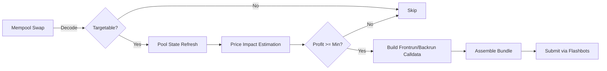

# Sandwich Strategy (MEV, No Flashloan)

현재 구현은 플래시론을 사용하지 않습니다. 프론트런/백런 두 개의 공개 트랜잭션을 구성하고, MEV 제출 경로(번들)를 통해 묶어 보내 승률을 높입니다.

## 정책 요약
- MEV 사용: Yes (번들 제출)
- Flashloan 사용: No (정책에 의해 차단)

## 데이터 소스
- 온체인 풀 상태: Uniswap V2/V3, SushiSwap
- 멤풀 트랜잭션: 대형 스왑 후보 탐지
- 오라클: Chainlink + Uniswap TWAP (리스크 가드)

## 처리 흐름 (요약)

## 실행 단계
1) 대상 선택: 라우터와 함수 시그니처 기반으로 스왑 판별 + USD 가치 필터
2) 풀 상태 업데이트: `getReserves` 등 온체인 조회로 최신 상태 반영
3) 가격 임팩트/최적 크기: xy=k 계산 + Kelly 기반 크기 제한, 슬리피지 가드
4) 트랜잭션 구성: 
   - 프론트런: swapExactTokensForTokens(path: token0->token1)
   - 백런: swapExactTokensForTokens(path: token1->token0)
5) MEV 제출: 두 트랜잭션을 하나의 번들로 제출 (사설 경로)

## 구성/환경
- `strategies.sandwich.use_flashloan=false` (필수, 코드에서 검증)
- 가스 전략: base/priority를 기반으로 상한 가드 적용

## 실패/리스크 처리
- 가격 급변 시 슬리피지 아웃 가드
- 경쟁 심화 시 가스 배수 상향(보수적)
- 번들 미포함 시 재시도 제한
