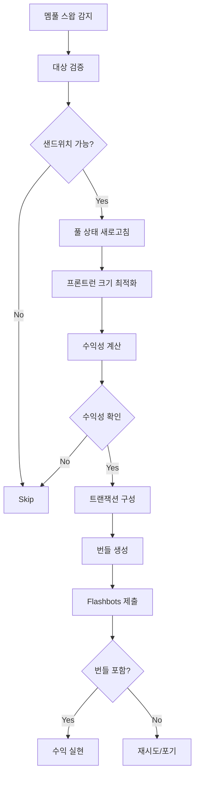

# 🥪 샌드위치 어택 전략 (v2.0 - 2025.01)

xCrack의 샌드위치 어택 전략은 대형 스왑을 감지하여 프론트런-백런으로 차익을 실현하는 고수익 MEV 전략입니다.

## 📋 목차
1. [전략 개요](#전략-개요)
2. [멤풀 모니터링](#멤풀-모니터링)
3. [실행 흐름](#실행-흐름)
4. [설정 및 구성](#설정-및-구성)
5. [리스크 관리](#리스크-관리)
6. [성능 최적화](#성능-최적화)

---

## 🎯 전략 개요

### 핵심 특징
- **멤풀 모니터링**: 실시간 대형 스왑 감지
- **MEV 번들링**: Flashbots를 통한 원자적 실행
- **지갑 기반**: 플래시론 미사용으로 단순화
- **고수익 잠재력**: 대형 거래의 가격 임팩트 활용

### 정책 요약
| 항목 | 정책 |
|------|------|
| **MEV 사용** | ✅ 사용 (Flashbots 번들) |
| **자금 조달** | 💰 지갑 모드만 지원 |
| **브로드캐스트** | 🔒 MEV 번들 (비공개) |
| **리스크 레벨** | 🔴 매우 높음 (MEV 경쟁) |

---

## 👁️ 멤풀 모니터링

### 1. 대상 트랜잭션 필터링

#### 스왑 탐지 조건
```rust
// 대상 트랜잭션 조건
struct SandwichTarget {
    min_usd_value: f64,      // 최소 $10,000 스왑
    supported_routers: Vec<Address>,  // Uniswap, Sushiswap 등
    supported_functions: Vec<String>, // swapExact*, swapTokensForExact*
    max_slippage: f64,       // 최대 5% 슬리피지
}
```

**지원 DEX 라우터**:
- Uniswap V2 Router
- Uniswap V3 Router  
- SushiSwap Router
- 1inch Router
- 0x Exchange Proxy

#### 함수 시그니처 감지
```rust
// 지원 함수 시그니처
const SWAP_SIGNATURES: &[&str] = &[
    "swapExactTokensForTokens(uint256,uint256,address[],address,uint256)",
    "swapTokensForExactTokens(uint256,uint256,address[],address,uint256)",
    "swapExactETHForTokens(uint256,address[],address,uint256)",
    "swapExactTokensForETH(uint256,uint256,address[],address,uint256)",
];
```

### 2. 수익성 사전 계산

#### 가격 임팩트 추정
```rust
// AMM 가격 임팩트 계산 (xy=k)
fn calculate_price_impact(
    reserve_in: U256,
    reserve_out: U256,
    amount_in: U256,
    fee: u16,
) -> PriceImpact {
    let amount_in_with_fee = amount_in * (10000 - fee) / 10000;
    let numerator = amount_in_with_fee * reserve_out;
    let denominator = reserve_in + amount_in_with_fee;
    
    PriceImpact {
        amount_out: numerator / denominator,
        price_after: (reserve_in + amount_in_with_fee) / (reserve_out - amount_out),
    }
}
```

---

## 🔄 실행 흐름

### 전체 시퀀스


### 세부 단계

#### 1. 멤풀 스왑 감지
```rust
async fn monitor_mempool_transactions() -> Vec<SandwichCandidate> {
    // 1. 웹소켓으로 pendingTransactions 구독
    // 2. 스왑 함수 시그니처 필터링  
    // 3. 최소 금액 및 슬리피지 검증
    // 4. 지원 DEX 라우터 확인
}
```

#### 2. 프론트런 최적화
```rust
// Kelly 기준 기반 최적 포지션 크기
fn calculate_optimal_frontrun_size(
    pool_reserves: (U256, U256),
    target_swap_size: U256,
    success_probability: f64,
) -> U256 {
    // Kelly Criterion: f = (bp - q) / b
    // f = optimal position size fraction
    // b = odds received on the wager  
    // p = probability of winning
    // q = probability of losing (1 - p)
}
```

#### 3. 트랜잭션 구성
```rust
async fn build_sandwich_bundle(
    target_tx: Transaction,
    pool_address: Address,
    optimal_size: U256,
) -> Result<SandwichBundle> {
    // 프론트런: 동일한 경로로 선매수
    let frontrun_tx = build_frontrun_transaction(
        pool_address,
        optimal_size,
        target_tx.gas_price + 1,  // 가스 가격 +1 wei
    ).await?;
    
    // 백런: 역방향 경로로 매도
    let backrun_tx = build_backrun_transaction(
        pool_address, 
        optimal_size,
        target_tx.gas_price - 1,  // 가스 가격 -1 wei
    ).await?;
    
    Ok(SandwichBundle {
        frontrun: frontrun_tx,
        target: target_tx,
        backrun: backrun_tx,
    })
}
```

---

## ⚙️ 설정 및 구성

### 환경 변수
```bash
# 샌드위치 전략 설정
SANDWICH_USE_FLASHLOAN=false           # 필수: 플래시론 비활성화
SANDWICH_MIN_TARGET_USD=10000.0        # 최소 타겟 거래 크기
SANDWICH_MAX_SLIPPAGE_PCT=5.0          # 최대 5% 슬리피지

# 수익성 임계값
SANDWICH_MIN_PROFIT_USD=200.0          # 최소 200달러 수익
SANDWICH_MIN_PROFIT_PCT=2.0            # 최소 2% 수익률

# MEV 설정
FLASHBOTS_PRIVATE_KEY=0x...            # Flashbots 서명 키
FLASHBOTS_RELAY_URL=https://relay.flashbots.net

# 가스 전략
SANDWICH_MAX_GAS_PRICE_GWEI=500        # 최대 가스 가격
SANDWICH_GAS_MULTIPLIER=1.2            # 가스 배수
```

### TOML 설정
```toml
[strategies.sandwich]
enabled = true
use_flashloan = false  # 필수: 플래시론 비활성화
min_target_usd = 10000.0
max_slippage_pct = 5.0
min_profit_usd = 200.0

# 지원 DEX
[[strategies.sandwich.dex]]
name = "uniswap_v2"
router_address = "0x7a250d5630B4cF539739dF2C5dAcb4c659F2488D"
enabled = true
fee_bps = 30  # 0.3%

[[strategies.sandwich.dex]]
name = "sushiswap"
router_address = "0xd9e1cE17f2641f24aE83637ab66a2cca9C378B9F"
enabled = true
fee_bps = 30  # 0.3%

# 가스 전략
[strategies.sandwich.gas]
max_price_gwei = 500
multiplier = 1.2
priority_fee_gwei = 10
```

---

## 🛡️ 리스크 관리

### 내장 보호 기능

#### 1. 시장 리스크 관리
- **가격 오라클**: Chainlink + Uniswap TWAP 검증
- **슬리피지 보호**: 최대 슬리피지 5% 제한
- **포지션 크기**: Kelly 기준 기반 리스크 관리

#### 2. 실행 리스크 관리
```rust
// 실행 전 최종 검증
async fn validate_before_execution(bundle: &SandwichBundle) -> Result<()> {
    // 풀 상태 재확인
    let current_reserves = get_pool_reserves(bundle.pool_address).await?;
    
    // 타겟 트랜잭션 여전히 유효한지 확인
    if !is_transaction_still_pending(&bundle.target).await? {
        return Err("타겟 트랜잭션 더 이상 유효하지 않음");
    }
    
    // 수익성 재계산
    let profit = calculate_expected_profit(&bundle, &current_reserves).await?;
    if profit < min_profit_threshold {
        return Err("수익성 임계값 미달");
    }
    
    Ok(())
}
```

#### 3. 경쟁 리스크 관리
- **동적 가스 조정**: 실시간 경쟁 상황 반영
- **번들 우선순위**: 최적 가스 가격 전략
- **재시도 제한**: 과도한 경쟁 시 포기

### 모니터링 메트릭
```rust
pub struct SandwichStats {
    pub targets_detected: u64,
    pub sandwiches_attempted: u64,
    pub sandwiches_successful: u64,
    pub bundles_included: u64,
    pub total_profit: U256,
    pub avg_profit_per_sandwich: U256,
    pub success_rate: f64,
    pub avg_execution_time_ms: u64,
}
```

---

## 🚀 성능 최적화

### 1. 멤풀 모니터링 최적화
- **WebSocket 연결**: 실시간 펜딩 트랜잭션 스트림
- **병렬 처리**: 다중 스레드 트랜잭션 분석
- **필터링 최적화**: 하드웨어 가속 패턴 매칭

### 2. 실행 최적화
- **풀 상태 캐싱**: 자주 사용하는 풀 데이터 캐싱
- **가스 추정**: 정확한 가스 한도 계산
- **병렬 번들**: 여러 기회 동시 처리

### 3. 수익성 최적화
```rust
// 다중 풀 아비트라지 기회 탐지
fn find_cross_pool_opportunities(
    target_swap: &SwapTransaction,
    available_pools: &[PoolInfo],
) -> Vec<SandwichOpportunity> {
    // 여러 풀에서 최적 수익 경로 탐색
}
```

### 실제 성능 지표
- **탐지 지연**: < 50ms (멤풀 → 기회 인식)
- **실행 성공률**: 60-75% (경쟁 강도에 따라)
- **평균 수익률**: 3-8% (타겟 크기에 따라)
- **가스 효율성**: 평균 150k gas per transaction

---

## 🔧 트러블슈팅

### 일반적인 문제

#### 1. 번들 미포함
```bash
# 번들 경쟁 상황 확인
grep "번들 미포함" logs/xcrack.log

# 해결법: 가스 가격 상향 또는 전략 조정
export SANDWICH_MAX_GAS_PRICE_GWEI=1000
```

#### 2. 타겟 트랜잭션 실패
```bash
# 타겟 실행 실패 로그 확인  
grep "타겟 실행 실패" logs/xcrack.log

# 일반적인 원인:
# - 슬리피지 초과
# - 가스 부족
# - 프론트런으로 인한 가격 변동
```

#### 3. 수익성 계산 오류
```bash
# 수익성 계산 로그 확인
grep "수익성 계산 오류" logs/xcrack.log

# 해결법: 오라클 가격 피드 확인
```

---

## 📚 레퍼런스

### 관련 문서
- [시스템 아키텍처](./architecture.md)
- [실행 가이드](./RUNNING.md)
- [MEV 전략 가이드](../mev/strategies.md)

### 핵심 파일
```
src/strategies/sandwich.rs           # 메인 전략 로직
src/mempool/                         # 멤풀 모니터링 모듈
src/mev/flashbots.rs                # Flashbots 통합
```

### 윤리적 고려사항
- **투명성**: 전략의 존재와 동작 원리 공개
- **공정성**: 과도한 MEV 추출 자제
- **생태계**: DeFi 생태계 건전성 고려

---

**✅ 샌드위치 어택 v2.0 완료**

멤풀 모니터링으로 고수익 MEV 기회를 포착합니다.